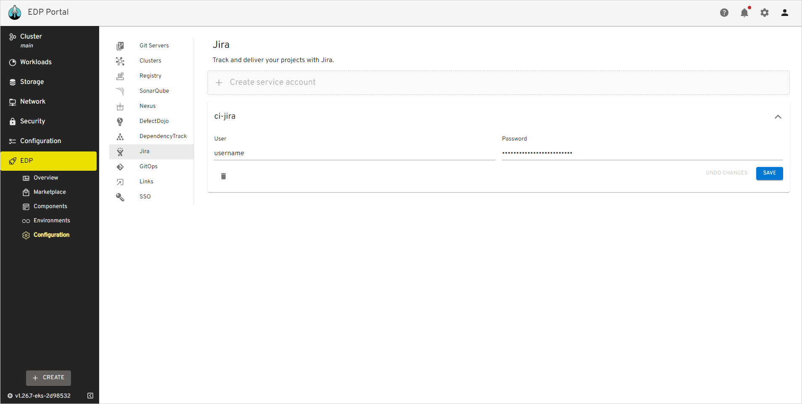
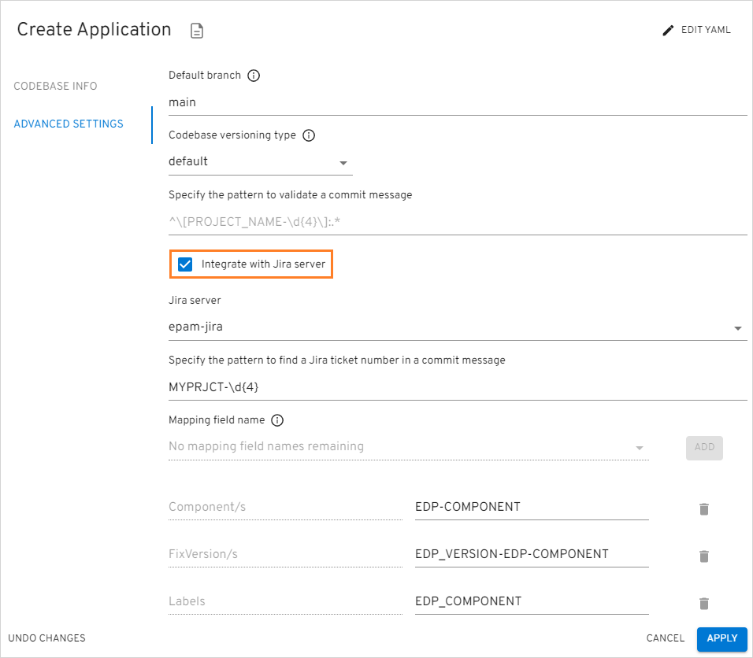
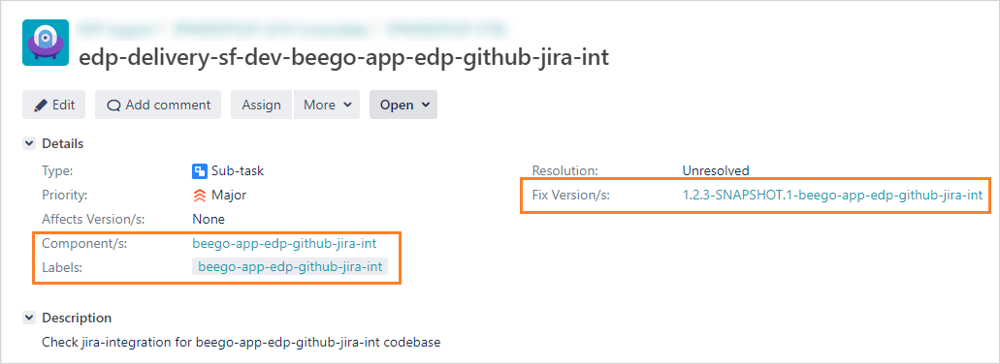

import Tabs from '@theme/Tabs';
import TabItem from '@theme/TabItem';

# Jira Integration

This documentation guide provides step-by-step instructions for enabling the Jira integration option in the EDP Portal UI for EPAM Delivery Platform. Jira integration allows including useful metadata in Jira tickets.

## Overview

Integrating Jira can provide a number of benefits, such as increased visibility and traceability, automatic linking code changes to relevant Jira issues, streamlining the management and tracking of development progress.

By linking CI pipelines to Jira issues, teams can get a better understanding of the status of their work and how it relates to the overall development process. This can help to improve communication and collaboration, and ultimately lead to faster and more efficient delivery of software.

Enabling Jira integration allows for the automatic population of three fields in Jira tickets: Fix Versions, Components, and Labels. Each of these fields provides distinct benefits:

* **Fix Versions**: helps track progress against release schedules;
* **Components**: allows grouping related issues together;
* **Labels**: enables identification of specific types of work.

Teams can utilize these fields to enhance their work prioritization, identify dependencies, improve collaboration, and ultimately achieve faster software delivery.

## Integration Procedure

In order to adjust the Jira server integration, add the JiraServer CR by performing the following:

1. Provision the **ci-jira** secret using `EDP Portal`, `Manifest` or with the `externalSecrets` operator:

    <Tabs
      defaultValue="portal"
      values={[
        {label: 'UI Portal', value: 'portal'},
        {label: 'Manifests', value: 'manifests'},
        {label: 'External Secrets Operator', value: 'externalsecret'},
      ]}>

      <TabItem value="portal">
      Go to **EDP Portal** -> **EDP** -> **Configuration** -> **Jira**. Update or fill in the **URL**, **User**, **Password** fields and click the **Save** button:

      
      </TabItem>

      <TabItem value="manifests">
      ```yaml
      apiVersion: v1
      kind: Secret
      metadata:
        name: ci-jira
        namespace: edp
        labels:
          app.edp.epam.com/secret-type=jira
      stringData:
        username: username
        password: password
      ```
      </TabItem>

      <TabItem value="externalsecret">
      ```json
      "ci-jira":
      {
        "username": "username",
        "password": "password"
      }
      ```
      </TabItem>

    </Tabs>

    :::note Required Permissions for Issue Management
      To manage issue labels, components, and add links in Jira, please make sure the user has the following permissions:
      1. **Edit Issues:** This permission is necessary to modify issue fields, including adding or removing labels and components.
      2. **Link Issues:** You must have this permission to create and manage links between issues.
      3. **Add Comments:** Required for adding external links and comments to issues.
    :::

2. Create `JiraServer` CR in the OpenShift/Kubernetes namespace with the **apiUrl**, **credentialName** and **rootUrl** fields:

      ```yaml
      apiVersion: v2.edp.epam.com/v1
      kind: JiraServer
      metadata:
        name: jira-server
      spec:
        apiUrl: 'https://jira-api.example.com'
        credentialName: ci-jira
        rootUrl: 'https://jira.example.com'
      ```

    :::note
      The value of the **credentialName** property is the name of the Kubernetes Secret, created on the previous step.
    :::

## Enable Jira During Platform Deployment

KubeRocketCI offers the capability to incorporate Jira integration as part of its deployment process. To follow this approach, please review the following parameters of the [values.yaml](https://github.com/epam/edp-install/blob/release/3.9/deploy-templates/values.yaml#L145) file. Enabling the `jira.integration` parameter creates the following custom resources:

* QuickLink;
* JiraServer;
* External Secrets Operator (in case it is used).

To set up Jira integration along with the platform, follow the steps below:

1. Create the **ci-jira** secret in the platform namespace (e.g., `edp`) as it's described [above](#integration-procedure).

2. Deploy the platform with the `jira.integration` parameter set to `true` in the [values.yaml](https://github.com/epam/edp-install/blob/release/3.8/deploy-templates/values.yaml#L138) file.

## Jira Usage

To use Jira, you need to set up your codebases properly.

During the codebase creation process, proceed to the **Advanced Settings** tab. Here, ensure to mark the **Integrate with Jira server** checkbox and complete the necessary fields accordingly:

  

There are four predefined variables, each with specific values, that can be utilized individually or in combination. These variables display varying data based on the versioning type in use (`edp` or `default`):

When using the `edp versioning` scheme:

* **EDP_COMPONENT** – yields the name of the application;
* **EDP_VERSION** – produces either 0.0.0-SNAPSHOT or 0.0.0-RC as output;
* **EDP_SEM_VERSION** – generates a semantic version, specifically 0.0.0;
* **EDP_GITTAG** – returns a Git tag format such as build/0.0.0-SNAPSHOT.2 or build/0.0.0-RC.2

If the `default versioning` type is used:

* **EDP_COMPONENT** – returns application-name;
* **EDP_VERSION** – returns the date when the application was tagged. (Example: 20231023-131217);
* **EDP_SEM_VERSION** – returns the date when the application was tagged. (Example: 20231023-131217);
* **EDP_GITTAG** – returns the date when the application was tagged. (Example: 20231023-131217).

:::note
  There are no character restrictions when combining the variables. You can concatenate them using the dash sign.
  Combination samples:<br />
  **EDP_SEM_VERSION-EDP_COMPONENT**;<br />
  **EDP_COMPONENT-hello-world/EDP_VERSION**;<br />
  etc.
:::

Upon successful configuration of the Jira integration, your tickets will be enriched with additional metadata:

  

Should you encounter an issue where metadata is not appearing within a Jira ticket, it's advisable to inspect the status field of the `JiraIssueMetadata` custom resources located in the platform namespace (e.g, `edp`). The codebase-operator typically removes this resource after post-processing, it may persist in case of reconciliation issues, remaining within the namespace.

## Related Articles

* [Add Application](../../user-guide/add-application.md)
