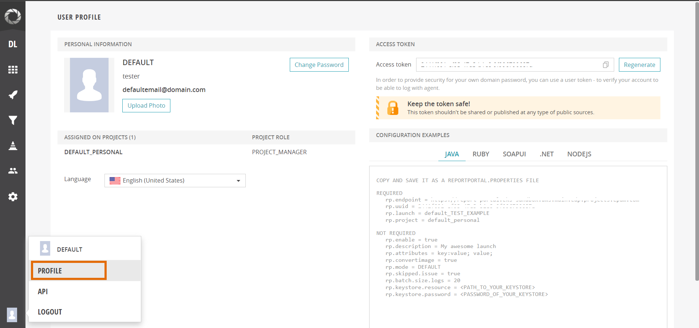
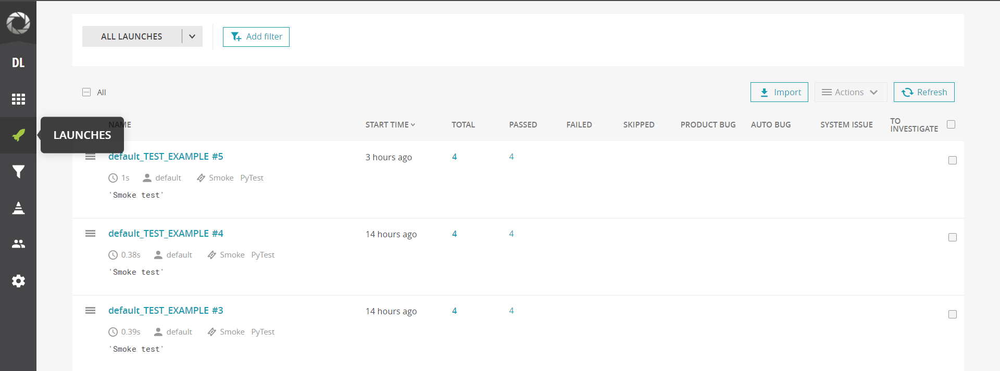

# Integration With Tekton

ReportPortal integration with Tekton allows managing all automation results and reports in one place, visualizing metrics and analytics, team collaborating to associate statistics results.

For integration, take the following steps:

1. Log in to the ReportPortal console and navigate to the **User Profile** menu:

  

2. Copy the **Access token** and use it as a value while creating a kubernetes secret for the ReportPortal credentials:

  ```yaml
  apiVersion: v1
  kind: Secret
  type: Opaque
  metadata:
    name: rp-credentials
    namespace: edp
  stringData:
    rp_uuid: <access-token>
  ```

2. In the **Configuration examples** section of the ReportPortal **User Profile** menu, copy the following `REQUIRED` fields: `rp.endpoint`, `rp.launch` and `rp.project`. Insert these fields to the `pytest.ini` file in root directory of your project:

  ```aidl
  [pytest]
  addopts = -rsxX -l --tb=short --junitxml test-report.xml
  rp_endpoint = <endpoint>
  rp_launch = <launch>
  rp_project = <project>
  ```

3. In root directory of the project create/update **requirements.txt** file and fill with following. it's mandatory to install report-portal python library (version may vary):
  ```aidl
  pytest-reportportal == 5.1.2
  ```

4. Create a custom Tekton task:

   <details>
   <summary><b>View: Custom Tekton task</b></summary>

   ```yaml
   apiVersion: tekton.dev/v1beta1
   kind: Task
   metadata:
     labels:
       app.kubernetes.io/version: '0.1'
     name: pytest-reportportal
     namespace: edp
   spec:
     description: |-
       This task can be used to run pytest integrated with report portal.
     params:
       - default: .
         description: The path where package.json of the project is defined.
         name: PATH_CONTEXT
         type: string
       - name: EXTRA_COMMANDS
         type: string
       - default: python:3.8-alpine3.16
         description: The python image you want to use.
         name: BASE_IMAGE
         type: string
       - default: rp-credentials
         description: name of the secret holding the rp token
         name: rp-secret
         type: string
     steps:
       - env:
           - name: HOME
             value: $(workspaces.source.path)
           - name: RP_UUID
             valueFrom:
               secretKeyRef:
                 key: rp_uuid
                 name: $(params.rp-secret)
         image: $(params.BASE_IMAGE)
         name: pytest
         resources: {}
         script: >
           #!/usr/bin/env sh
           set -e
           export PATH=$PATH:$HOME/.local/bin
           $(params.EXTRA_COMMANDS)
           # tests are being run from ./test directory in the project
           pytest ./tests --reportportal
         workingDir: $(workspaces.source.path)/$(params.PATH_CONTEXT)
     workspaces:
       - name: source
   ```

   </details>

5. Add this task ref to your Tekton pipeline after *tasks*:

   <details>
   <summary><b>View: Tekton pipeline</b></summary>

   ```yaml
   - name: pytest
     params:
       - name: BASE_IMAGE
         value: $(params.image)
       - name: EXTRA_COMMANDS
         value: |
           set -ex
           pip3 install -r requirements.txt
           [ -f run_service.py ] && python run_service.py &
     runAfter:
       - compile
     taskRef:
       kind: Task
       name: pytest-reportportal
     workspaces:
       - name: source
         workspace: shared-workspace
   ```
   </details>

6. Launch your Tekton pipeline and check that the custom task has been successfully executed:

  

7. Test reports will be displayed in the **Launches** section of the ReportPortal:

  

## Related Articles

* [Install ReportPortal](advanced-installation/reportportal.md)
* [Keycloak Integration](reportportal-keycloak.md)
* [Pytest Integration With ReportPortal](https://github.com/reportportal/agent-python-pytest)
