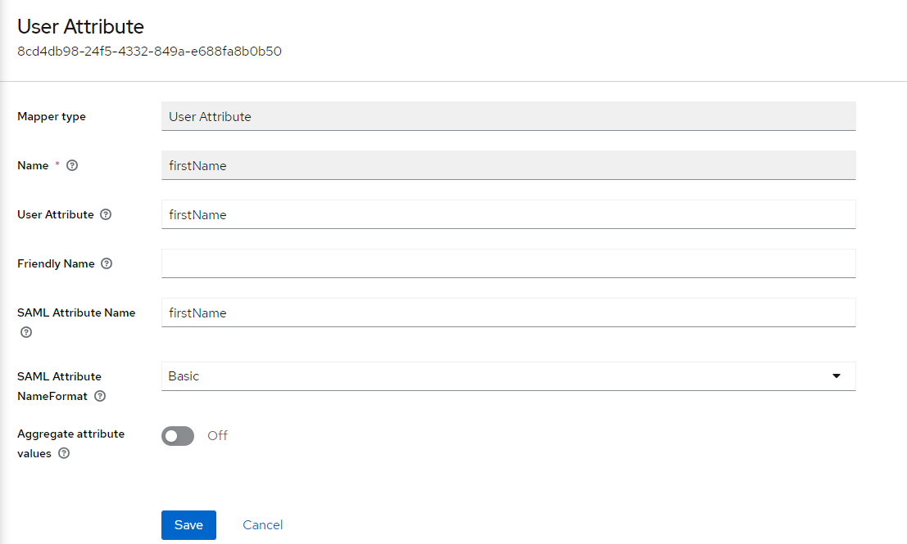
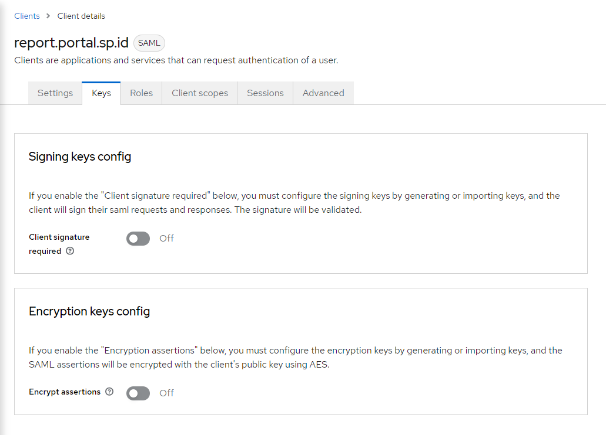
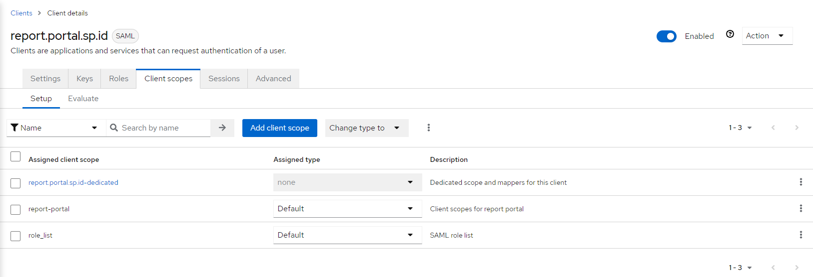
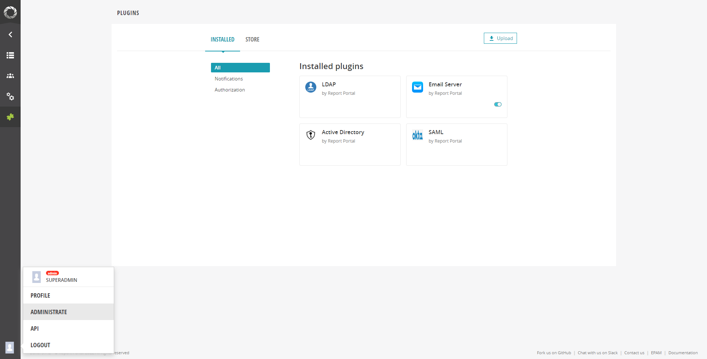
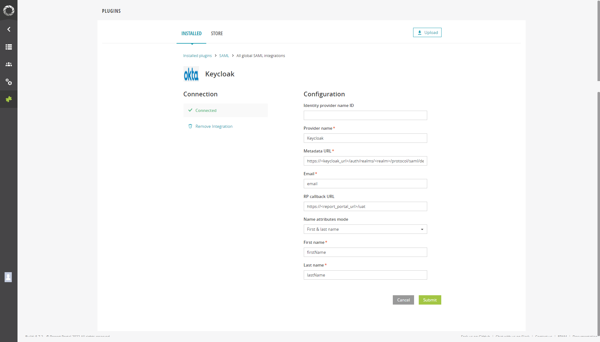
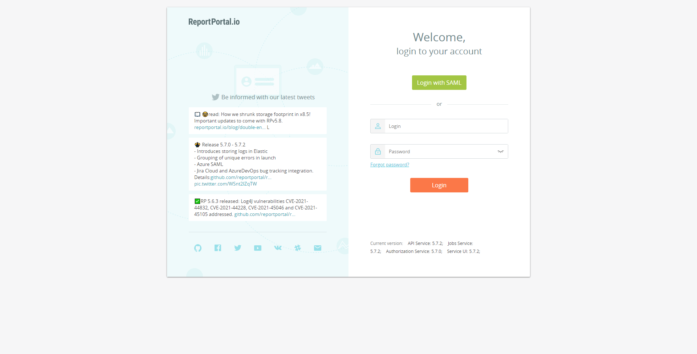

# Keycloak Integration

Follow the steps below to integrate the ReportPortal with Keycloak.

!!! info
    It is also possible to install ReportPortal using the cluster add-ons. For details, please refer to the [Install via Add-Ons](add-ons-overview.md) page.

## Prerequisites

* Keycloak is installed. For detailed instructions, please refer to the provided [documentation](advanced-installation/keycloak.md).
* ReportPortal is installed. To install it using the Helm Chart, please follow the instructions outlined in the corresponding [documentation](advanced-installation/reportportal.md).

## Keycloak Configuration

1. Navigate to **Client Scopes** > **Create client scope** and create a new scope with the *SAML* protocol type.

2. Navigate to **Client Scopes** > **your_scope_name** > **Mappers** > **Configure a new mapper** > select the *User Attribute* mapper type. Add three mappers for the email, first name, and last name by typing `lastName`, `firstName`, and `email` in the *User Attribute* field:

  * *Name* is a display name in Keycloak.
  * *User Attribute* is a user property for mapping.
  * *SAML Attribute Name* is an attribute used for requesting information in the ReportPortal configuration.
  * *SAML Attribute NameFormat*: `Basic`.
  * *Aggregate attribute values*: `Off`.

  
  

3. Navigate to **Clients** > **Create client** and fill in the following fields:

  * *Client type*: `SAML`.
  * *Client ID*: `report.portal.sp.id`.

  !!! warning
      The `report.portal.sp.id` Client ID is a constant value.

4. Navigate to **Client** > **your_client** > **Settings** and add `https://<report-portal-url\>/*` to the *Valid redirect URIs*.

5. Navigate to **Client** > **your_client** > **Keys** and disable *Client signature required*.

  

6. Navigate to **Client** > **your_client** > **Client scopes** and add the scope created on step 3 with the default *Assigned type*.

  

## ReportPortal Configuration

1. Log in to the ReportPortal with the admin permissions.

2. Navigate to **Client** > **Administrate** > **Plugins** and select the SAML plugin.

  

3. To add a new integration, fill in the following fields:

  

  * *Provider name* is the display name in the ReportPortal login page.
  * *Metadata URL*: `https://<keycloak_url\>/auth/realms/<realm\>/protocol/saml/descriptor`.
  * *Email* is the value from the *SAML Attribute Name* field in the Keycloak mapper.
  * *RP callback URL*: `https://<report_portal_url\>/uat`.
  * *Name attributes mode* is the first & last name (type based on your mapper).
  * *First name* is the value from the *SAML Attribute Name* field in the Keycloak mapper.
  * *Last name* is the value from the *SAML Attribute Name* field in the Keycloak mapper.

4. Log in to the ReportPortal.

  !!! note
      By default, after the first login, ReportPortal creates the \<your_email\>_personal project and adds an account with the `Project manager` role.

  

## Related Articles

* [Install ReportPortal](advanced-installation/reportportal.md)
* [Integration With Tekton](report-portal-integration-tekton.md)
