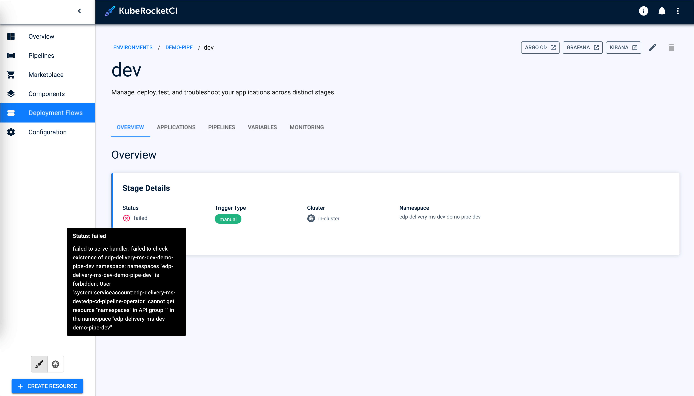

---

title: "Environment Creation Issues"
description: "Troubleshooting steps for resolving environment creation failures in KubeRocketCI due to namespace permission issues, including manual namespace creation and Helm chart configuration adjustments."
sidebar_label: "Environment Creation Issues"

---
<!-- markdownlint-disable MD025 -->

# Environment Creation Issues

<head>
  <link rel="canonical" href="https://docs.kuberocketci.io/docs/operator-guide/troubleshooting/environment-creation" />
</head>

## Problem

Failed to create an environment due to the following error:



## Cause

The [cd-pipeline-operator](https://github.com/epam/edp-cd-pipeline-operator), one of the components of KubeRocketCI should have the permissions to automatically create namespaces. This permission is managed by the `manage-namespace` parameter of the [values.yaml](https://github.com/epam/edp-install/blob/v3.12.3/deploy-templates/values.yaml#L265) file. Read the [Namespace Management](../auth/namespace-management.md) page for more details.

## Solution 1 (Manually Create a Namespace)

The first solution is to create the namespace manually:

1. Open the terminal. Ensure you have access to the cluster from your kubeconfig.

2. Create a namespace using the `<platform-namespace>-<deployment-flow-name>-<environment-name>` pattern:

```bash
kubectl create namespace <platform-namespace>-<deployment-flow-name>-<environment-name>
```

## Solution 2 (Adjust Helm Chart Configuration)

In the [values.yaml](https://github.com/epam/edp-install/blob/v3.12.3/deploy-templates/values.yaml#L265) file, set the `manage-namespace` parameter to true.

## Related Articles

* [Change Container Registry](../../user-guide/change-container-registry.md)
