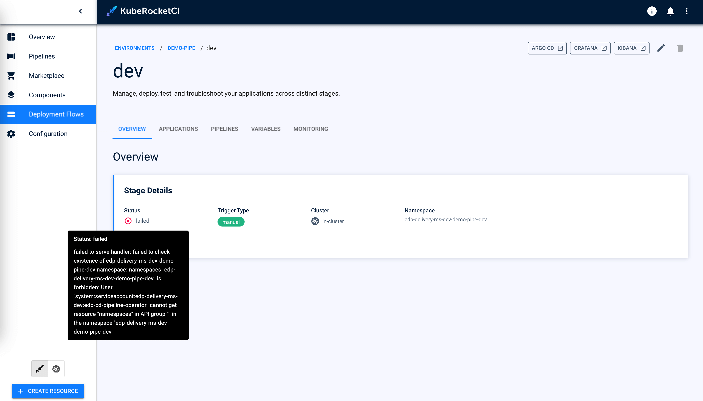

---

title: "Environment Creation Issues"
description: "Troubleshooting steps for resolving environment creation failures in KubeRocketCI due to namespace permission issues, including manual namespace creation and Helm chart configuration adjustments."
sidebar_label: "Environment Creation Issues"

---
<!-- markdownlint-disable MD025 -->

# Environment Creation Issues

<head>
  <link rel="canonical" href="https://docs.kuberocketci.io/docs/operator-guide/troubleshooting/environment-creation" />
</head>

## Problem

Failed to create an environment due to the following error:



## Cause

KubeRocketCI offers several approaches for namespace management: namespaces can be created by users, by KubeRocketCI itself, or by Argo CD. With the default settings on Kubernetes, a namespace that users or Argo CD create before its Environment needs a label (see [Environment Fails in a Namespace Without the Tenant Label](#environment-fails-in-a-namespace-without-the-tenant-label)). If you expect KubeRocketCI to handle namespace creation, ensure that the [cd-pipeline-operator](https://github.com/epam/edp-cd-pipeline-operator), a component of KubeRocketCI, has the necessary permissions. This permission is managed by the `manageNamespace` parameter of the [values.yaml](https://github.com/epam/edp-install/blob/v3.16.0/deploy-templates/values.yaml#L288) file.

If the `manageNamespace` parameter is set to false, it means the KubeRocketCI does not have permission to create namespaces and the procedure of creating namespaces in your project is delegated to a concrete person.

## Solution

Make sure the `manageNamespace` parameter is intentionally set to `false`. If not, define proper flow for namespace management. Read the [Namespace Management](../auth/namespace-management.md) page for more details.

If the parameter was intentionally set to `false`, the solution would be to clarify with your management who is allowed to manage namespaces in your project and request a namespace creation:

If you are allowed to create namespaces, create it manually:

1. Open the terminal. Ensure you have access to the cluster from your kubeconfig.

2. Create a namespace using the `kubectl create namespace` command:

```bash
kubectl create namespace <ns>
```

Usually, the required namespace is shown on the Overview tab of the Environment:


## Environment Fails in a Namespace Without the Tenant Label

**Problem:** since KubeRocketCI 3.16, an Environment in a namespace that was created before it shows the following message, or deleting the Environment or its Deployment does not finish:

```text
... denied request: edp-cd-pipeline-operator may act only on its own namespace and namespaces it provisioned (label app.edp.epam.com/tenant).
```

**Cause:** with the default settings on Kubernetes (`tenancyEngine: none`, `manageNamespace: true`), an admission policy lets the cd-pipeline-operator configure and delete only namespaces labelled `app.edp.epam.com/tenant`. The operator labels the namespaces it creates, but not a namespace created before its Environment, for example by a user or Argo CD.

**Solution:** label the namespace with the name of the platform namespace, as the operator does; it then retries the Environment on its own.

:::warning
Label only a namespace that holds nothing but this Environment: when the Environment is deleted, the operator deletes the labelled namespace with everything in it.
:::

```bash
kubectl label namespace <environment-namespace> app.edp.epam.com/tenant=<platform-namespace>
```

To find all affected namespaces, see [Upgrade KubeRocketCI v3.15 to 3.16](../upgrade/upgrade-krci-3.16.md).

## Related Articles

* [Namespace Management](../auth/namespace-management.md)
