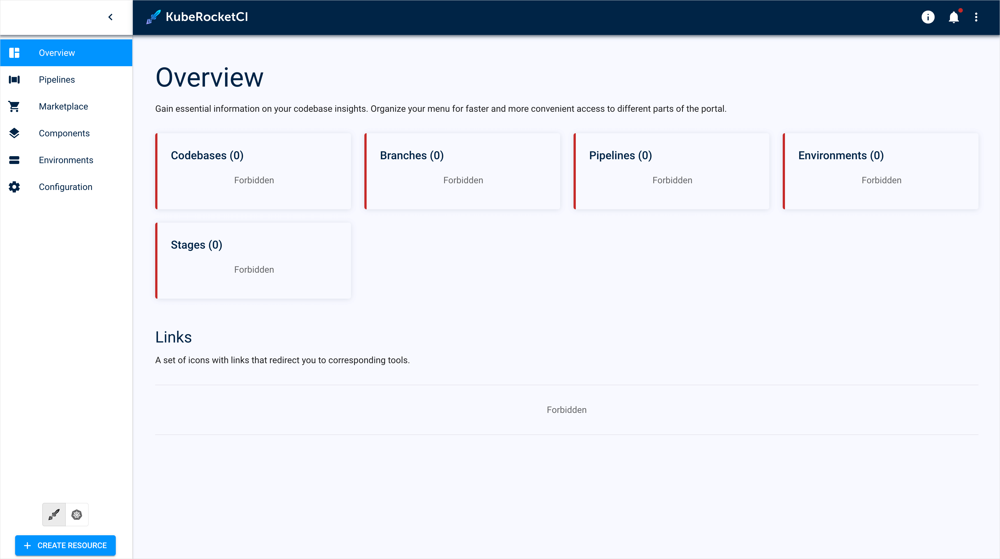

---

title: "Forbidden Messages on the Overview Page"
description: "Troubleshooting guide for resolving issues with forbidden messages on the KubeRocketCI portal overview page, detailing solutions for service account token and Keycloak users."
sidebar_label: "Forbidden Messages"

---
<!-- markdownlint-disable MD025 -->

# Forbidden Messages on the Overview Page

<head>
  <link rel="canonical" href="https://docs.kuberocketci.io/docs/operator-guide/troubleshooting/forbidden-messages/" />
</head>

## Problem

Users can't see resources within the KubeRocketCI dedicated namespace via KubeRocketCI portal:

  

## Cause

The problem might be caused by several factors. First of all, default and allowed namespaces may be either unset or set incorrectly. Secondly, service account used for browsing the KubeRocketCI portal may have insufficient permission set. Thirdly, if Keycloak is used for as an authentication mechanism, then the problem might be related to improper group membership.

## Solution

Solution can vary depending on the way users log into the platform, whether it is a service account token or an OpenID Connect mechanism.

### Solution 1 (Configure Default namespace)

This solution suits those who to log into the KubeRocketCI portal Keycloak.

To fix the problem, follow the steps below:

1. Check both default and allowed namespace by navigating to the **KubeRocketCI** portal -> **Account Settings** -> **Cluster**.

### Solution 2 (Service Account Token)

This solution suits those who use a service account token to log into the KubeRocketCI portal.

To fix the problem, follow the steps below:

1. Make sure the service account is set up in accordance with the [KubeRocketCI Access Model](../../operator-guide/auth/platform-auth-model.md#cluster-rbac-resources) and possesses the appropriate access rights.

2. Check the roles associated with the ServiceAccount:

    ```bash
    serviceaccount=<ServiceAccount_name>
    kubectl get rolebindings -n edp -o json | jq -r --arg sa "$serviceaccount" '.items[] | select(.subjects[]? | select(.kind == "ServiceAccount" and .name == $sa)) | .metadata.name'
    ```

3. Check permissions of the role used in the role binding:

    ```bash
    kubectl describe role <role-name> -n edp
    ```

4. Refresh the page and verify that the new RBAC settings are functioning properly.

## Related Articles

* [KubeRocketCI Access Model](../../operator-guide/auth/platform-auth-model.md)
