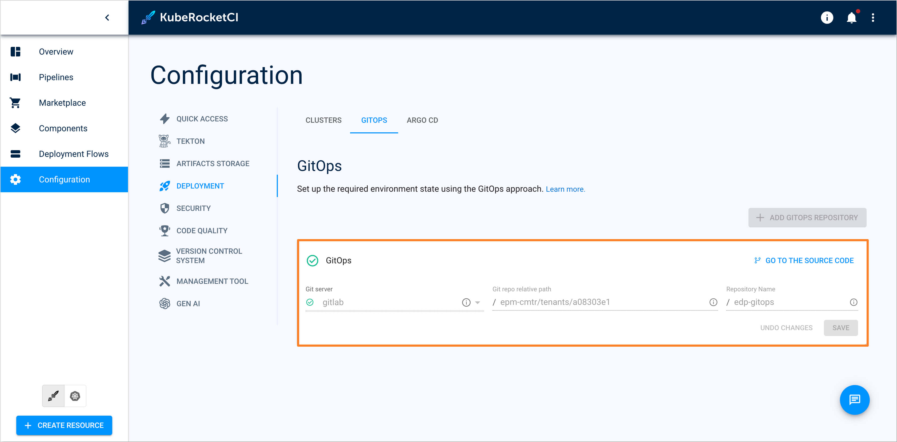
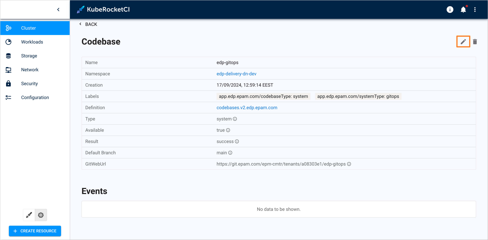
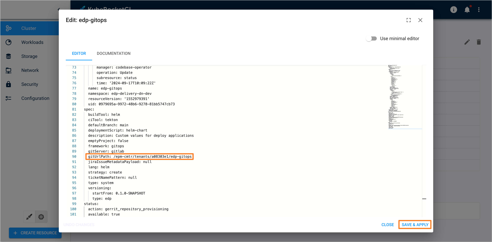

---

title: "Modify GitOps Repository Path"
description: "Guide on how to change the GitOps repository path in KubeRocketCI, including steps for adjusting the Codebase custom resource and deleting and recreating the repository."
sidebar_label: "Modify GitOps Repo Path"

---
<!-- markdownlint-disable MD025 -->

# Modify GitOps Repository Path

<head>
  <link rel="canonical" href="https://docs.kuberocketci.io/docs/operator-guide/troubleshooting/modify-gitops-repo-path/" />
</head>

This page explains how to change the path of a [GitOps](../../user-guide/gitops.md) repository after it has been created.

## Problem

The GitOps repository is located at an incorrect path:

  

## Cause

The GitOps repository path was either misconfigured at creation or needs to be modified as part of a migration or project restructuring.

## Solution 1 (Modify the Codebase Custom Resource)

This solution involves modifying the existing repository path in Codebase custom resource.

To fix the problem, follow the steps below:

1. Navigate to the **Kubernetes** tab in the bottom left corner in Portal UI.

    

2. Navigate to **Cluster** -> **Custom Resources**.

    

3. Find and navigate to the `Codebase` custom resource using the search field in the top right corner.

    

4. Find the `Codebase` custom resource that corresponds to the GitOps repository.

    

5. Navigate to the resource and then press the **Edit** button in the top right corner.

    

6. In the **Edit** window modify the `gitUrlPath` field within the `spec` section to change the GitOps repository path and then press the **Save and Apply** button.

    

7. With the path updated, the GitOps repository will be recreated at the new path on the designated Git Server.

## Solution 2 (Delete and Recreate)

This solution involves deleting the existing GitOps repository and recreating it.

To fix the problem, follow the steps below:

1. Navigate to the **Kubernetes** tab in the bottom left corner in Portal UI.

    

2. Navigate to **Cluster** -> **Custom Resources**.

    

3. Find and navigate to the `Codebase` custom resource using the search field in the top right corner.

    

4. Find the `Codebase` custom resource that corresponds to the GitOps repository.

    

5. Navigate to the resource and then press the **Delete** button in the top right corner.

    

6. Confirm the deletion by pressing the **Yes** button in the confirmation window.

    

7. Click the **Portal** tab in the bottom left corner. Navigate to **Configuration** -> **Deployment** -> **GitOps** and recreate the GitOps repository with the new desired path.

    

## Related Articles

* [Manage GitOps](../../user-guide/gitops.md)
