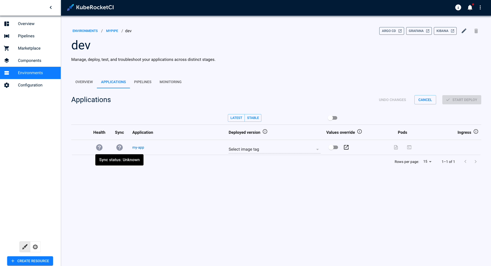
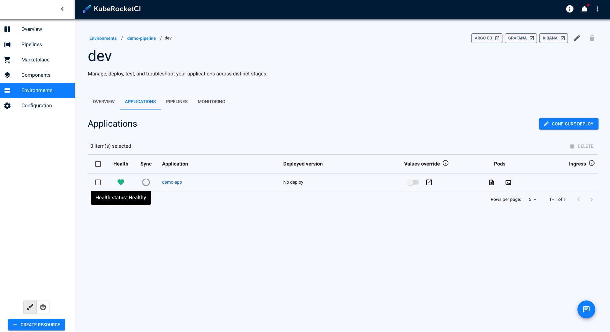

---

title: "Sync and Health Status Unknown"
description: "Troubleshooting guide for resolving unknown health and sync status issues in KubeRocketCI, focusing on correct configuration of ArgoCD integration."
sidebar_label: "Sync & Health Status"

---
<!-- markdownlint-disable MD025 -->

# Sync and Health Status Unknown

<head>
  <link rel="canonical" href="https://docs.kuberocketci.io/docs/operator-guide/troubleshooting/sync-health-status-unknown/" />
</head>

## Problem

In the **Stage Detail** page, the application **Health status** and **Sync Status** is unknown. The `deploy` button doesn't work when attempting to create a stage.

  

## Cause

Incorrect Configuration of ArgoCD Integration

## Solution

1. Please verify that the [Argo CD Integration](../../operator-guide/cd/argocd-integration.md) process has been completed and all steps have been executed correctly.

2. Check the status of the application:

    

## Related Articles

* [Argo CD Integration](../../operator-guide/cd/argocd-integration.md)
