---

title: "Create Application"
description: "Step-by-step guide on creating a Go application using the Gin framework in KubeRocketCI via Marketplace, including build and deployment steps."
sidebar_label: "Create Application"

---
<!-- markdownlint-disable MD025 -->

# Create Application

<head>
  <link rel="canonical" href="https://docs.kuberocketci.io/docs/quick-start/create-application" />
</head>

In KubeRocketCI, all software components, such as applications, libraries, Terraform infrastructures, and automated tests, are referred to as codebases. KubeRocketCI provides flexible methods for scaffolding these components.

This guide will walk you through the process of creating a Go application using the Gin framework. The [Marketplace](../user-guide/marketplace.md) will be used to streamline the application creation process.

## Application Onboarding

To create the first application, complete the instructions below:

1. In the KubeRocketCI, navigate to **Projects**.

2. In the top right corner of the screen, click **+ Create project**.

3. In the **Select Ready Template** section, select **Web Applications with Gin Framework** and click **Continue ->**:

    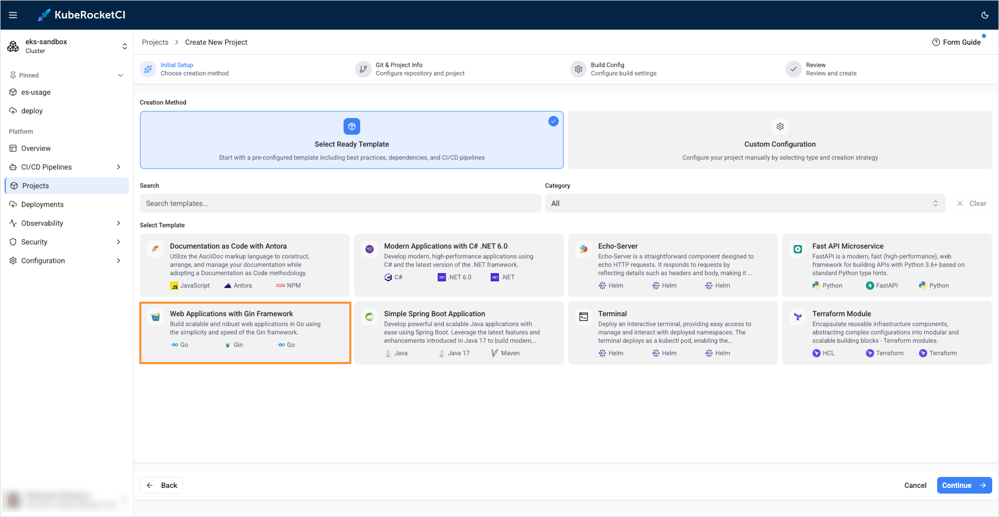

4. In the **Git and Project info** stage, define the following values and click **Continue**:

    - Git server: `github`
    - Owner: `<github_account_name>`
    - Repository name: `my-go-gin-app`
    - Default branch: `main`
    - Project name: `my-go-gin-app`
    - Description: `My first application`
    - Private: `disabled`

    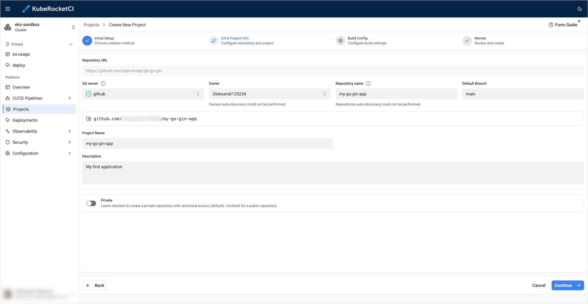

5. In the **Build Config** stage, define the following values and click **Continue**:

    - Codebase versioning type: `semver`
    - Start version from: `0.1.0`
    - Suffix: `SNAPSHOT`

    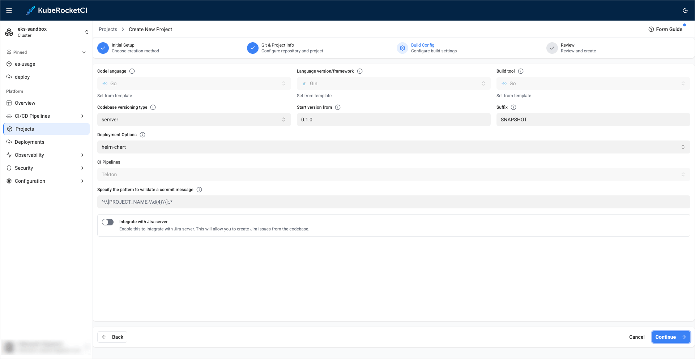

6. In the **Review** stage, verify the configuration and click **Create Project**:

    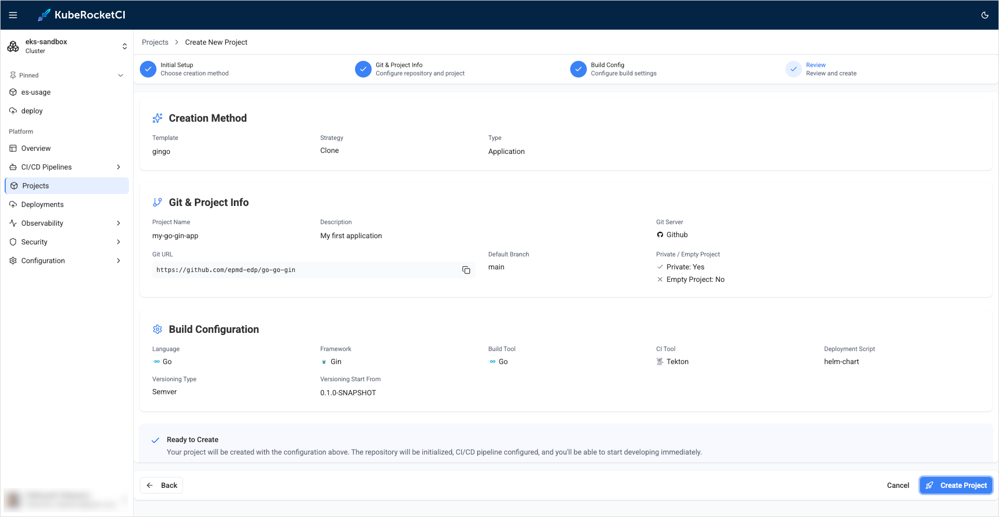

7. As soon as the codebase is created, navigate to it via the notification at the bottom left corner or click the **Components** section:

    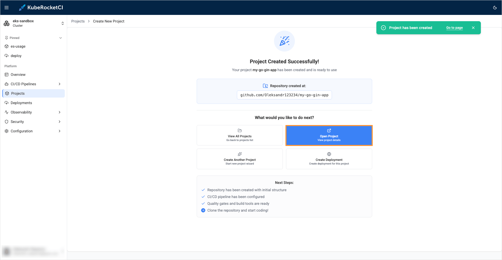

## Build Application

Having created the Go application, proceed to build it by performing the following actions:

1. Open SonarCloud page.

2. On the [account settings](https://sonarcloud.io/account/organizations), copy your SonarCloud **organization key** (lowercase identifier used in API and properties):

    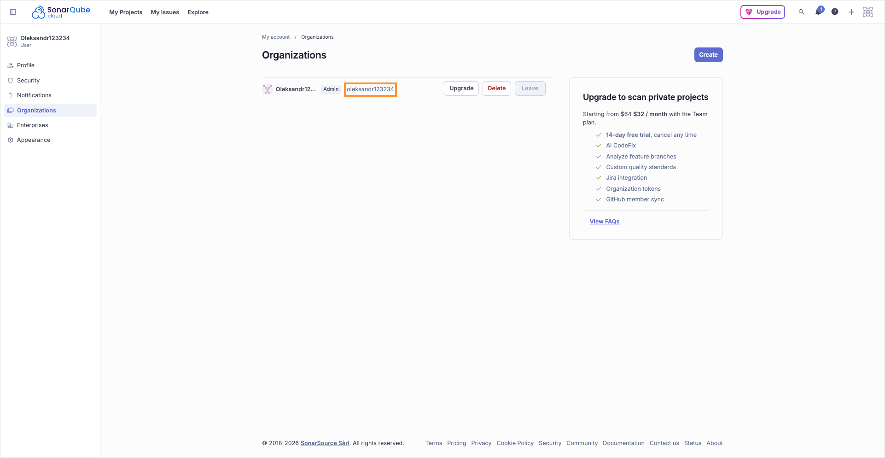

3. In SonarCloud, open the project and go to **Project Information**. Copy the **Project key** exactly as shown (spelling and casing matter). For projects created from GitHub, it is often `<organization-name>_<codebase-name>` (for this guide the codebase name is `my-go-gin-app`):

    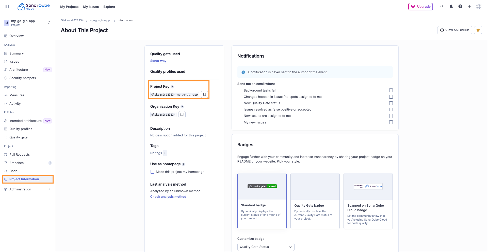

4. In the component details page, expand the application and click the **GIT** button:

    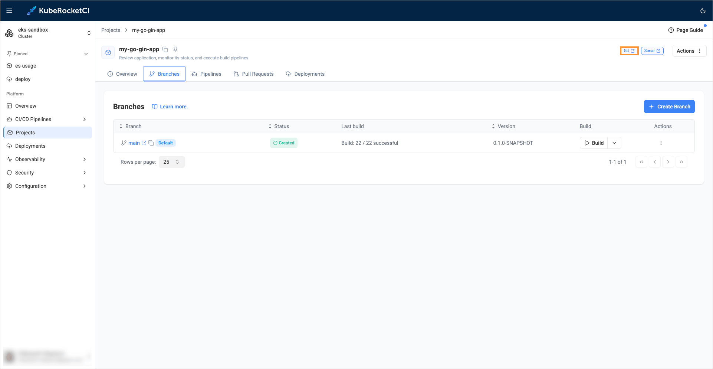

5. In the repository on the `main` branch, edit `sonar-project.properties`. Set `sonar.projectKey` to the **Project key** from the previous step, `sonar.organization` to your **organization key**, and keep the rest aligned with the codebase name `my-go-gin-app`:

    ```ini
    sonar.projectKey=<organization-name>_my-go-gin-app
    sonar.projectName=my-go-gin-app
    sonar.go.coverage.reportPaths=coverage.out
    sonar.branch.name=main
    sonar.test.inclusions=**/*_test.go
    sonar.exclusions=**/cmd/**,**/deploy/**,**/deploy-templates/**,**/*.groovy,**/config/**
    sonar.language=go
    sonar.organization=<organization-key>
    ```

    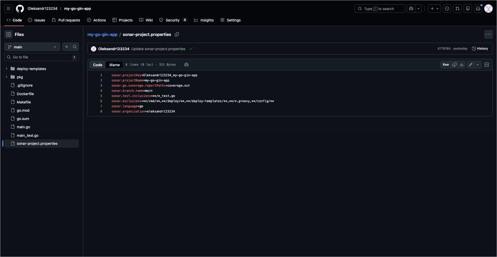

    :::note
      Replace `<organization-key>` with your real organization key from SonarCloud. If SonarCloud shows a **Project key** that does not follow `<organization-key>_my-go-gin-app`, use the value from **Project Information** verbatim for `sonar.projectKey`.
    :::

6. Commit and push the `sonar-project.properties` changes to the main branch.

7. Align the Tekton **Pipeline** with SonarCloud.

    The `sonarqube-general` Task overwrites `sonar.projectKey` from the pipeline parameter `SONAR_PROJECT_KEY`. The build pipeline often sets `SONAR_PROJECT_KEY` to `$(params.CODEBASE_NAME)` only (for example `my-go-gin-app`). That value must match the **Project key** from SonarCloud **Project Information** (often `<organization-key>_my-go-gin-app`).

    Navigate to **KubeRocketCI portal** -> **CI/CD Pipelines** -> **Pipelines**. Search the `github-go-gin-app-build-semver` Pipeline and click on its name. In the top-right corner of the screen, click **Actions** -> **Edit**. Find the task named `sonar` and set its parameters as follows.

    Replace the `sonar` task parameter block (or the equivalent fragment) with:

    ```yaml
    - name: sonar
      params:
        - name: SONAR_PROJECT_KEY
          value: "<organization-name>_my-go-gin-app"
        - name: SONAR_PROJECT_NAME
          value: $(params.CODEBASE_NAME)
        - name: branch
          value: $(params.git-source-revision)
      runAfter:
        - build
      taskRef:
        kind: Task
        name: sonarqube-general
      workspaces:
        - name: source
          subPath: source
          workspace: shared-workspace
    ```

    Replace `"<organization-name>_my-go-gin-app"` with the **exact Project key** from SonarCloud (quotes keep YAML valid if the key contains characters such as `_`):

        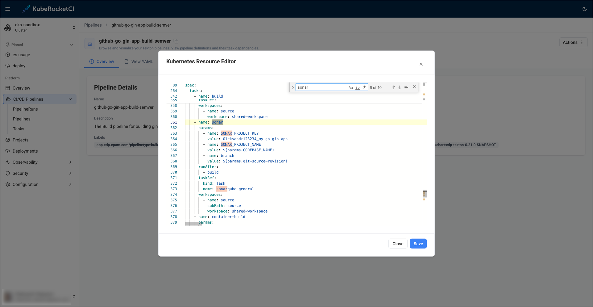


    :::note
      If this Pipeline is managed by Helm or Argo CD, apply the same change in the GitOps manifest or chart values so the cluster object is not reverted on sync.
    :::

    :::note
      If you use a self-hosted SonarQube instance instead of SonarCloud, follow [SonarQube integration](../operator-guide/code-quality/sonarqube.md); project key rules may differ.
    :::

8. Update the `sonarqube-general` **Task** so the SonarCloud availability check does not treat HTTP **307** (redirect on the site root) as failure.

    1. Navigate to **KubeRocketCI portal** -> **CI/CD Pipelines** -> **Tasks**. 
    2. Search the `sonarqube-general` Task and click on its name. 
    3. In the top-right corner of the screen, click **Actions** -> **Edit**. 
    4. In the Tekton **Task** named `sonarqube-general`, open the step `prepare-project`.
    5. Find the check that requests `${SONAR_HOST_URL}` with `curl` and **replace** the availability logic with a **GET** to `/api/system/status`, for example:

    ```bash
    SONAR_STATUS=$(curl -s -o /dev/null -w "%{http_code}" "${SONAR_HOST_URL}/api/system/status") || SONAR_STATUS="503"

    if [[ "$SONAR_STATUS" != "200" ]]; then
      echo -e "SonarQube is not available\nPlease check the connection to SonarQube"
      exit 1
    fi
    ```

    Remove or do not use a bare `HEAD`/`GET` against `${SONAR_HOST_URL}` alone without following redirects, as SonarCloud can respond with **307** and the step would exit incorrectly.

    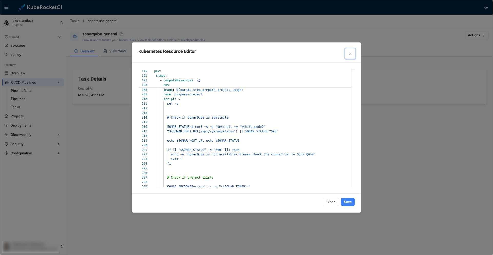


    :::note
      Cluster administrators usually patch this Task once per environment. If your platform already ships the `/api/system/status` check, you can skip this step.
    :::

9. Ensure **Automatic Analysis** is disabled for this project in SonarCloud when using CI scans (see [Integrate SonarQube](./integrate-sonarcloud.md)).

10. In the Project details page, click **Build**:

    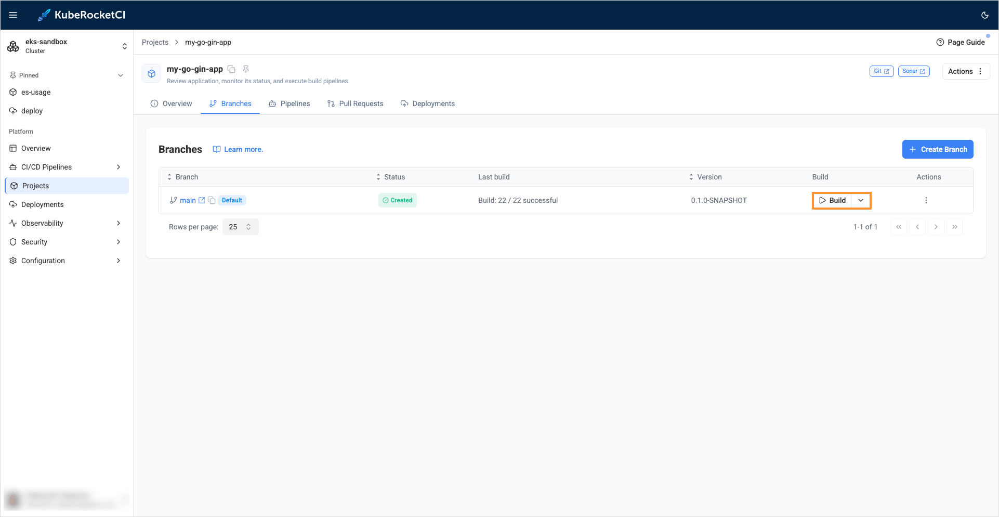

11. Open the PipelineRun and wait until it finishes. Many small starter projects pass on the first run:

    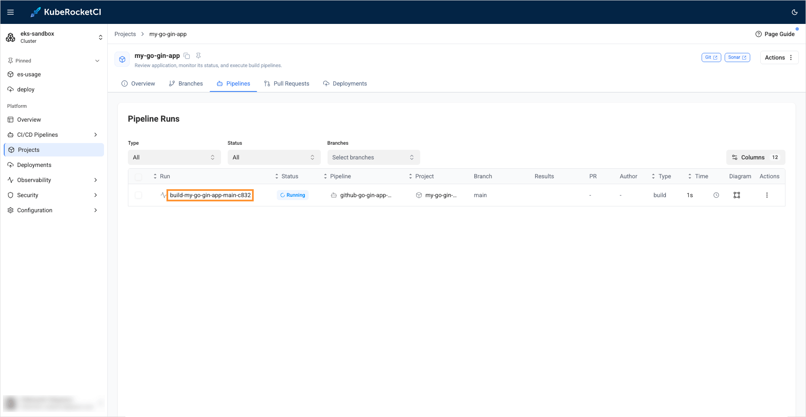

    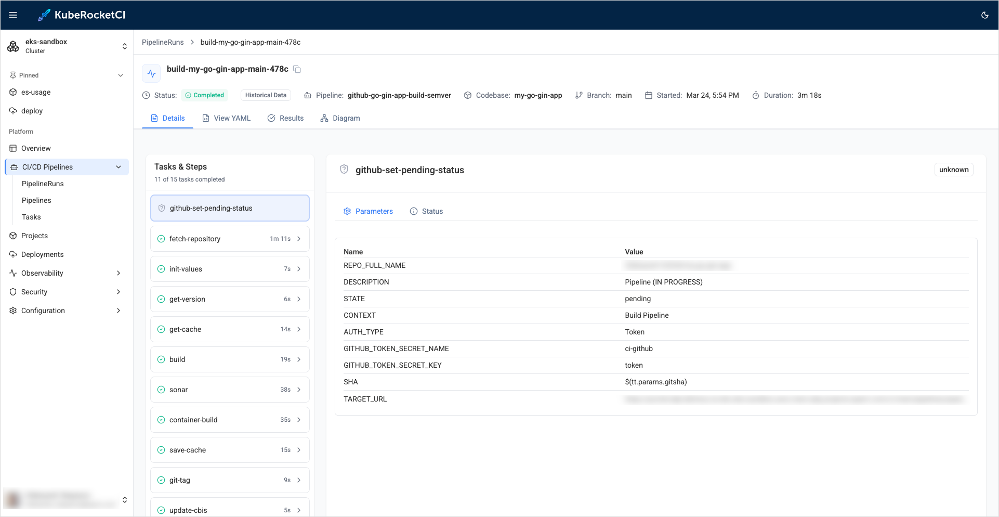

    :::note
      After the first analysis, SonarCloud may adjust Quality Gate behavior for the project. If the `sonar` task fails with **Quality Gate failed** even though the scan completed, address the reported issues or review the Quality Gate, then **re-run** the build pipeline. A second run is not always required.
    :::

Build pipelines in KubeRocketCI are specifically designed to generate an executable image of an application. Once the build process is complete, the resulting image can be deployed and run in a target environment.

Now that you have successfully built an application, the next step is to create an environment for deployment. In order to deploy the application, you will need to install and integrate Argo CD. To learn how to install and integrate Argo CD, please refer to the [Integrate Argo CD](./integrate-argocd.md) page.
