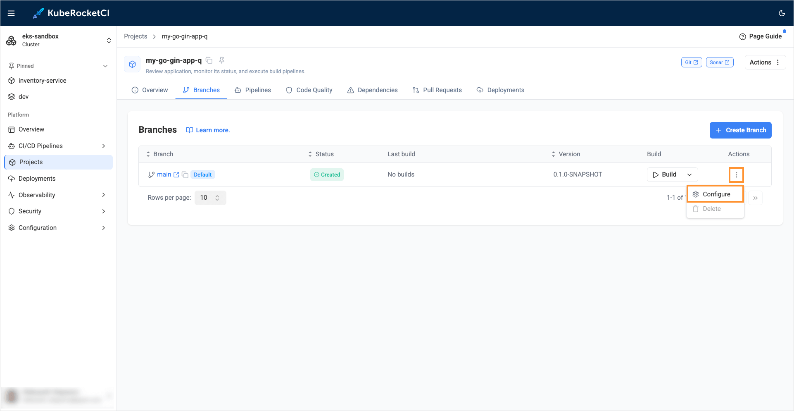
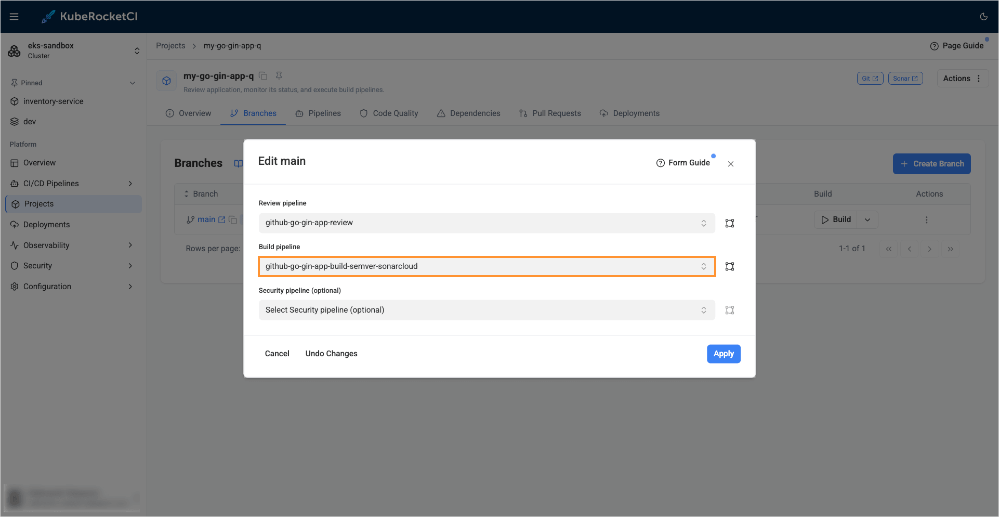
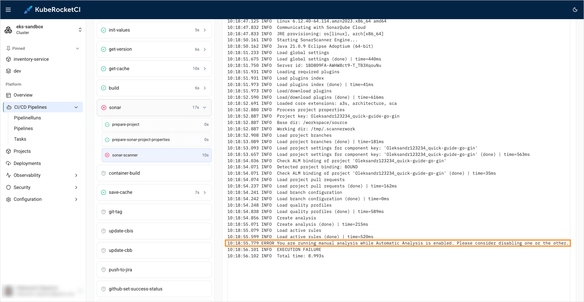

---

title: "Create Application"
description: "Step-by-step guide on creating a Go application using the Gin framework in KubeRocketCI via Marketplace, including build and deployment steps."
sidebar_label: "Create Application"

---
<!-- markdownlint-disable MD025 -->

# Create Application

<head>
  <link rel="canonical" href="https://docs.kuberocketci.io/docs/quick-start/create-application" />
</head>

In KubeRocketCI, all software components, such as applications, libraries, Terraform infrastructures, and automated tests, are referred to as codebases. KubeRocketCI provides flexible methods for scaffolding these components.

This guide will walk you through the process of creating a Go application using the Gin framework. The [Marketplace](../user-guide/marketplace.md) will be used to streamline the application creation process.

## Application Onboarding

To create the first application, complete the instructions below:

1. In the KubeRocketCI, navigate to **Projects**.

2. In the top right corner of the screen, click **+ Create project**.

3. In the **Select Ready Template** section, select **Web Applications with Gin Framework** and click **Continue ->**:

    

4. In the **Git and Project info** stage, define the following values and click **Continue**:

    - Git server: `github`
    - Owner: `<github_account_name>`
    - Repository name: `my-go-gin-app`
    - Default branch: `main`
    - Project name: `my-go-gin-app`
    - Description: `My first application`
    - Private: `disabled`

    

5. In the **Build Config** stage, define the following values and click **Continue**:

    - Codebase versioning type: `semver`
    - Start version from: `0.1.0`
    - Suffix: `SNAPSHOT`

    

6. In the **Review** stage, verify the configuration and click **Create Project**:

    

7. As soon as the codebase is created, click the **Open Project** button:

    

## Build Application

Having created the Go application, proceed to build it by performing the following actions:

1. Open SonarCloud page.

2. On the [account settings](https://sonarcloud.io/account/organizations), copy your SonarCloud **organization key** (lowercase identifier used in API and properties):

    

3. In SonarCloud, open the project and go to **Project Information**. Copy the **Project key** exactly as shown (spelling and casing matter). For projects created from GitHub, it is often `<organization-name>_<codebase-name>` (for this guide the codebase name is `my-go-gin-app`):

    

4. In the component details page, expand the application and click the **GIT** button:

    

5. In the repository on the `main` branch, edit `sonar-project.properties`. Set `sonar.projectKey` to the **Project key** from the previous step, `sonar.organization` to your **organization key**, and keep the rest aligned with the codebase name `my-go-gin-app`:

    ```ini
    sonar.projectKey=<organization-name>_my-go-gin-app
    sonar.projectName=my-go-gin-app
    sonar.go.coverage.reportPaths=coverage.out
    sonar.branch.name=main
    sonar.test.inclusions=**/*_test.go
    sonar.exclusions=**/cmd/**,**/deploy/**,**/deploy-templates/**,**/*.groovy,**/config/**
    sonar.language=go
    sonar.organization=<organization-key>
    ```

    

    :::note
      Replace `<organization-key>` with your real organization key from SonarCloud. If SonarCloud shows a **Project key** that does not follow `<organization-key>_my-go-gin-app`, use the value from **Project Information** verbatim for `sonar.projectKey`.
    :::

6. Commit and push the `sonar-project.properties` changes to the main branch.

7. (Optional) Select the SonarCloud-specific pipeline:

  On the Project details page, select the **Branches tab**, click the actions button and select **Configure**:

    

    :::note
      If this Pipeline is managed by Helm or Argo CD, apply the same change in the GitOps manifest or chart values so the cluster object is not reverted on sync.
    :::

    :::note
      If you use a self-hosted SonarQube instance instead of SonarCloud, follow [SonarQube integration](../operator-guide/code-quality/sonarqube.md); project key rules may differ.
    :::

  In the **Edit** window, select the **github-build-edp-sonarcloud** build Pipeline and click **Apply**:

    

8. In the Project details page, click **Build**:

    

9. Open the PipelineRun and wait until it finishes. Many small starter projects pass on the first run:

    

    

    :::note
      After the first analysis, SonarCloud may adjust Quality Gate behavior for the project. If the `sonar` task fails with **Quality Gate failed** even though the scan completed, address the reported issues or review the Quality Gate, then **re-run** the build pipeline. A second run is not always required.
    :::

    If the pipeline failed, ensure **Automatic Analysis** is disabled for this project in SonarCloud when using CI scans (see [Integrate SonarQube](./integrate-sonarcloud.md)):

      

Build pipelines in KubeRocketCI are specifically designed to generate an executable image of an application. Once the build process is complete, the resulting image can be deployed and run in a target environment.

Now that you have successfully built an application, the next step is to create an environment for deployment. In order to deploy the application, you will need to install and integrate Argo CD. To learn how to install and integrate Argo CD, please refer to the [Integrate Argo CD](./integrate-argocd.md) page.
