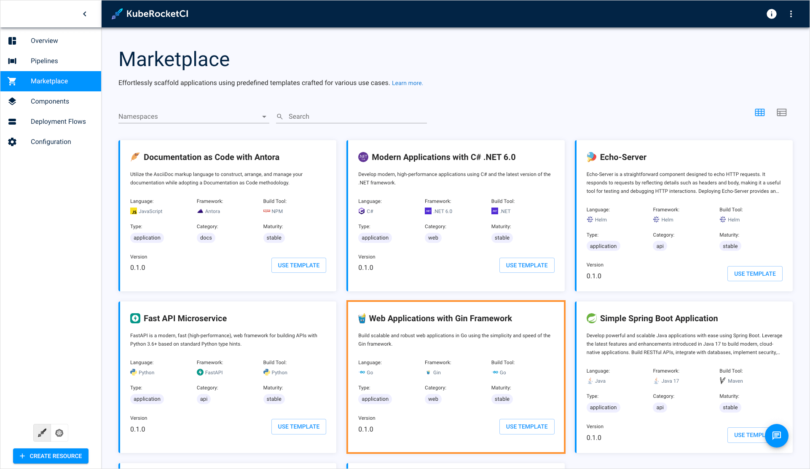
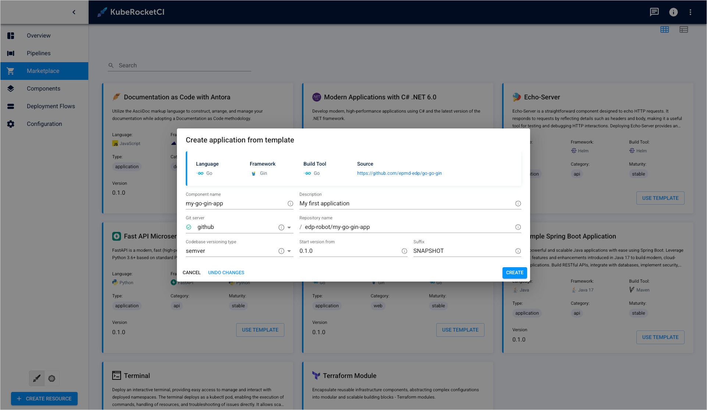
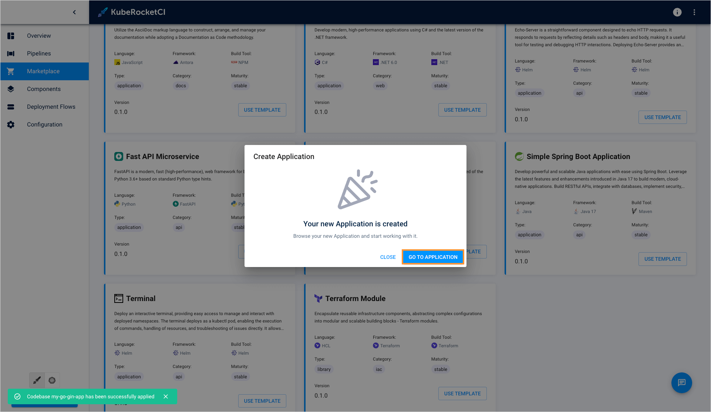
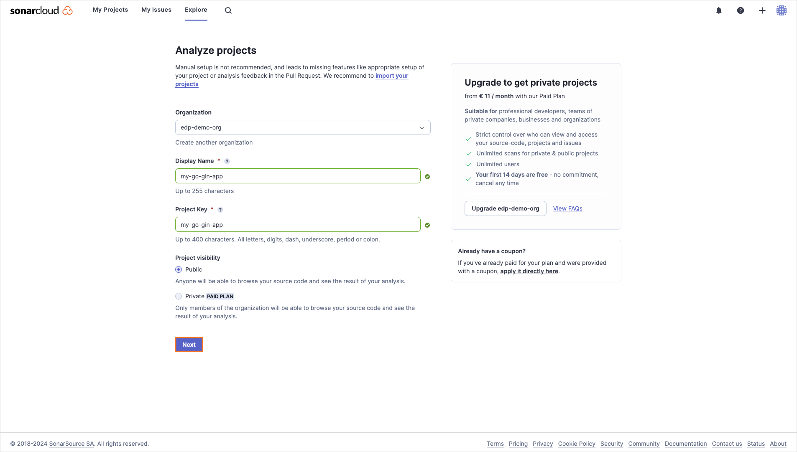
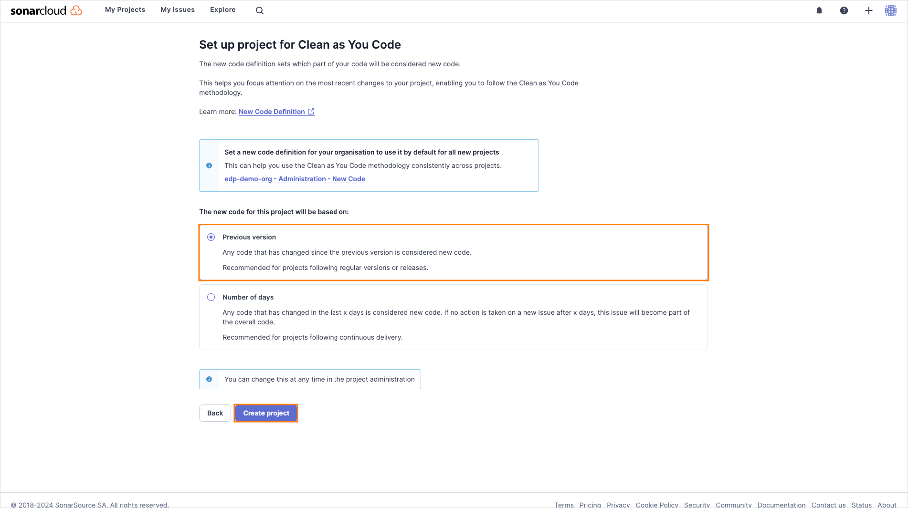
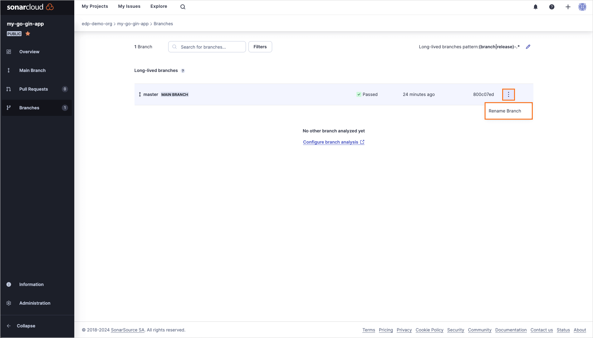
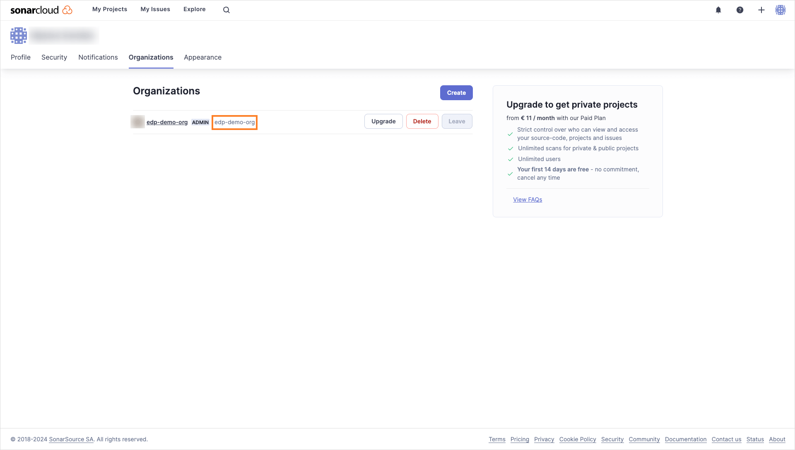
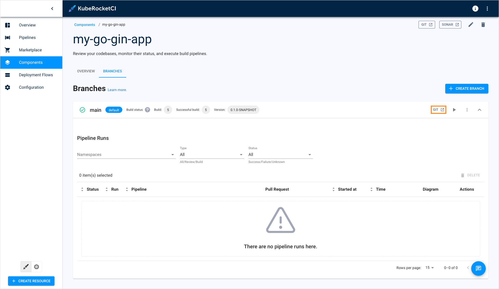
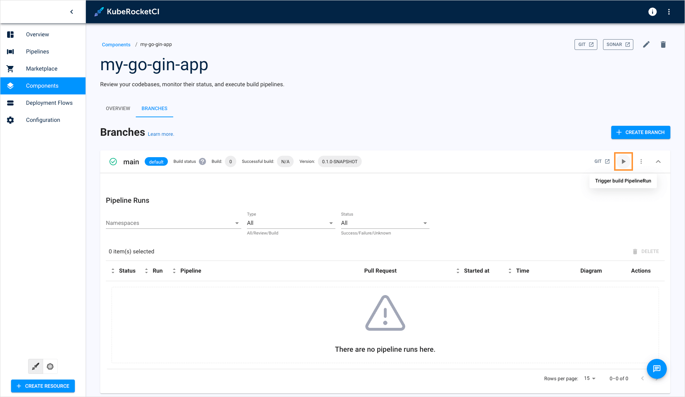
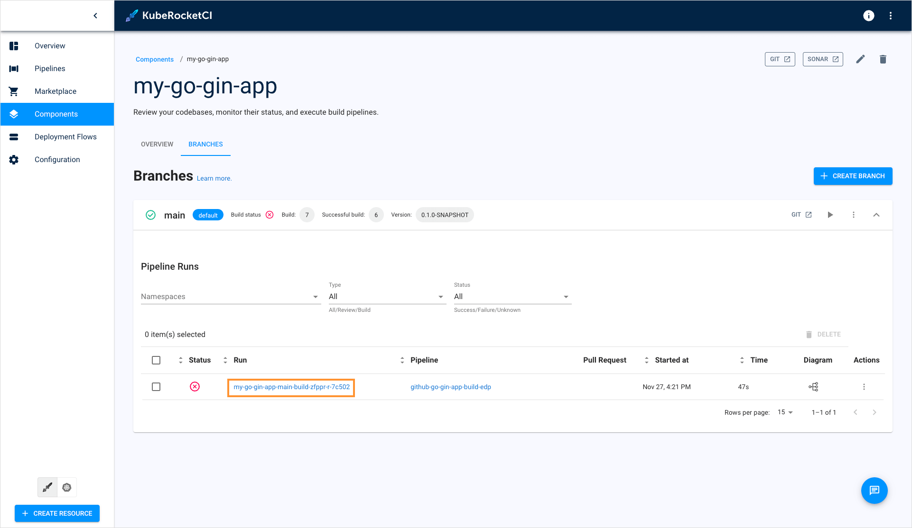

# Create Application

<head>
  <link rel="canonical" href="https://docs.kuberocketci.io/docs/quick-start/create-application/" />
</head>

In KubeRocketCI, all software components, such as applications, libraries, Terraform infrastructures, and automated tests, are referred to as codebases. KubeRocketCI provides flexible methods for scaffolding these components.

This guide will walk you through the process of creating a Go application using the Gin framework. The [Marketplace](../user-guide/marketplace.md) will be used to streamline the application creation process.

## Application Onboarding

To create the first application, complete the instructions below:

1. In the KubeRocketCI, navigate to **Marketplace**.

2. In the **Marketplace** section, select **Web Applications with Gin Framework**:

    

3. On the application template details window, click **Proceed**:

    

3. In the appeared window, define the following values and click **Apply**:

    - Component name: `my-go-gin-app`
    - Description: `My first application`
    - Git server: `github`
    - Repository name: `<github_account_name>/my-go-gin-app`
    - Codebase versioning type: `edp`
    - Start version from: `0.1.0`
    - Suffix: `SNAPSHOT`

    

4. As soon as the codebase is created, navigate to it via the notification at the bottom left corner or click the **Components** section:

    

## Build Application

Having created the Go application, proceed to build it by performing the following actions:

1. In the [create project](https://sonarcloud.io/projects/create) page add new project to analyze it.

    :::note
      Project name in the Sonar cloud must be the same as codebase name.
    :::

    

    Set the Previous version option and click Create project.

    

2. On the project menu, navigate to **Branches** menu, select `master` branch and rename it to `main`.

    

3. On the [account settings](https://sonarcloud.io/account/organizations) copy the value of the SonarCloud organization name.

    

4. In the component details page, expand the application and click the **GIT** button:

    

5. In the opened Source Code. In the `main` branch in GitHub, open the `sonar-project.properties` file and include the `sonar.language=go`, and `sonar.organization` parameters where `sonar.organization` is equal to the value copied in the previous step, resulting in the following configuration:

    ```ini
    sonar.projectKey=my-go-gin-app
    sonar.projectName=my-go-gin-app
    sonar.go.coverage.reportPaths=coverage.out
    sonar.test.inclusions=**/*_test.go
    sonar.exclusions=**/cmd/**,**/deploy/**,**/deploy-templates/**,**/*.groovy,**/config/**
    sonar.language=go
    sonar.organization=<organization-key>
    ```

6. Commit the changes.

7. In the component details page, click the **Trigger build pipeline run** button:

    

    :::note
      After first project scan, sonar creates Quality Gate for this project, and scan will be failed, rerun pipeline to analyze project with new Quality Gates.
    :::

8. To check the status of the build pipeline, click on its name:

    

9. Once the build fails, click the failed task name to open the Tekton pipeline run:

    

10. In KubeRocketCI, initiate the build pipeline again and wait for its completion.

    

Build pipelines in KubeRocketCI are specifically designed to generate an executable image of an application. Once the build process is complete, the resulting image can be deployed and run in a target environment.

Now that you have successfully built an application, the next step is to create an environment for deployment. In order to deploy the application, you will need to install and integrate Argo CD. To learn how to install and integrate Argo CD, please refer to the [Integrate Argo CD](./integrate-argocd.md) page.
