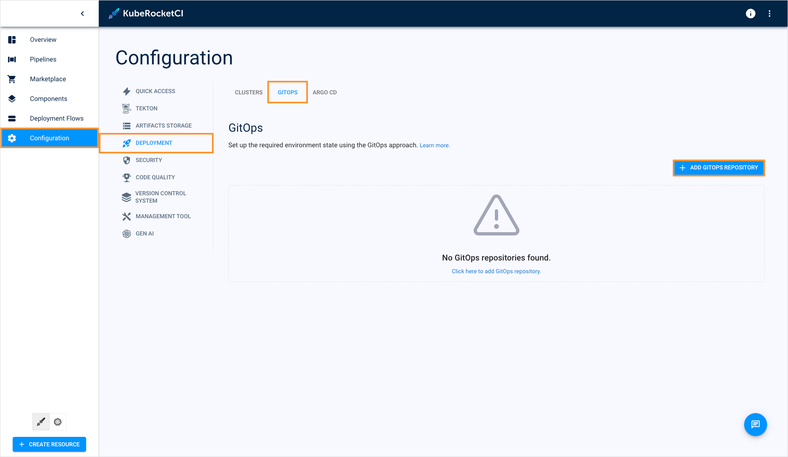
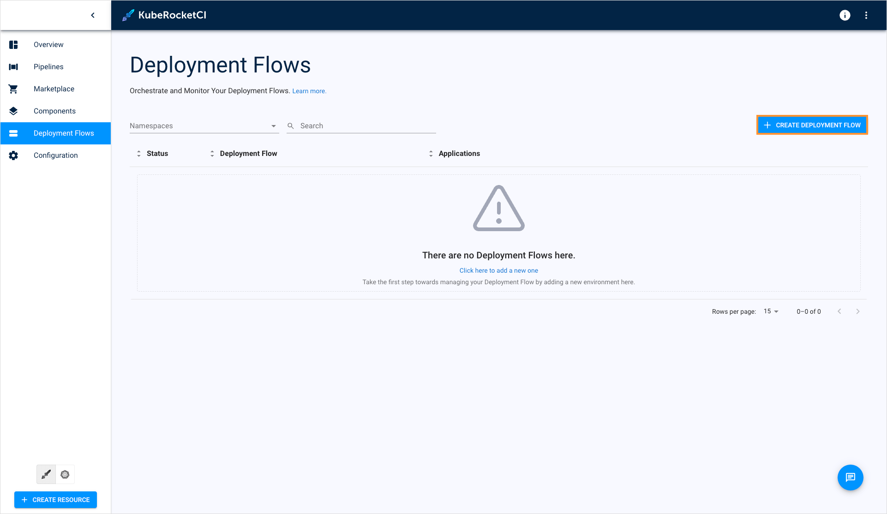
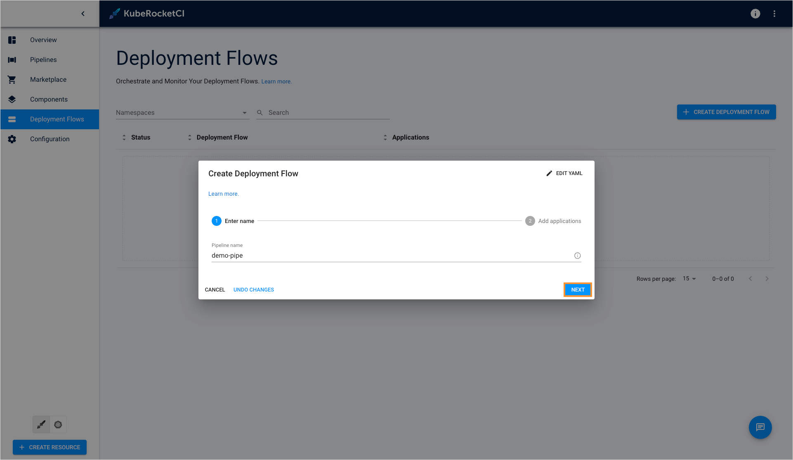
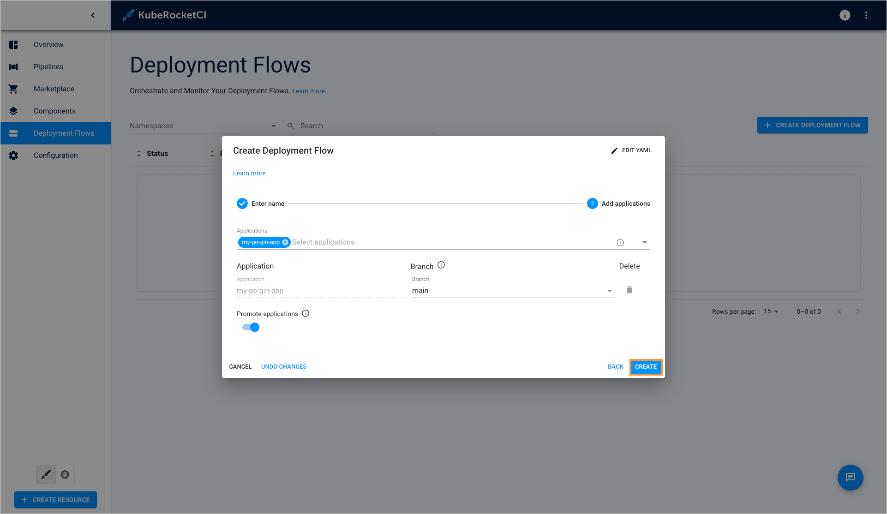
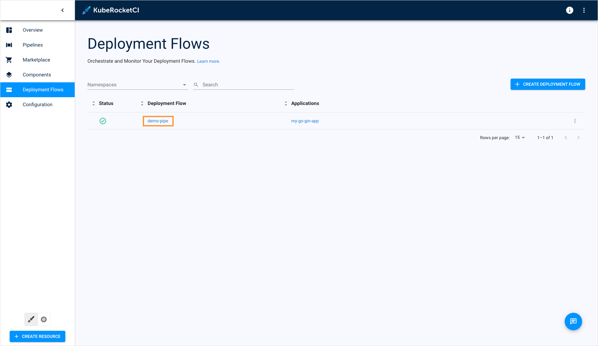
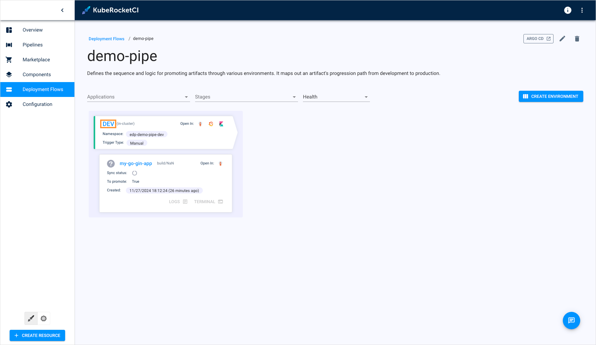
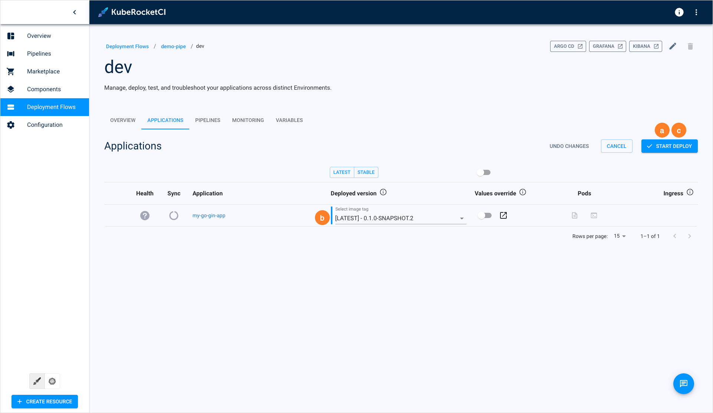

---

title: "Deploy Application"
description: "Detailed guide on deploying your first application in KubeRocketCI, including creating a GitOps repository, deployment flow, and executing the deployment."
sidebar_label: "Deploy Application"

---
<!-- markdownlint-disable MD025 -->

# Deploy Application

<head>
  <link rel="canonical" href="https://docs.kuberocketci.io/docs/quick-start/deploy-application" />
</head>

Now, let's proceed to deploy our first application. This page offers detailed instructions on how to create an environment and deploy the application within it.

## Create GitOps Repository

As a prerequisite, create a GitOps repository in your GitHub account. KubeRocketCI Portal adheres to the GitOps approach when working with environments. In a GitOps repository, values are saved to redefine the default behavior (parameters) of deployment for each environment. The creation of a GitOps repository involves the following two steps:

1. In the UI Portal, navigate to **Configuration** -> **Deployment** -> **GitOps** and click **+ Add GitOps repository**:

    

2. Define the following values and click **Save**:

    - Git server: `github`
    - Git repo relative path: `github_account_name`
    - Repository Name: `edp-gitops`

    

## Create Deployment Flow

To create a deployment flow, follow the steps below:

1. In the UI Portal, navigate to **Deployment Flows** and click the **+ Create deployment flow** button:

    

2. In the **Create deployment flow** window, enter the pipeline name and click the **Next** button:

    

3. In the **Add applications** tab, select the my-go-gin-app application, main branch, and click **Create**:

    

4. Once the deployment flow is created, click the **Go to deployment flow** button on the congratulations window:

    

5. In the **Deployment flows** section, click the **Create environment** button:

    

6. On the **Configure stages** tab, define the following values and click **Next**:

    - Cluster: `in-cluster`
    - Environment name: `dev`
    - Namespace: `edp-my-go-gin-app-dev`
    - Description: `Development stage`
    - Trigger type: `Manual`
    - Deploy Pipeline template: `deploy`
    - Clean Pipeline template: `clean`

    

7. On the **Add quality gates** tab, define the quality gates and click **Create**:

    - Quality gate type: `Manual`
    - Step name: `dev`

    

8. On the congratulations window, click **Go to environment**:

    

   The created deployment flow will be added to the deployment flows list.

## Application Deployment

To deploy application, follow the steps below:

1. In the deployment flows section, click the deployment flow name:

    

2. In the deployment flow details page, click the environment name to enter the environment details page:

    

3. Once you enter the environment details page, proceed to deploy the application:

    a. Click the **Configure deploy** button;

    b. Select the Image stream version;

    c. Click the **Start deploy** button.

    

Congratulations on completing the Quick Start guide! We hope you found this journey enjoyable.

Now that you have a good understanding of how KubeRocketCI works, you can further enhance its capabilities by integrating it with [Nexus](../operator-guide/artifacts-management/nexus-sonatype.md). Additionally, explore other functionalities detailed in our [Use Cases](../use-cases/index.md) section. If you're eager to unlock the full potential of KubeRocketCI, navigate to the [Operator Guide](../operator-guide/index.md) to fine-tune your KubeRocketCI for your specific requirements!
