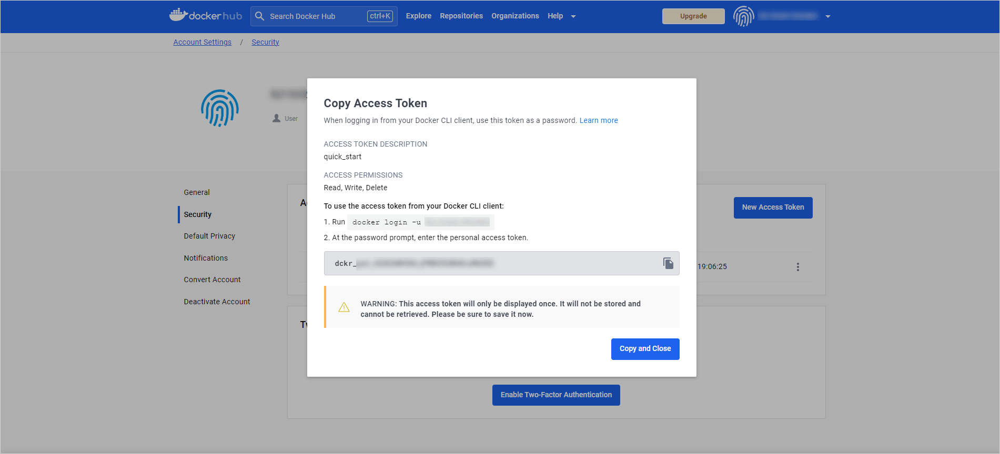
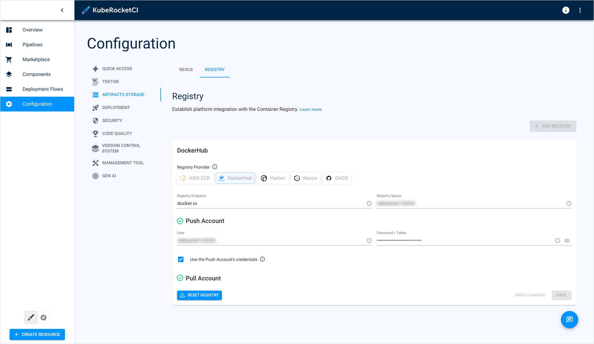

---

title: "Integrate DockerHub"
description: "Guide on integrating KubeRocketCI with DockerHub for storing and distributing application images, including generating access tokens and configuring registry settings."
sidebar_label: "Integrate DockerHub"

---
<!-- markdownlint-disable MD025 -->

# Integrate DockerHub

<head>
  <link rel="canonical" href="https://docs.kuberocketci.io/docs/quick-start/integrate-container-registry" />
</head>

KubeRocketCI utilizes container registries for storing and distributing application images. This page provides instructions on integrating your platform with DockerHub.

## Integration Procedure

To integrate KubeRocketCI with DockerHub, follow the steps below:

1. Log in to your DockerHub account.

2. In the DockerHub main page, click your user icon at the top right corner and select **Account Settings**.

3. In the **Account Settings** page, select the **Security** tab and click **New Access Token**.

4. Enter the token description, select the **Read, Write, Delete** permission and click **Generate**.

5. Copy the generated token:

    

6. In the UI Portal, navigate to **Configuration** -> **Registry** and click the **Add Registry** button.

7. In the **Registry Provider** field, select **DockerHub**. Define the following values and click **Save**:

    - Registry Endpoint: `https://docker.io`
    - Registry Space: `DockerHub account name`
    - User: `DockerHub account name`
    - Password/Token: `Your generated access token`
    - Use the Push Account's credentials: `check`

    

:::note
  In the DockerHub context, the **Registry Space** field is equivalent to the account/organization name.
:::

With all integrations in place, let's proceed to the [Create Application](./create-application.md) page for further instructions on how to create applications using KubeRocketCI.
