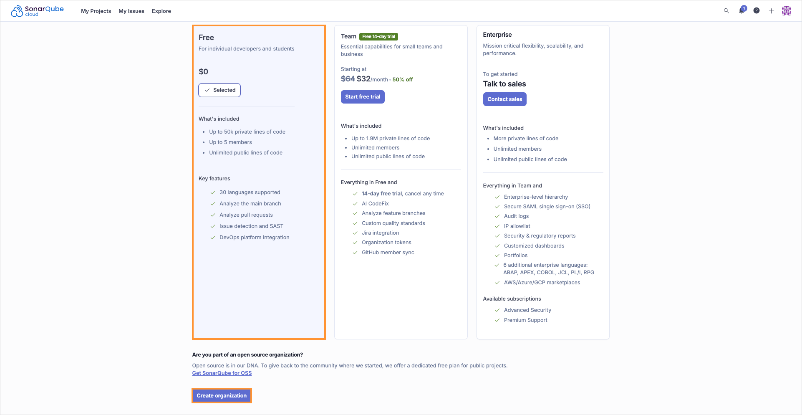
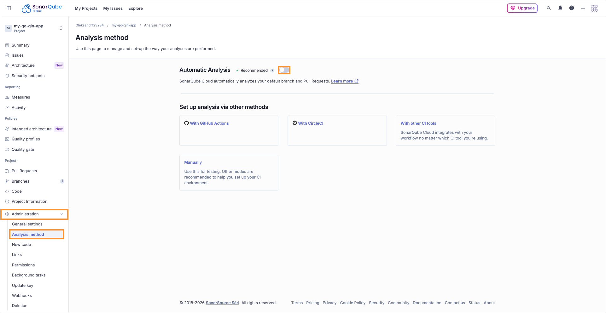
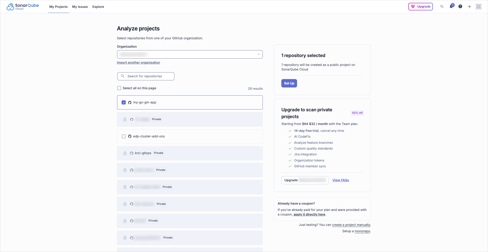
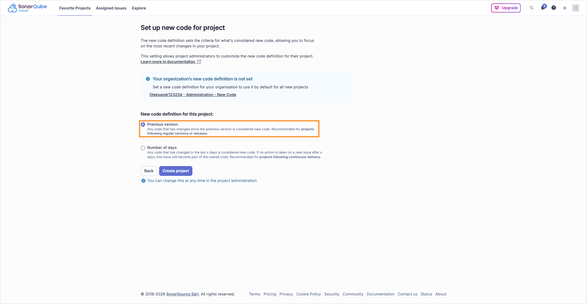
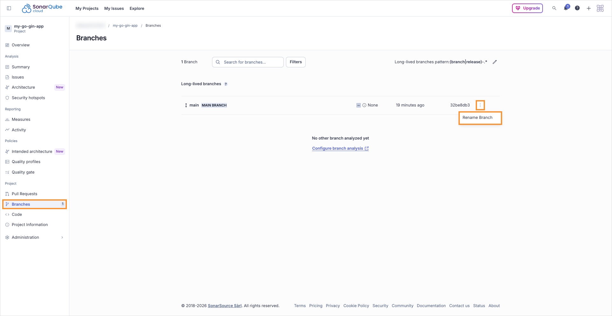
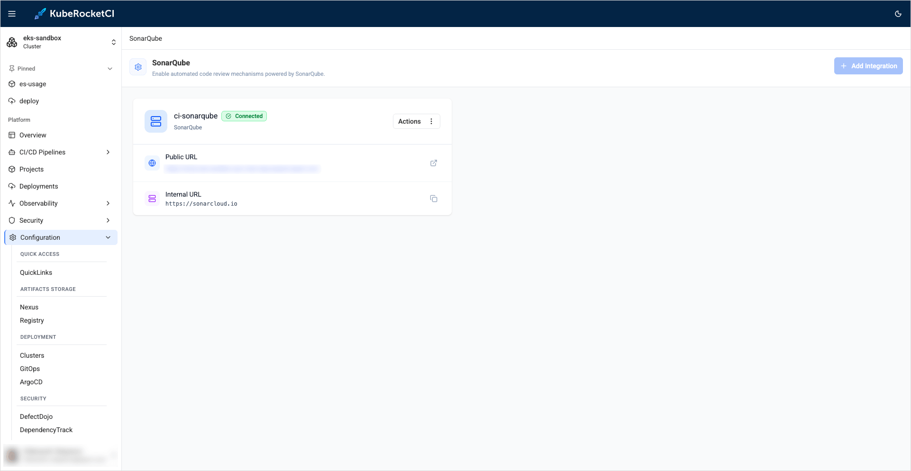

---

title: "Integrate SonarQube"
description: "Guide on integrating SonarQube with KubeRocketCI for code quality analysis in build and review pipelines, including steps for setting up SonarCloud."
sidebar_label: "Integrate SonarQube"

---
<!-- markdownlint-disable MD025 -->

# Integrate SonarQube

<head>
  <link rel="canonical" href="https://docs.kuberocketci.io/docs/quick-start/integrate-sonarcloud" />
</head>

It is essential for KubeRocketCI to have SonarQube integrated with the platform as all the pipelines include the `sonar` step.

SonarQube is a powerful tool used in build and code review pipelines to enhance code quality by identifying and reporting issues, as well as providing recommendations for improvement. SonarCloud, the SaaS solution offered by SonarQube, serves this purpose.

This guide will walk you through the configuration process of SonarCloud for your project.

:::note
  An alternative option is to use an independent [SonarQube instance](../operator-guide/code-quality/sonarqube.md).
:::

## Integrate SonarCloud

To integrate SonarCloud with the platform, follow the steps below:

1. Sign in to [SonarCloud](https://sonarcloud.io) with your GitHub account.

2. In the top right corner of the screen, click **+** and select [Create new organization](https://sonarcloud.io/create-organization), select **GitHub**, and continue with your GitHub account/organization:

    ")

    :::note
      SonarCloud UI has changed: the flow is now **Create organization** -> **GitHub** instead of the old "import from GitHub" screen.
    :::

3. In the Create an organization menu, choose the free plan and click **Create organization**:

    :::note
      Organization key must be unique.
    :::

    

4. For each SonarCloud project that KubeRocketCI analyzes with Tekton (`sonar-scanner` in the build or review pipeline), turn off **Automatic Analysis** in SonarCloud so only CI runs the scan. If you have not created those projects yet, do this after you add each repository in SonarCloud (for example while following [Create Application](./create-application.md)):

    1. In SonarCloud, open the project.
    2. Go to **Administration** -> **Analysis Method**.
    3. Disable **Automatic Analysis**:

      

    :::warning
      If **Automatic Analysis** stays enabled while the pipeline runs `sonar-scanner`, SonarCloud returns an error such as *You are running manual analysis while Automatic Analysis is enabled* and the `sonar` task fails. KubeRocketCI expects a **single** analysis path: CI-driven scans with the token configured in the portal.
    :::

5. In the [create project](https://sonarcloud.io/projects/create) page on the SonarCloud site, add new project to analyze it:

    :::note
      Project name in the Sonar cloud must be the same as codebase name.
    :::

    

    Set the **Previous** version option and click **Create project**:

    

6. On the project menu, navigate to **Branches** menu, select `master` branch and rename it to `main`. You can skip this step if the default branch is already `main`:

    

7. Click your profile icon, open [**My account -> Security**](https://sonarcloud.io/account/security), enter a token name, and click **Generate Token**:

    :::warning
      Copy the generated token right away. SonarCloud shows token value only once.
    :::

    ")

8. In the KubeRocketCI portal, navigate to **Configuration** -> **Code Quality** -> **SonarQube**. Define the following values and click **Save**:

    * Quick Link URL: `https://sonarcloud.io`
    * URL: `https://sonarcloud.io`
    * Token: `account token generated in SonarCloud`

    

After completing the SonarQube integration, proceed to integrate the platform with GitHub. Navigate to the [Integrate GitHub](./integrate-github.md) page for further instructions.
