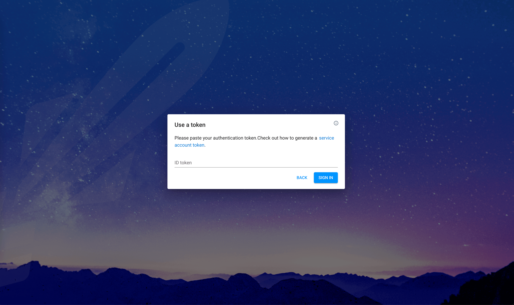
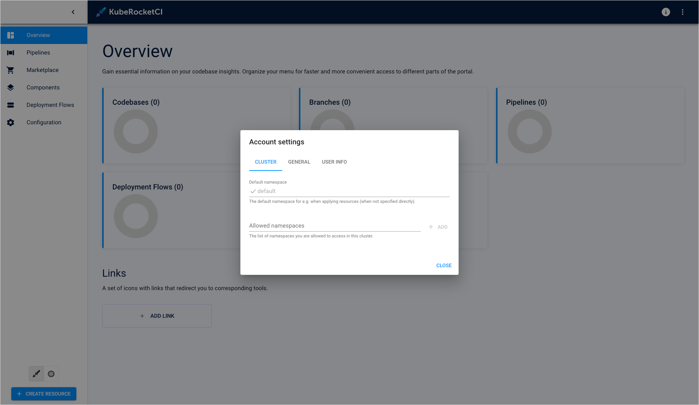
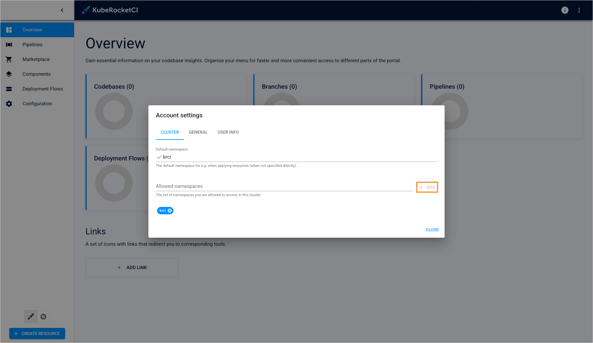

<!-- markdownlint-disable MD025 -->
<head>
  <link rel="canonical" href="https://docs.kuberocketci.io/docs/quick-start/platform-installation" />
</head>

# Install KubeRocketCI

This page serves as the starting point for the quick start guide, where we will install Tekton as a prerequisite and then proceed to install the KubeRocketCI itself.

<div style={{ display: 'flex', justifyContent: 'center' }}>
<iframe width="560" height="315" src="https://www.youtube-nocookie.com/embed/ILlY4niCWeU" title="YouTube video player" frameborder="0" allow="accelerometer; autoplay; clipboard-write; encrypted-media; gyroscope; picture-in-picture" allowfullscreen="allowfullscreen"></iframe>
</div>

## Install Tekton

KubeRocketCI relies on Tekton resources, including Tasks, Pipelines, Triggers, and Interceptors to execute CI/CD pipelines.

To install Tekton, run the commands below:

  ```bash
  kubectl apply -f https://storage.googleapis.com/tekton-releases/pipeline/previous/v0.53.4/release.yaml
  kubectl apply -f https://storage.googleapis.com/tekton-releases/triggers/previous/v0.25.3/release.yaml
  kubectl apply -f https://storage.googleapis.com/tekton-releases/triggers/previous/v0.25.3/interceptors.yaml
  ```

## Install platform

To deploy the platform, follow the steps below:

1. Add a Helm Chart repository:

    ```bash
    helm repo add epamedp https://epam.github.io/edp-helm-charts/stable
    helm repo update
    ```

2. Deploy the platform using the `helm install` command:

    ```bash
    helm install krci epamedp/edp-install --version 3.11.1 --create-namespace --atomic -n krci --set global.dnsWildCard=example.com
    ```

3. Upon successful deployment of the KubeRocketCI Helm Chart, run the `kubectl port-forward` command:

    ```bash
    kubectl port-forward service/portal 59480:80 -n krci
    ```

4. Enter the localhost in your browser to access the login menu:

    ```bash
    localhost:59480
    ```

    

5. Create the edp-admin service account and generate an access token to open the KubeRocketCI:

    ```bash
    kubectl -n krci create serviceaccount edp-admin
    kubectl create clusterrolebinding edp-admin --serviceaccount=krci:edp-admin --clusterrole=cluster-admin
    kubectl create token edp-admin -n krci
    ```

6. In the login menu, paste the generated token in the **ID token** field and click the **SIGN IN** button.

7. Upon logging in, specify the namespace for KubeRocketCI where platform is deployed by clicking the **cluster settings** link in the bottom left corner of the UI:

    

8. In the **Cluster Settings** page, define the following for fields:

    * Default namespace: `krci`
    * Allowed namespaces: `krci`

    

    :::note
      Remember to click the **+ ADD** icon when adding the allowed namespace.
    :::

After completing these steps, you will gain access to KubeRocketCI components through the Portal UI. You can now proceed with the integration steps, starting with the [SonarQube](./integrate-sonarcloud.md) integration.
