---

title: "Autotest as a Quality Gate"
description: "Explore how to integrate autotests as quality gates in CD pipelines with KubeRocketCI to ensure only stable and functional application versions are promoted."
sidebar_label: "Autotest as a Quality Gate"

---

<!-- markdownlint-disable MD025 -->

# Autotest as a Quality Gate

<head>
  <link rel="canonical" href="https://docs.kuberocketci.io/docs/use-cases/autotest-as-quality-gate" />
</head>

This use case outlines the process of integrating an autotest as a quality gate into a newly created Deployment. The Deployment includes a selected build version of an application that needs to be promoted. The purpose of incorporating autotests is to ensure that the application meets predefined criteria for stability and functionality, guaranteeing that only reliable versions are promoted. By implementing this feature, users can perform comprehensive testing, thereby enhancing the overall stability of the application.

In KubeRocketCI, users can seamlessly add autotests as quality gates to their Deployment, enabling them to validate the application's stability and functionality before promoting it to the next stage. This ensures that only reliable versions of the application are deployed, improving the overall quality and reliability of the software.

<div style={{ display: 'flex', justifyContent: 'center' }}>
<iframe width="560" height="315" src="https://www.youtube.com/embed/ytaO-ZaQb0c" title="KubeRocketCI: Autotests Overview" frameborder="0" allow="accelerometer; autoplay; clipboard-write; encrypted-media; gyroscope; picture-in-picture" allowfullscreen="allowfullscreen"></iframe>
</div>

## Roles

This documentation is tailored for the Developers and Quality Assurance specialists.

## Goals

- Create several applications and autotests.
- Create a Deployment.
- Perform testing.
- Update delivery by deploying the new version.

## Preconditions

- KubeRocketCI instance is [configured](../operator-guide/prerequisites.md) with GitHub, Tekton and [Argo CD](../operator-guide/cd/argocd-integration.md).
- Developer has access to the platform using the Single-Sign-On approach.
- Developer has the **Administrator** role (to perform merge in GitHub).

### Create Applications

To implement autotests as Quality Gates, follow the steps below:

1. Log in to the KubeRocketCI portal:

    

2. On the main menu, click the **Manage Namespaces** button:

    

3. Ensure the `Namespace` value points to the namespace with the KubeRocketCI installation:

    

    :::note
    Don't forget to press Enter to add the namespace to the allowed namespaces list.
    :::

4. Create a new Project with the `Application` type using the `Create` strategy. Select the **Projects** section and click **+ Create project**:

    

5. Select the **Custom configuration** option, choose the `Application` Codebase type as we intend to deliver our application as a container and deploy it within the Kubernetes cluster. Select the **Create** strategy to scaffold our application from the template provided by the KubeRocketCI and click **Continue**:

    

6. On the **Git & project info** tab, define the following values and click **Continue**:

    - Git server: `github`
    - Owner: `github_account_name`
    - Repository name: `js-application`
    - Default branch: `main`
    - Project name: `js-application`
    - Description: `JavaScript application`
    - Private: `enabled`

    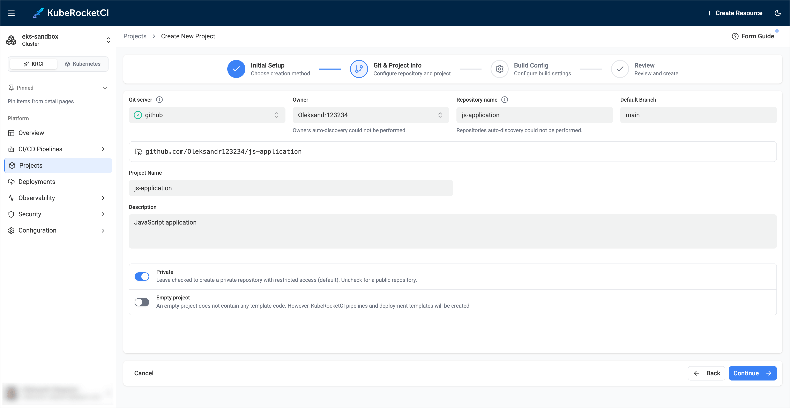

7. On the **Build config** tab, define the values and click **Continue**:

    - Application code language: `JavaScript`
    - Language version/Provider: `Vue`
    - Build tool: `NPM`
    - Deployment options: `helm-chart`
    - Codebase versioning type: `semver`
    - Start version from: `0.1.0` 
    - Suffix: `SNAPSHOT`

    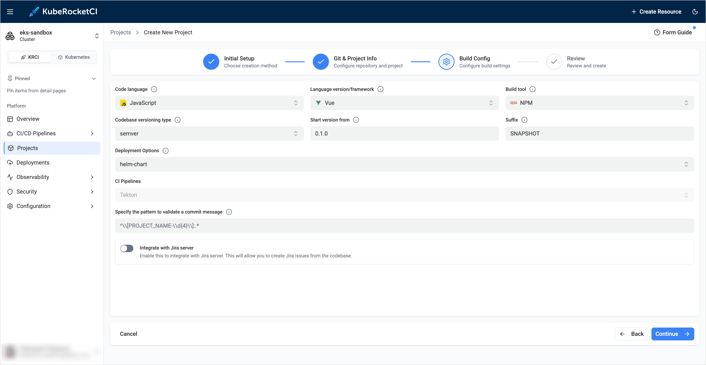

8. On the **Review** tab, verify the project configuration and click **Create project**:

    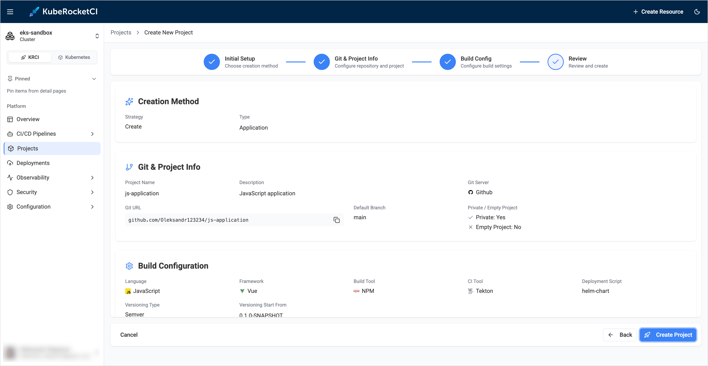

9. On the congratulations menu, click **View all projects**:

    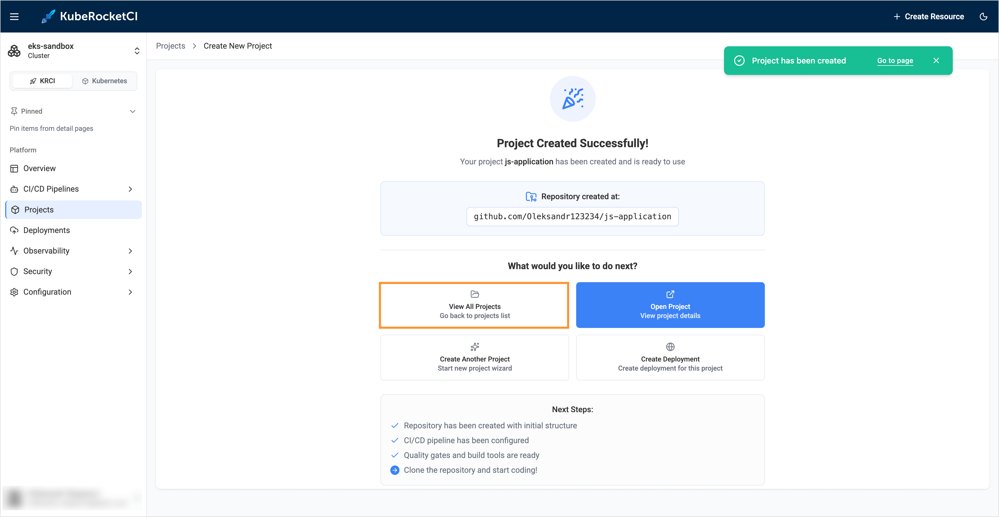

10. Repeat the procedure twice to create the **go-application** and **python-application** applications. These applications will have the following parameters:

    go-application:
    - Git server: `github`
    - Owner: `github_account_name`
    - Repository name: `go-application`
    - Project name: `go-application`
    - Description: `Go application`
    - Application code language: `Go`
    - Language version/Provider: `Gin`
    - Build tool: `Go`
    - Default branch: `main`
    - Codebase versioning type: `semver`
    - Start version from: `0.1.0` 
    - Suffix: `SNAPSHOT`

    python-application:
    - Git server: `github`
    - Owner: `github_account_name`
    - Repository name: `python-application`
    - Project name: `python-application`
    - Description: `Python application`
    - Application code language: `Python`
    - Language version/Provider: `FastAPI`
    - Build tool: `Python`
    - Default branch: `main`
    - Codebase versioning type: `semver`
    - Start version from: `0.1.0` 
    - Suffix: `SNAPSHOT`

11. In the **Projects** tab, click one of the applications name to enter the application menu:

    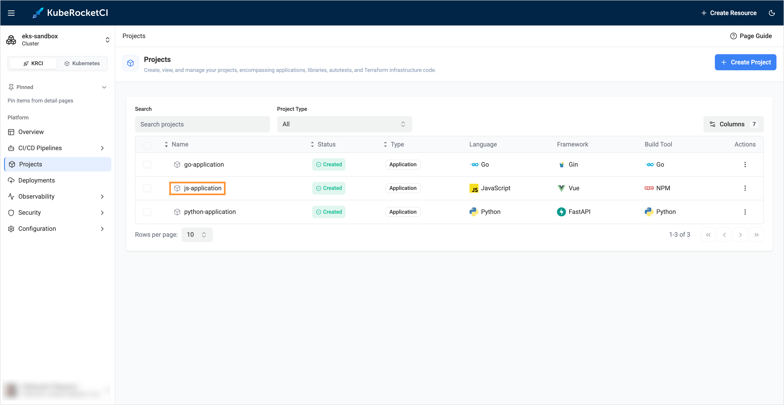

12. Select the **Branches** tab and click the **Build** button:

    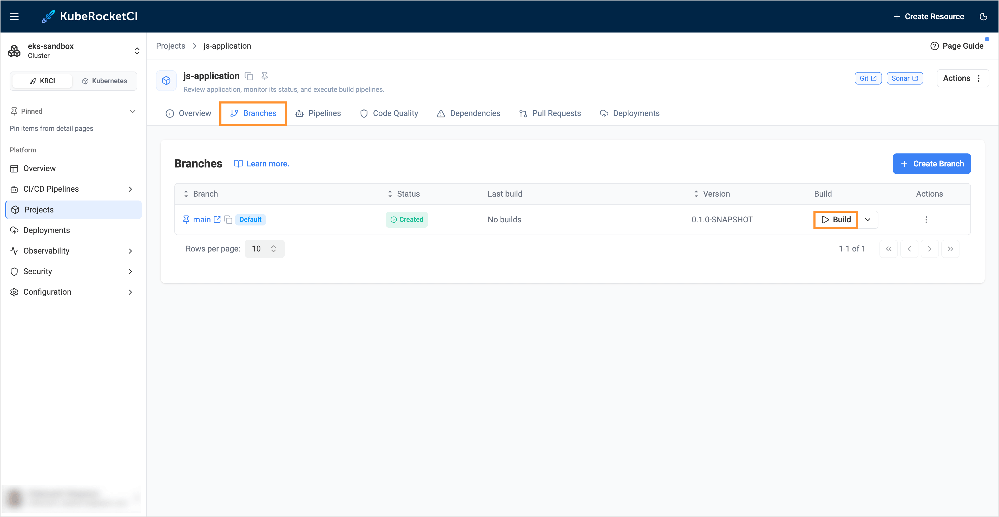

13. Click the PipelineRun name to watch the building logs:

    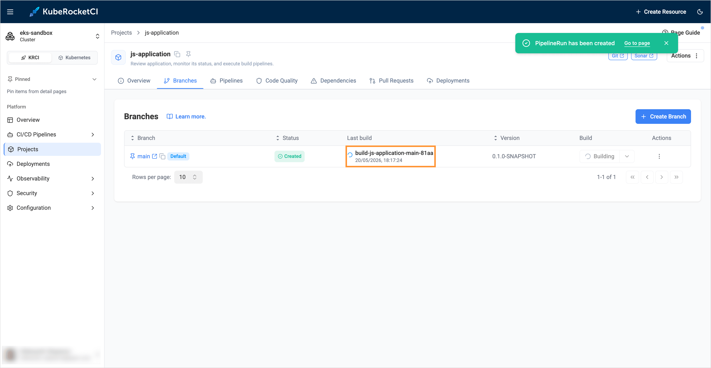

14. On the pipeline details page, you can find information about each step, pipeline status, and view logs:

    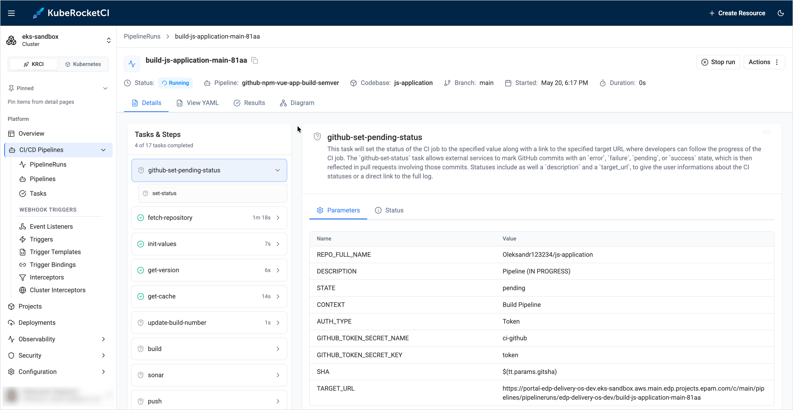

15. Wait till the build is successful.

16. Repeat steps 11-15 for the rest of the applications.

### Create Autotests

The steps below instruct how to create autotests in KubeRocketCI:

1. Create a couple of autotests using the **Clone** strategy. Navigate to the **Projects** tab, click on the **+ Create project** button. Select **Autotest**, **Clone** and click **Next**:

    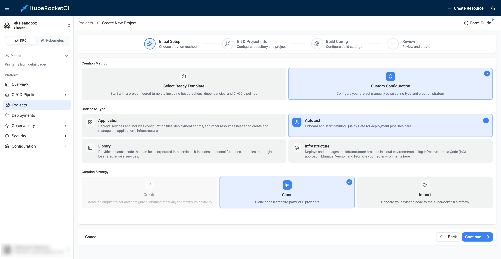

    :::note
      Please refer to the [Add Autotest](../user-guide/add-autotest.md) section for details.
    :::

2. On the **Git & project info** tab, define the following values and click **Continue**:

    - Repository URL: `https://github.com/Oleksandr123234/autotests.git`
    - Git server: `github`
    - Owner: `github_account_name`
    - Repository name: `demo-autotest-gradle`
    - Default branch: `main`
    - Project name: `demo-autotest-gradle`
    - Description: `Gradle demo autotests`

    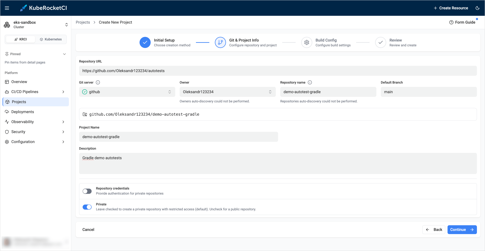

3. On the **Build config** tab, define the values and click **Continue**:

    - Autotest code language: `Java`
    - Language version/framework: `Java25`
    - Build tool: `Gradle`
    - Autotest report framework: `Allure`
    - Codebase versioning type: `semver`
    - Start version from: `0.1.0` 
    - Suffix: `SNAPSHOT`

    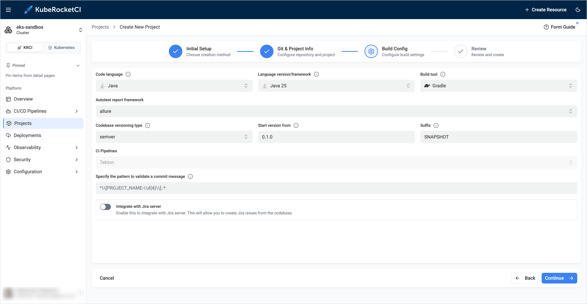

4. On the **Review** tab, verify the autotest configuration and click **Create project**:

    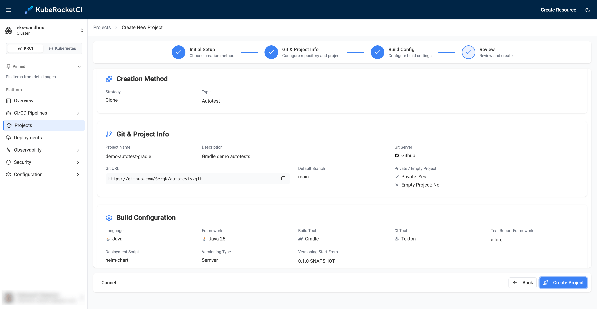

5. Repeat the steps 1-4 to create one more autotest with the parameters below:

    - Repository URL: `https://github.com/Oleksandr123234/autotests.git`
    - Git server: `github`
    - Repository name: `demo-autotest-maven`
    - Project name: `demo-autotest-maven`
    - Description: `Maven demo autotest`
    - Autotest code language: `Java`
    - Language version/framework: `Java25`
    - Build tool: `Maven`
    - Autotest report framework: `Allure`
    - Default branch: `main`
    - Codebase versioning type: `semver`
    - Start version from: `0.1.0` 
    - Suffix: `SNAPSHOT`

### Create CD Pipeline

Now that applications and autotests are created, create pipeline for them by following the steps below:

:::note
  To utilize and manage various environments through the KubeRocketCI platform, the initial step is to onboard a new GitOps repository.
:::

1. Navigate to the **Deployments** section and click the corresponding button to create new GitOps repository:

    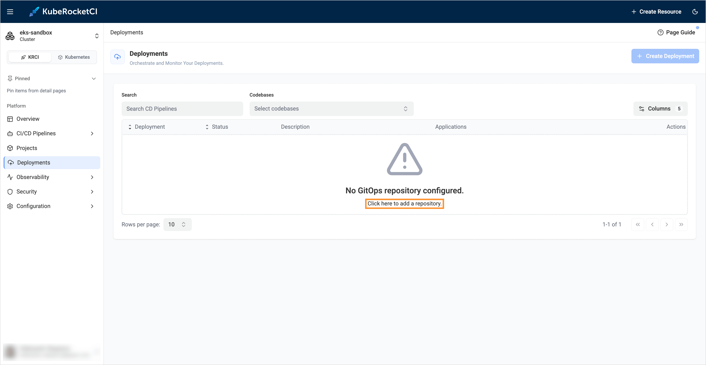

2. Click to the **+ Add GitOps repository**:

    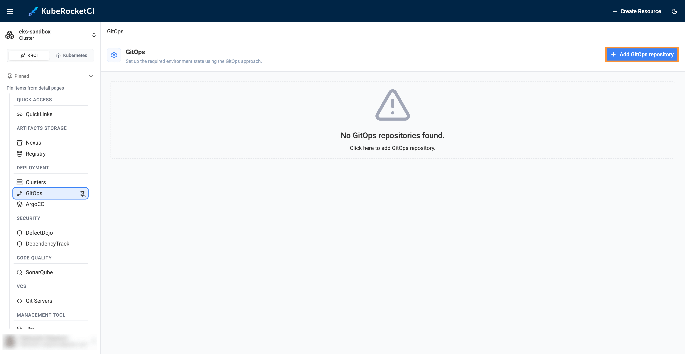

3. Select the `github` server, enter GitHub account name and click **Save**:

    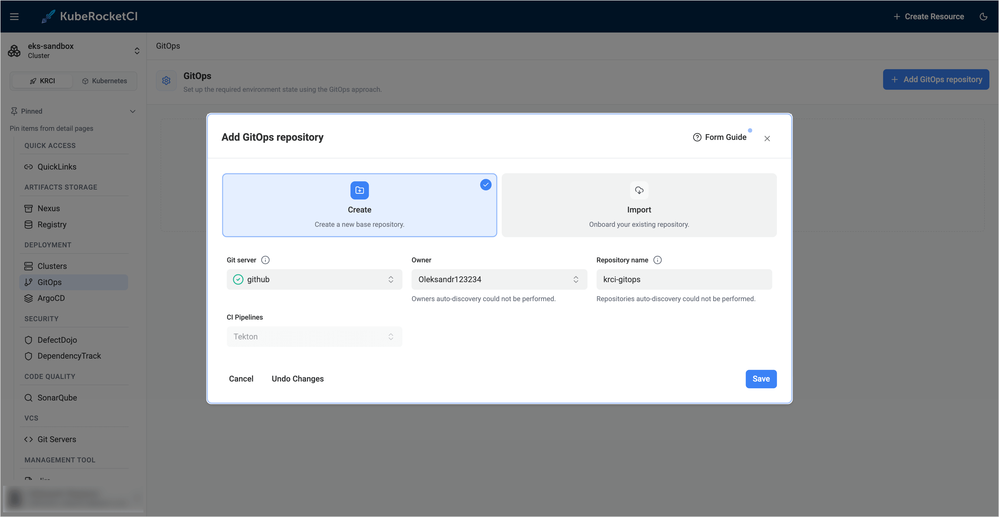

4. Return to the **Deployments** tab and click **+ Create deployment** button:

    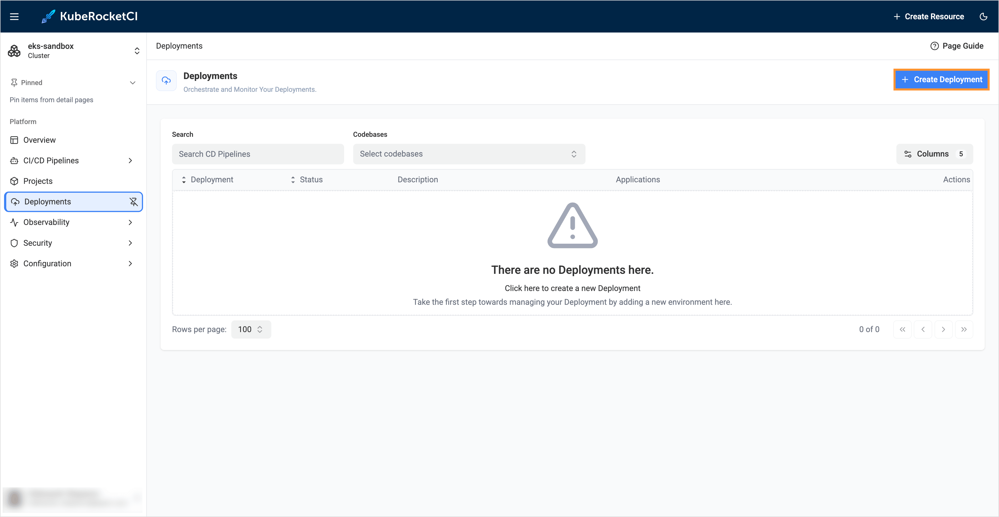

5.  On the **Applications** tab, add all the three applications, specify the **main** branch for all for them and click the **Continue** button:

    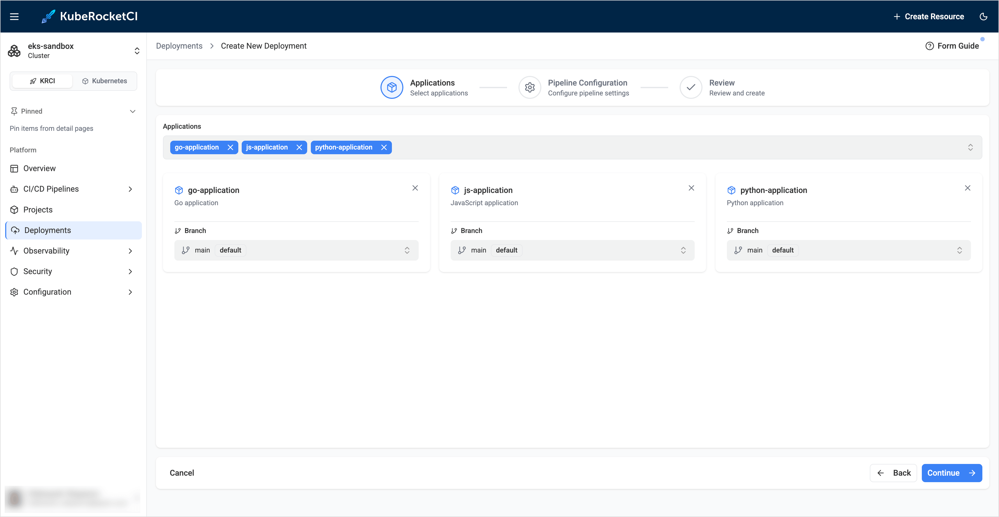

6. Enter `demo-deploy` name, specify description, enable the "Promote applications" option and click **Continue**:

    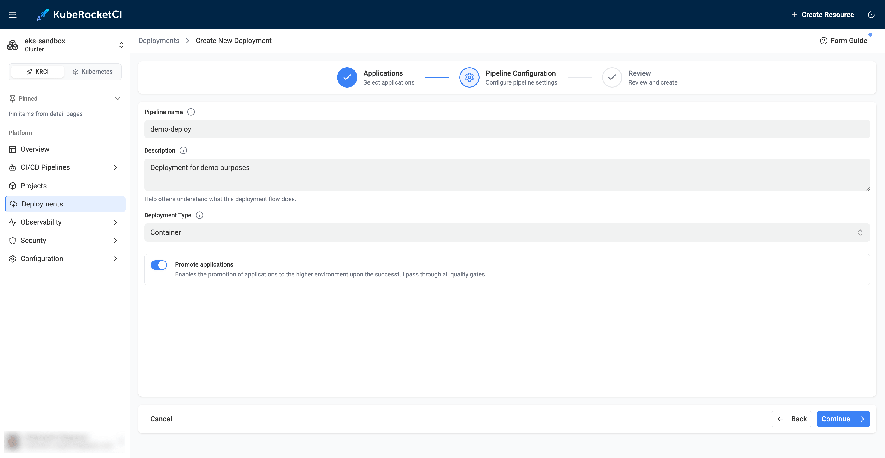

7. Review the Deployment configuration and click **Continue**:

    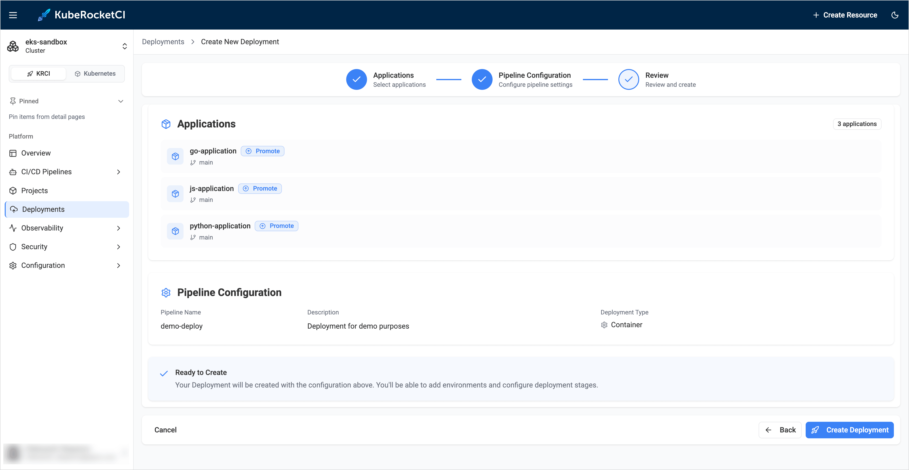

7. Once all the steps have been completed, you may begin creating Environments:

    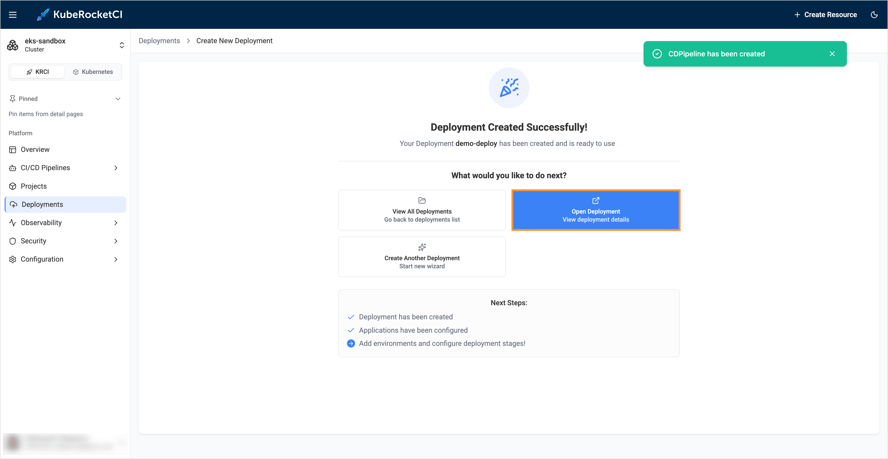

8. On the Deployment details page, click the **+ Create environment** button:

    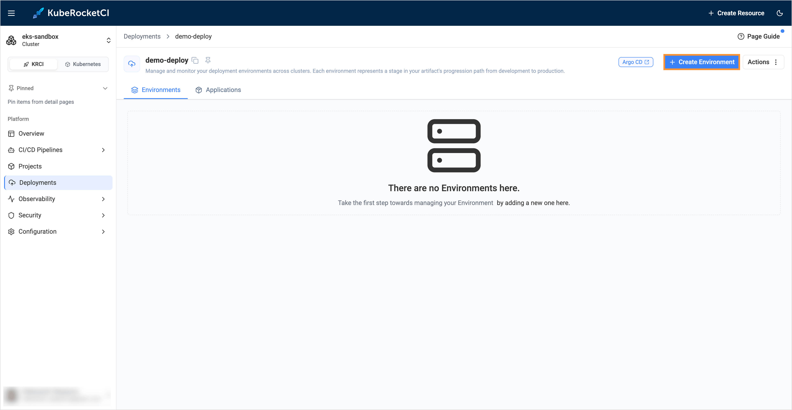

9. On the **Basic configuration** step, define the following values and click **Continue**:

    - Cluster: `in-cluster`
    - Stage name: `dev`
    - Description: `Development Environment`

    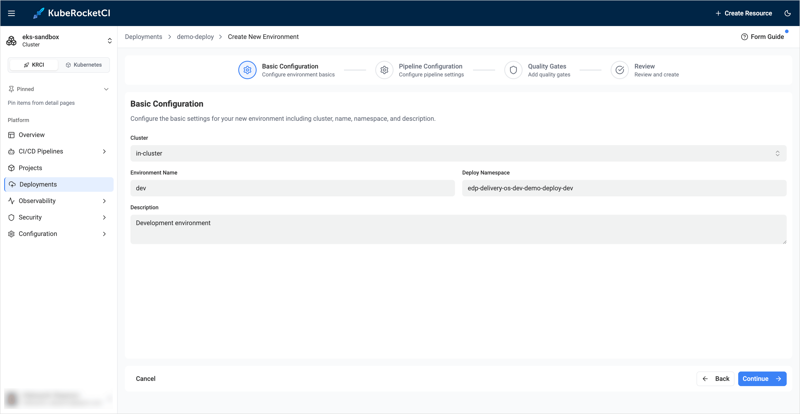


10. On the **Pipeline configuration** step, define the following values and click **Continue**:

    - Trigger type: `Manual`
    - Deploy pipeline template: `deploy-with-autotests`
    - Clean pipeline template: `clean`

    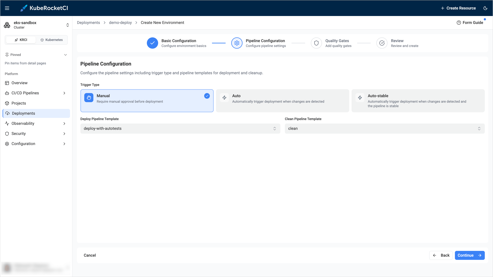

11. In the **Quality gates** menu click **+** button. Specify the following parameters and click **Continue**:

    First Quality Gate:

    - Quality gate type: `Autotest`
    - Step name: `autotest-step-1`
    - Autotest: `demo-autotest-gradle`
    - Autotest branch: `main`

    Second Quality Gate:

    - Quality gate type: `Autotest`
    - Step name: `autotest-step-2`
    - Autotest: `demo-autotest-gradle`
    - Autotest branch: `main`

    Third Quality Gate:

    - Quality gate type: `Autotest`
    - Step name: `autotest-step-3`
    - Autotest: `demo-autotest-maven`
    - Autotest branch: `main`

    Fourth Quality Gate:

    - Quality gate type: `Autotest`
    - Step name: `autotest-step-4`
    - Autotest: `demo-autotest-maven`
    - Autotest branch: `main`

    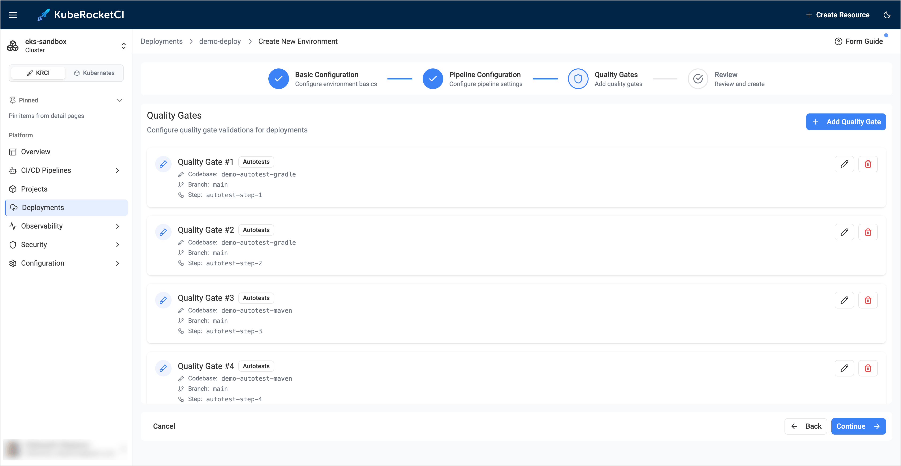

    :::note
        The same automated test can be executed multiple times within a single deployment pipeline using different step names. To achieve this, specify a unique step name as a parameter when triggering the Tekton automated test pipeline. Verify that the key names in demo-autotest-gradle/run.json and demo-autotest-maven/run.json comply with the required template and update them if necessary.

         ```yaml title="demo-autotest-gradle/run.json"
            {
                "comment": "step-name: <deployment Flow>-<environment>-<autotest step name>",
                "demo-deploy-dev-autotest-step-1": "gradle -q hello",
                "demo-deploy-dev-autotest-step-2": "gradle -q hello",
                "demo-deploy-dev-autotest-step-3": "mvn antrun:run@hello -q",
                "demo-deploy-dev-autotest-step-4": "mvn antrun:run@hello -q"
            }
        ```
    :::

12. Review the changes and click **Create environment**:

    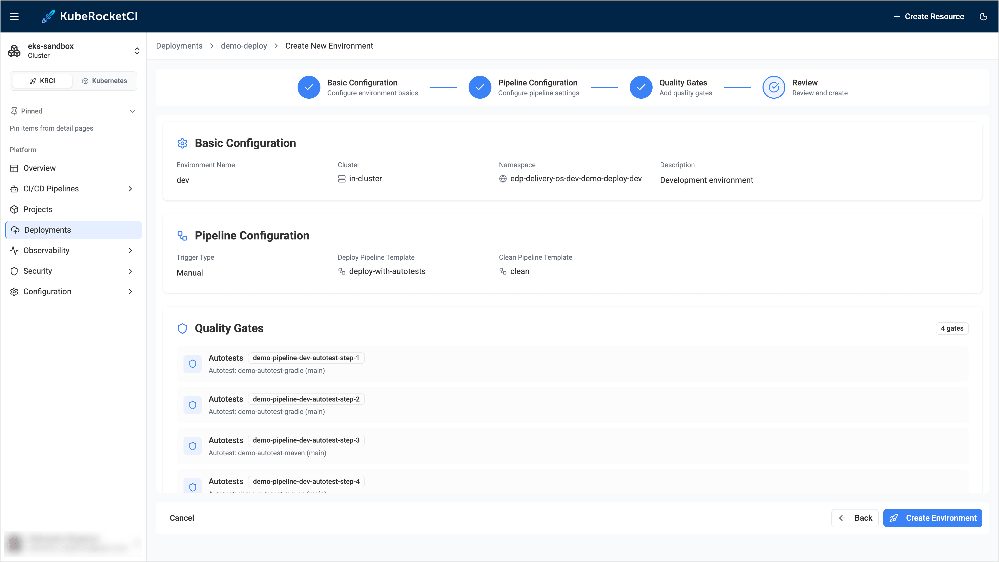

13. Repeat the steps 8-10 to create one more stage with the parameters below:

    - Cluster: `in-cluster`
    - Stage name: `sit`
    - Description: `System integration testing`
    - Trigger type: `manual`
    - Deploy pipeline template: `deploy`
    - Clean pipeline template: `clean`
    - Quality gate type: `Manual`

### Run Autotests

After the Deployment is created, deploy applications and run autotests by following the steps below:

1. Open the **sit** Environment name by clicking on its name:

    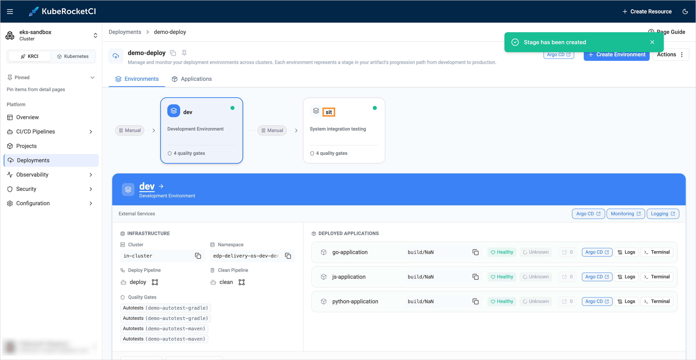

2. Select the **Applications** tab and click **Configure deploy**. Hover your cursor over the application versions to see the image that blocks you from running a deployment:

    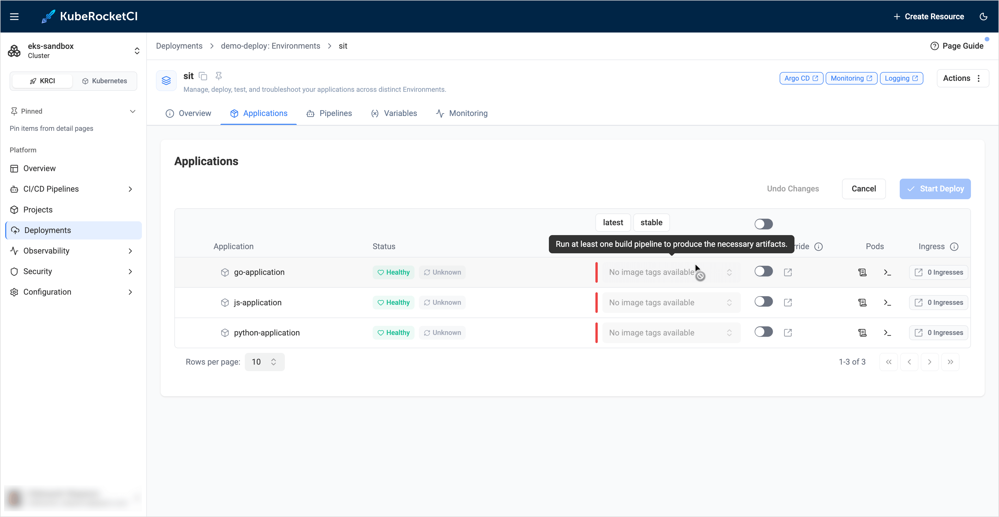

3. Get back to the Deployment details page. Click the **dev** stage name to expand its details:

    

4. Select the **Applications** tab and click **Configure deploy**. Then select latest versions of all the applications and click **Start deploy**:

    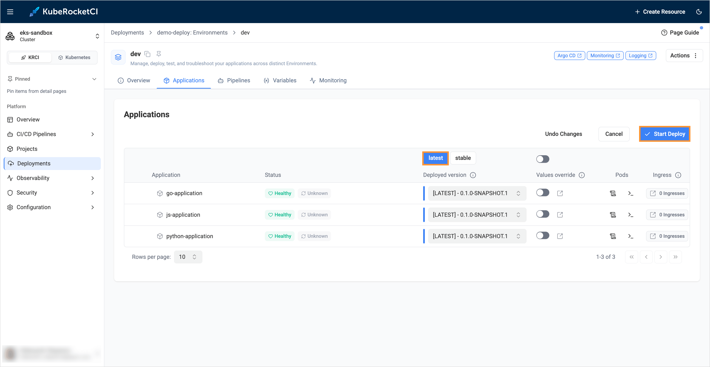

5. To find information about the running deploy pipeline, navigate to the **Pipelines** tab and click on the pipeline name:

    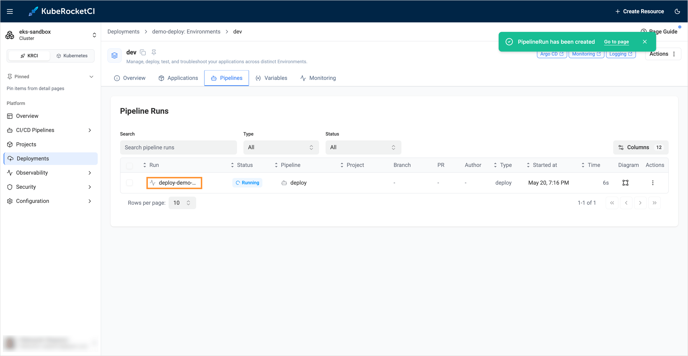

6. View the pipeline details. Pay attention that the **deploy-with-autotest** pipeline features the **wait-for-autotests** task:

    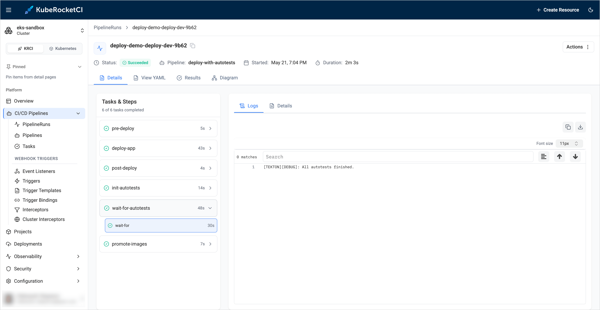

7. Wait until the deploy pipeline completes. The application statuses should be **Healthy** and **Synced**:

    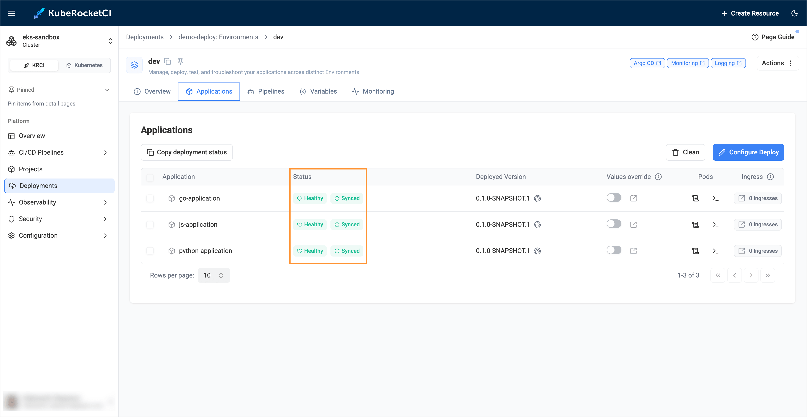

8. Once promotion procedure is finished, the promoted applications will become available in the **Sit** stage. You will be able to select image stream versions for the promoted applications:

    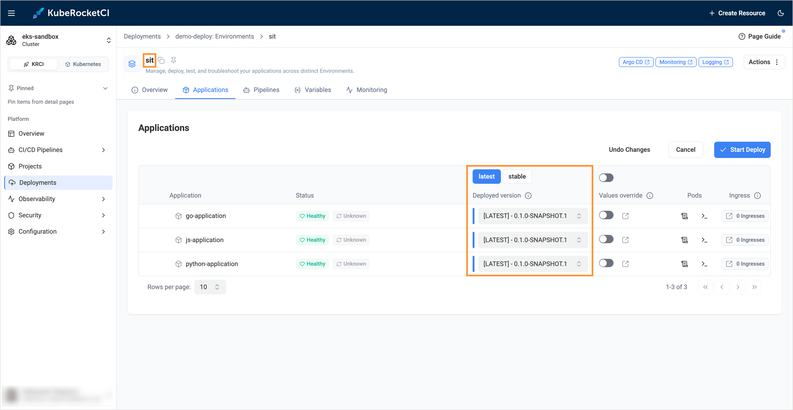

## Related Articles

- [Add Application](../user-guide/add-application.md)
- [Add Autotest](../user-guide/add-autotest.md)
- [Add CD Pipeline](../user-guide/add-cd-pipeline.md)
- [Add Quality Gate](../user-guide/add-quality-gate.md)
