# Set Test Suite Parameters Using Environment Variables in CD Pipelines

<head>
  <link rel="canonical" href="https://docs.kuberocketci.io/docs/use-cases/cd-autotests-run-with-env-variables/" />
</head>

This use case demonstrates how the KubeRocketCI platform uses environment variables to flexibly configure commands in deployment pipelines. Teams can dynamically adjust parameters adding, modifying, or removing them without changing the test suite code. This provides precise control over quality gates, streamlines workflows, and allows pipelines to adapt to different environments or requirements while maintaining efficiency and quality standards.

## Goals

- Flexible and convenient preparation and validation of the testing environment using environment variables.
- The ability to manage environment variables by overriding, adding, or removing their values and keys to configure test parameters.
- A streamlined setup process that allows teams to focus on development without platform constraints.

## Preconditions

- KubeRocketCI instance with GitHub is [configured](../operator-guide/prerequisites.md).
- Developer has access to the KubeRocketCI instances using the Single-Sign-On approach.
- Developer has `Write` permissions for GitHub repository to merge the code.

## Scenario

To implement specific logic in deployment flow quality gate within the KubeRocketCI platform, follow these steps:

- **Fork the Tekton Chart**: Fork, clone and deploy the prepared Tekton chart that implements the required Tekton resources with the environment variables usage.
- **Add the Application**: Add a simple application from the platform marketplace and build the application to prepare it for deployment.
- **Add the Autotests**: Set up the autotests with the clone strategy to include them in the Deployment Flow.
- **Create Deployment Flow, Environment, and Set Variables**: Create a Deployment Flow, Set up an environment for the deployment, add Autotests as a quality gate to the flow, and define the variable.
- **Validate**: Review the pipeline logs to ensure autotests execute correctly and produce the expected output.

### Fork the Tekton Chart

The first step is to clone and install the Tekton chart:

1. Create a private repository and copy the [chart repository](https://github.com/KubeRocketCI/variables-case-tekton) content. Below is the repository structure:

    <details>
    <summary>Repository structure</summary>
    ```bash
      variables-case-tekton
        .
        ├── Chart.lock
        ├── Chart.yaml
        ├── README.md
        ├── chart_schema.yaml
        ├── ct.yaml
        ├── lintconf.yaml
        ├── templates
        │   ├── pipelines
        │   │   └── cd
        │   │       ├── autotest-variables.yaml
        │   │       └── deploy-with-autotests-variables.yaml
        │   ├── tasks
        │   │   └── cd
        │   │       ├── init-autotests-variables.yaml
        │   │       └── run-autotests-variables-java.yaml
        │   └── triggers
        │       └── cd
        │           └── deploy-with-autotests-variables.yaml
        └── values.yaml
    ```
    </details>

2. Clone your private repository to your local machine:

  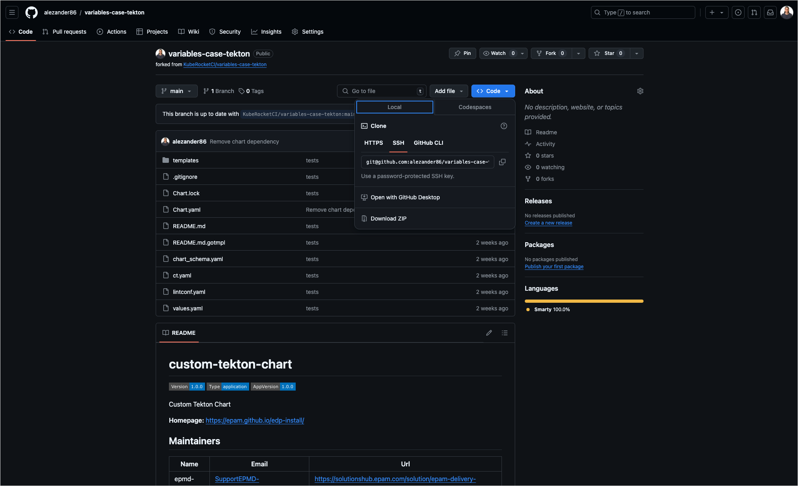

    ```bash
    git clone git@github.com:<github_account_name>/variables-case-tekton.git
    ```

3. Update the component configuration in the `values.yaml` file:

    ```yaml
    # Replace `example.domain.com` with the appropriate wildcard domain for your setup.
     dnsWildCard: "example.domain.com"
    ```

4. Install the chart:

    ```bash
    helm upgrade --install custom-tekton-chart variables-case-tekton -n krci
    ```

### Add an Application

As soon as the Helm chart is installed, the new deploy pipeline will appear in the Environment configuration window. The next step is to create an application from a template:

1. Navigate to the `Marketplace` section on the navigation bar to see the `Marketplace` overview page.

2. Select the component `Simple Spring Boot Application`, open its details window, and click `Create` from template:

  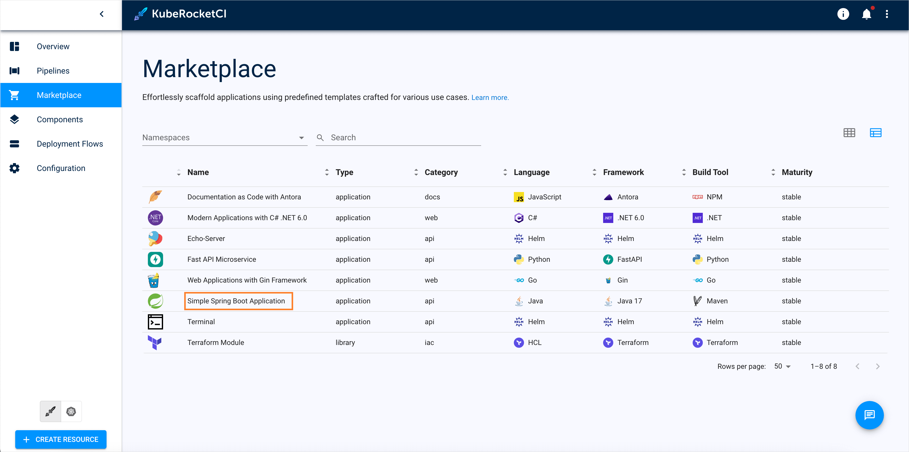

3. Fill in the required fields and click `Create`:

   * Component name:`spring-boot-app`
   * Description: `Simple spring boot application`
   * Git server: `github`
   * Repository name: `<github_account_name>/spring-boot-app`
   * Codebase versioning type: `edp`
   * Start version from: `0.1.0`
   * Suffix: `SNAPSHOT`

  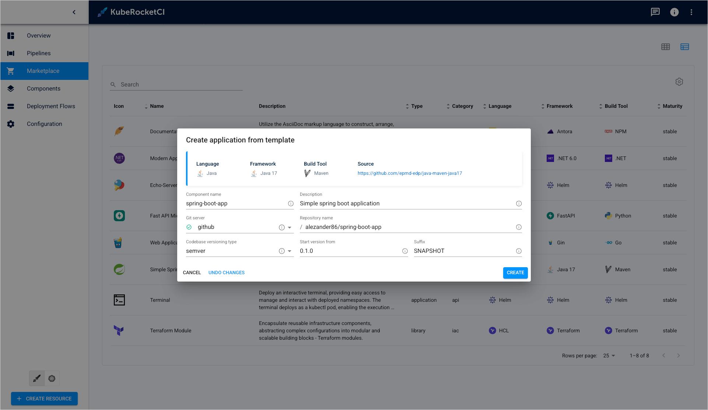

4. Click the **Go to application** button.

5. Click on **Branches** and click the **Trigger build PipelineRun** button:

  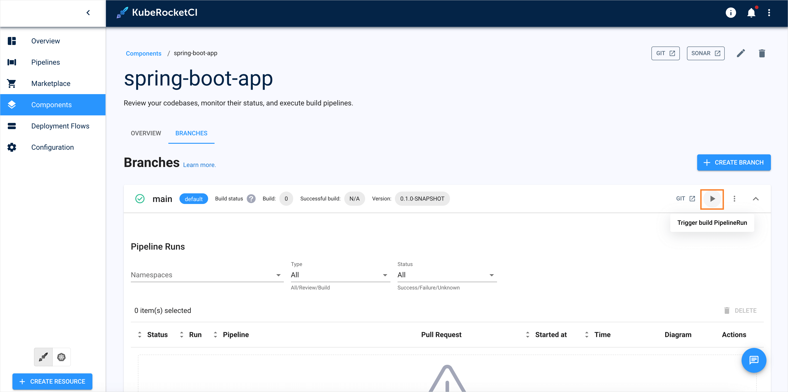

6. Wait until the build is successful:

  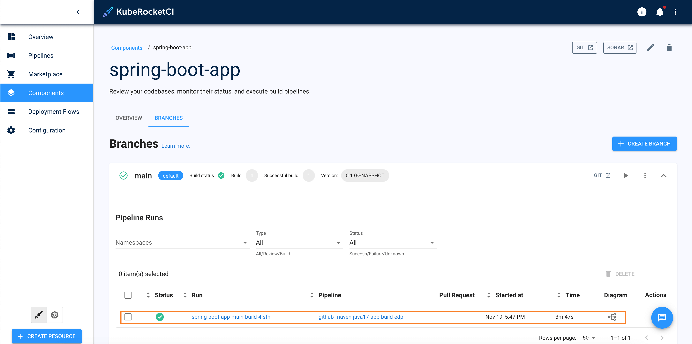

### Add the Autotests

Now you need to create template autotests that will be executed when deploying application:

1. To add an autotest, navigate to the **Components** section on the navigation bar and click **+ Create component**.

2. Once clicked, the **Create new component** dialog will appear, then select **Autotest** and click **Next**:

  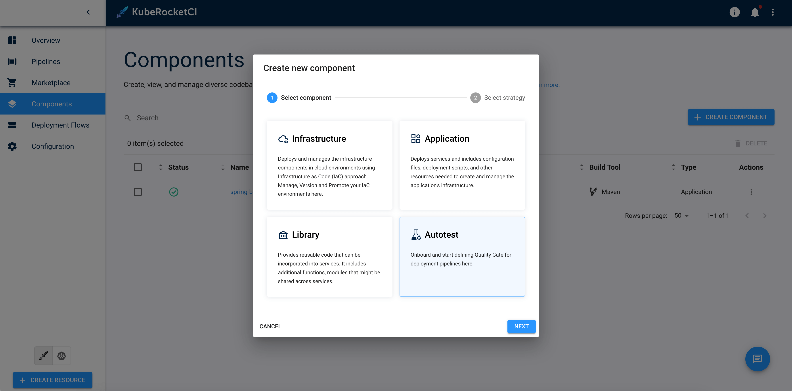

3. Choose **Clone project** strategy and click the **CREATE** button:

  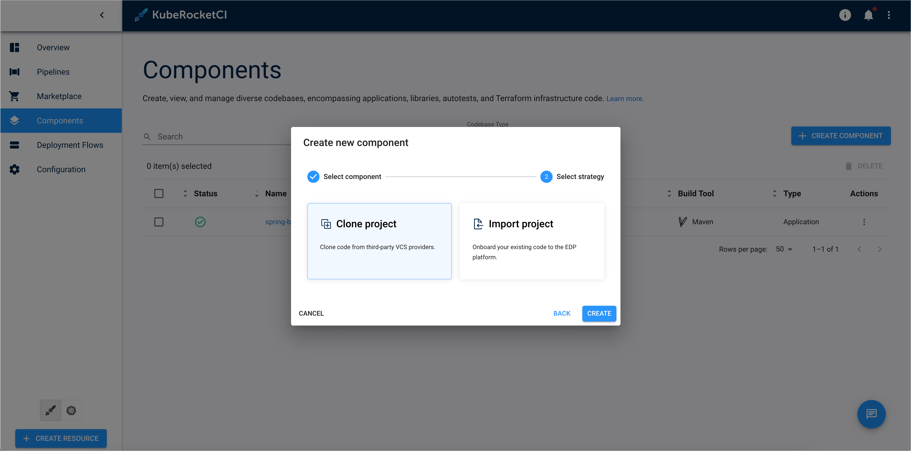

4. Fill in the following fields in **Add components info** and click the **NEXT** button to proceed:

  * RepoUrl: `https://github.com/KubeRocketCI/demo-autotests-gradle`
  * Git server: `github`
  * Repository name: `<github_account_name>/autotests`
  * Component name: `autotest`
  * Description: `simple autotests gradle`

Specify the autotest language properties:

  * Autotest code language: `Java`
  * Language version/framework: `Java17`
  * Build Tool: `Maven`
  * Autotest report framework: `allure`

  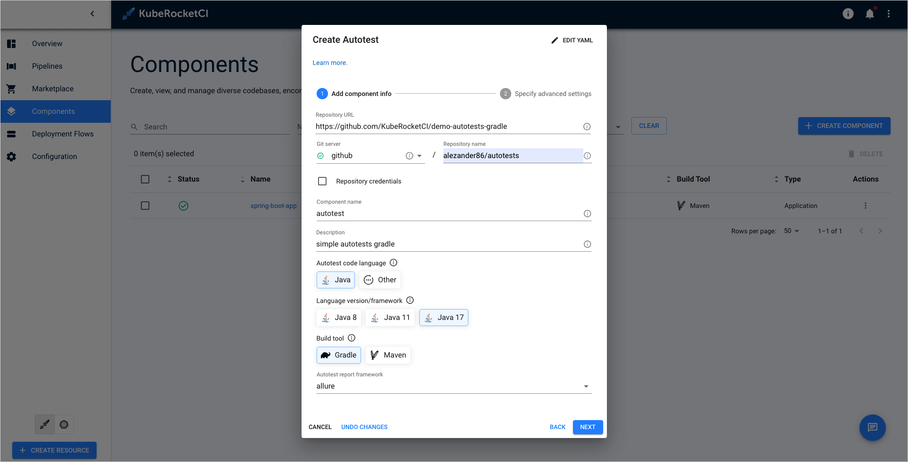

5. Fill in the following fields in **Specify advanced settings*** and click **CREATE**:

  * Default branch: `master`
  * Codebase versioning type: `edp`
  * Start version from: `0.1.0`
  * Suffix: `SNAPSHOT`

  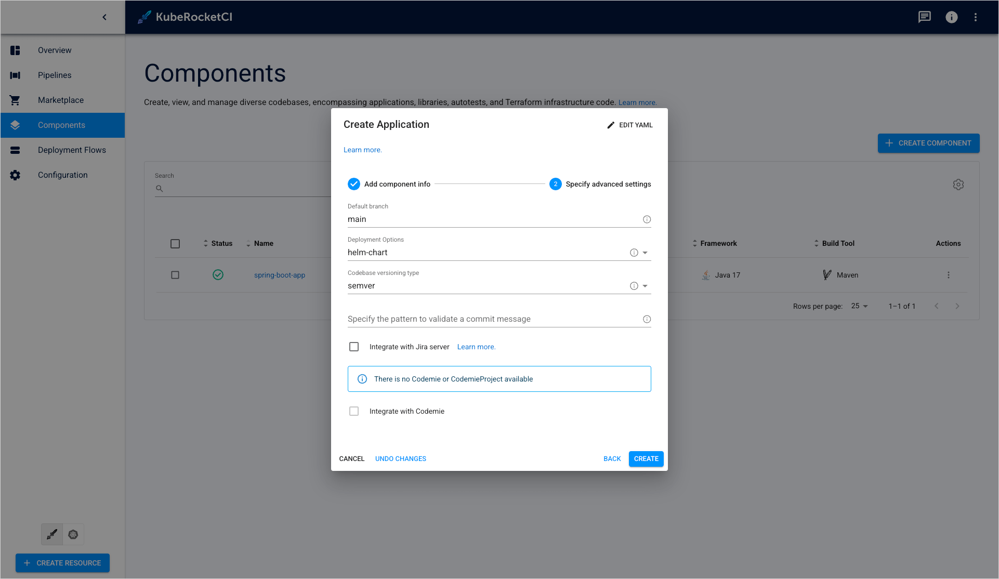

6. Click **Close**. Now the application and autotest are created:

  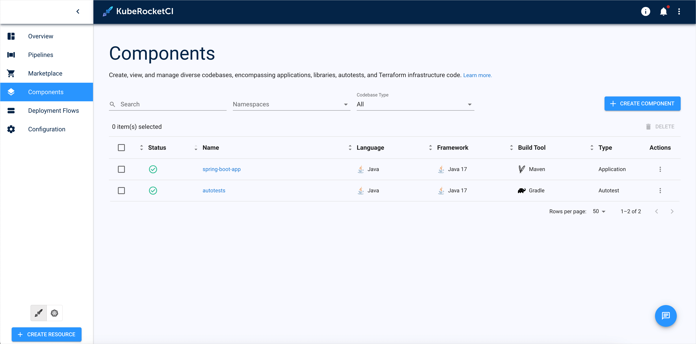

### Create Deployment Flow, Environment, and Set Variables

The next step is to configure deployment flow with appropriate deploy pipeline, application, autotests, and variables:

  :::note
  To utilize and manage various environments through the KubeRocketCI platform, the initial step is to onboard a new [GitOps repository](../user-guide/gitops.md).
  :::

1. Navigate to the `Deployment flows` section and click the **Click here to add a repository** button:

  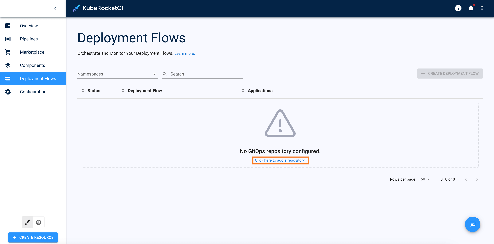

2. Click the **+ Add GitOps Repository** button and fill `<github_account_name>` in the **Git repo relative path** and click **SAVE** button:

  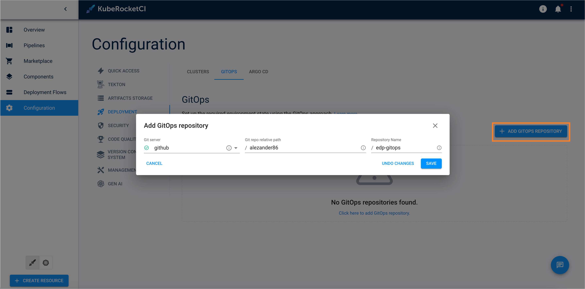

3. Navigate to the `Deployment flows` section on the navigation bar and click **+ Create deployment flow**. Once clicked, the Create deployment flow dialog will appear.

4. Enter `demo-pipeline` and click the **NEXT** button:

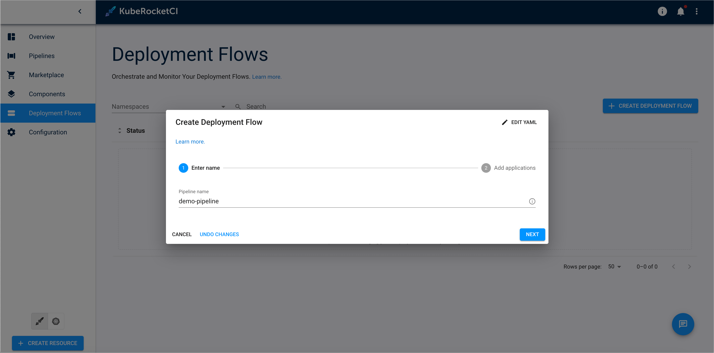

5. On the Applications tab, add the `spring-boot-app` application, specify the **main** branch for it, and click **CREATE** button and **GO TO DEPLOYMENT FLOW**:

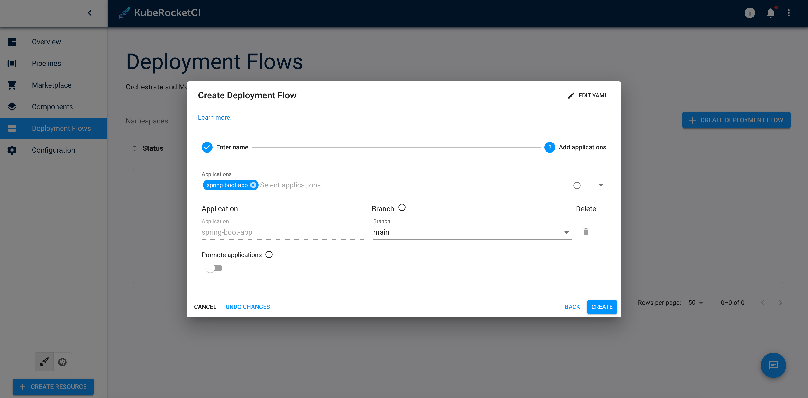

6. Click the **CREATE ENVIRONMENT** button, define the following values, and click **NEXT**:

  * Cluster: `In cluster`
  * Stage name: `qa`
  * Description: `qa`
  * Trigger type: `Manual`
  * Pipeline template: `deploy-with-autotests-variables`
  * Clean pipeline template: `clean`

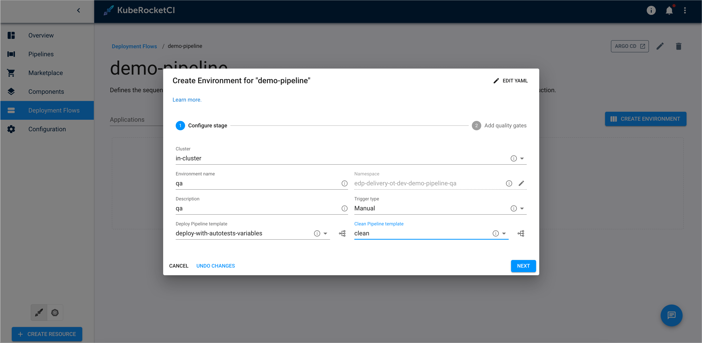

7. In the Add quality gates menu, click the **+** button. Specify the following parameters and click **Create**:

  * Quality gate type: `Autotest`
  * Step name: `Autotest`
  * Autotest: `autotest`
  * Autotest branch: `master`

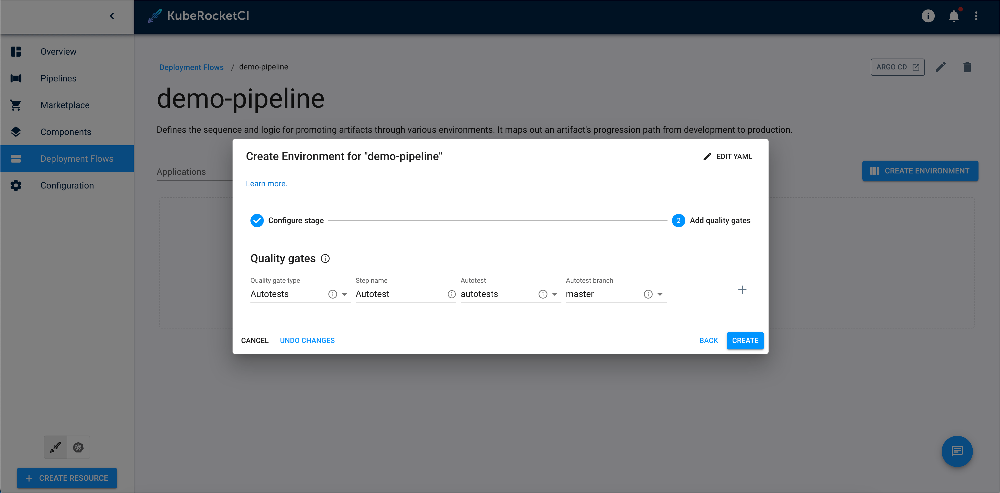

8. Click the **GO TO ENVIRONMENT** button:

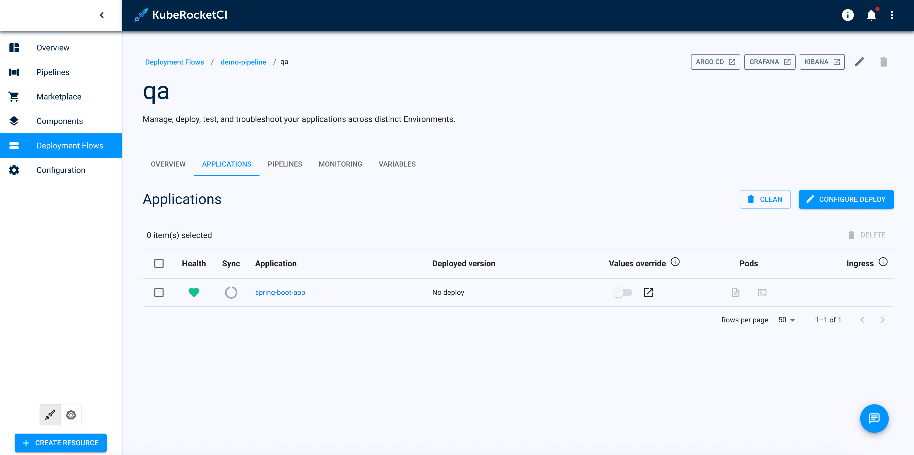

9. Select the **Variables** tab. Click the **Click here to add a new variable.** button:

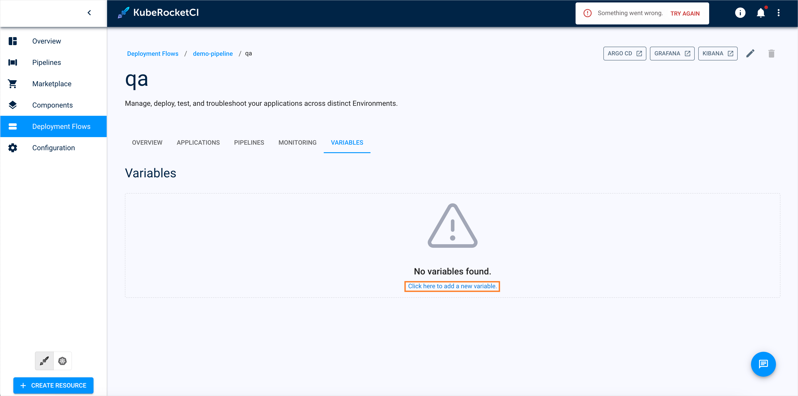

10. Enter `MY_COMMAND`, and set the **Value** to `gradle -q hello`. Then, click the **SAVE** button:

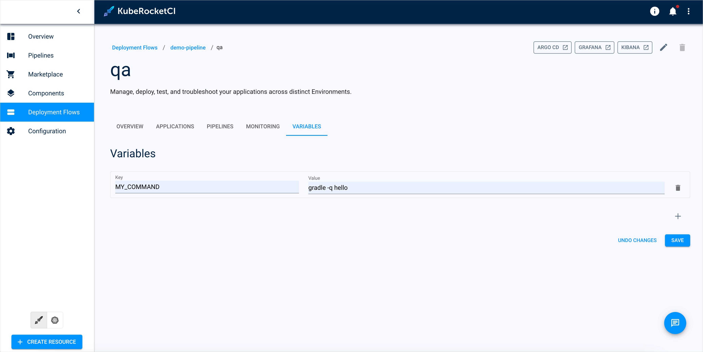

  In the Tekton task run-autotests-java-variables, we have implemented logic to check for the MY_COMMAND variable. If it exists, the task uses the value of this variable as the command. If it is missing or empty, the task falls back to using the logic defined in the run.json file from the autotests repository.

  <details>
  <summary>run-autotests-java-variables.yaml</summary>

  ```yaml
  apiVersion: tekton.dev/v1
  kind: Task
  metadata:
    name: run-autotests-java-variables
    labels:
      app.kubernetes.io/based-on: "0.2"
      {{- include "edp-tekton.labels" $ | nindent 4 }}
    annotations:
      tekton.dev/pipelines.minVersion: "0.12.1"
      tekton.dev/categories: Autotest Tools
      tekton.dev/tags: autotest-tool
      tekton.dev/platforms: "linux/amd64,linux/s390x,linux/ppc64le"
  spec:
    description: >-
      This task runs autotests for a specified stage using either Maven or Gradle based on the provided configuration, extracting and executing the relevant commands from a `run.json` file.
    workspaces:
      - name: source
        description: A workspace that contains the repository.
    params:
      - name: cd-pipeline-name
        type: string
      - name: stage-name
        type: string
      - name: base-image
        type: string
    steps:
      - name: run-autotest
        image: "$(params.base-image)"
        workingDir: $(workspaces.source.path)
        env:
          - name: STAGE_NAME
            value: $(params.stage-name)
          - name: CD_PIPELINE_NAME
            value: $(params.cd-pipeline-name)
        envFrom:
          - configMapRef:
              name: $(params.cd-pipeline-name)-$(params.stage-name)
        script: |
          #!/bin/bash

          set -exo pipefail

          # Check if the MY_COMMAND variable is set and not empty
          if [[ -n "${MY_COMMAND}" ]]; then
              # If MY_COMMAND is defined, execute its content
              eval "${MY_COMMAND}"
          else
              # If MY_COMMAND is not set, execute the existing logic
              $(sed -n 's/.*"'$STAGE_NAME'": "\(.*\)",/\1/p' run.json | awk -F '"' '{print $1}')
          fi
  ```
  </details>

11. Navigate to the **APPLICATIONS** tab. Then click **CONFIGURE DEPLOY** then **LATEST** button and click **START DEPLOY** button:


### Validate

Now it is time to review the pipeline logs to ensure autotests pass successfully and application produces the expected output:

1. To find autotests logs, navigate to the **PIPELINES** section and wait until all pipelines are done:

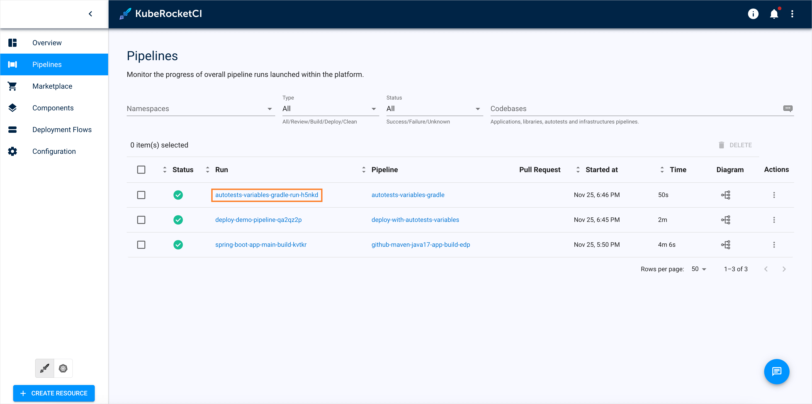

2. Click on **autotests-variables-gradle-run-xxxxx**, then stage **run autotests**, and task **run autotests** in the logs tab. You will see your autotests output:

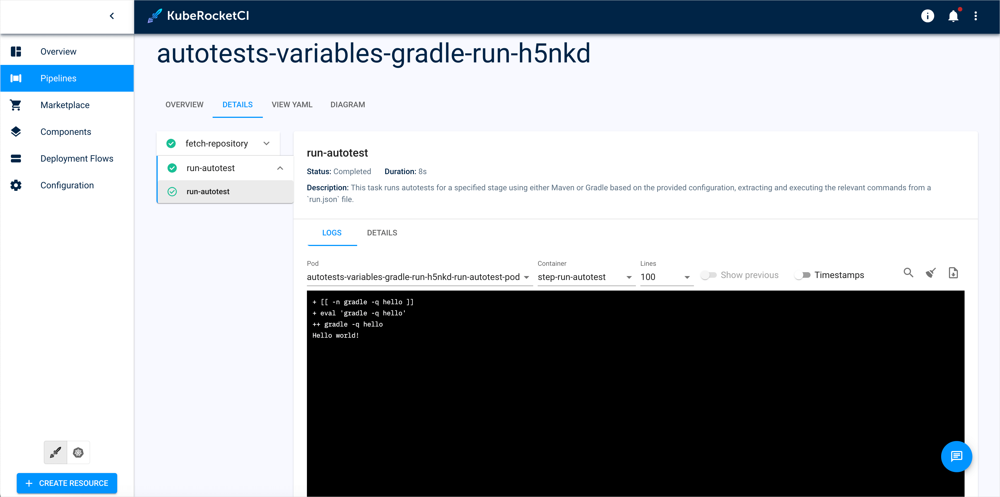

## Related Articles

- [Add Application](../user-guide/add-application.md)
- [Add Autotest](../user-guide/add-autotest.md)
- [Add Deployment Flow](../user-guide/add-cd-pipeline.md)
- [Add Quality Gate](../user-guide/add-quality-gate.md)
- [Customize Deploy Pipeline](../operator-guide/cd/customize-deploy-pipeline.md)
- [Manage Deployment Flows](../user-guide/manage-environments.md)
