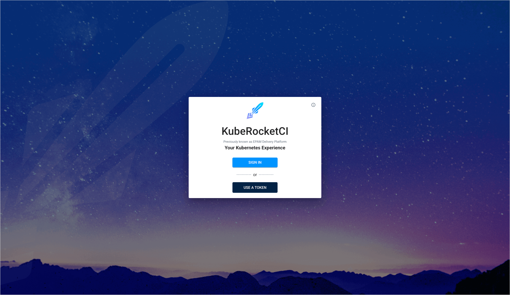

---

title: "Deploy Application From a Feature Branch"
description: "Master the deployment of feature branches with KubeRocketCI for efficient testing and deployment, ensuring seamless integration and quality control in development workflows."
sidebar_label: "Deploy Application From a Feature Branch"
---

<!-- markdownlint-disable MD025 -->

# Deploying Feature Branches With KubeRocketCI: A Comprehensive Guide for Efficient Application Testing and Deployment

<head>
  <link rel="canonical" href="https://docs.kuberocketci.io/docs/use-cases/deploy-application-from-feature-branch/" />
</head>

## Overview

Deploying feature branches is crucial for testing activities, including manual testing of the product's functionality, running quality gates, and verifying dependencies or integrations with other components.

The KubeRocketCI platform enables the deployment of feature environments straight from feature branches. This guide offers comprehensive instructions for managing and deploying these branches.

### Preconditions

Before you start passing the use case, ensure to meet the following requirements:

- KubeRocketCI instance is [configured](../operator-guide/prerequisites.md) with [GitOps](../user-guide/gitops.md) repository.
- Developer has access to the KubeRocketCI instances using the [Single-Sign-On](../operator-guide/auth/platform-auth-model.md) approach or via token.
- Developer has access to the KubeRocketCI platform under the [Developer](../operator-guide/auth/platform-auth-model.md#keycloak-groups) role.
- Developer has merge permissions in [Bitbucket](../user-guide/gitops.md).
- Application you want to add a branch to is onboarded in KubeRocketCI.

### Goals

Below are the goals to complete in the use case:

- Onboard a feature branch for the application.
- Configure GitOps approach for the environment by adding a values.yaml file with application parameters within it.
- Deploy application with redefined parameters.

## Scenario

The use case scenario contains the following stages:

- **Create a feature branch**: Create a feature branch and build artifact for it.
- **Create a deployment flow**: Create a deployment flow that contains an environment and deploy application within the environment.
- **Configure application parameters**: Adjust a GitOps repository by adding custom application configuration into it.
- **Apply custom settings for application**: Deploy application with custom parameters.

### Create Feature Branch

There are two approaches to onboard a feature branch:

1. **Create a Feature Branch via KubeRocketCI**: KubeRocketCI creates a new branch in Bitbucket.
2. **Onboard an Existing Branch in KubeRocketCI**: Manually [create the branch in Bitbucket](https://support.atlassian.com/bitbucket-cloud/docs/branch-a-repository/) using the correct naming convention and then onboard it into KubeRocketCI.

In this use case, we will follow the first approach to add a branch.

When creating a feature branch, ensure the branch name is lowercase to meet Kubernetes restrictions. As an example, we will use the `feature/<jira-ticket>` pattern as a naming convention for feature branches.

To create a feature branch via KubeRocketCI. Follow these steps:

1. Open the KubeRocketCI portal and log into the platform:

  

2. Navigate to the **Components** section and select the desired component by clicking its name.

3. Click the **Create branch** button and fill in the form:

  * **Branch Name**: Specify the name (e.g., `feature/tt-000`).
  * **From Commit Hash**: Specify the commit hash or leave it empty for the latest commit.
  * **Branch Version**: Provide a version tag for the branch.
  * **Review Pipeline**: Leave the default pipeline.
  * **Build Pipeline**: Leave the default pipeline.

  

4. Click **Create** to finalize the branch creation.

5. The branch will also be created in Bitbucket. Verify its creation in the repository:

  

  Since we don't create merge request to merge our feature with the main branch, we need to manually trigger the build pipeline in KubeRocketCI portal.

6. Build the application using the **Build** button:

  

7. View the build pipeline run details by clicking the pipeline run name:

  

### Deploy Feature Branch

Once you have completed the onboarding process for the feature branch, you can deploy its artifacts to a dedicated feature environment.

#### Create Deployment Flow

We recommend using initials to name the deployment flow. For example, a user with the email `firstname_lastname@example.com` should use `fl` as the identifier.

To create a feature environment, follow the steps below:

1. Open the **Deployment Flows** section and click **Create Deployment Flow**:

  

2. Select components and branches for the deployment flow. Disable the **Promote Applications** switcher for environments without Quality Gate promotion and click **Create**:

  

#### Create Environment

The next step is to create an environment:

1. Select the deployment flow from the **Deployment Flows** section.

2. Click the **Create Environment** button and fill in the form:

  * **Cluster**: Choose the target cluster.
  * **Environment Name**: Specify the name (`dev`).
  * **Description**: Specify the description for the environment.
  * **Deploy Pipeline Template**: Select the deployment pipeline (`deploy`).
  * **Namespace**: Use the pre-defined namespace without modifications.
  * **Trigger Type**: Select `Manual`.
  * **Clean Pipeline Template**: Choose the clean pipeline (`clean`)


3. Set Manual as the Quality Gate type and click **Create**:


4. On the congratulations window, click **Go to environment**.

The feature environment is now ready for deployment.

#### Deploy Application

To deploy an application, follow the steps below:

1. Click **Configure Deploy**, select the image tag to be deployed, and proceed with the **Start Deploy** button:

  

2. Verify the deployment status in the **Pipelines** section:

  

3. Click the pipeline run name to view its details:

  

4. Open application in Argo CD by clicking the **Argo CD** button:

  

5. View enhanced insights and log analysis:

  

### Deploy With Custom Parameters

The platform utilizes a Helm chart found in the **deploy-templates** folder of each component repository. To deploy a feature branch with custom variables, select the **Values override** option on the environment page. The **Values override** option allows to redefine default parameters in the **deploy-templates** folder of the Helm chart.

:::note
Before enabling this option, you must provide custom parameters for the application. To do this, please add the required values to the `values.yaml` file in the GitOps repository, ensuring you follow the expected structure.
:::

For the `inventory-service` application, no Helm chart variables are defined yet. So, we will modify the Helm chart to add a parameter. If your Helm chart already has variables to redefine, you can proceed to step 4.

1. In KubeRocketCI, navigate back to the application and open the branch source code:

  

2. Clone the application repository to the local machine. Checkout to the feature branch and paste the contents below to the `deploy-templates/templates/deployment.yaml` and `deploy-templates/values.yaml` files:

```yaml title="values.yaml"

extraEnv: {}

```

```yaml title="deploy-templates/deployment.yaml"
...
          ports:
            - name: http
              containerPort: {{ .Values.service.port }}
              protocol: TCP
          {{- if .Values.extraEnv }}
          env:
          {{- toYaml .Values.extraEnv | nindent 12 }}
          {{- end }}
          livenessProbe:
            {{- toYaml .Values.livenessProbe | nindent 12 }}
          readinessProbe:
            {{- toYaml .Values.readinessProbe | nindent 12 }}

...
```

The resulting difference should look this way:

  

3. Commit your changes and push your branch to the origin.

4. Open the GitOps repository by clicking the **Go to the source code** button:

  

5. Clone the GitOps repository to the local machine. Checkout to another branch and create a file by the `<deployment-flow-name>/<environment-name>/<application-name>-values.yaml` pattern (in our case, `fl/dev/notifications-service-values.yaml`).

6. Open the `<deployment-flow-name>/<environment-name>/<application-name>-values.yaml` file and paste the contents below:

```yaml title="values.yaml"

extraEnv:
  - name: NAME
    value: "Hello from KubeRocketCI"

```

7. Commit your changes, push your branch to the origin and create a pull request:

  

8. Merge the pull request.

9. On the environment page, click the **Configure Deploy** button. When deploying an application, enable the **Values Override** option in the environment settings:

  

  When the **Values Override** option is enabled, the platform navigates to the GitOps repository to pull the parameters from the `<application-name>-values.yaml` file and then redefines them in an Argo CD application accordingly.

10. If the application is deployed in the "in-cluster", open the pod terminal using a dedicated button in the environment details page:

  

11. Run the following command to verify that the variable has been applied to the pod:

```bash
env | grep NAME
```

  

12. (Optional) If you deploy the application in the [remote cluster](../user-guide/add-cluster.md), you can open the deployed application in Argo CD and click the pod block:

  

13. (Optional) In the **Terminal** tab, run the following command to verify that the variable has been applied to the pod:

```bash
env | grep NAME
```

  ")

### Cleanup

After merging the feature branch, please delete the branch and environment.

#### Delete Feature Environment

1. In the KubeRocketCI portal, return to the environment.

2. Select application from the **Applications** tab and click the **Delete** button to remove the application from the environment:

  

3. Navigate to the **Deployment Flows** section. Click the actions button and select **Delete**:

  

#### Delete Feature Branch

The last step is to delete a feature branch for the application:

1. Navigate to the **Components** section.

2. Open to the component where you want to delete the feature branch.

3. Delete the branch from the **Branches** tab:

  

4. Delete the feature branch from Bitbucket:

  

## Related Articles

- [Use Cases](./index.md)
- [Add Application](../user-guide/add-application.md)
- [Add Deployment Flow](../user-guide/add-cd-pipeline.md)
- [Manage Deployment Flows](../user-guide/manage-environments.md)
- [Manage GitOps](../user-guide/gitops.md)
