---

title: "Secured Secrets for Application Deployment"
description: "Implement secure secrets management in KubeRocketCI with External Secret Operator, enhancing application security by securely storing and accessing sensitive data."
sidebar_label: "Secured Secrets Management for Application Deployment"

---
<!-- markdownlint-disable MD025 -->

# Secured Secrets Management for Application Deployment

<head>
  <link rel="canonical" href="https://docs.kuberocketci.io/docs/use-cases/external-secrets" />
</head>

This use case demonstrates the secure management of sensitive data, such as passwords, API keys, and other credentials used by an application during development or production runtime.
The process involves storing sensitive data in an external secret store within a `krci-vault` namespace. The confidential information is then transmitted from the `krci-vault` namespace to the namespace where the application is deployed. This ensures that the application can utilize these credentials to establish a secure connection to the database.
In this scenario, the KubeRocketCI platform leverages capabilities of the `External Secret Operator`. Developers can use another external secret store (Hashicorp Vault, AWS Secret Store, or another provider) to ensure that confidential information is securely stored and accessed only when necessary.

To follow this approach, the next steps are involved:

1. Configure the KubeRocketCI platform with the external secret store provider, [namespace will be used](../operator-guide/secrets-management/external-secrets-operator-integration.md#kubernetes-provider) for the below scenario.

2. Create a separate namespace, with the name `krci-vault`, to store the sensitive data.

3. Keep sensitive data, such as passwords, API keys, and credentials, in the `krci-vault` namespace.

4. Establish a connection between the deployed namespace and the vault namespace to securely access the sensitive data when required.

By following these steps, developers can ensure that sensitive data is protected and accessed securely within the KubeRocketCI platform. This approach enhances the overall security of the application and reduces the risk of unauthorized access to confidential information.

## Roles

This documentation is tailored for the Platform Team, Developers and Team Leads.

## Goals

- Ensure secure handling of confidential information within the Deployment Environment.

## Preconditions

- KubeRocketCI instance is [configured](../operator-guide/prerequisites.md) with [GitOps](../user-guide/gitops.md) repo (to be able to create Projects);
- External Secrets Operator is [installed](../operator-guide/secrets-management/install-external-secrets-operator.md);
- Developer has access to the KubeRocketCI instances using the Single-Sign-On approach;
- Developer has merge permissions in the one of the [Git Server](../user-guide/git-server-overview.md) repository, e.g. GitHub;
- Developer has permissions to create resources such as namespace, roles, and role bindings.

## Scenario

To utilize External Secrets in the KubeRocketCI platform, follow the steps outlined below:

### Add Application

To begin, you will need an application first. Here are the steps to create it:

1. Log in to the KubeRocketCI portal:

    

2. On the main menu, click the **Manage Namespaces** button:

    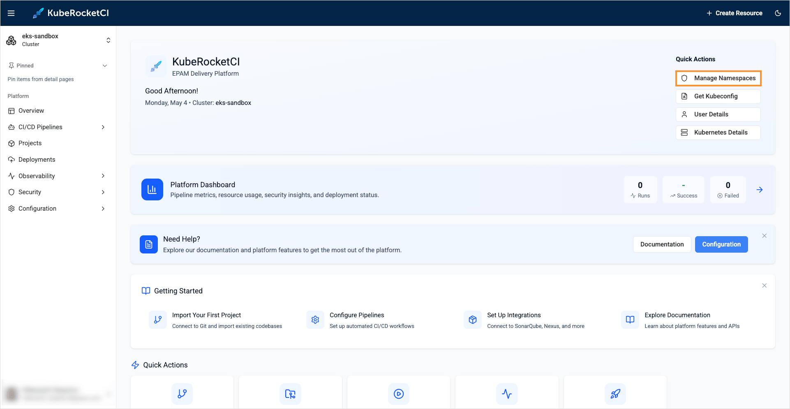

3. Ensure the `Namespace` value points to the namespace with the KubeRocketCI installation:

    

    :::note
    Don't forget to press Enter to add the namespace to the allowed namespaces list.
    :::

4. Create a new Project with the `Application` type using the `Create` strategy. Select the **Projects** section and click **+ Create project**:

    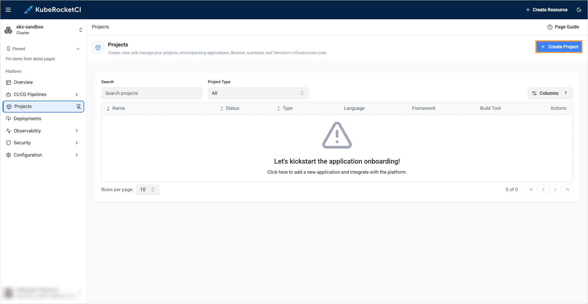

5. Select the **Custom configuration** option, choose the `Application` Codebase type as we intend to deliver our application as a container and deploy it within the Kubernetes cluster. Select the **Create** strategy to scaffold our application from the template provided by the KubeRocketCI and click **Continue**:

    

6. On the **Git & project info** tab, define the following values and click **Continue**:

    - Git server: `github`
    - Owner: `github_account_name`
    - Repository name: `es-usage`
    - Default branch: `main`
    - Project name: `es-usage`
    - Description: `External-secrets usage`

    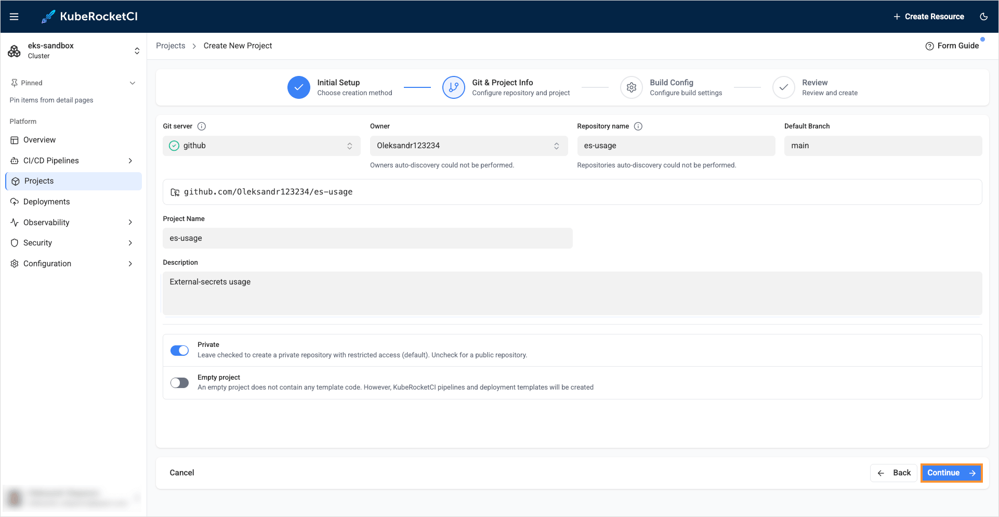

7. On the **Build config** tab, define the values and click **Continue**:

    - Code language: `Java`
    - Language version/framework: `Java 17`
    - Build tool: `Maven`
    - Codebase versioning type: `semver`
    - Start version from: `0.1.0`
    - Suffix: `SNAPSHOT`
    - Deployment options: `helm-chart`


    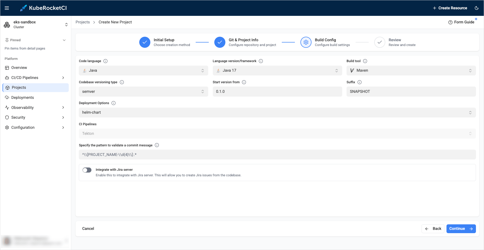

8. On the **Review** tab, verify the project configuration and click **Create project**:

    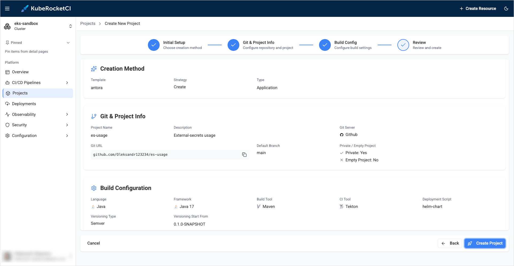

9. Check the application status. It should be green:

    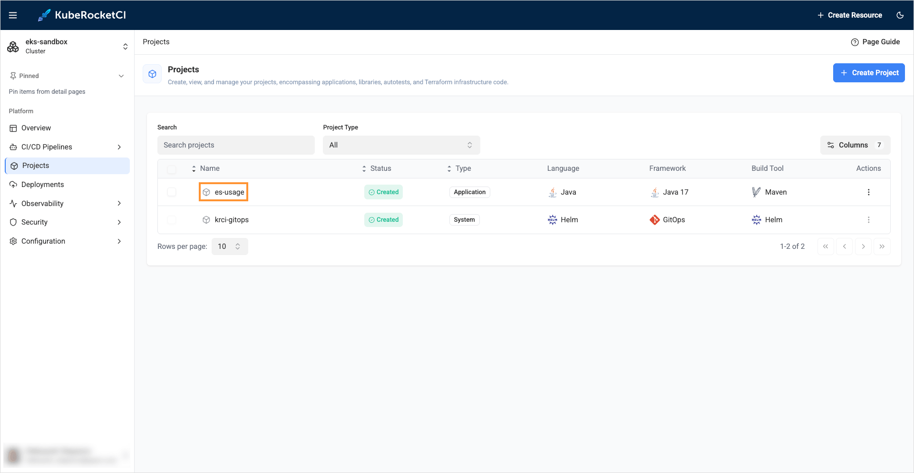

### Create Deployment

This section outlines the process of establishing a CD pipeline within UI Portal. There are two fundamental steps in this procedure:

- Create a `Deployment`;
- Within the `Deployment`, configure the `Environment`.

:::note
  Ensure [GitOps repository](../user-guide/gitops.md) is connected to the KubeRocketCI instance.
:::

Follow the instructions below to complete the process successfully:

1. In the KubeRocketCI portal, navigate to **Deployments** tab and push the **Create deployment** button to create pipeline:

    

2. In the **Create Deployment** dialog, define the below values:

    - **Applications**:

      - Applications: Add `es-usage` application
      - Branch: Select the `main` branch

        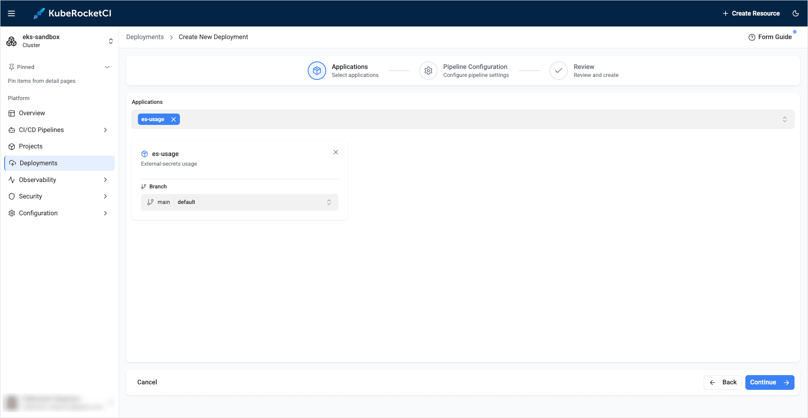

    - **Pipeline configuration**: 

      - Pipeline name: `deploy`
      - Description: `Deployment for application that uses External Secrets Operator`
      - Deployment type: Select `Container`
      - Promote applications: Leave unchecked

      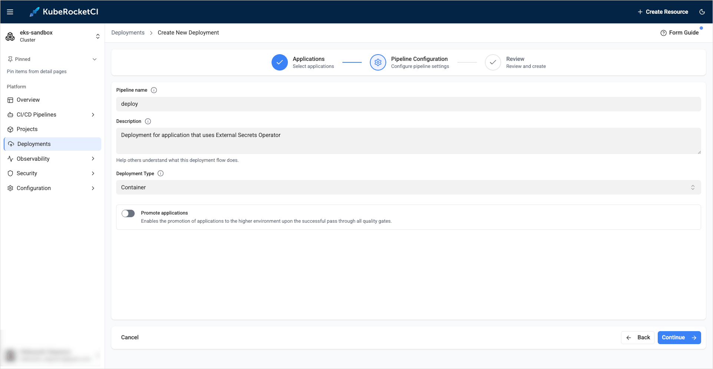

    - **Review**: 

      Verify the Deployment configuration and click **Create deployment**:
    
      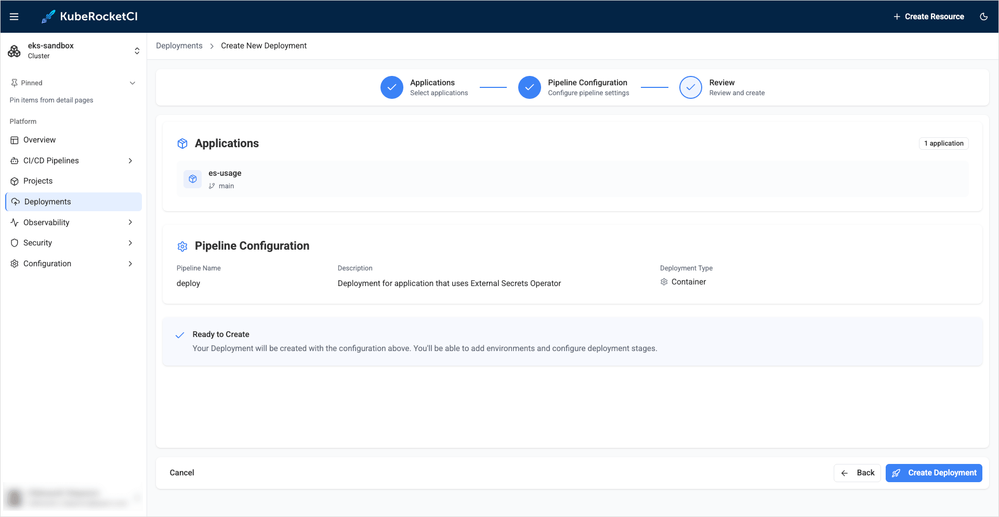

3. Click the `Open deployment` button to continue creating the environment:

    

4. Click the **+ Create environment** button:

    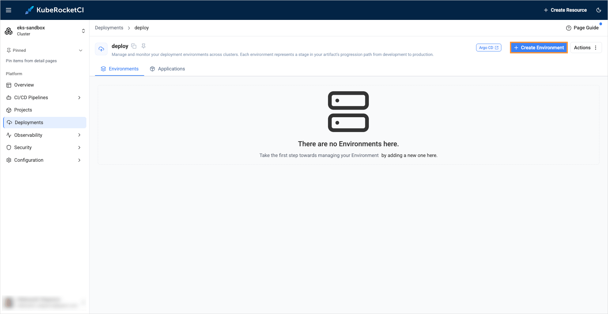

5. In the **Create new environment** dialog add the **sit** environment with the values below:

    - **Basic configuration**:

      - Cluster: `in-cluster`
      - Environment name: `sit`
      - Deploy namespace: `krci-deploy-sit`
      - Description: `System integration testing`

      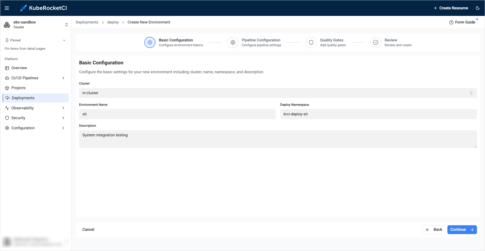

    - **Pipeline configuration**:

      - Trigger type: `Manual`
      - Deploy Pipeline template: `deploy`
      - Clean Pipeline template: `clean`

      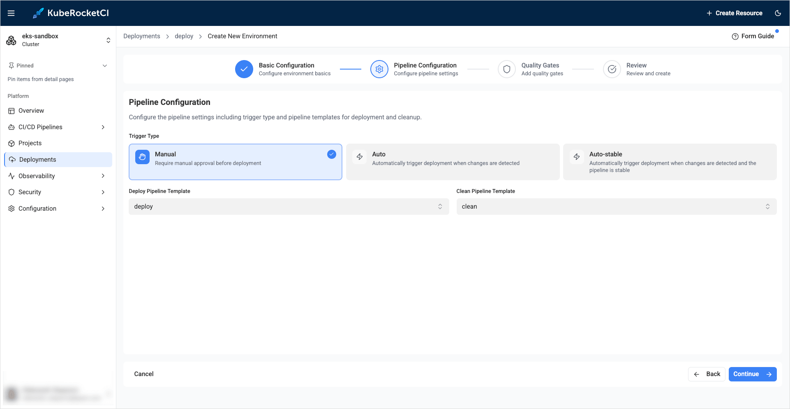

    - **Quality Gates**:

      Leave everything as is:
    
      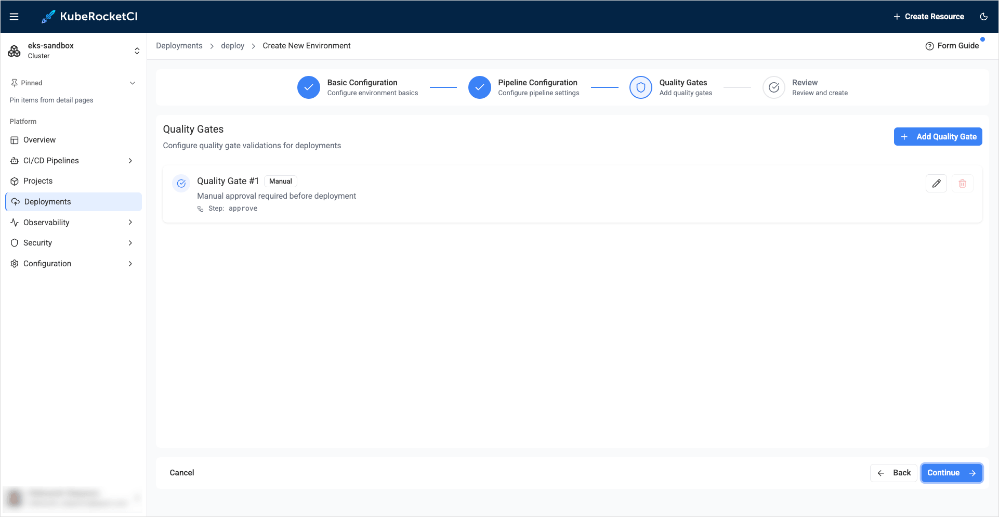

    - **Review**:

      Review the specified values and click the **Create environment** button:

      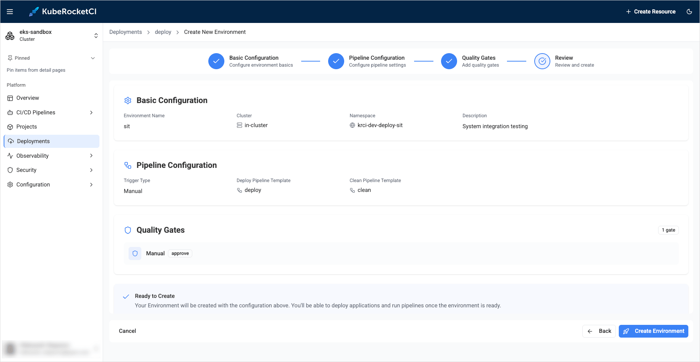

6. As soon as the Environment is created, click **Open environment**:

    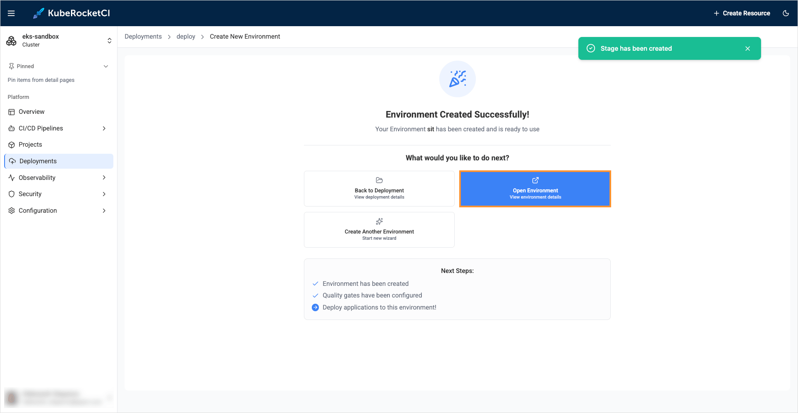

### Configure RBAC for External Secret Store

:::note

  Three namespaces are used:

    - `krci`, the namespace where KubeRocketCI is deployed;
    - `krci-vault`, the vault namespace where sensitive data is stored;
    - `krci-deploy-sit`, the **Deploy namespace** for the application (same value as in **Create environment** → **Basic configuration** → **Deploy namespace**).

  The application deploy namespace is not arbitrary: the UI suggests a name derived from the KubeRocketCI installation namespace, environment name, and stage name (see [Create Environment](../user-guide/add-cd-pipeline.md#create-environment)). In this guide the platform namespace is **`krci`**, the Deployment is named **`deploy`**, the Environment name is **`sit`**, and the deploy target is **`krci-deploy-sit`** — use the same string everywhere below (RoleBinding subject namespace, Helm templates, `kubectl -n`, and allowed namespaces in the portal).

:::

To ensure the proper functioning of the system, it is crucial to create the following resources:

1. Create namespace `krci-vault` to store secrets:

    ```bash
    kubectl create namespace krci-vault
    ```

2. Create Secret:

    ```yaml
    apiVersion: v1
    kind: Secret
    metadata:
      name: mongo
      namespace: krci-vault
    stringData:
      password: pass
      username: user
    type: Opaque
    ```

3. Create Role to access the Secret:

    ```yaml
    apiVersion: rbac.authorization.k8s.io/v1
    kind: Role
    metadata:
      namespace: krci-vault
      name: external-secret-store
    rules:
    - apiGroups: [""]
      resources:
      - secrets
      verbs:
      - get
      - list
      - watch
    - apiGroups:
      - authorization.k8s.io
      resources:
      - selfsubjectrulesreviews
      verbs:
      - create
    ```

4. Create RoleBinding:

    ```yaml
    apiVersion: rbac.authorization.k8s.io/v1
    kind: RoleBinding
    metadata:
      name: eso-from-krci
      namespace: krci-vault
    subjects:
      - kind: ServiceAccount
        name: secret-manager
        namespace: krci-deploy-sit
    roleRef:
      apiGroup: rbac.authorization.k8s.io
      kind: Role
      name: external-secret-store
    ```

### Add External Secret to Helm Chart

Now that RBAC is configured properly, it is time to add external secrets templates to application Helm chart. Follow the instructions provided below:

1. Navigate to one of the `Git Servers` where the `es-usage` application was created during the [Add Application](#add-application) step. In this example, it is `GitHub`:

    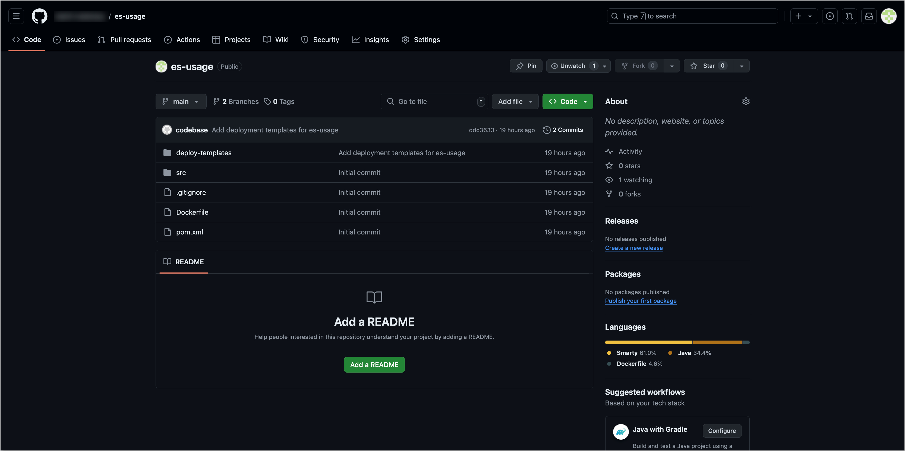

2. Create a commit in the `es-usage` repository and add the following configuration files to the Helm chart:

    1. `deploy-templates/templates/sa.yaml`:

        ```yaml
        apiVersion: v1
        kind: ServiceAccount
        metadata:
          name: secret-manager
          namespace: krci-deploy-sit
        ```

    2. `deploy-templates/templates/secret-store.yaml`:

        ```yaml
        apiVersion: external-secrets.io/v1
        kind: SecretStore
        metadata:
          name: krci-vault-store
          namespace: krci-deploy-sit
        spec:
          provider:
            kubernetes:
              remoteNamespace: krci-vault
              auth:
                serviceAccount:
                  name: secret-manager
              server:
                caProvider:
                  type: ConfigMap
                  name: kube-root-ca.crt
                  key: ca.crt
        ```

    3. `deploy-templates/templates/external-secret.yaml`:

        ```yaml
        apiVersion: external-secrets.io/v1
        kind: ExternalSecret
        metadata:
          name: mongo                            # target secret name
          namespace: krci-deploy-sit         # target namespace
        spec:
          refreshInterval: 1h
          secretStoreRef:
            kind: SecretStore
            name: krci-vault-store
          data:
          - secretKey: username                   # target value property
            remoteRef:
              key: mongo                          # remote secret key
              property: username                  # value will be fetched from this field
          - secretKey: password                   # target value property
            remoteRef:
              key: mongo                          # remote secret key
              property: password                  # value will be fetched from this field
        ```

    4. `deploy-templates/templates/deployment.yaml`. Add the environment variable for mongodb to the existing deployment configuration that used the secret:

        ```yaml
        env:
          - name: MONGO_USERNAME
            valueFrom:
              secretKeyRef:
                name: mongo
                key: username
          - name: MONGO_PASSWORD
            valueFrom:
              secretKeyRef:
                name: mongo
                key: password
        ```

3. Push the changes made to the `es-usage` repository.

### Deploy Application

Deploy the application by following the steps below:

1. Build Container from the latest branch commit. To build the initial version of the application's `main` branch, go to the **Projects** -> **es-usage** -> **Branches** -> **main** and press the **Trigger build pipeline run** button:

    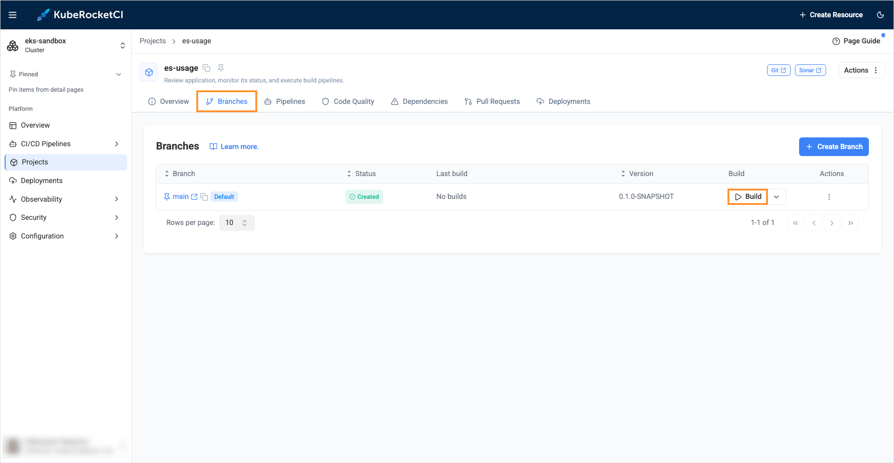

2. Build pipeline for the `es-usage` application starts:

    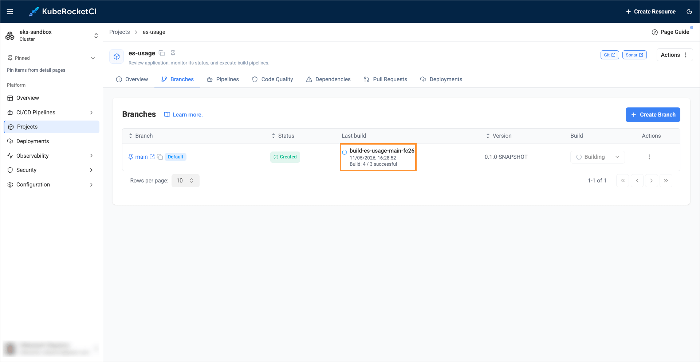

3. Once the build pipeline has successfully completed, navigate to the **Deployments** tab and select the `deploy` pipeline: Choose the **sit** environment and click on the **Configure deploy** button:

    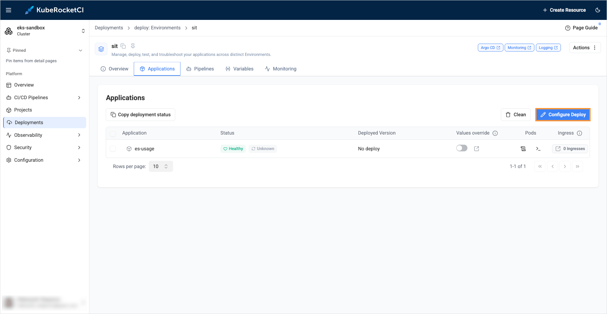

4. In the `Image stream version`, select latest version and push the **Start deploy** button:

    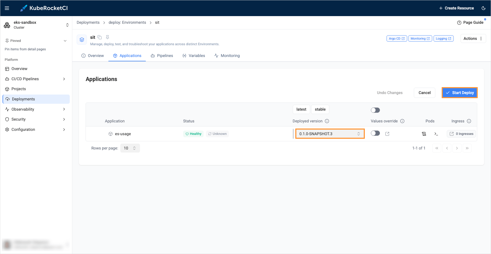

5. Ensure application status is `Healthy` and `Synced`:

    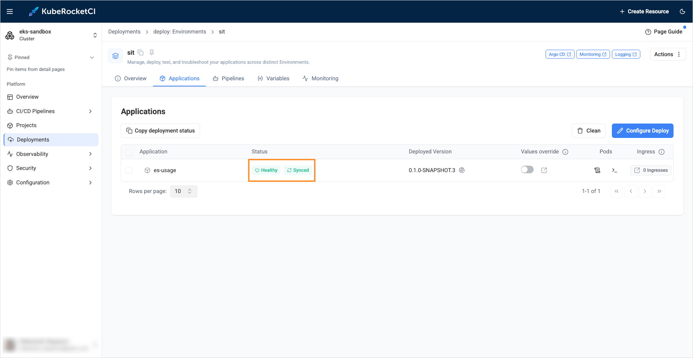

### Check Application Status

To ensure the application is deployed successfully, use `kubectl` with a context that can read the deploy namespace (replace `krci-deploy-sit` if your **Deploy namespace** differs).

1. Check that External Secrets resources are reconciled:

    ```bash
    kubectl get secretstore -n krci-deploy-sit
    NAME               AGE     STATUS   CAPABILITIES   READY
    krci-vault-store   4m38s   Valid    ReadWrite      True
    ```

    ```bash
    kubectl get externalsecret -n krci-deploy-sit
    NAME    STORE               REFRESH INTERVAL   STATUS         READY
    mongo   krci-vault-store    1h                 SecretSynced   True
    ```

    If `READY` is not `True`, inspect events:

    ```bash
    kubectl describe externalsecret mongo -n krci-deploy-sit
    kubectl describe secretstore krci-vault-store -n krci-deploy-sit
    ```

2. Confirm the Kubernetes `Secret` named `mongo` exists in the deploy namespace (created by ESO from the vault):

    ```bash
    kubectl get secret mongo -n krci-deploy-sit
    ```

    Confirm keys exist (values stay hidden in this output):

    ```bash
    kubectl describe secret mongo -n krci-deploy-sit
    ```

    Under **Data**, expect keys `username` and `password`.

    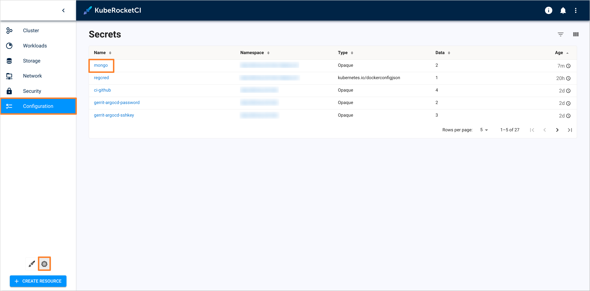

3. See which **Secrets** the workload is wired to (desired state from the `Deployment`; values are never printed here):

    `kubectl get deployment` only shows high-level fields (replicas, image, etc.), not secret references. Use **`describe`** or **`get -o yaml`** on the `Deployment` to inspect the Pod template.

    ```bash
    kubectl get deployment -n krci-deploy-sit -l app.kubernetes.io/name=es-usage
    kubectl describe deployment -n krci-deploy-sit -l app.kubernetes.io/name=es-usage
    ```

    ```text
    Environment:
      MONGO_USERNAME:  <set to the key 'username' in secret 'mongo'>  Optional: false
      MONGO_PASSWORD:  <set to the key 'password' in secret 'mongo'>  Optional: false
    ```

    That output means the Deployment injects those keys from the `mongo` Secret into every Pod it creates.

    Optional — compact list of env vars that use `secretKeyRef` (requires a single Deployment in the selector result):

    ```bash
    kubectl get deployment -n krci-deploy-sit -l app.kubernetes.io/name=es-usage \
      -o jsonpath='{range .items[0].spec.template.spec.containers[0].env[*]}{.name}{"\t"}{.valueFrom.secretKeyRef.name}{"\t"}{.valueFrom.secretKeyRef.key}{"\n"}{end}'
    ```

    Each line is: `VARIABLE_NAME`, Secret name, Secret key. Empty lines can appear for env entries that are not backed by a Secret (ignore them).

:::note
The steps above confirm External Secrets, the synced `mongo` Secret, and the **desired** Pod template on the `Deployment`. If the application misbehaves or Pods are not healthy anyway, inspect **runtime** state with `kubectl describe pod` (and Pod events) in the deploy namespace, and review the **Argo CD Application** resource that owns this release (sync status, rendered manifests, and events in the Argo CD UI or via `kubectl get application -n <argocd-namespace>` / `kubectl describe application` as appropriate for your installation).
:::

## Related Articles

- [Use Cases](./index.md)
- [Add Application](../user-guide/add-application.md)
- [CD Pipeline](../user-guide/add-cd-pipeline.md)
