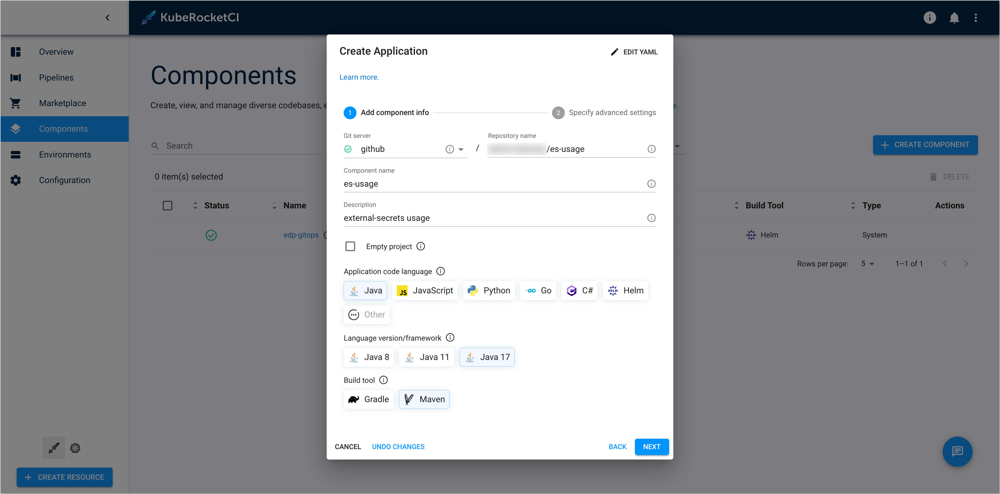
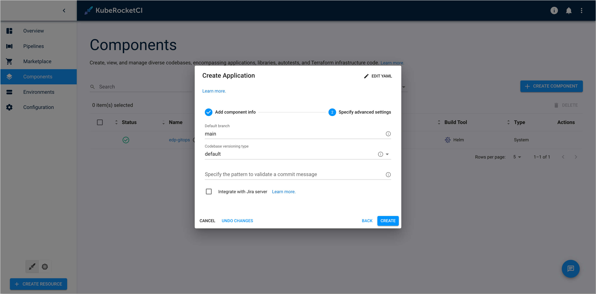
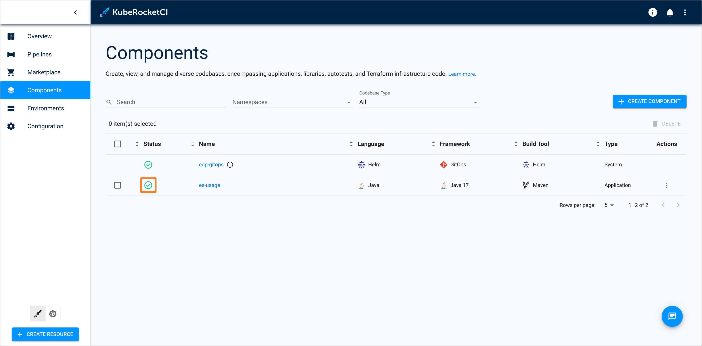

# Secured Secrets Management for Application Deployment

This use case demonstrates how to securely manage sensitive data, such as passwords, API keys, and other credentials, that are consumed by an application during development or runtime in production. The approach involves storing sensitive data in an external secret store located in a "vault" namespace (which can be Vault, AWS Secret Store, or any other provider). The process entails transmitting confidential information from the vault namespace to the deployed namespace to establish a connection to a database.

In this scenario, the KubeRocketCI platform is used to facilitate the management of sensitive data. By leveraging an external secret store, developers can ensure that confidential information is securely stored and accessed only when needed. This approach enhances the security of the deployment environment and mitigates the risk of exposing sensitive data.

To implement this approach, the following steps are involved:

1. Configure the KubeRocketCI platform with the desired external secret store provider, such as Vault or AWS Secret Store.

2. Create a separate namespace, referred to as the "vault" namespace, to store the sensitive data securely.

3. Store the sensitive data, such as passwords, API keys, and credentials, in the vault namespace using the chosen external secret store provider.

4. Establish a connection between the deployed namespace and the vault namespace to securely access the sensitive data when required.

By following these steps, developers can ensure that sensitive data is protected and accessed securely within the KubeRocketCI platform. This approach enhances the overall security of the application and reduces the risk of unauthorized access to confidential information.

## __Roles__

This documentation is tailored for the Developers and Team Leads.

## __Goals__

- Make confidential information usage secure in the deployment environment.

## __Preconditions__

- KubeRocketCI instance is [configured](../operator-guide/prerequisites.md) with Gerrit, Tekton and [Argo CD](../operator-guide/argocd-integration.md);
- External Secrets is [installed](../operator-guide/install-external-secrets-operator.md);
- Developer has access to the EDP instances using the Single-Sign-On approach;
- Developer has the `Administrator` role (to perform merge in Gerrit);
- Developer has access to manage secrets in demo-vault namespace.

## Scenario

To utilize External Secrets in the KubeRocketCI platform, follow the steps outlined below:

### Add Application

To begin, you will need an application first. Here are the steps to create it:

1. Open the UI Portal. Use the `Sign-In` option:

    

2. In the top right corner, enter the `Cluster settings` and ensure that both `Default namespace` and `Allowed namespace` are set:

    

3. Create the new `Codebase` with the `Application` type using the `Create` strategy. To do this, click the `EDP` tab:

    

4. Select the `Components` section under the `EDP` tab and push the `+` button:

    

5. Select the `Application` Codebase type because we are going to deliver our application as a container and deploy it inside the Kubernetes cluster. Select the `Create` strategy to use predefined template:

    

6. On the `Application Info` tab, define the following values and press the `Proceed` button:

    - Application name: `es-usage`
    - Default branch: `master`
    - Application code language: `Java`
    - Language version/framework: `Java 17`
    - Build tool: `Maven`

    

7. On the `Advanced Settings` tab, define the below values and push the `Apply` button:

    - CI tool: `Tekton`
    - Codebase versioning type: `default`

    

8. Check the application status. It should be green:

    

### Create CD Pipeline

This section outlines the process of establishing a CD pipeline within UI Portal. There are two fundamental steps in this procedure:

- Build the application from the last commit of the `master` branch;

- Create a `CD Pipeline` to establish continuous delivery to the SIT environment.

To succeed with the steps above, follow the instructions below:

1. Create CD Pipeline. To enable application deployment, create a CD Pipeline with a single environment - System Integration Testing (SIT for short). Select the `CD Pipelines` section under the `EDP` tab and push the `+` button:

    

2. On the `Pipeline` tab, define the following values and press the `Proceed` button:

    - Pipeline name: `deploy`
    - Deployment type: `Container`

    

3. On the `Applications` tab, add `es-usage` application, select `master` branch, leave `Promote in pipeline` unchecked and press the `Proceed` button:

    

4. On the `Stage` tab, add the `sit` stage with the values below and push the `Apply` button:

    - Stage name: `sit`
    - Description: `System integration testing`
    - Trigger type: `Manual`. We plan to deploy applications to this environment manually
    - Quality gate type: `Manual`
    - Step name: `approve`

    

### Configure RBAC for External Secret Store

:::note
  In this scenario, three namespaces are used: `demo`, which is the namespace where KubeRocketCI is deployed, `demo-vault`, which is the vault where developers store secrets, and `demo-deploy-sit`, which is the namespace used for deploying the application. The target namespace name for deploying the application is formed with the pattern: `edp-<cd_pipeline_name>-<stage_name>`.
:::

To ensure the proper functioning of the system, it is crucial to create the following resources:

1. Create namespace `demo-vault` to store secrets:

    ```bash
    kubectl create namespace demo-vault
    ```

2. Create Secret:

    ```yaml
    apiVersion: v1
    kind: Secret
    metadata:
      name: mongo
      namespace: demo-vault
    stringData:
      password: pass
      username: user
    type: Opaque
    ```

3. Create Role to access the secret:

    ```yaml
    apiVersion: rbac.authorization.k8s.io/v1
    kind: Role
    metadata:
      namespace: demo-vault
      name: external-secret-store
    rules:
    - apiGroups: [""]
      resources:
      - secrets
      verbs:
      - get
      - list
      - watch
    - apiGroups:
      - authorization.k8s.io
      resources:
      - selfsubjectrulesreviews
      verbs:
      - create
    ```

4. Create RoleBinding:

    ```yaml
    apiVersion: rbac.authorization.k8s.io/v1
    kind: RoleBinding
    metadata:
      name: eso-from-edp
      namespace: demo-vault
    subjects:
      - kind: ServiceAccount
        name: secret-manager
        namespace: demo-deploy-sit
    roleRef:
      apiGroup: rbac.authorization.k8s.io
      kind: Role
      name: external-secret-store
    ```

### Add External Secret to Helm Chart

Now that RBAC is configured properly, it is time to add external secrets templates to application Helm chart. Follow the instructions provided below:

1. Navigate to `UI Portal` -> `EDP` -> `Overview`, and push the Gerrit link:

    

2. Log in to Gerrit UI, select `Repositories` and select `es-usage` project:

    

3. In the `Commands` section of the project, push the `Create Change` button:

    

4. In the `Create Change` dialog, provide the branch `master` and fill in the `Description` (commit message) field and push the `Create` button:

    ```txt
    Add external secrets templates
    ```

    

5. Push the `Edit` button of the merge request and then the `ADD/OPEN/UPLOAD` button and add files:

      

    Once the file menu is opened, and click `SAVE` after editing each of the files:

    1. deploy-templates/templates/sa.yaml:

        ```yaml
        apiVersion: v1
        kind: ServiceAccount
        metadata:
          name: secret-manager
          namespace: demo-deploy-sit
        ```

    2. deploy-templates/templates/secret-store.yaml:

        ```yaml
        apiVersion: external-secrets.io/v1beta1
        kind: SecretStore
        metadata:
          name: demo
          namespace: demo-deploy-sit
        spec:
          provider:
            kubernetes:
              remoteNamespace: demo-vault
              auth:
                serviceAccount:
                  name: secret-manager
              server:
                caProvider:
                  type: ConfigMap
                  name: kube-root-ca.crt
                  key: ca.crt
        ```

    3. deploy-templates/templates/external-secret.yaml:

        ```yaml
        apiVersion: external-secrets.io/v1beta1
        kind: ExternalSecret
        metadata:
          name: mongo                            # target secret name
          namespace: demo-deploy-sit    # target namespace
        spec:
          refreshInterval: 1h
          secretStoreRef:
            kind: SecretStore
            name: demo
          data:
          - secretKey: username                   # target value property
            remoteRef:
              key: mongo                          # remote secret key
              property: username                  # value will be fetched from this field
          - secretKey: password                   # target value property
            remoteRef:
              key: mongo                          # remote secret key
              property: password                  # value will be fetched from this field
        ```

    4. deploy-templates/templates/deployment.yaml. Add the environment variable for mongodb to the existing deployment configuration that used the secret:

        ```yaml
        env:
          - name: MONGO_USERNAME
            valueFrom:
              secretKeyRef:
                name: mongo
                key: username
          - name: MONGO_PASSWORD
            valueFrom:
              secretKeyRef:
                name: mongo
                key: password
        ```

6. Push the `Publish Edit` button.

7. As soon as review pipeline finished, and you get `Verified +1` from CI, you are ready for review. Click `Mark as Active` -> `Code-Review +2` -> `Submit`:

    

### Deploy Application

Deploy the application by following the steps provided below:

1. When build pipeline is finished, navigate to `UI Portal` -> `EDP` -> `CD-Pipeline` and select `deploy` pipeline.

2. Deploy the initial version of the application to the SIT environment:

    - Select the `sit` stage from the Stages tab;
    - In the `Image stream version`, select latest version and push the `Deploy` button.

3. Ensure application status is `Healthy` and `Synced`:

    

### Check Application Status

To ensure the application is deployed successfully, do the following:

1. Check that the resources are deployed:

    ```bash
    kubectl get secretstore -n demo-deploy-sit
    NAME                           AGE     STATUS   READY
    demo                           5m57s   Valid    True
    ```

    ```bash
    kubectl get externalsecret -n demo-deploy-sit
    NAME    STORE                          REFRESH INTERVAL   STATUS         READY
    mongo   demo                           1h                 SecretSynced   True
    ```

2. In the top right corner, enter the `Cluster settings` and add `demo-deploy-sit` to the `Allowed namespace`.

3. Navigate `UI Portal` -> `Configuration` -> `Secrets` and ensure that secret was created:

    

4. Navigate `UI Portal` -> `Workloads` -> `Pods` and select deployed application:

    

## Related Articles

- [Use Cases](./index.md)
- [Add Application](../user-guide/add-application.md)
- [CD Pipeline](../user-guide/add-cd-pipeline.md)
