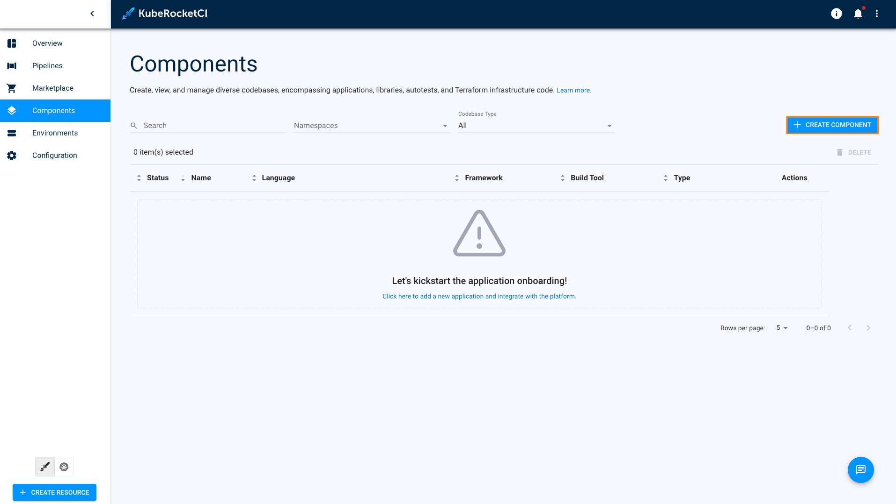
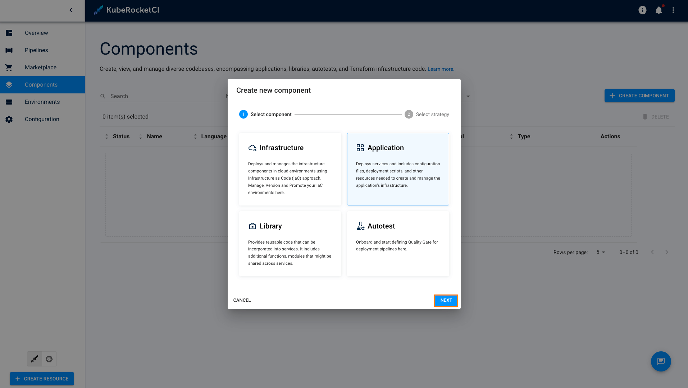
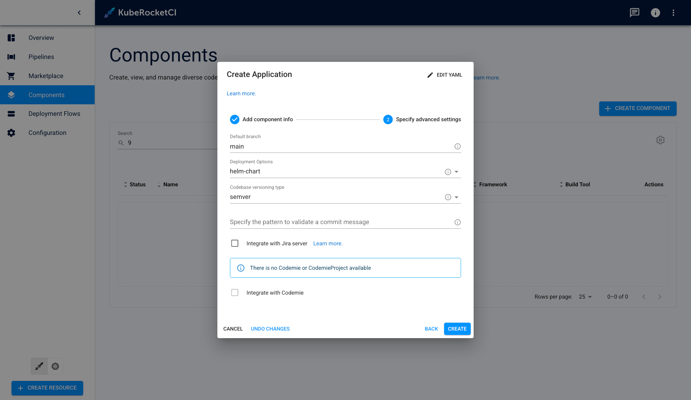
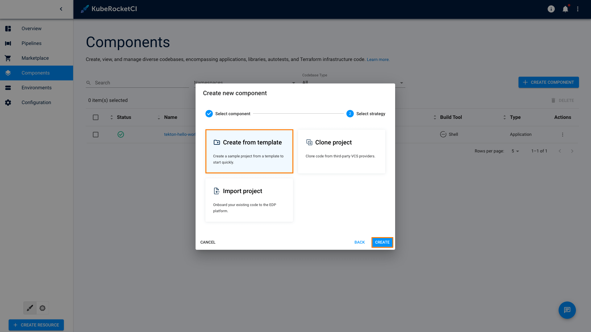
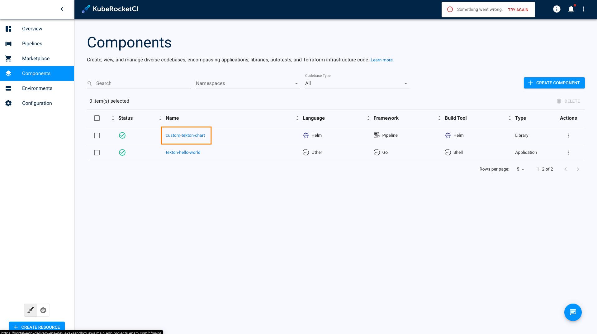
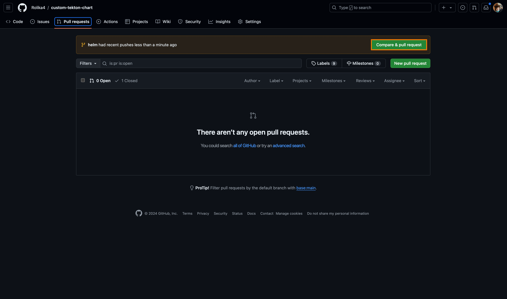
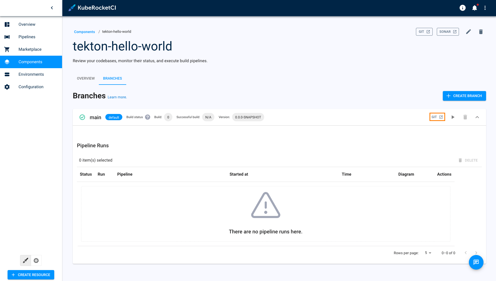
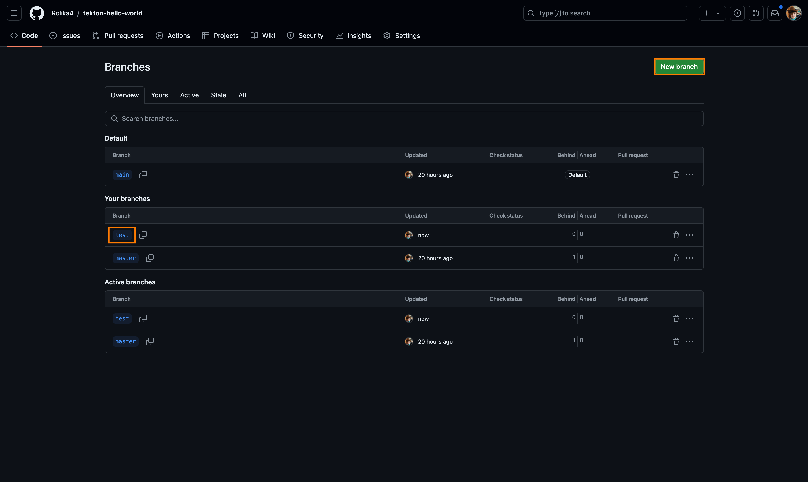
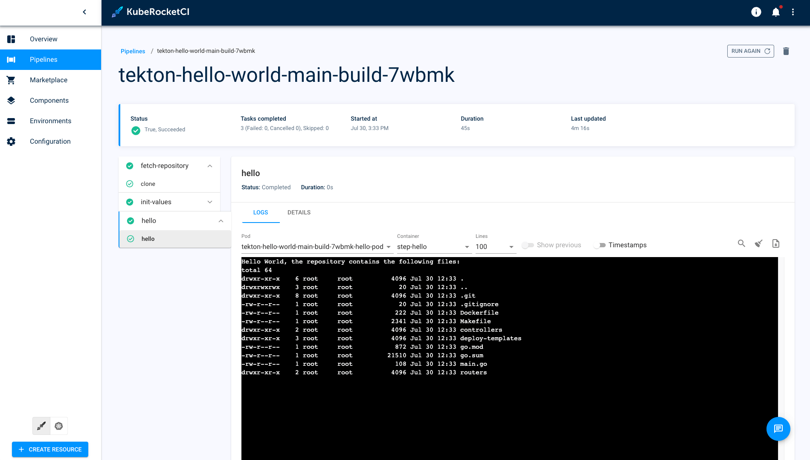

# Deploy Application With Custom Build Tool/Framework

This use case outlines the steps for adding custom Tekton libraries that contain pipelines with tasks. It also covers the process of modifying custom pipelines and tasks.

## Goals

- Add custom Tekton pipeline library;
- Modify existing pipelines and tasks in a custom Tekton library.

## Preconditions

- KubeRocketCI instance with GitHub and Tekton inside is [configured](../operator-guide/prerequisites.md);
- Developer has access to the KubeRocketCI instances using the Single-Sign-On approach;
- Developer has the `Administrator` role to perform merge in GitHub.

## Scenario

:::note
  This case is based on our predefined repository and application. Your case may be different.
:::

To create and then modify a custom Tekton library, please follow the steps below:

### Add Custom Application to KubeRocketCI

1. Open the KubeRocketCI. Use the Sign-In option:

    

2. In the top right corner, enter the `Account settings` and ensure that both `Default namespace` and `Allowed namespace` are set:

    

3. Select the **Components** tab and push the create **+CREATE COMPONENT** button:

    

4. Select the `Application` codebase type because is meant to be delivered as a container and deployed inside the Kubernetes cluster. Click **Next** button.

    

5. Choose the `Clone` strategy:

    

6. In the **Add component info** tab, define the following values and click the **Proceed** button:

    - Repository URL: `https://github.com/epmd-edp/go-go-beego.git`
    - Repository name: `tekton-hello-world`
    - Component name: `tekton-hello-world`
    - Description: `tekton-hello-world`
    - Application code language: `Other`
    - Language version/framework: `go`
    - Build tool: `shell`

    

    :::note
      These application details are required to match the Pipeline name `github-shell-go-app-build-default`.

      The PipelineRun name is formed with the help of TriggerTemplates in `pipelines-library` so the Pipeline name should correspond to the following structure:

      ```yaml
      pipelineRef:
        name: github-$(tt.params.buildtool)-$(tt.params.framework)-$(tt.params.cbtype)-build-$(tt.params.versioning-type)
      ```

      The PipelineRun is created as soon as GitHub (or, if configured GitLab) sends a payload during Merge Request events.
    :::

7. In the **Advances Settings** tab, define the below values and click the **Create** button:

    - Default branch: `main`
    - Codebase versioning type: `edp`
    - Leave `Specify the pattern to validate a commit message` empty.

    

8. Check the application status. It should be green.

    Now that the application is successfully created, proceed to adding the Tekton library to the KubeRocketCI platform.

### Add Tekton Library

1. Select the **Components** tab and push the create **+CREATE COMPONENT** button:

    

2. Create a new Codebase with the `Library` type:

    

3. Select **Create from template** and click **Create** button:

    

    :::note
      The KubeRocketCI `Create` strategy will automatically pull the code for the Tekton Helm application from [the template](https://github.com/epmd-edp/helm-helm-pipeline.git).
    :::

4. In the Application Info tab, define the following values and click the `Proceed` button:

    - Repository name: `custom-tekton-chart`
    - Component name: `custom-tekton-chart`
    - Description: `custom-tekton-chart`
    - Application code language: `Helm`
    - Language version/framework: `Pipeline`
    - Build tool: `Helm`

    

5. In the `Advances Settings` tab, define the below values and click the `Apply` button:

    - Default branch: `main`
    - Codebase versioning type: `edp`
    - Leave `Specify the pattern to validate a commit message` empty.

    

6. Check the codebases status:

    

### Modify Tekton Pipeline

:::info
  Our recommendation is to avoid modifying the default Tekton resources. Instead, we suggest creating and modifying your own custom Tekton library.
:::

Now that the Tekton Helm library is created, it is time to clone, modify and then apply it to the Kubernetes cluster.

1. In the Components tab, click one of the `custom-tekton-chart` to enter the application menu:

    

2. Navigate to **Branches** and click to the **Git** button:

    

3. Clone the repository with `SSH` using **Code** button:

    


4. Examine the repository structure. It should look this way by default:

    ```bash
    custom-tekton-chart
      ├── Chart.yaml
      ├── chart_schema.yaml
      ├── ct.yaml
      ├── lintconf.yaml
      ├── templates
      │   ├── pipelines
      │   │   └── hello-world
      │   │       ├── gerrit-build-default.yaml
      │   │       ├── gerrit-build-edp.yaml
      │   │       ├── gerrit-build-lib-default.yaml
      │   │       ├── gerrit-build-lib-edp.yaml
      │   │       ├── gerrit-review-lib.yaml
      │   │       ├── gerrit-review.yaml
      │   │       ├── github-build-default.yaml
      │   │       ├── github-build-edp.yaml
      │   │       ├── github-build-lib-default.yaml
      │   │       ├── github-build-lib-edp.yaml
      │   │       ├── github-review-lib.yaml
      │   │       ├── github-review.yaml
      │   │       ├── gitlab-build-default.yaml
      │   │       ├── gitlab-build-edp.yaml
      │   │       ├── gitlab-build-lib-default.yaml
      │   │       ├── gitlab-build-lib-edp.yaml
      │   │       ├── gitlab-review-lib.yaml
      │   │       └── gitlab-review.yaml
      │   └── tasks
      │       └── task-hello-world.yaml
      └── values.yaml
    ```

    :::note
      Change the values in the `values.yaml` file.

      The `gitProvider` parameter is the git hosting provider, GitHub and GitLab in this example.

      The [dnsWildCard](https://github.com/epam/edp-install/blob/v3.9.0/deploy-templates/values.yaml#L10) parameter is the cluster DNS address.
    :::

    :::note
      Our custom Helm chart includes [edp-tekton-common-library](https://github.com/epam/edp-tekton/blob/master/charts/common-library/Chart.yaml) dependencies in the `Chart.yaml` file. This library allows to use our predefined code snippets.
    :::

    Here is an example of the filled in `values.yaml` file:

    ```yaml
    nameOverride: ""
    fullnameOverride: ""

    global:
      gitProviders:
        - github
      dnsWildCard: "example.domain.com"
    ```

5. Modify and add tasks or pipelines.

    As an example, let's assume that we need to add the `helm-lint` pipeline task to the review pipeline. To implement this, insert the code below to the [github-review.yaml](https://github.com/epmd-edp/helm-helm-pipeline/blob/master/templates/pipelines/hello-world/github-review.yaml#L66) file underneath the hello task:

    ```yaml
    - name: hello
      taskRef:
        name: hello
      runAfter:
      - init-values
      params:
      - name: BASE_IMAGE
        value: "$(params.shell-image-version)"
      - name: username
        value: "$(params.username)"
      workspaces:
        - name: source
          workspace: shared-workspace

    - name: helm-lint
      taskRef:
        kind: Task
        name: helm-lint
      runAfter:
        - hello
      params:
        - name: EXTRA_COMMANDS
          value: |
            ct lint --validate-maintainers=false --charts deploy-templates/
      workspaces:
        - name: source
          workspace: shared-workspace
          subPath: source
    ```

    :::note
      The `helm-lint` task references to the default `pipeline-library` Helm chart which is applied to the cluster during EDP installation.

      The `runAfter` parameter shows that this Pipeline task will be run after the `hello` pipeline task.
    :::

6. Build Helm dependencies in the custom chart:

    ```bash
    helm dependency update .
    ```

7. Ensure that the chart is valid and all the indentations are fine:

    ```bash
    helm lint .
    ```

    To validate if the values are substituted in the templates correctly, render the templated YAML files with the values using the following command. It generates and displays all the manifest files with the substituted values:

    ```bash
    helm template .
    ```

8.  Install the custom chart with the command below. You can also use the `--dry-run` flag to simulate the chart installation and catch possible errors:

    ```bash
    helm upgrade --install edp-tekton-custom . -n edp --dry-run
    ```

    ```bash
    helm upgrade --install edp-tekton-custom . -n edp
    ```

9.  Check the created pipelines and tasks in the cluster:

    ```bash
    kubectl get tasks -n edp
    kubectl get pipelines -n edp
    ```

10. Commit and push the modified Tekton Helm chart to GitHub:

    ```bash
    git checkout -b helm
    git add .
    git commit -m "Add Helm chart testing for go-shell application"
    git push -u origin helm
    ```

11. Navigate Github -> **Pull requests** -> **Compare & pull request** -> **Create pull request**.

    

12. Check the GitHub code review for the custom Helm chart pipelines repository in KubeRocketCI. Navigate **Components** -> **Component name** and click to the review pipeline run:

    

13. Explore the pipeline status and steps:

    

14. Go to the GitHub **Pull requests** -> **Add Helm chart testing for go-shell application** -> and click **Merge pull request**:

    

### Create Application Merge Request

Since we applied the Tekton library to the Kubernetes cluster in the previous step, let's test the review and build pipelines for our `tekton-hello-world` application.

Perform the below steps to merge new code (Merge Request) that passes the Code Review flow. For the steps below, we use GitHub UI but the same actions can be performed using the command line and Git tool:

1. In the Components tab, click one of the `custom-tekton-chart` to enter the application menu.

2. Navigate to **Branches** and click to the **Git** button:

    

3. Navigate to the **Branches** menu, create new branch from **New branch** menu with name `test`, and the click on the test branch:

    

4. Change file `deploy-templates/values.yaml` with values below:

    ```yaml
    ...
    ingress:
      enabled: true
    ...
    ```

    

5. Navigate to the **Pull requests** -> **Compare & pull request** -> and click **Create pull request**:

6. Check the Review Pipeline status. Navigate KubeRocketCI -> **Components** -> `tekton-hello-world` and click on review pipeline. The `helm-lint` task should be displayed there:

    

7. After review procedure successfully ended - approve merge request. Navigate Github -> **Pull requests** -> `test` and click on **Merge pull request** button. Then, your code is merged to the main branch, triggering the Build Pipeline:

    

    :::note
      If the build is added and configured, push steps in the pipeline, it will produce a new version of artifact, which will be available for the deployment in EDP Portal.
    :::

8.  Check the pipelines in the KubeRocketCI dashboard:

    

Under the hood, the following process takes place:

1. GitHub sends a payload to the Tekton EventListener when a Merge Request event occurs.
2. The EventListener captures the payload with the assistance of an Interceptor.
3. The TriggerTemplate is responsible for creating a PipelineRun.

The detailed scheme is shown below:


This chart will be using the core of `common-library` and `pipelines-library` and custom resources on the top of them.

## Related Articles

- [Tekton Overview](../operator-guide/ci/tekton-overview.md)
- [Add Application using EDP Portal](../user-guide/add-application.md)
