---

title: "Application With Custom Build Tool/Framework"
description: "Learn how to integrate custom build tools and frameworks in KubeRocketCI for enhanced CI/CD pipelines, catering to unique project requirements and workflows."
sidebar_label: "Deploy Application With Custom Build Tool/Framework"

---
<!-- markdownlint-disable MD025 -->

# Deploy Application With Custom Build Tool/Framework

<head>
  <link rel="canonical" href="https://docs.kuberocketci.io/docs/use-cases/tekton-custom-pipelines" />
</head>

This use case demonstrates how to implement custom CI/CD pipelines within the KubeRocketCI platform to address project-specific requirements.
KubeRocketCI extends this capability by supporting the **customization** of Applications (Components) and Tekton pipelines, allowing teams to integrate and develop functionalities or services not readily available on the platform.

## Goals

- Incorporate and manage custom Tekton pipeline libraries that addresses project requirements.
- Modify existing pipelines and tasks within these libraries to align with specific developmental goals and introduce novel functionalities.
- Facilitate a swift setup and implementation process, enabling teams to focus on development without being hindered by platform limitations.

## Preconditions

- KubeRocketCI instance with GitHub and Tekton is [configured](../operator-guide/prerequisites.md);
- Developer has access to the KubeRocketCI instances using the Single-Sign-On approach;
- Developer has `Write` permissions for GitHub repository to merge the code;
- Configured Argo CD instance with the [Add-ons repository](../operator-guide/add-ons-overview.md) added.

## Scenario

To streamline the process of implementing custom logic within the KubeRocketCI platform, follow this scenario:

- Add Custom Application: Begin by adding your application to the KubeRocketCI platform.
- Add Custom Tekton Library: Create and add a custom Tekton library designed to implement the CI/CD logic required by your application.
- Validate the Implementation: After setting up your Application and Tekton library, conduct testing to ensure that the pipelines execute as intended.

### Add Custom Application to KubeRocketCI

:::tip
  A `Custom Application` refers to any application that utilizes a programming language, framework, or build tool not natively supported by the platform, or an existing application that necessitates specific customizations to its pipeline.
  This encompasses scenarios where the default pipeline configurations and toolchains are unable to meet the unique requirements of the application, thereby requiring the development and integration of tailored solutions.
:::

1. Open the KubeRocketCI portal. Use the **Sign-In** option:

    

2. In the top right corner, enter the `Account settings` and ensure that both `Default namespace` and `Allowed namespace` are set:

    

3. Select the **Components** tab and push the create **+ CREATE COMPONENT** button:

    

4. Choose the `Application` type since it is intended for containerization and deployment within a Kubernetes cluster. Click the **Next** button.

    

5. Choose the `Clone` strategy, since we are cloning the application from the existing repository:

    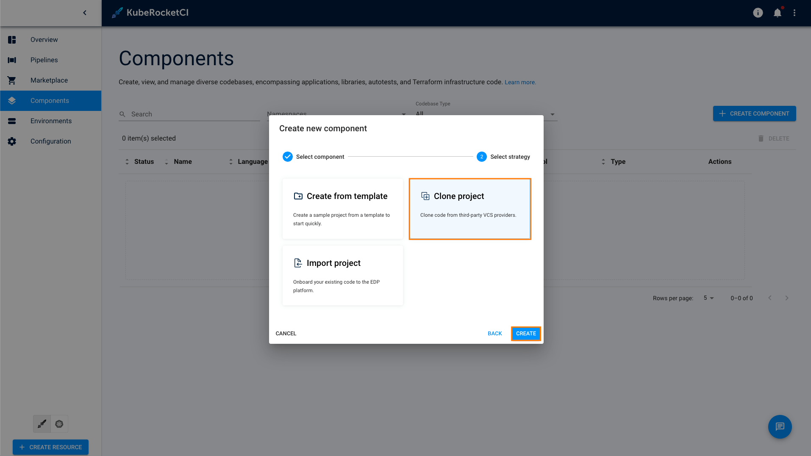

6. In the **Add component info** tab, define the following values and click the **Proceed** button:

    - Repository URL: `https://github.com/epmd-edp/go-go-beego.git`
    - Repository name: `tekton-hello-world`
    - Component name: `tekton-hello-world`
    - Description: `Custom tekton-hello-world application`
    - Application code language: `Other`
    - Language version/framework: `go`
    - Build tool: `shell`

    

7. In the **Advances Settings** tab, define the below values and click the **Create** button:

    - Default branch: `main`
    - Codebase versioning type: `semver`
    - Leave `Specify the pattern to validate a commit message` empty.

    

8. Check the application status. It should be green.

    Now that the application is successfully created, proceed to adding the Tekton library to the KubeRocketCI platform.

:::warning
  It's important to align with the Tekton Pipeline name to ensure correct pipeline execution for review and build events.

  The name for PipelineRun is dynamically generated via `TriggerTemplates` located in the [pipelines-library](https://github.com/epam/edp-tekton/tree/master/charts/pipelines-library/templates/triggers) and aligned to the structure provided below:

  ```yaml
  pipelineRef:
    name: github-$(tt.params.buildtool)-$(tt.params.framework)-$(tt.params.cbtype)-build-$(tt.params.versioning-type)
  ```

  This naming convention facilitates the automatic creation of PipelineRun instances in response to payload from GitHub during Merge Request events.
  Ensure that the Pipeline name matches this structure to enable the correct triggering of pipeline executions.

  In our case, the build pipeline name should be `github-shell-go-app-build-edp`
:::

### Add Tekton Library

KubeRocketCI allows for the creation of custom Tekton libraries to address specific project requirements. This feature enables the modification of existing pipelines and tasks to align with the unique needs of the application.

1. Select the **Components** tab and push the create **+ CREATE COMPONENT** button:

    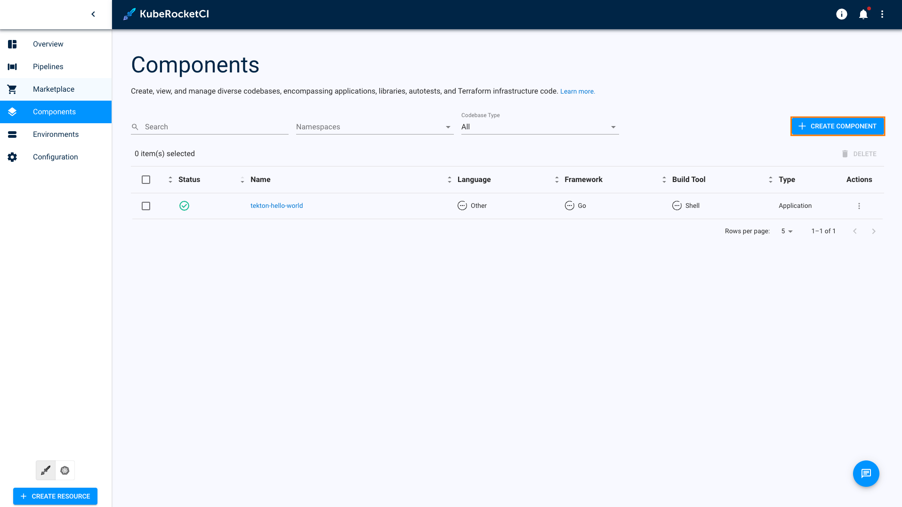

2. Create a new Codebase with the `Library` type:

    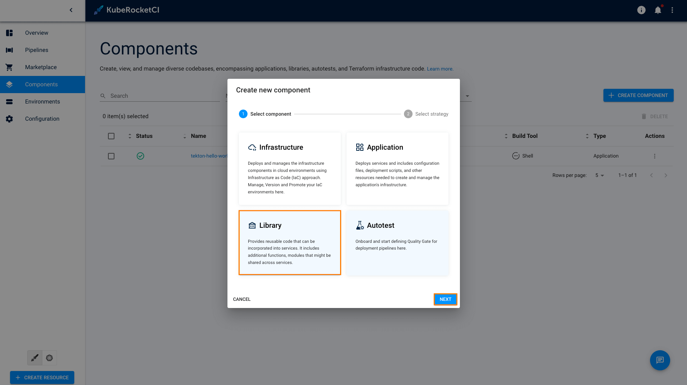

3. Select **Create from template** and click **Create** button:

    

    :::note
      The KubeRocketCI `Create` strategy will automatically pull the code for the Tekton Helm application from [the template](https://github.com/epmd-edp/helm-helm-pipeline.git).
    :::

4. In the Application Info tab, define the following values and click the `Proceed` button:

    - Repository name: `custom-tekton-chart`
    - Component name: `custom-tekton-chart`
    - Description: `Repository for storing and managing custom Tekton resources`
    - Application code language: `Helm`
    - Language version/framework: `Pipeline`
    - Build tool: `Helm`

    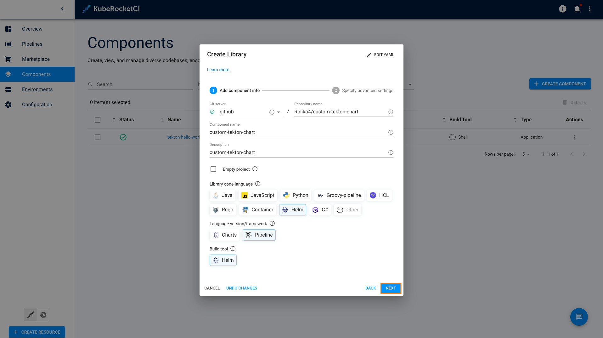

5. In the `Advances Settings` tab, define the below values and click the `Apply` button:

    - Default branch: `main`
    - Codebase versioning type: `semver`
    - Leave `Specify the pattern to validate a commit message` empty.

    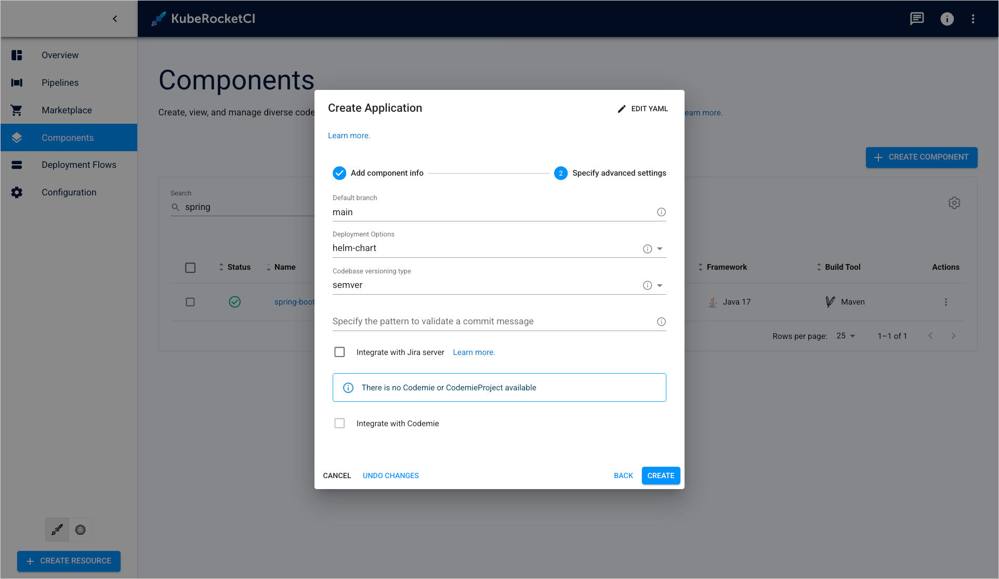

6. Check the codebases status:

    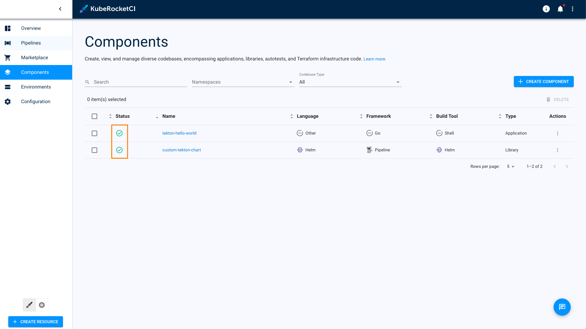

You have successfully added the custom Tekton library to the KubeRocketCI platform and are now ready to modify the Tekton pipeline to align with the specific requirements of your custom application.

### Modify Tekton Pipeline

:::info
  We strongly advise against altering the platform's default Tekton resources. To ensure seamless upgrades and maintain custom functionality, it is recommended to develop and manage your custom pipelines within a dedicated Custom Tekton Library. This approach safeguards your customizations and facilitates a smoother update process.
:::

Now that the Tekton Helm library is created, it is time to clone, modify and then apply it to the Kubernetes cluster.

1. In the Components tab, click one of the `custom-tekton-chart` to enter the application menu:

    

2. Navigate to **Branches** and click to the **Git** button:

    

3. Clone the repository with `SSH` using **Code** button:

    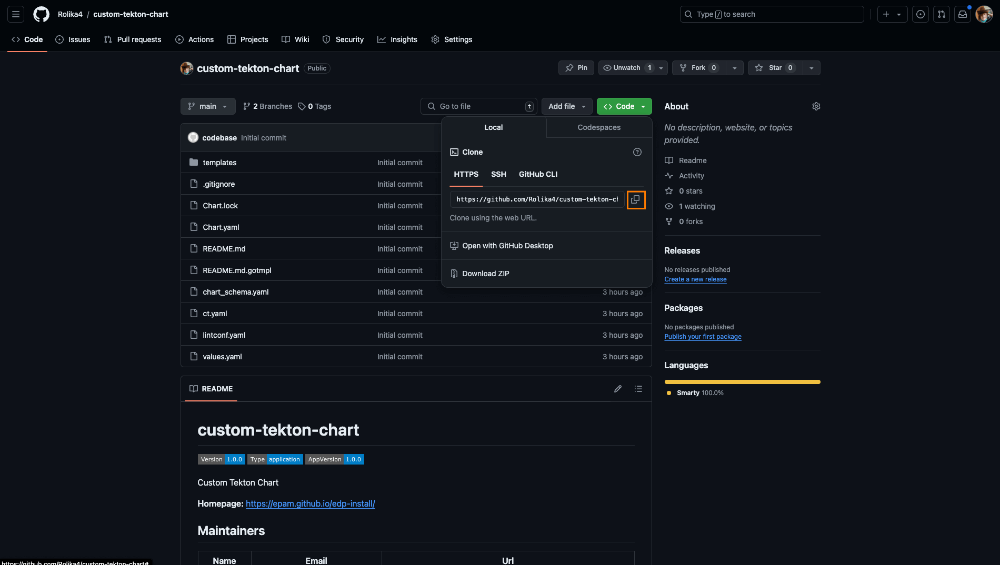

4. Examine the repository structure. It should look this way by default:

    ```plaintext
    tekton-custom-pipelines
    ├── Chart.yaml
    ├── templates
    │   ├── pipelines
    │   │   ├── deploy
    │   │   │   ├── custom-clean.yaml
    │   │   │   └── custom-deploy.yaml
    │   │   ├── bitbucket-build-default.yaml
    │   │   ├── bitbucket-build-edp.yaml
    │   │   ├── bitbucket-build-lib-default.yaml
    │   │   ├── bitbucket-build-lib-edp.yaml
    │   │   ├── bitbucket-review.yaml
    │   │   ├── gerrit-build-default.yaml
    │   │   ├── gerrit-build-edp.yaml
    │   │   ├── gerrit-build-lib-default.yaml
    │   │   ├── gerrit-build-lib-edp.yaml
    │   │   ├── gerrit-review.yaml
    │   │   ├── github-build-default.yaml
    │   │   ├── github-build-edp.yaml
    │   │   ├── github-build-lib-default.yaml
    │   │   ├── github-build-lib-edp.yaml
    │   │   ├── github-review.yaml
    │   │   ├── gitlab-build-default.yaml
    │   │   ├── gitlab-build-edp.yaml
    │   │   ├── gitlab-build-lib-default.yaml
    │   │   ├── gitlab-build-lib-edp.yaml
    │   │   └── gitlab-review.yaml
    │   ├── resources
    │   │   └── npm-settings.yaml
    │   ├── tasks
    │   │   ├── deploy
    │   │   │   └── hello-world-deploy.yaml
    │   │   └── hello-world.yaml
    │   └── triggers
    │       ├── custom-clean.yaml
    │       └── custom-deploy.yaml
    └── values.yaml
    ```

    For more detailed information and explanations regarding the repository structure, please refer to [Creating and Using Custom Tekton Pipelines](./custom-pipelines-flow.md) use case.

    :::note
      Update the values in the `values.yaml` file.

      The [dnsWildCard](https://github.com/epam/edp-install/blob/v3.9.0/deploy-templates/values.yaml#L10) parameter is the platform address.
    :::

    Below is a sample configuration for the `values.yaml` file:

    ```yaml
    dnsWildCard: "example.domain.com"
    ```

5. Modify and add tasks or pipelines.

    Consider the scenario where it's necessary to incorporate the `helm-lint` task into the review pipeline.
    To achieve this, append the following code snippet to the `templates/pipelines/github-review.yaml` file, specifically below the `hello-world` task, located here: [github-review.yaml](https://github.com/epmd-edp/helm-helm-pipeline/blob/master/templates/pipelines/github-review.yaml#L114):

    ```yaml
    apiVersion: tekton.dev/v1beta1
    kind: Pipeline
    metadata:
      name: github-shell-go-app-review
    ...
    - name: hello-world
      taskRef:
        name: hello-world
      runAfter:
      - init-values
      params:
      - name: BASE_IMAGE
        value: "$(params.image-version)"
      - name: username
        value: "$(params.username)"
      workspaces:
        - name: source
          workspace: shared-workspace
          subPath: source

    - name: helm-lint
      taskRef:
        kind: Task
        name: helm-lint
      runAfter:
        - hello-world
      params:
        - name: EXTRA_COMMANDS
          value: |
            ct lint --validate-maintainers=false --charts deploy-templates/
      workspaces:
        - name: source
          workspace: shared-workspace
          subPath: source
    ```

    :::note
      The `helm-lint` task references to the default `pipeline-library` Helm chart which is deployed to the cluster as part of the KubeRocketCI setup process.

      The `runAfter` parameter indicates the execution sequence, specifying that the `helm-lint` task is scheduled to run subsequent to the completion of the `hello-world` task.
    :::

    Also, in the `templates/pipelines/github-build-edp.yaml` file, specify the name `github-shell-go-app-build-edp` for the custom build pipeline:

    ```yaml
    apiVersion: tekton.dev/v1beta1
    kind: Pipeline
    metadata:
      name: github-shell-go-app-build-edp
    ...
    ```

6. Commit and push the modified Tekton Helm chart to GitHub:

    ```bash
    git checkout -b helm
    git add .
    git commit -m "Add Helm chart testing for go-shell application"
    git push -u origin helm
    ```

7. Navigate Github -> **Pull requests** -> **Compare & pull request** -> **Create pull request**.

    

8. Check the GitHub code review for the custom Helm chart pipelines repository in KubeRocketCI. Navigate **Components** -> **Component name** and click to the review pipeline run:

    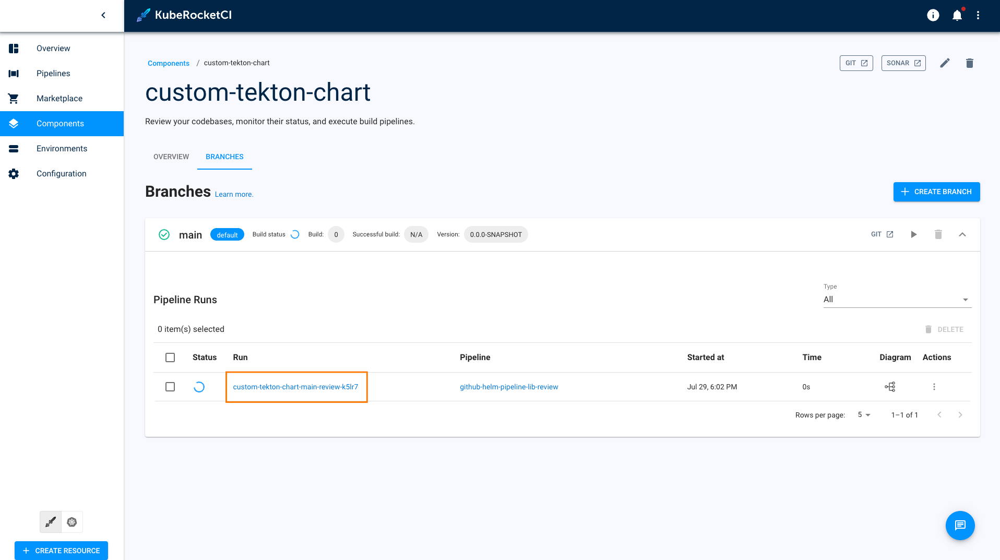

9. Explore the pipeline status and steps:

    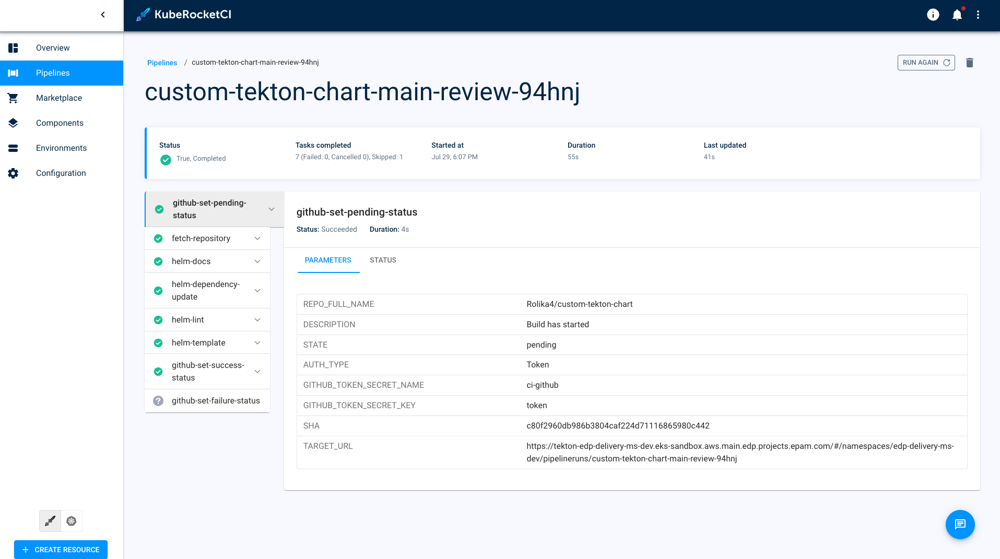

10. Go to the GitHub **Pull requests** -> **Add Helm chart testing for go-shell application** -> and click **Merge pull request**:

    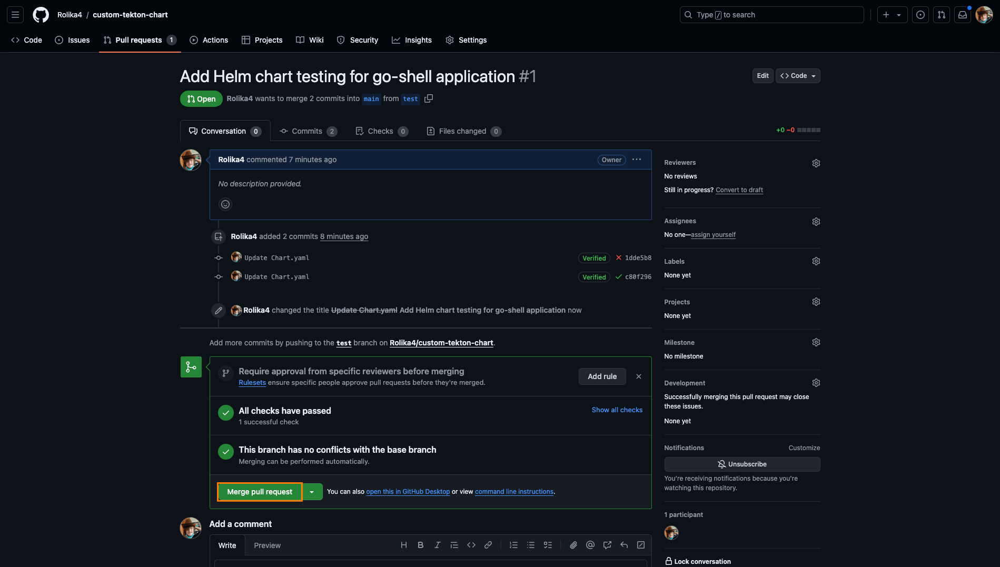

### Deliver Custom Tekton Pipelines to the cluster

To deploy custom pipelines to the cluster, you can use Argo CD, which includes a repository with [add-ons](https://github.com/epam/edp-cluster-add-ons/tree/main).

To deliver custom Tekton pipelines to the cluster, follow these steps:

1. Clone the forked repository with add-ons and make the following changes. In the `clusters/core/apps/values.yaml` file, set the `repoUrl` and `namespace` fields to specify the Git URL of the `tekton-custom-pipelines` repository and the namespace where the KubeRocketCI platform is deployed. Also, set the `kuberocketci-pipelines.enabled` field to `true` to enable the deployment of the `tekton-custom-pipelines` Argo CD Application:

    ```yaml
    kuberocketci-pipelines:
      enable: true
      namespace: <krci-namespace>
      repoUrl: ssh://git@github.com:22/<account-name>/tekton-custom-pipelines.git
    ```

2. Commit and push the changes to the repository.

    After making the necessary changes, commit and push the changes to the repository. Use the following commands to commit and push the changes:

    ```bash
    git add .
    git commit -m "Enable custom Tekton pipelines deployment"
    git push origin main
    ```

3. After pushing the changes, access **Argo CD**, navigate to the Application that corresponds to the repository with the **add-ons**, and initiate the `Sync` process. This will apply the `tekton-custom-pipelines` Helm Chart to the cluster within the specified namespace.

    

### Create Application Merge Request

Since we applied the Tekton library to the Kubernetes cluster in the previous step, let's test the review and build pipelines for our `tekton-hello-world` application.

Perform the below steps to merge new code (Merge Request) that passes the Code Review flow. For the steps below, we use GitHub UI but the same actions can be performed using the command line and Git tool:

1. In the Components tab, click one of the `custom-tekton-chart` to enter the application menu.

2. Navigate to **Branches** and click to the **Git** button:

    

3. Navigate to the **Branches** menu, create new branch from **New branch** menu with name `test`, and the click on the test branch:

    

4. Change file `deploy-templates/values.yaml` with values below:

    ```yaml
    ...
    ingress:
      enabled: true
    ...
    ```

    

5. Navigate to the **Pull requests** -> **Compare & pull request** -> and click **Create pull request**:

6. Check the Review Pipeline status. Navigate KubeRocketCI -> **Components** -> `tekton-hello-world` and click on review pipeline. The `helm-lint` task should be displayed there:

    

7. After review procedure successfully ended - approve merge request. Navigate Github -> **Pull requests** -> `test` and click on **Merge pull request** button. Then, your code is merged to the main branch, triggering the Build Pipeline:

    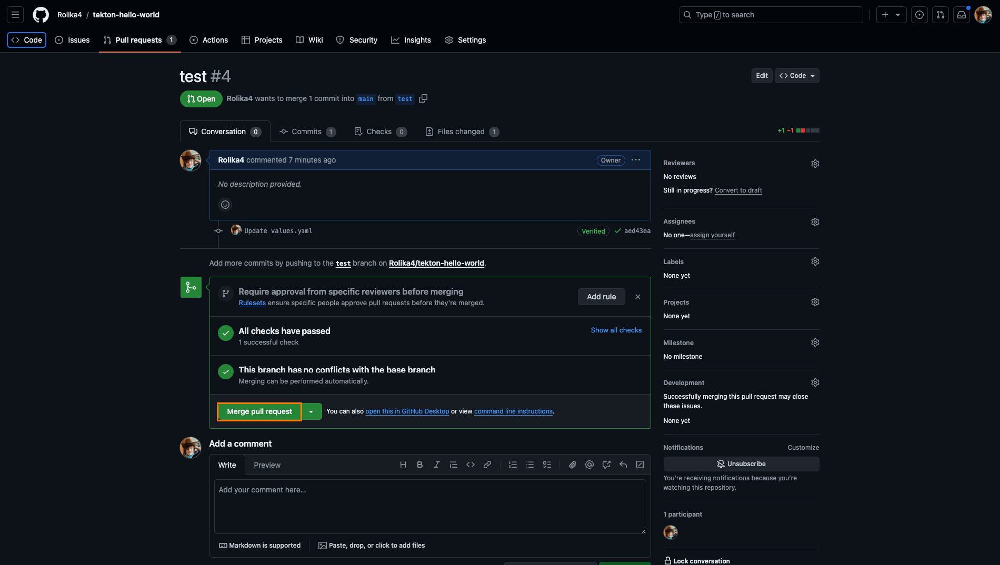

8. Check the pipelines in the KubeRocketCI dashboard:

    

Under the hood, the following process takes place:

1. GitHub sends a payload to the Tekton EventListener when a Merge Request event occurs.
2. The EventListener captures the payload with the assistance of an Interceptor.
3. The TriggerTemplate creates a PipelineRun.

The detailed scheme is shown below:


This chart will be using the core of `common-library` and `pipelines-library` and custom resources on the top of them.

## Related Articles

- [Tekton Overview](../operator-guide/ci/tekton-overview.md)
- [Add Application using KubeRocketCI Portal](../user-guide/add-application.md)
