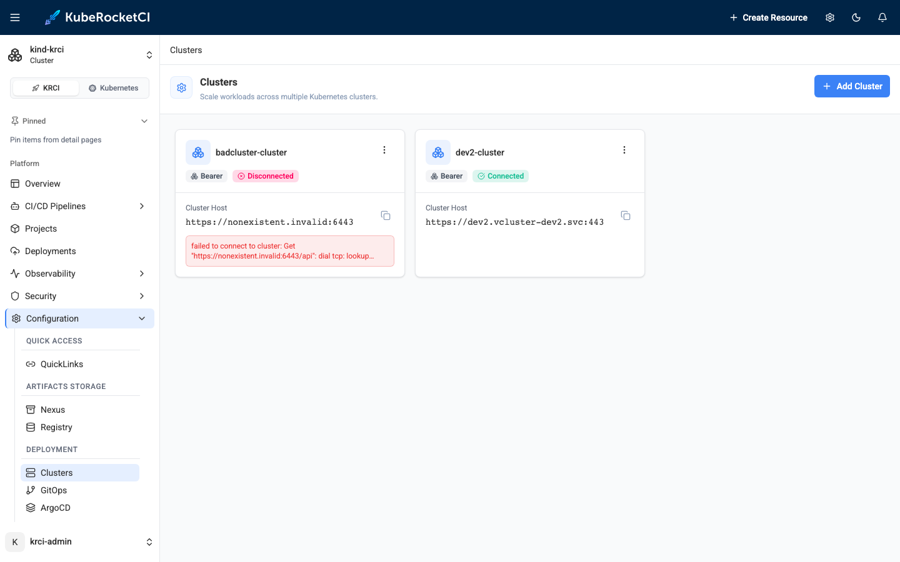

---

title: "Add Cluster"
sidebar_label: "Add Cluster"
description: "Step-by-step guide on integrating external clusters into KubeRocketCI for multi-cluster deployment, enhancing environment segregation and management."

---
<!-- markdownlint-disable MD025 -->

import Tabs from '@theme/Tabs';
import TabItem from '@theme/TabItem';

# Add Cluster

<head>
  <link rel="canonical" href="https://docs.kuberocketci.io/docs/user-guide/add-cluster" />
</head>

This page provides comprehensive instructions on how to integrate an external cluster into the KubeRocketCI workloads. By doing so, it creates an opportunity for users to employ multi-cluster deployment, thereby facilitating the segregation of different environments across various clusters.

<div style={{ display: 'flex', justifyContent: 'center' }}>
<iframe width="560" height="315" src="https://www.youtube.com/embed/3Gm8YLj-0x4" title="Deploying Applications to Remote Kubernetes Clusters with KubeRocketCI and Argo CD" frameborder="0" allow="accelerometer; autoplay; clipboard-write; encrypted-media; gyroscope; picture-in-picture" allowfullscreen="allowfullscreen"></iframe>
</div>

## Prerequisites

Before moving ahead, ensure you have already performed the guidelines outlined in the [Argo CD Integration](../operator-guide/cd/argocd-integration.md#deploy-argo-cd-application-to-remote-cluster-optional) page. Besides, user needs to have a cluster admin role to add clusters.

## Integrate External Cluster

To deploy an application to a remote cluster, follow the steps below:

1. Navigate to **Configuration** -> **Deployment** -> **Clusters** and click the **+ Add cluster** button.

2. In the **Add cluster** window, choose the credentials type and specify the required fields. Click the **Save** button to add the cluster:

    <Tabs
      defaultValue="bearer"
      values={[
        {label: 'Bearer Token', value: 'bearer'},
        {label: 'IRSA', value: 'irsa'},
      ]}>

        <TabItem value="bearer">

            * **Cluster Name**: a unique and descriptive name for the external cluster (e.g., dev2). The platform stores the cluster as a Kubernetes Secret named `<cluster-name>-cluster` — this Secret name is the identifier used in all further configuration steps;
            * **Cluster Host**: the cluster’s Kubernetes API endpoint. The value must be a full HTTPS URL (e.g., `https://example-cluster-domain.com:6443`) — a bare host name without the `https://` scheme does not pass the form validation;
            * **Cluster Token**: a [Kubernetes token](../operator-guide/cd/deploy-application-in-remote-cluster-via-token.md#get-kubernetes-token) with permissions to access the cluster. This token is required for proper authorization;
            * **Skip TLS verification**: allows connect to cluster without cluster certificate verification;
            * **Cluster Certificate**: a Kubernetes certificate essential for authentication. Obtain this certificate from the configuration file of the user account you intend to use for accessing the cluster.

            :::note
              The `Cluster Certificate` field is hidden if the `skip TLS verification` option is enabled.
            :::

        </TabItem>

        <TabItem value="irsa">

            * **Cluster Name**: a unique and descriptive name for the external cluster (e.g., prod);
            * **Cluster Host**: the cluster’s Kubernetes API endpoint. The value must be a full HTTPS URL (e.g., `https://example-cluster-domain.com:6443`) — a bare host name without the `https://` scheme does not pass the form validation;
            * **Certificate Authority Data**: base64-encoded Kubernetes certificate essential for authentication. Obtain this certificate from the configuration file of the user account you intend to use for accessing the cluster;
            * **Role ARN**: arn:aws:iam::\<AWS_ACCOUNT_B_ID\>:role/AWSIRSA_\{cluster_name\}_CDPipelineAgent.

            :::note
              For more details on how to work with clusters integrated using IRSA approach, please refer to the [Deploy Application In Remote Cluster via IRSA](../operator-guide/cd/deploy-application-in-remote-cluster-via-irsa.md) page.
            :::

        </TabItem>
    </Tabs>

3. Wait for the platform to confirm the connection. Clicking **Save** only creates a Kubernetes Secret named `<cluster-name>-cluster` in the platform namespace — the actual connectivity check runs asynchronously in the cd-pipeline-operator (usually under a minute). The cluster card then shows a **Connected** or **Disconnected** badge together with the error message, based on the `app.edp.epam.com/cluster-connected` and `app.edp.epam.com/cluster-error` annotations the operator sets on the Secret. A "Secret has been created" notification does **not** mean the credentials are valid — always wait for the **Connected** badge before proceeding:

    

    :::note
      Add the cluster while the KubeRocketCI platform namespace (e.g., `krci`) is selected in the Portal. The Secret is created in the currently selected namespace, and the operator only processes cluster Secrets in the platform namespace.
    :::

4. As soon as the cluster is connected, open the terminal which has access to the cluster that runs the KubeRocketCI deployment.

5. Open the `krci-config` ConfigMap edit menu using the `kubectl edit` command:

```bash
kubectl edit ConfigMap krci-config -n krci
```

6. In the YAML file, add the `available_clusters` parameter and insert the **Secret name** of the cluster — the cluster name you entered in the Portal with the `-cluster` suffix appended:

    ```yaml title="krci-config ConfigMap"
    data:
      available_clusters: <cluster-name>-cluster
    ```

    :::warning
      The value must exactly match the name of the cluster Secret (`<cluster-name>-cluster` for Bearer clusters), because it becomes the `clusterName` of the Environment (Stage) and is resolved as a Secret name by the cd-pipeline-operator. Using the plain cluster name without the suffix results in an Environment that fails with `failed to get cluster secret: secrets "<cluster-name>" not found`. For clusters added with the IRSA credentials type, use the name **without** the `-cluster` suffix — the operator derives a kubeconfig Secret named `<cluster-name>` from the IRSA configuration. To list several clusters, separate the values with a comma followed by a space, e.g. `available_clusters: dev2-cluster, prod-cluster`.
    :::

7. Ensure the `available_clusters` parameter is added into the config map:

```
kubectl get ConfigMap krci-config -n krci -o yaml
```

## Integrate ArgoCD with External Cluster

To integrate ArgoCD with an external cluster, you need to register the target cluster’s credentials with ArgoCD so that ArgoCD can securely connect to and manage resources in that cluster. This process involves creating a Kubernetes Secret **in the ArgoCD namespace** containing the cluster connection configuration — Argo CD only discovers cluster Secrets in its own control-plane namespace (typically `argocd`); the apps-in-any-namespace feature does not apply to cluster Secrets. Depending on your platform and security requirements, authentication can be configured via a static token or by using an AWS IAM Role for Service Accounts (IRSA).

:::tip
  For clusters added with the Bearer credentials type, the cd-pipeline-operator already generates a ready-to-use Argo CD cluster Secret next to the source Secret in the platform namespace as soon as the connectivity check succeeds. Its name is the cluster Secret name with the `-argocd-cluster` suffix appended: a cluster added as `dev2` is stored as Secret `dev2-cluster` and produces `dev2-cluster-argocd-cluster`. Instead of composing the Secret manually, you can copy that generated Secret into the ArgoCD namespace (keep the `argocd.argoproj.io/secret-type: cluster` label).
:::

:::warning
  The `name` field inside the Secret must exactly match the value you added to `available_clusters` (e.g., `<cluster-name>-cluster`). The Argo CD Applications generated by the platform reference the destination cluster **by name**, taken from the Environment's `clusterName` — if the names differ, deployments fail with a "cluster not found" error. Also make sure the `krci` AppProject allows the new destination, as described in the [Argo CD Integration](../operator-guide/cd/argocd-integration.md#deploy-argo-cd-application-to-remote-cluster-optional) page; otherwise deployments fail with `InvalidSpecError: application destination server '<cluster-name>-cluster' ... do not match any of the allowed destinations`.
:::

Choose the configuration method that matches your external cluster's authentication mechanism and follow the relevant steps below to prepare your cluster for use with ArgoCD.

<Tabs
 defaultValue="token"
 values={[
 {label: 'Static Token', value: 'token'},
 {label: 'IRSA', value: 'irsa'},
 ]}>

  <TabItem value="token">

  ```yaml
  apiVersion: v1
  kind: Secret
  metadata:
    name: <cluster-name>-cluster
    namespace: argocd
    labels:
      argocd.argoproj.io/secret-type: cluster
  type: Opaque
  stringData:
    name: "<cluster-name>-cluster"
    server: "https://EXAMPLED539D4633E53DE1B71EXAMPLE.gr7.<AWS_REGION>.eks.amazonaws.com"
    config: |
      {
        "tlsClientConfig": {
          "insecure": false,
          "caData": ""
        },
        "bearerToken": ""
      }
  ```
  </TabItem>

  <TabItem value="irsa">

  <Tabs
  defaultValue="manifests"
  values={[
  {label: 'Manifests', value: 'manifests'},
  {label: 'External Secrets Operator', value: 'externalsecret'},
  ]}>

    <TabItem value="manifests">

    ```yaml
    apiVersion: v1
    kind: Secret
    metadata:
      name: <cluster-name>-cluster
      namespace: argocd
      labels:
        argocd.argoproj.io/secret-type: cluster
    stringData:
      config: |
        {
          "awsAuthConfig": {
            "clusterName": "<cluster-name>",
            "roleARN": "arn:aws:iam::<AWS_ACCOUNT_A_ID>:role/AWSIRSA_{cluster_name}_ArgoCDMaster"
          },
          "tlsClientConfig": {
            "insecure": false,
            "caData": "<Base64-encoded CA certificate of the target cluster>"
          }
        }
      name: "<cluster-name>"
      server: "https://EXAMPLED539D4633E53DE1B71EXAMPLE.gr7.<AWS_REGION>.eks.amazonaws.com"
    ```
    </TabItem>

    <TabItem value="externalsecret">

    ```json
    "<cluster-name>-cluster": {
      "config": {
        "awsAuthConfig": {
          "clusterName": "<cluster-name>",
          "roleARN": "arn:aws:iam::<AWS_ACCOUNT_B_ID>:role/AWSIRSA_{cluster_name}_ArgoCDMaster"
        },
        "tlsClientConfig": {
          "insecure": false,
          "caData": "<Base64-encoded CA certificate of the target cluster>"
        }
      },
      "name": "<cluster-name>",
      "server": "https://EXAMPLED539D4633E53DE1B71EXAMPLE.gr7.<AWS_REGION>.eks.amazonaws.com"
    }
    ```
    </TabItem>
  </Tabs>

  </TabItem>
</Tabs>

After applying the configuration, you can verify the cluster connection `ArgoCD` -> `Settings` -> `Clusters` -> `<cluster-name>`.

## Deploy application on new cluster

To create a Deployment with an Environment, follow the instructions specified in the [Add Deployment](./add-cd-pipeline.md) page.

When creating an Environment, specify your new cluster name in the **Cluster** field.

## Remove External Cluster

To disconnect an external cluster from the platform, remove the resources in the following order:

1. Delete (or migrate) all Environments that reference the cluster.
2. Remove the cluster name from the `available_clusters` parameter in the `krci-config` ConfigMap.
3. Delete the cluster in the Portal (**Configuration** -> **Deployment** -> **Clusters**) — this deletes the cluster Secret together with the generated Argo CD Secret owned by it.
4. Delete the Argo CD cluster Secret you created in the ArgoCD namespace and remove the destination from the `krci` AppProject.

:::warning
  Always delete Environments **before** the cluster Secret. If the Secret is removed first, the cd-pipeline-operator can no longer reach the cluster during Environment deletion and skips the remote cleanup, leaving orphaned namespaces and RBAC objects on the external cluster.
:::

## Related Articles

* [Argo CD Integration](../operator-guide/cd/argocd-integration.md)
* [Add Application](add-application.md)
* [Add Library](add-library.md)
* [Add Autotest](add-autotest.md)
* [Add Deployment Flow](add-cd-pipeline.md)
