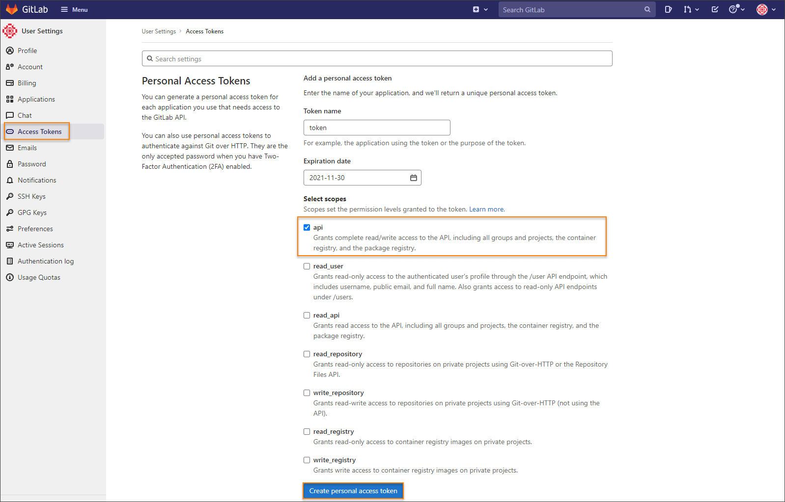
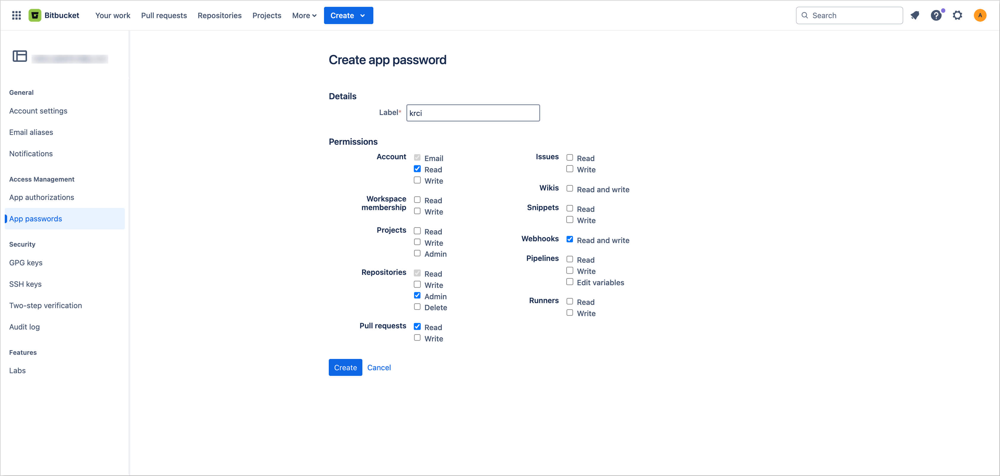
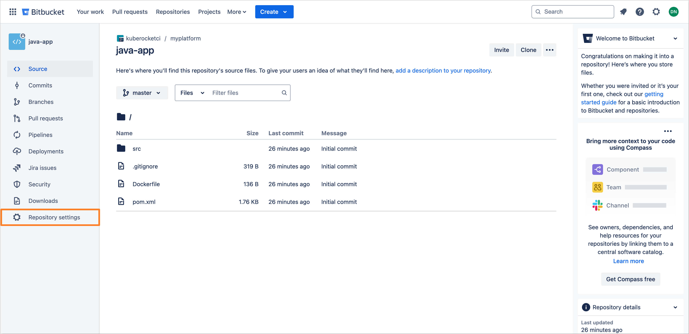

import Tabs from '@theme/Tabs';
import TabItem from '@theme/TabItem';

# Add Git Server

This guide outlines the steps for integrating KubeRocketCI with GitLab, GitHub, or Bitbucket, enabling seamless CI/CD workflows across these version control platforms.

<div style={{ display: 'flex', justifyContent: 'center' }}>
<iframe width="560" height="315" src="https://www.youtube.com/embed/pzheGwBLZvU" title="Install KubeRocketCI via Civo" frameborder="0" allow="accelerometer; autoplay; clipboard-write; encrypted-media; gyroscope; picture-in-picture" allowfullscreen="allowfullscreen"></iframe>
</div>

## Integration Procedure

To start from, it is required to add both Secret with SSH key, API token, and GitServer resources by taking the steps below.

1. Generate an SSH key pair and add a public key to your [GitLab](https://docs.gitlab.com/ee/user/ssh.html), [GitHub](https://docs.github.com/en/authentication/connecting-to-github-with-ssh/generating-a-new-ssh-key-and-adding-it-to-the-ssh-agent), or [Bitbucket](https://support.atlassian.com/bitbucket-cloud/docs/configure-ssh-and-two-step-verification) account.

    ```bash
    ssh-keygen -t ed25519 -C "email@example.com"
    ```

2. Generate access token for [GitLab](https://docs.gitlab.com/ee/user/profile/personal_access_tokens.html) or [GitHub](https://docs.github.com/en/authentication/keeping-your-account-and-data-secure/creating-a-personal-access-token) account with read/write access to the API. Both personal and project access tokens are applicable.
For [Bitbucket](https://support.atlassian.com/bitbucket-cloud/docs/app-passwords), generate an App Password with the necessary permissions to interact with the repository.

    <Tabs
      defaultValue="github"
      values={[
        {label: 'GitHub', value: 'github'},
        {label: 'GitLab', value: 'gitlab'},
        {label: 'Bitbucket', value: 'bitbucket'}
      ]}>

      <TabItem value="github">
      To create access token in GitHub, follow the steps below:

      * Log in to GitHub.
      * Click the profile account and navigate to **Settings** -> **Developer Settings**.
      * Select *Personal access tokens (classic)* and generate a new token with the following parameters:

        

      :::note
        The access below is required for the codebase operator to setup hooks.
      :::

      
      
      

      :::warning
        Make sure to save a new personal access token because it won`t be displayed later.
      :::
      </TabItem>

      <TabItem value="gitlab">
      To create access token in GitLab, follow the steps below:

      * Log in to GitLab.
      * In the top-right corner, click the avatar and select **Settings**.
      * On the **User Settings** menu, select **Access Tokens**.
      * Choose a name and an optional expiry date for the token.
      * In the **Scopes** block, select the **api** scope for the token.

        

      * Click the **Create personal access token** button.

      :::note
        Make sure to save the access token as there will not be any ability to access it once again.
      :::

      In case you want to create a project access token instead of a personal one, take the following steps:

      * Log in to GitLab and navigate to the project.
      * On the **User Settings** menu, select *Access Tokens*.
      * Choose a name and an optional expiry date for the token.
      * Choose a role: *Owner* or *Maintainer*.
      * In the **Scopes** block, select the *api* scope for the token.

        

      * Click the **Create project access token** button.
      </TabItem>

      <TabItem value="bitbucket">
      To create an App Password in Bitbucket, follow the steps below:

      * Log in to Bitbucket.
      * In the top navigation bar, click the **Settings** icon located in the upper-right corner.
      * Navigate to **Personal settings** and select **Personal Bitbucket settings**.
      * In the left-hand sidebar, click on **App passwords**.
      * Choose **Create app password**.
      * Provide a meaningful name for the App Password.
      * Specify the required permissions by selecting the appropriate checkboxes.

        

      * Click **Create** to generate the App Password. A dialog box will display the new password.
      * Copy the App Password and securely store it. You will not be able to see it again.
      </TabItem>
    </Tabs>

3. Create a secret in the namespace where KubeRocketCI is installed (default is `edp`) to store the Git account credentials, including the **id_rsa**, **username**, and **token** fields.

   :::note
   For integration with **Bitbucket**, the **token** field should be populated with the App Password.
   :::

    <Tabs
      defaultValue="portal"
      values={[
        {label: 'UI Portal', value: 'portal'},
        {label: 'kubectl', value: 'kubectl'}
      ]}>

      <TabItem value="portal">
      Navigate to **Configuration** -> **Version Control System**. Fill in the required fields:

      
      </TabItem>

      <TabItem value="kubectl">

      :::warning
        Take the following template as an example (for the name use `ci-gitlab` for GitLab, `ci-github` for GitHub, and `ci-bitbucket` for Bitbucket):
      :::

      Create a manifest file called `secret.yaml` with the following content filled in:

      ```bash
      kubectl apply -f - <<EOF
        apiVersion: v1
        kind: Secret
        metadata:
          name: ci-github
          namespace: edp
          labels:
            app.edp.epam.com/secret-type: repository
        type: Opaque
        stringData:
          id_rsa: <id_rsa_data>
          username: git
          token: <your_github_access_token>
      EOF

      ```

      </TabItem>
    </Tabs>

As a result, you will be able to create codebases using an integrated Version Control System.

## Bitbucket Default Branch Management

When onboarding components via KubeRocketCI with Bitbucket as the Git Server, Bitbucket automatically creates a `master` branch as the default, regardless of the branch specified during component creation (e.g., `main`). This may result in inconsistencies with the expected default branch.

To change the default branch from `master` to desired branch in Bitbucket, follow these steps:

* Log in to Bitbucket.
* Navigate to the repository where the default branch needs to be changed.
* In the left sidebar menu, select **Repository Settings**.

  

* Proceed to the **Advanced** section. Locate the **Main branch** field and select your desired branch to set it as the default.

  

* Click **Save changes** to apply your modifications.

## Advanced Configuration: Using a Custom Webhook URL

Custom Webhook URL configuration is effectively utilized in Kubernetes clusters facing specific restrictions on traffic routing or requiring customized webhook event handling. Beyond the conventional Ingress, alternative traffic routing solutions such as Service Mesh (e.g., Istio), NodePort services, or external Load Balancers can be employed to manage traffic into the cluster, offering flexibility in addressing diverse networking policies and security requirements.

:::warning
  When deploying a custom webhook URL, it's important to note that the KubeRocketCI platform does not automatically handle the Ingress and the Tekton EventListener.
:::

User is responsible for the following action:

* **Ingress Traffic Routing:** The configuration and management of Ingress for custom webhook URL. This entails ensuring that the custom URL is configured to accept incoming traffic and webhook events from your VCS (e.g., GitHub, GitLab). It's essential that your networking setup, including firewalls and DNS, allows your git hosting service to reach the specified URL endpoint.

* **Tekton EventListener Setup:** The creation and configuration of the Tekton EventListener, which processes webhook events directed to the custom URL. This setup involves defining the EventListener to capture and handle events from your VCS, triggering the necessary CI/CD pipelines within KubeRocketCI based on these events.

For more information on setting up a Ingress and Tekton EventListener for custom webhook URL, refer to the [Helm Chart](https://github.com/epam/edp-tekton/tree/release/0.12/charts/pipelines-library/templates/resources/gitservers).

## Related Articles

* [Add Application](add-application.md)
