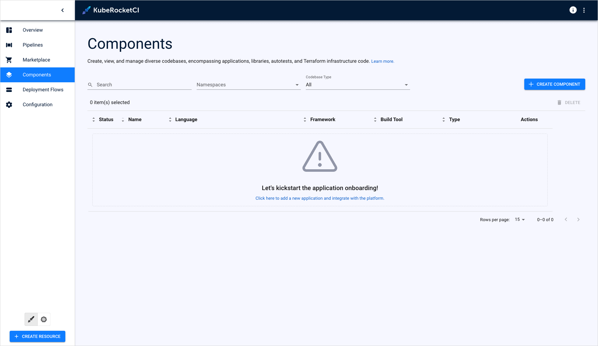
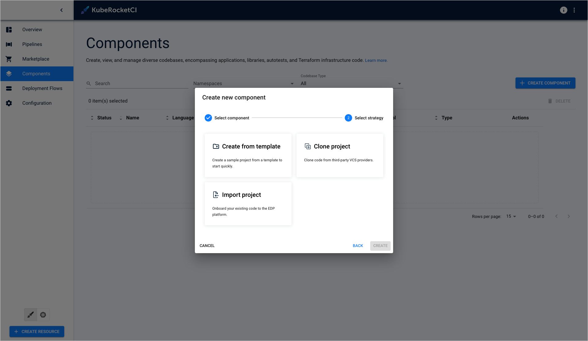
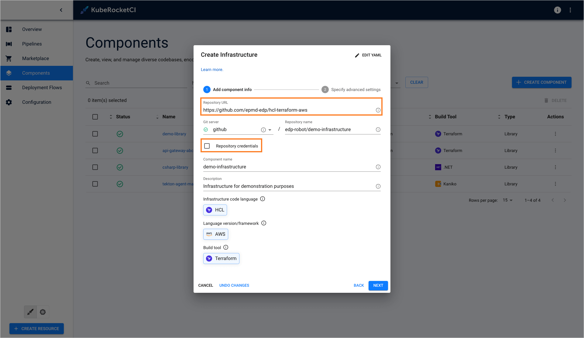
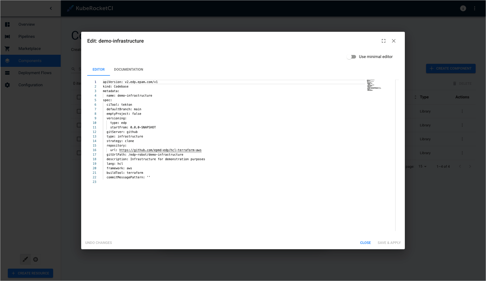
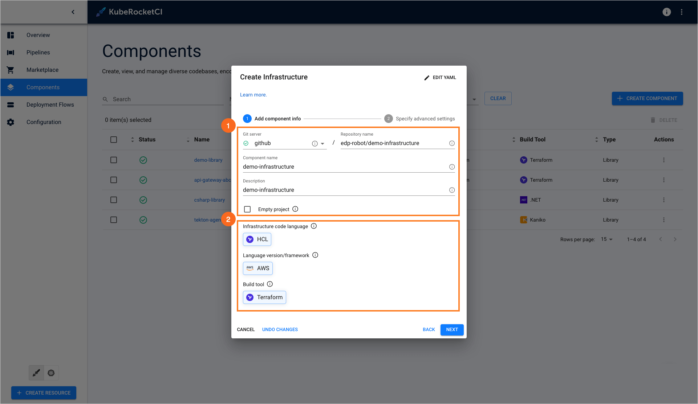
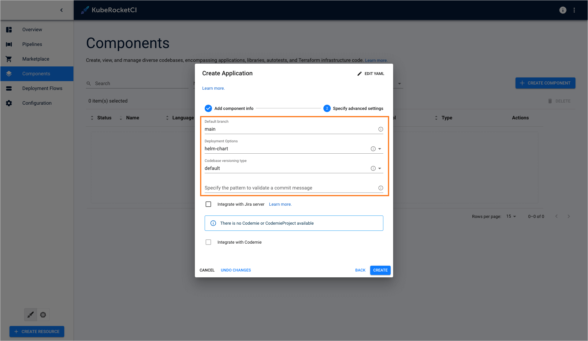
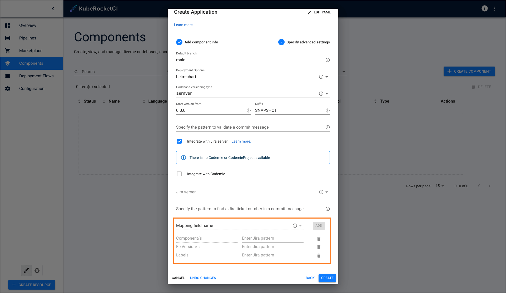

---

title: "Add Infrastructure"
sidebar_label: "Add Infrastructure"
description: "Learn how to add, clone, and import infrastructure projects in KubeRocketCI, automating resource creation in the cloud for robust development."

---
<!-- markdownlint-disable MD025 -->

# Add Infrastructure

<head>
  <link rel="canonical" href="https://docs.kuberocketci.io/docs/user-guide/add-infrastructure" />
</head>

KubeRocketCI portal allows you to create an application, clone an existing repository with the application to your Version Control System (VCS), or using an external repository and importing an application to the environment.
When an application is created or cloned, the system automatically generates a corresponding repository within the integrated Version Control System. The functionality of the Infrastructure codebase type is to create resources in cloud provider. You can create an Infrastructure [in YAML](#create-infrastructure-in-yaml) or [via the two-step menu](#create-infrastructure-via-ui) in the dialog.

To add an infrastructure, navigate to the **Components** section on the navigation bar and click **+ Create component**:

  

Once clicked, the **Create new component** dialog will appear. Select **Infrastructure** and click **Next**:

  

Choose one of the strategies and click **Create**:

  

In the **Create new component** menu, select the necessary configuration strategy. The choice will define the parameters you will need to specify:

* **Create from template** – creates a project on the pattern in accordance with an infrastructure language, a build tool, and a framework.

* **Import project** - allows using existing VCS repository to integrate with KubeRocketCI. While importing the existing repository, select the Git server from the drop-down list and define the relative path to the repository, such as `epmd-edp/python-python-flask`.

  :::note
    In order to use the **Import project** strategy, make sure to adjust it with the [Integrate GitLab/GitHub With Tekton](../user-guide/add-git-server.md) page.
  :::

* **Clone project** – clones the indicated repository into KubeRocketCI. While cloning the existing repository, it is required to fill in the **Repository URL** field and specify the **Repository credentials** field if needed:

  

## Create Infrastructure in YAML

Click **Edit YAML** in the upper-right corner of the **Create Infrastructure** dialog to open the YAML editor and create the Infrastructure.

To edit YAML in the minimal editor, turn on the **Use minimal editor** toggle in the upper-right corner of the **Create Infrastructure** dialog.

To save the changes, select the **Save & Apply** button.

## Create Infrastructure via UI

The **Create Infrastructure** dialog contains the two steps:

* The Codebase Info Menu
* The Advanced Settings Menu

### Codebase Info Menu

In our example, we will use the **Create from template** strategy.

1. Select all the settings that define how the infrastructure will be added to Git server:

    

    * **Git server** - the pre-configured server where the component will be hosted. Select one from the from the drop-down list. Please refer to the [Manage Git Servers](git-server-overview.md) page to learn how to create the one.
    * **Repository name** - the relative path to the repository, such as `epmd-edp/python-python-flask`.
    * **Component name** - the name of the infrastructure. Must be at least two characters using the lower-case letters, numbers and inner dashes.
    * **Description** - brief and concise description that explains the purpose of the infrastructure.
    * **Empty project** - check this box to create a infrastructure with an empty repository. The empty repository option is available only for the **Create from template** strategy.

2. Specify the infrastructure language properties:

    * **Infrastructure code language** - defines the code language with its supported frameworks.
    * **Language version/framework** - defines the specific framework or language version of the infrastructure. The field depends on the selected code language.
    * **Build Tool** - allows to choose the build tool to use. A set tools and can be changed in accordance with the selected code language.

### Advanced Settings Menu

In the **Advanced Settings** menu, specify the branch options and define the Jira settings:

  

Follow the instructions below to fill in the fields of the **Advanced Setting** menu:

* **Default branch** - the name of the branch where you want the development to be performed.

  :::note
    The default branch cannot be deleted.
  :::

* **Codebase versioning type** - defines how will the infrastructure tag be changed once the new image version is built. There are two versioning types:
  * **default**: Using the `default` versioning type, in order to specify the version of the current artifacts, images, and tags in the Version Control System, a developer should navigate to the corresponding file and change the version **manually**.
  * **semver**: Using the `semver` versioning type, a developer indicates the version number from which all the artifacts will be versioned and, as a result, **automatically** registered in the corresponding file (e.g. pom.xml). When selecting the `semver` versioning type, the extra fields will appear, type the version number from which you want the artifacts to be versioned:

    

    :::note
      The **Start Version From** field should be filled out in compliance with the semantic versioning rules, e.g. 1.2.3 or 10.10.10. Please refer to the [Semantic Versioning](https://semver.org/) page for details.
    :::

* **Specify the pattern to validate a commit message** - the regular expression used to indicate the pattern that is followed on the project to validate a commit message in the code review pipeline. An example of the pattern: `^[PROJECT_NAME-d{4}]:.*$`.

  

* **Integrate with Jira server** - this check box is used in case it is required to connect Jira tickets with the commits and have a respective label in the **Fix Version** field.

  :::note
    To adjust the Jira integration functionality, first apply the necessary changes described on the [Adjust Jira Integration](../operator-guide/project-management-and-reporting/jira-integration.md) page.
  :::

* **Jira Server** - the integrated Jira server with related Jira tasks.

* **Specify the pattern to find a Jira ticket number in a commit message** - based on this pattern, the value from KubeRocketCI will be displayed in Jira.

  

* **Mapping field name** - the section where the additional Jira fields are specified the names of the Jira fields that should be filled in with attributes from KubeRocketCI:

  * Select the name of the field in a Jira ticket. The available fields are the following: _Fix Version/s_, _Component/s_ and _Labels_.

  * Click the **Add** button to add the mapping field name.

  * Enter Jira pattern for the field name:

    * For the **Fix Version/s** field, select the **EDP_VERSION** variable that represents an EDP upgrade version, as in _2.7.0-SNAPSHOT_.Combine variables to make the value more informative. For example, the pattern **EDP_VERSION-EDP_COMPONENT** will be displayed as _2.7.0-SNAPSHOT-nexus-operator_ in Jira.
    * For the **Component/s** field select the **EDP_COMPONENT** variable that defines the name of the existing repository. For example, _nexus-operator_.
    * For the **Labels** field select the **EDP_GITTAG**variable that defines a tag assigned to the commit in Git Hub. For example, _build/2.7.0-SNAPSHOT.59_.

  * Click the bin icon to remove the Jira field name.

Click the **Apply** button to add the infrastructure to the Components list.

:::note
  After the complete adding of the application, inspect the [Manage Infrastructures](infrastructure.md) page to learn how you can operate with infrastructure codebase types.
:::

## Related Articles

* [Application Overview](application.md)
* [Add CD Pipelines](add-cd-pipeline.md)
* [Adjust Jira Integration](../operator-guide/project-management-and-reporting/jira-integration.md)
