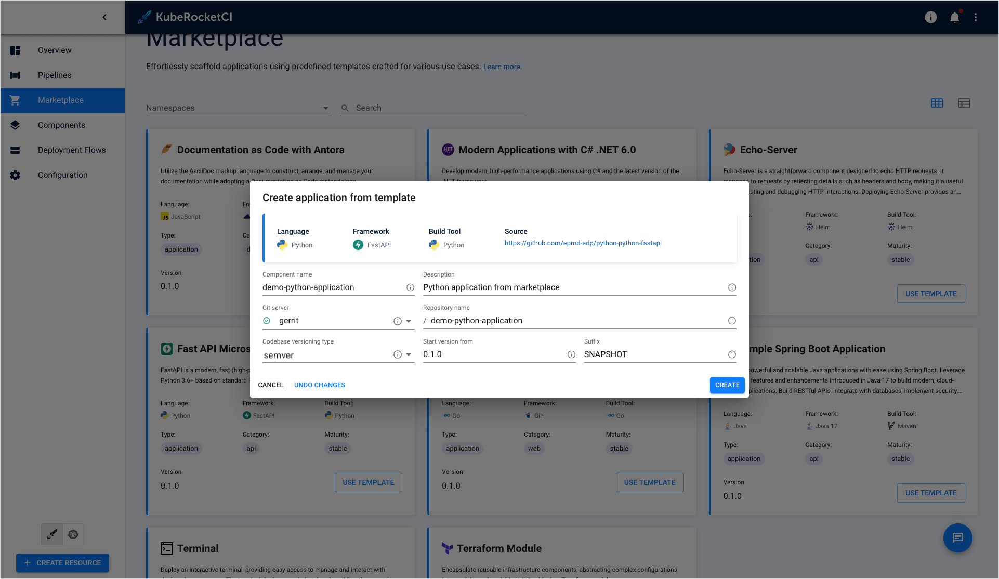
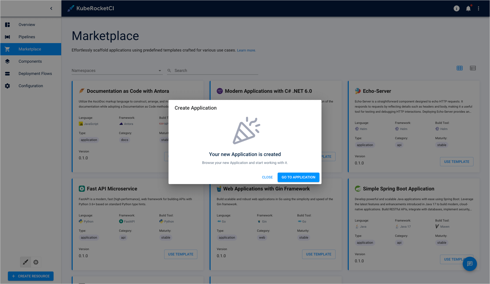

---

title: "Create Component via Marketplace"
sidebar_label: Create Component via Marketplace
description: "This page contains detailed guidelines on how to easily create a new application by clicking several buttons with the help of the Marketplace feature."

---
<!-- markdownlint-disable MD025 -->

# Create Component via Marketplace

<head>
  <link rel="canonical" href="https://docs.kuberocketci.io/docs/user-guide/add-marketplace" />
</head>

With the built-in Marketplace, users can easily create a new application by clicking several buttons. This page contains detailed guidelines on how to create a new component with the help of the Marketplace feature.

## Add Component

To create a component from template, follow the instructions below:

1. Navigate to the **Marketplace** section on the navigation bar to see the Marketplace overview page.

2. Choose the component and click **Use template**.

3. View the template details and click **Proceed**:

    

4. Fill in the required fields and click **Create**:

    

5. Click the **Go to application** button to open the application details:

    

6. As a result, new component will appear in the **Components** section:

    

## Related Articles

* [Marketplace Overview](marketplace.md)
* [Add Application](add-application.md)
* [Add Library](add-library.md)
* [Add Infrastructure](add-infrastructure.md)
