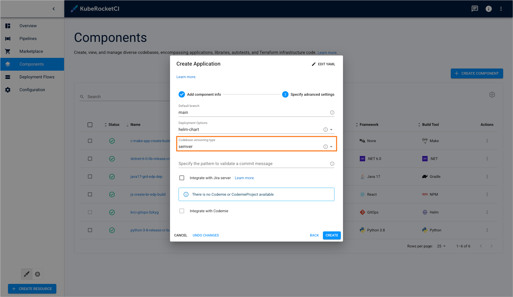
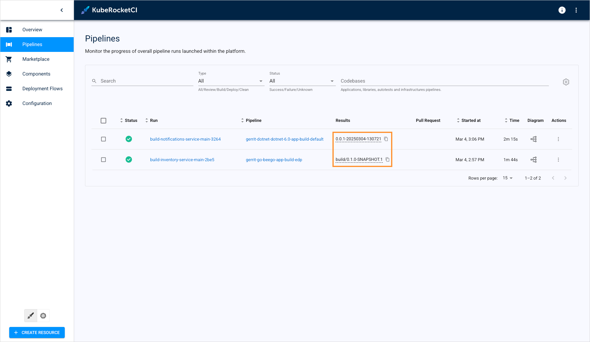
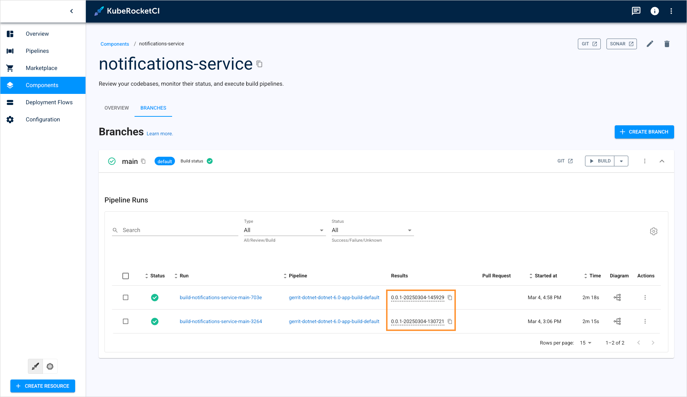
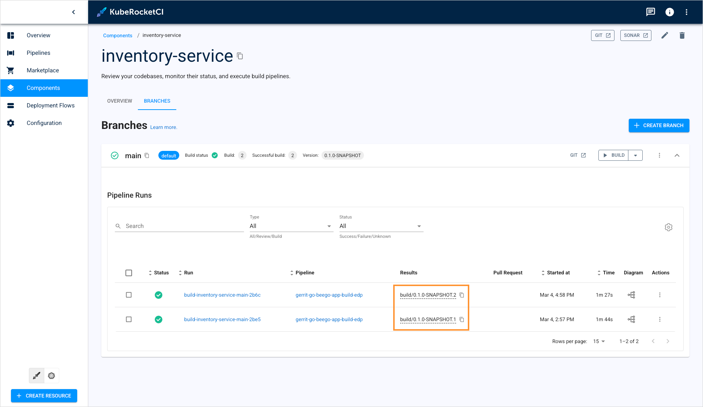
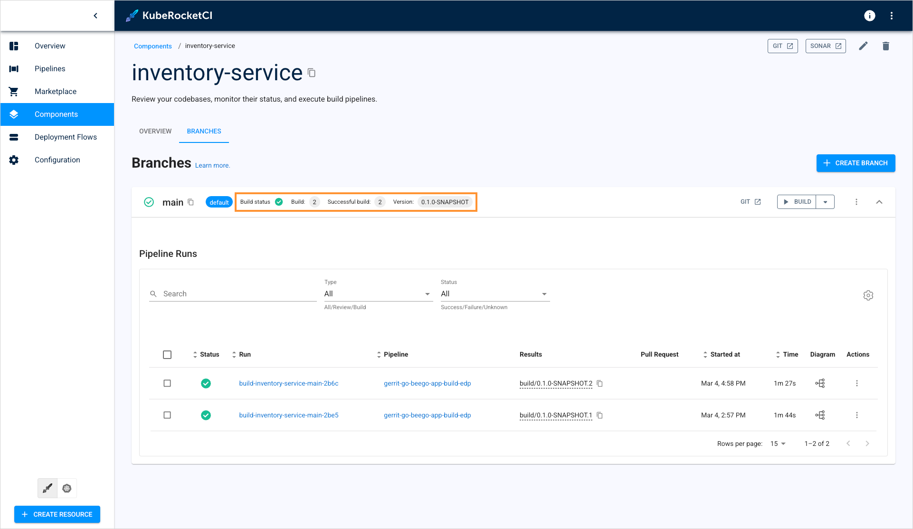
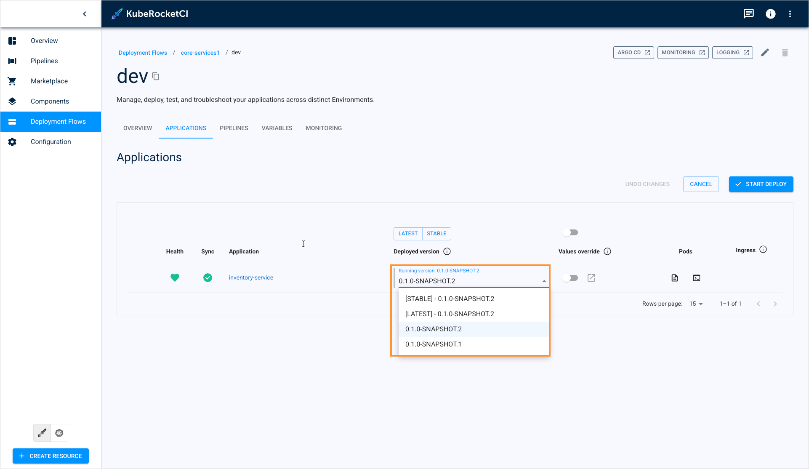

<!-- markdownlint-disable MD025 -->

# Artifact Versioning in KubeRocketCI

<head>
  <link rel="canonical" href="https://docs.kuberocketci.io/docs/user-guide/artifact-versioning" />
</head>

This page describes artifact versioning types in KubeRocketCI, outlining their differences and versioning patterns.

Artifact versioning in KubeRocketCI is designed to ensure each build and deployment can be uniquely identified, managed, and traced back to its source.

Artifact versioning is defined for every codebase individually when creating a codebase:

  

A new application version appears when a build pipeline run completes successfully. A successfully built artifact is marked with the new version once the `git-tag`, `update-cbb`, and `update-cbis` steps complete successfully:

  

Application version can also be seen in the pipeline that built the version:

  

## Versioning Types

KubeRocketCI supports two versioning types: default and semver. They offer different patterns for tagging codebases.

### Default Versioning

Default versioning generates versions based on the branch name and datetime, e.g. (`BRANCH-DATETIME`):

  

### Semantic Versioning

Semantic versioning (semver) structures versions as `MAJOR.MINOR.PATCH-BUILD_ID`, based on the [semantic versioning standards](https://semver.org/):

  

Several other resources are also involved in managing semantic versioning.

The first resource is **CodebaseBranch**. It contains data major version and build number for a specific branch. Besides, it contains codebase versioning-related data, including:

- **Version History**: A record of all versions generated from the branch.
- **Build Information**: Details of the current and most recent successful builds, which may include version identifiers.

**CodebaseBranch** data is displayed in the codebase details page:

  

The second resource is **CodebaseImageStream**. It contains application container versions built for container registry. The available container versions are displayed in the environment details page when deploying an application:

  

## Custom Versioning

User can adjust artifact versioning pattern by updating [`get-version`](https://github.com/epam/edp-tekton/tree/master/charts/pipelines-library/templates/tasks/getversion) CI step to address your personal needs.

## Related Articles

* [Add Application](add-application.md)
* [Add Cluster](add-cluster.md)
* [Manage GitOps](gitops.md)
* [Manage Registries](manage-container-registries.md)
