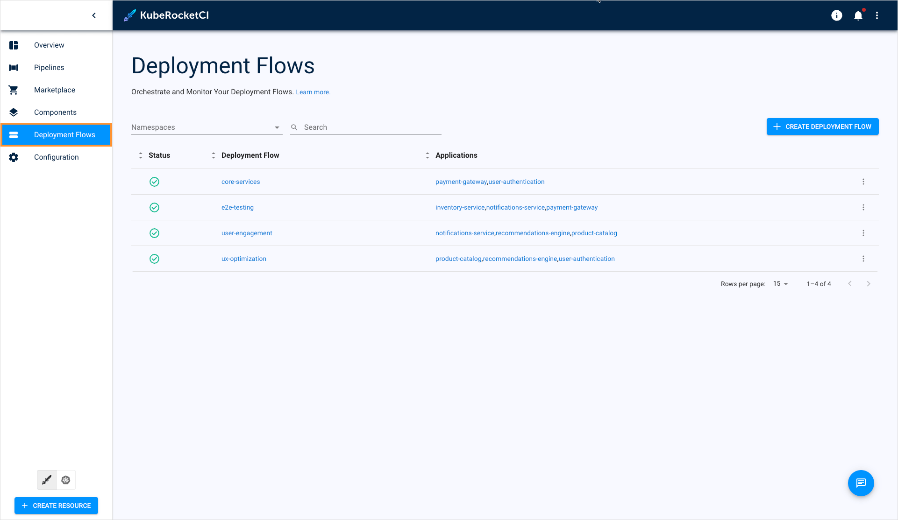
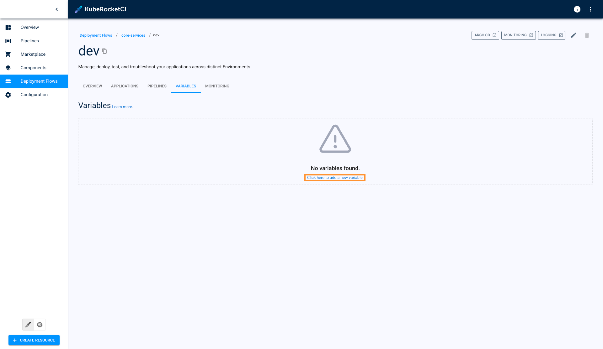
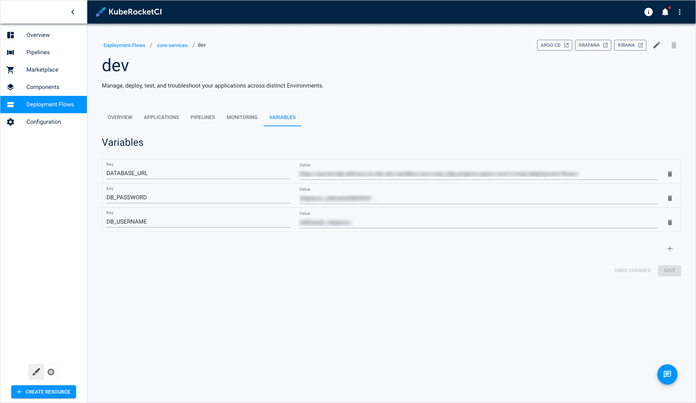
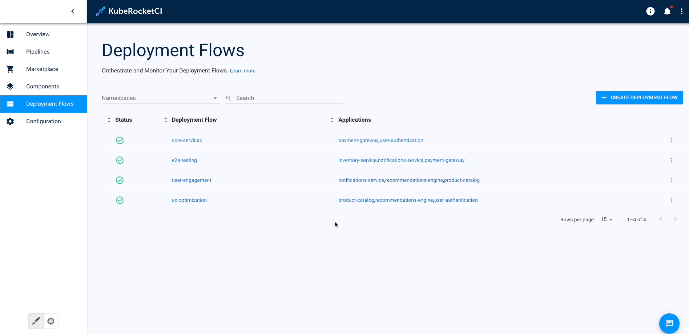

---

title: "Inject Variables Into Deploy Pipelines"
sidebar_label: "Inject Variables Into Deploy Pipelines"
description: "Explore variable injection in KubeRocketCI deploy pipelines for dynamic configuration, secure data management, and efficient automated testing."

---
<!-- markdownlint-disable MD025 -->

# Inject Variables Into Deploy Pipelines

<head>
  <link rel="canonical" href="https://docs.kuberocketci.io/docs/user-guide/cd-pipeline-variables-injection" />
</head>

KubeRocketCI offers a robust set of features to build highly customizable CI/CD workflows. One of the key features is variable injection, which enables the parametrization of deploy pipelines.
This capability is particularly valuable for running multiple automated tests simultaneously and efficiently. Below are some key use cases where variable injection can be beneficial:

1. Redefining environment-specific configurations.
2. Securely managing sensitive information such as API keys, tokens, and passwords.
3. Implementing feature toggles to enable or disable various tasks and checks.
4. Dynamically configuring application behavior based on deployment contexts.

By leveraging variable injection, developers can ensure smoother deployments, enhance security, and improve operational efficiency.

## Prerequisites

Before proceeding, ensure you have created the following resources:

1. [Codebase](../user-guide/add-application.md);
2. [Deployment Flow](../user-guide/add-cd-pipeline.md);
3. [Environment](../user-guide/manage-environments.md#add-a-new-environment).

Additionally, customize your deploy pipeline to utilize parameters efficiently. To learn more about creating custom deploy pipelines, read the [Customize Deploy Pipeline](../operator-guide/cd/customize-deploy-pipeline.md) page.

## Add Key-Value Variable

To add a key-value variable in deploy pipelines, follow the steps below:

1. Navigate to the **KubeRocketCI portal** -> **Deployment Flows**:

  

2. Enter your deployment flow and then enter the environment you need to add a variable to. In the environment details page, select the **Variables** tab. Click the **+** button to add a variable:

  

3. Specify the variables and click **Save**:

  

4. Verify that the deploy pipeline uses your variables:

  

## Related Articles

* [Customize Deploy Pipeline](../operator-guide/cd/customize-deploy-pipeline.md)
* [Add Deployment Flow](../user-guide/add-cd-pipeline.md)
* [Manage Deployment Flows](../user-guide/manage-environments.md)
