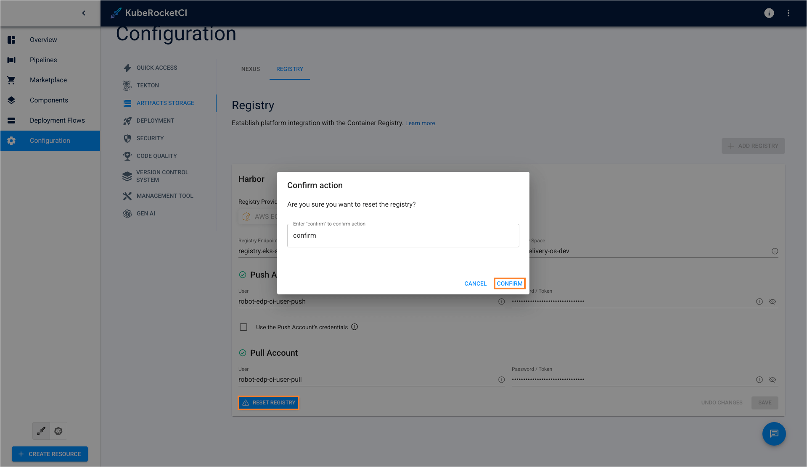

---

title: "Change Container Registry"
sidebar_label: "Change Container Registry"
description: "Guidelines for transitioning to a different container registry within KubeRocketCI, ensuring smooth updates for both new and existing components."

---
<!-- markdownlint-disable MD025 -->

# Change Container Registry

<head>
  <link rel="canonical" href="https://docs.kuberocketci.io/docs/user-guide/change-container-registry" />
</head>

Modifying container registry settings may be necessary. This section provides clear guidelines for transitioning to a different registry.

:::warning
  Removing registry settings may disrupt your CI/CD process. New components created after changing the registry, including Components and Environments, will seamlessly function. However, existing 'Components' require additional steps, as outlined below.
:::

## Reset Container Registry

To reset container registry integration from the KubeRocketCI, follow the steps below:

  1. In the KubeRocketCI main menu, navigate to **Configuration** -> **Artifacts storage** -> **Registry**.

  2. Click the **Reset registry** button, type the `confirm` word and then click **Confirm**:

      

## Update Registry for the Existing Components and Environments

KubeRocketCI uses `CodebaseImageStream` custom resource to define Container Registry settings for the codebases. To update the registry for the existing codebases, follow the steps below:

1. List all the existing `CodebaseImageStream` CR(s) and copy their `<name>` and `<codebase name>` fields:

    ```bash
      kubectl get codebaseimagestream -n edp
    ```

2. Patch the `CodebaseImageStream` CR(s) using the commands for the registry you switched to:

    * AWS ECR:

      ```bash
      kubectl patch codebaseimagestream <name> -n edp --type='json' -p='[{"op": "replace", "path": "/spec/imageName", "value": "<Registry Endpoint>/<Registry Space>/<codebase name>"}]'
      ```

    * DockerHub

      ```bash
      kubectl patch codebaseimagestream <name> -n edp --type='json' -p='[{"op": "replace", "path": "/spec/imageName", "value": "dockerhub.io/<User>/<codebase name>"}]'
      ```

    * Harbor

      ```bash
      kubectl patch codebaseimagestream <name> -n edp --type='json' -p='[{"op": "replace", "path": "/spec/imageName", "value": "<Registry Endpoint>/<Registry Space>/<codebase name>}]'
      ```

    * Nexus

      ```bash
      kubectl patch codebaseimagestream <name> -n edp --type='json' -p='[{"op": "replace", "path": "/spec/imageName", "value": "<Registry Endpoint>/<Registry Space>/<codebase name>}]'
      ```

If necessary, update the registry credentials for the existing `CD pipelines` by copying the `regcred` secret from the `edp` namespace to all the namespaces managed by the platform. To get the list of the namespaces, run the following command:

```bash
kubectl get stages -n edp -o jsonpath='{range .items[*]}{.spec.namespace}{"\n"}{end}'
```

## Related Articles

* [Manage Registries](./manage-container-registries.md)
* [Integrate Harbor With KubeRocketCI Pipelines](../operator-guide/artifacts-management/harbor-integration.md)
* [Integrate Docker](../quick-start/integrate-container-registry.md)
