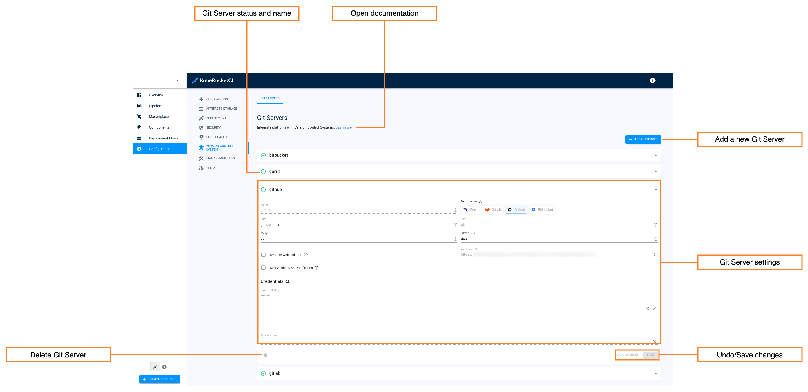
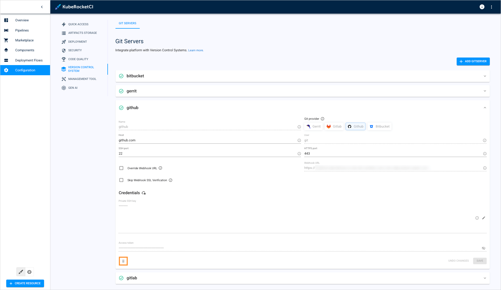
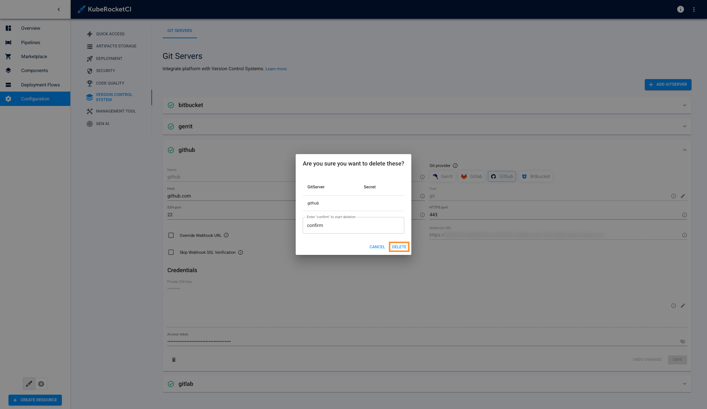

---

title: "Manage Git Servers"
sidebar_label: "Manage Git Servers"
description: "Discover how to manage Git Server integrations in KubeRocketCI for seamless Version Control System connectivity, ensuring streamlined workflows."

---
<!-- markdownlint-disable MD025 -->

import Tabs from '@theme/Tabs';
import TabItem from '@theme/TabItem';

# Manage Git Servers

<head>
  <link rel="canonical" href="https://docs.kuberocketci.io/docs/user-guide/git-server-overview" />
</head>

Git Server is responsible for integration with Version Control System, whether it is GitHub, GitLab, Bitbucket, or Gerrit.

<div style={{ display: 'flex', justifyContent: 'center' }}>
<iframe width="560" height="315" src="https://www.youtube.com/embed/pzheGwBLZvU" title="YouTube video player" frameborder="0" allow="accelerometer; autoplay; clipboard-write; encrypted-media; gyroscope; picture-in-picture" allowfullscreen="allowfullscreen"></iframe>
</div><br />

The Git Server is set via the **global.gitProviders** parameter of the [values.yaml](https://github.com/epam/edp-install/blob/release/3.9/deploy-templates/values.yaml#L12) file.

To view the current Git Server, you can open Portal **Configuration** -> **Git Servers** and inspect the following properties:



* **Git Server status and name** - displays the Git Server status, which depends on the Git Server integration status (Success/Failed).
* **Git Server properties** - displays the Git Server type, its host address, username, SSH/HTTPS port, public and private SSH keys.
* **Open documentation** - opens the "Manage Git Servers" documentation page.
* **Undo/Save changes** - these buttons apply or revert changes made to the Git Server.
* **Add a new Git Server** - add a new blank to specify the new Git Server's parameters.
* **Delete a Git Server** - deletes the Git Server after confirmation.

## View Authentication Data

To view authentication data that is used to connect to the Git server, use `kubectl describe` command as follows:

  ```bash
  kubectl describe GitServer git_server_name -n krci
  ```

## Delete Git Server

There are two ways for deleting Git server: using KubeRocketCI portal or CLI.

    <Tabs
      defaultValue="portal"
      values={[
        {label: 'Portal', value: 'portal'},
        {label: 'CLI', value: 'cli'}
      ]}>

        <TabItem value="portal">

          To delete a Git server using KubeRocketCI portal, follow the steps below:

          1. Navigate to **KubeRocketCI portal** -> **Configuration** -> **Version Control System**.

          2. In the **Version Control System** tab, click the bin icon:

          

          3. In the confirmation window, enter **confirm** and click **Delete**.

          

        </TabItem>

        <TabItem value="cli">

          To remove a Git Server from the Git Servers list, utilize the `kubectl delete` command as follows:

            ```bash
            kubectl delete GitServer git_server_name -n krci
            ```

        </TabItem>

    </Tabs>

## Related Articles

* [Add Git Server](add-git-server.md)
* [Add Application](add-application.md)
