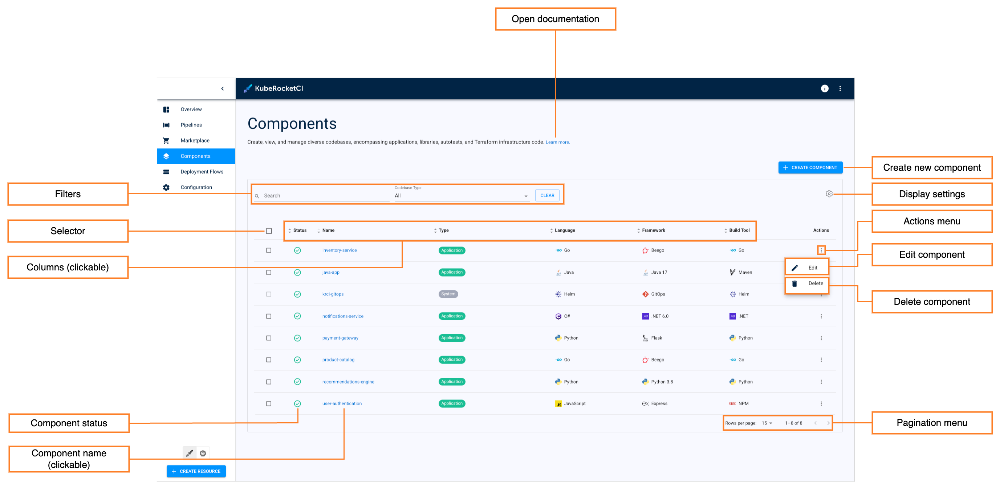
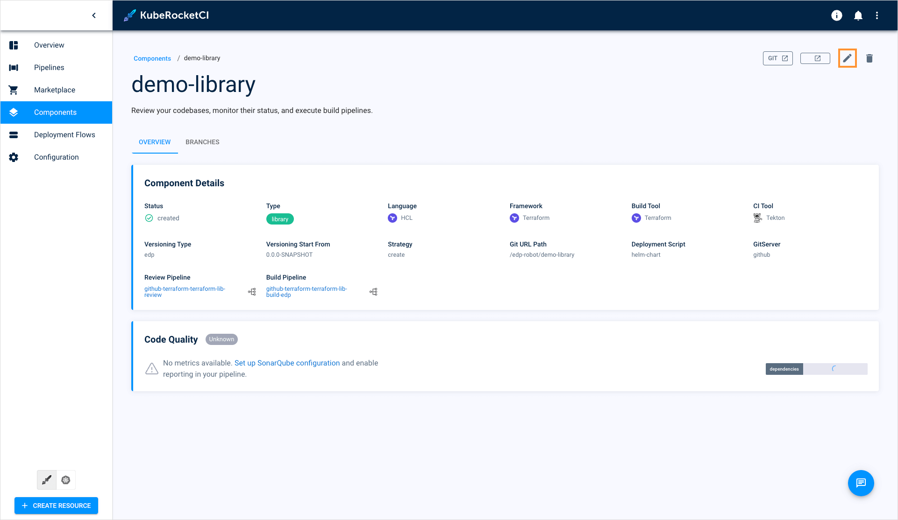
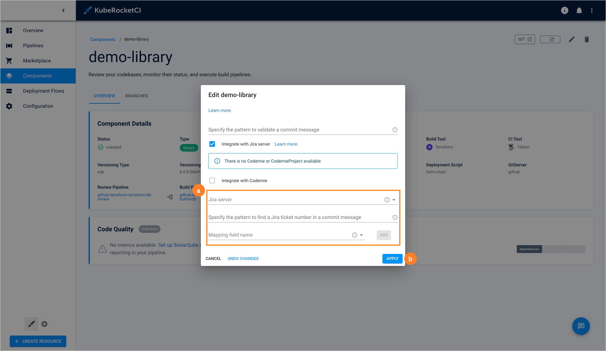

---

title: "Manage Libraries"
sidebar_label: "Manage Libraries"
description: "Explore how to manage libraries in KubeRocketCI, including editing details, integrating with Jira, and managing branches for development efficiency."

---
<!-- markdownlint-disable MD025 -->

# Manage Libraries

<head>
  <link rel="canonical" href="https://docs.kuberocketci.io/docs/user-guide/library/" />
</head>

This section describes the subsequent possible actions that can be performed with the newly added or existing libraries.

## Check and Remove Library

As soon as the library is successfully provisioned, the following will be created:

* A Library Codebase type will appear in the Codebase list of the Components section.
* With the **Create** strategy, a new project will be generated on GitHub or another integrated VCS. When **Clone** is chosen, the repository will be forked from the original and copied to the KubeRocketCI-integrated repository. If **Import** is selected, the platform connects to the chosen repository.

:::info
    To navigate quickly to OpenShift, Tekton, Gerrit, SonarQube, Nexus, and other resources, click the **Overview** section on the navigation bar and hit the necessary link.
:::

The added library will be listed in the Libraries list allowing to do the following:

* **Component status** - displays the library status. Can be red or green depending on if the KubeRocketCI portal managed to connect to the Git Server with the specified credentials or not.
* **Component name (clickable)** - displays the library name set during the library creation.
* **Open documentation** - opens the library related documentation page.
* **Enable filtering** - enables filtering by library name and namespace where this custom resource is located in.
* **Selector** - Allows you to select multiple library for bulk actions.
* **Delete selected** - Deletes all selected library. This option is only available when one or more library`s are selected using the **Selector**.
* **Create new component** - displays the **Create new component** menu.
* ***Actions menu**
* **Edit** - edit the library by selecting the options icon next to its name in the libraries list, and then selecting **Edit**. For details see the [Edit Existing Library](#edit-existing-library) section.
* **Delete** - remove library by clicking the vertical ellipsis button and then selecting **Delete**.

There are also options to sort the libraries:

* **Enable filtering** - Sort the existing libraries in a table by clicking the sorting icons in the table header. Sort the libraries alphabetically by their name, language, build tool, framework, and CI tool. You can also sort the libraries by their status: Created, Failed, or In progress.
* **Pagination menu** - Select a number of libraries displayed per page (15, 25 or 50 rows) and navigate between pages if the number of libraries exceeds the capacity of a single page.

## Edit Existing Library

KubeRocketCI portal provides the ability to enable, disable or edit the Jira Integration functionality for libraries.

1. To edit a library directly from the Libraries overview page or when viewing the library data:

    * Select **Edit** in the options icon menu:

      

    * Select **Edit** in the library details menu:

      

2. To enable Jira integration, in the **Edit Library** dialog do the following:

    

    a. Mark the **Integrate with Jira server** check box and fill in the necessary fields. Please see the steps of the [Add Library](add-library.md) page.

    b. Select the **Apply** button to apply the changes.

3. To disable Jira integration, in the **Edit Library** dialog do the following:

    a. Clear the **Integrate with Jira server** check box.

    b. Select the **Apply** button to apply the changes.

    As a result, the necessary changes will be applied.

4. To create, edit and delete library branches, please refer to the [Manage Branches](../user-guide/manage-branches.md) page.

## Related Articles

* [Add Library](add-library.md)
* [Manage Branches](../user-guide/manage-branches.md)
