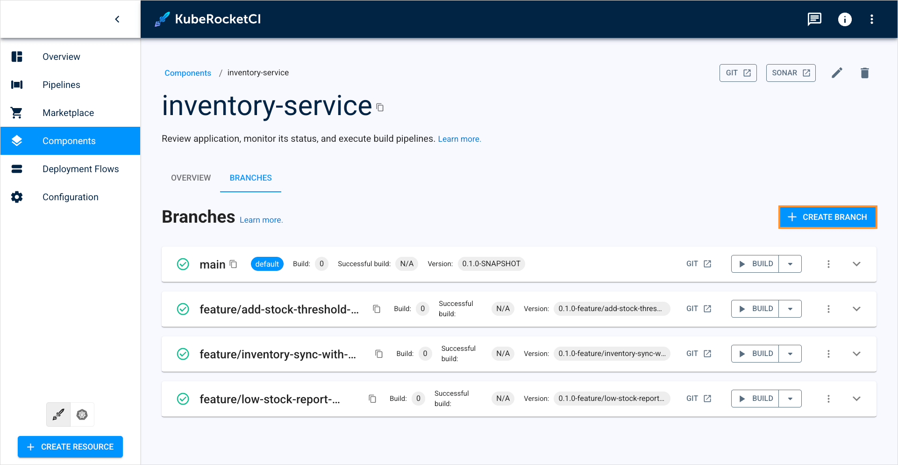
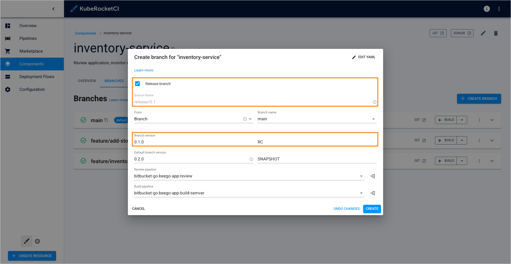
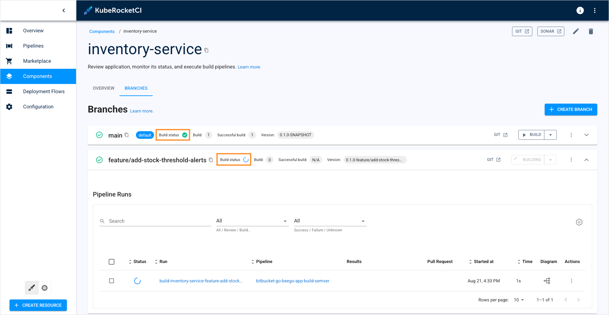
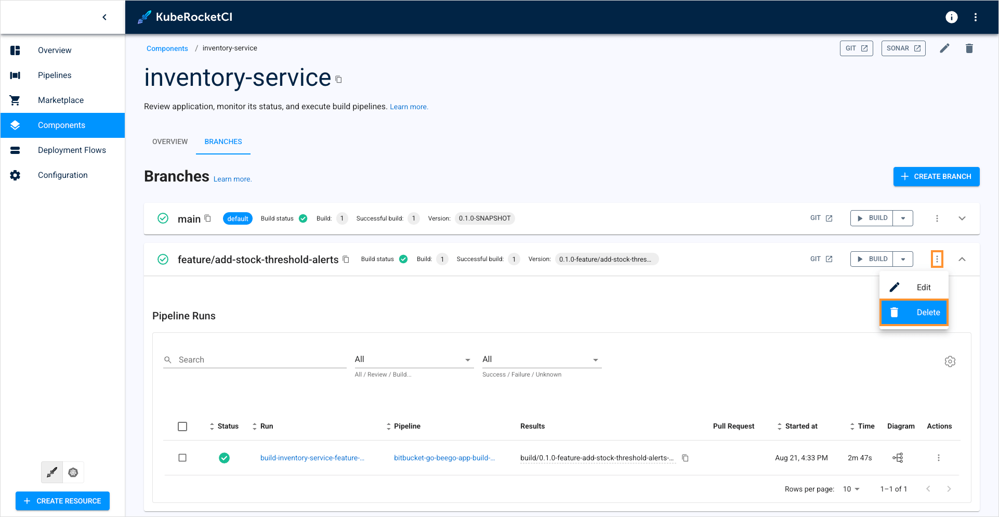

---

title: "Manage Branches"
sidebar_label: "Manage Branches"
description: "Explore branch management in KubeRocketCI, from adding new branches, editing properties, to integrating pipelines for applications, libraries, and more."

---
<!-- markdownlint-disable MD025 -->

import Tabs from '@theme/Tabs';
import TabItem from '@theme/TabItem';

# Manage Branches

<head>
  <link rel="canonical" href="https://docs.kuberocketci.io/docs/user-guide/manage-branches" />
</head>

This page describes how to manage branches in the created component, whether it is an application, library, autotest or infrastructure. It also briefly explains two approaches of managing custom pipelines for codebases.

<iframe width="560" height="315" src="https://www.youtube-nocookie.com/embed/AsWQKiRvNDY" title="KubeRocketCI: Branches Management" frameborder="0" allow="accelerometer; autoplay; clipboard-write; encrypted-media; gyroscope; picture-in-picture" allowfullscreen="allowfullscreen"></iframe>

## Pipeline Management

There are two approaches to define codebases with Tekton pipelines:

  * Using [build tool and framework](../use-cases/tekton-custom-pipelines.md);
  * Using codebase [branch settings](../use-cases/custom-pipelines-flow.md).

### Build Tool/Framework Approach

This approach involves [adding your application](../use-cases/tekton-custom-pipelines.md) operating with language type and framework.

In this approach, it is essential to create a pipeline name using the pattern: `git_server_name-build_tool-framework-codebase_type-pipeline_type-codebase_versioning_type`.

Follow this approach if you need to define multiple similar applications with identical settings, as this approach would be more beneficial.

### Codebase Branch Settings

This approach involves creating a component with Tekton pipelines and selecting it in the codebase branch settings.

In contrast to the approach based on [build tool and framework](../use-cases/tekton-custom-pipelines.md), this one offers two main advantages:

  * **Simplified management**: This method eliminates the requirement for strict resource naming conventions. With this approach, pipelines can be created without following any predefined pattern.
  * **Branch-based logic**: With this method, pipelines can be defined not just for an application but also for specific branches within the application.

If you need to frequently and quickly redefine a build or review pipeline, this approach is highly recommended.

## Add New Branch

:::note
  When working with libraries, pay attention to specifying the branch name: the branch name is involved in the formation of the library version, so it must comply with the [semantic versioning](https://semver.org/) rules for the library.
:::

When adding a component, the default branch is **main**. To add a new branch, follow the steps below:

1. Navigate to the **Branches** block by clicking the component name link in the Components list and click the **+ Create branch** button:

  

2. Fill in the required fields to create a new branch:

  

    a. **Learn more** - opens a documentation page the explains how to add a new branch.

    b. **Release branch** - select this option to make a release branch. Codebases from release branches are marked with a different tag.

  :::note
  When working with release branches, keep in mind that only the **semver** versioning type supports release branches. In the **default** versioning type, this option is unavailable.
  Additionally, the SNAPSHOT version is reset each time you create a release branch.
  :::

    When the **Release branch** option is selected, you will also need to specify release tag the application will be marked:

    

    c. **Branch name** - type the branch name.

    :::note
    The **Branch name** field remains static if you create a release branch.
    If you want to onboard an existing branch, enter the name of the existing branch in the **Branch name** fields.
    :::

    d. **From** - by default, the KubeRocketCI portal will suggest creating a branch from the main branch. If you want to create a branch from another branch or commit hash, change this field:

      <Tabs
        defaultValue="commit-hash"
        values={[
          {label: 'Commit hash', value: 'commit-hash'},
          {label: 'Another branch', value: 'branch'}
        ]}>

        <TabItem value="commit-hash">

        In the **From** field, select the **Commit hash** option. In the field to the right, specify the full SHA of the commit you want to create a branch from.
        Note that if the **From commit hash** field is empty, the latest commit from the branch name will be used.

          

        </TabItem>

        <TabItem value="branch">

        In the **From** field, select the **Branch** option. In the field to the right, specify the name of the source branch you want to create a branch from:

          

        </TabItem>
      </Tabs>

    e. **Branch version** - specify the application version and tag (SNAPSHOT by default).

    f. **Build pipeline** - select the build pipeline you want to use to build the application or leave the default one.

    g. **Review pipeline** - select the review pipeline you want to use to review the application or leave the default one.

    h. **View diagram** - view the pipeline to verify this is the exact pipeline you need:

    

  :::note
  To get the most out of managing build/review pipelines via KubeRocketCI portal, you should follow the **Add-Ons** approach for pipeline management.
  :::

3. Click **Edit YAML** in the upper-right corner of the dialog to open the YAML editor and add a branch. Otherwise, fill in the required fields in the dialog:

  

  :::info
    Adding of a new branch is indicated in the context of the `semver` versioning type.
  :::

## Add Existing Branch

Onboarding a branch that has already been created in Git to the platform follows the same steps as when you [add a new branch](../user-guide/manage-branches.md#add-new-branch). When adding an existing branch, specify its name in the **Branch name** fields.

## Edit Existing Branch

To edit branch properties, follow the steps below:

1. Navigate to the **Branches** block by clicking the component name link in the components list.

2. Click the actions button and select **Edit**:

  

3. Change the branch options and click **Apply**:

  

  a. Select another pipeline from the drop-down list.

  b. Click the **View diagram** button.

## Build Branch

In order to build branch from the latest commit, do the following:

1. Navigate to the **Branches** block by clicking the library name link in the Libraries list.

2. Click the **Build** button:

  

The pipeline run status is displayed near the branch name in the **Branches** block:

  

The corresponding item appears in the **Pipelines** section:

  

As an alternative way, click the tree diagram icon to observe the real-time status of the pipeline run:

  

The tree diagram window is presented below:

  

## Delete Branch

:::note
  The default **master/main** branch cannot be removed.
  Additionally, deleting a branch in the portal doesn’t remove it from Git. It is required to delete it there as well if necessary.
:::

In order to delete the added branch with the corresponding record in the KubeRocketCI portal database, do the following:

1. Click the component name link in the components list.
2. Select the **Branches** tab.
2. Define the branch you want to delete.
3. On the branch block, click the actions button and select **Delete**:

  

4. Confirm deletion of the branch by typing its name and clicking **Confirm**:

  

## Related Articles

* [Add Application](../user-guide/add-application.md)
* [Add Library](../user-guide/add-library.md)
* [Add Autotest](../user-guide/add-autotest.md)
