---

title: "Pipelines Overview"
sidebar_label: Pipelines Overview
description: "Optimize CI/CD workflows with KubeRocketCI's Pipelines section, a centralized management hub for builds, reviews, and deployments."

---
<!-- markdownlint-disable MD025 -->

# Pipelines Overview

<head>
  <link rel="canonical" href="https://docs.kuberocketci.io/docs/user-guide/pipelines" />
</head>

Pipelines are an integral part of any CI/CD. They are involved in code build, review, and deployment procedures. Such a big variety of pipelines results in a demand for having a single place where the pipelines can be managed. For this purpose, the Pipelines section was added to the KubeRocketCI portal.

## Pipelines Page Overview

To see the Pipelines section, open the KubeRocketCI portal and select the **Pipelines** section:

  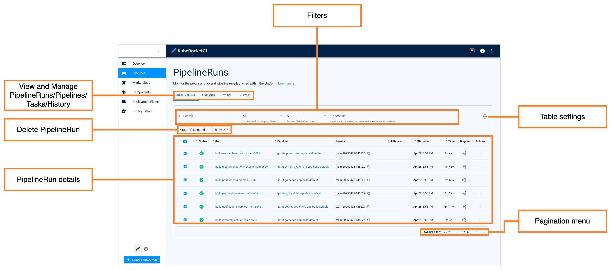

* **View and Manage PipelineRuns/Pipelines/Tasks/History** - Allows to navigate between the corresponding tabs of the section.
* **PipelineRun details** - Displays the following pages:

  * **Checkbox** - Click the check box to select the pipelines to delete.
  * **Status** - Displays PipelineRun status. The status can be either successful (green) or failed (red). Hover over the status to view the description.
  * **Run** - Displays the PipelineRun name. Click the name to view its details.
  * **Pipeline** - Indicates which pipeline this PipelineRun belongs to. Click the pipeline name to view its details.
  * **Pull Request** - Click the icon to see which pull request started this PipelineRun.
  * **Started at** - Displays the time the pipeline was started.
  * **Time** - Displays the total amount of time it took the pipeline to complete.
  * **Diagram** - Click the icon to see the real-time pipeline diagram.
  * **Actions** - This button allows for restarting and deleting PipelineRuns.

* **Filters** - Filter PipelineRuns by name, namespace, and pipeline they belong to.
* **Delete PipelineRun** - Allows to delete the selected PipelineRuns.
* **Pagination menu** - Allows to navigate through the list of PipelineRuns.

## Pipeline Overview

To inspect pipeline details, follow the steps below:

1. Click the PipelineRun name to view its details:

  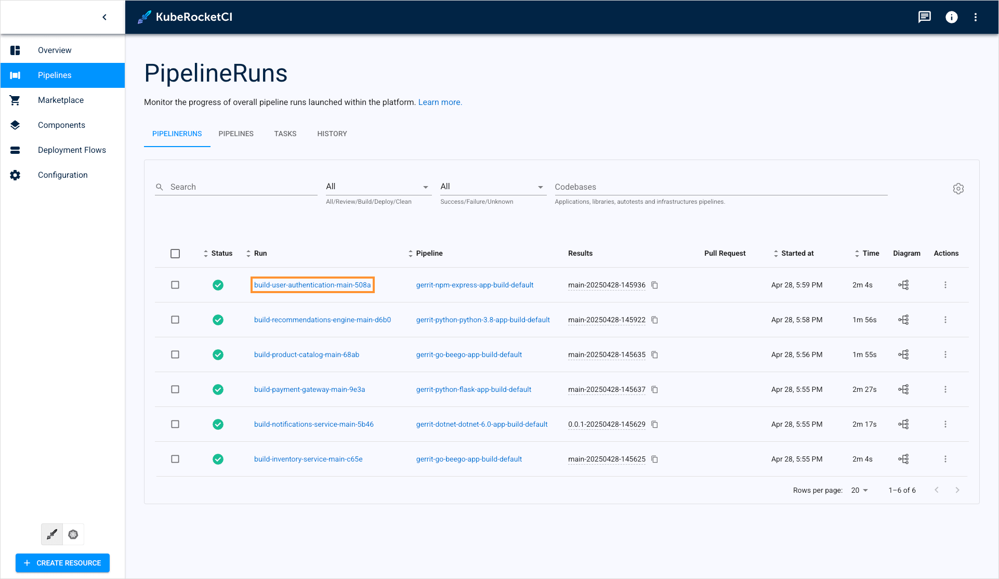

2. The first tab that appears when you click the PipelineRun name is the **Details** tab:

  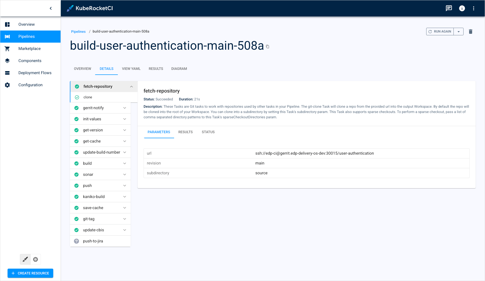

  This tab displays the PipelineRun status and logs.

3. Navigate to the **Overview** tab:

  

  In this tab, you can view the general information and resources that the pipeline is connected with.

4. Navigate to the **View YAML** tab:

  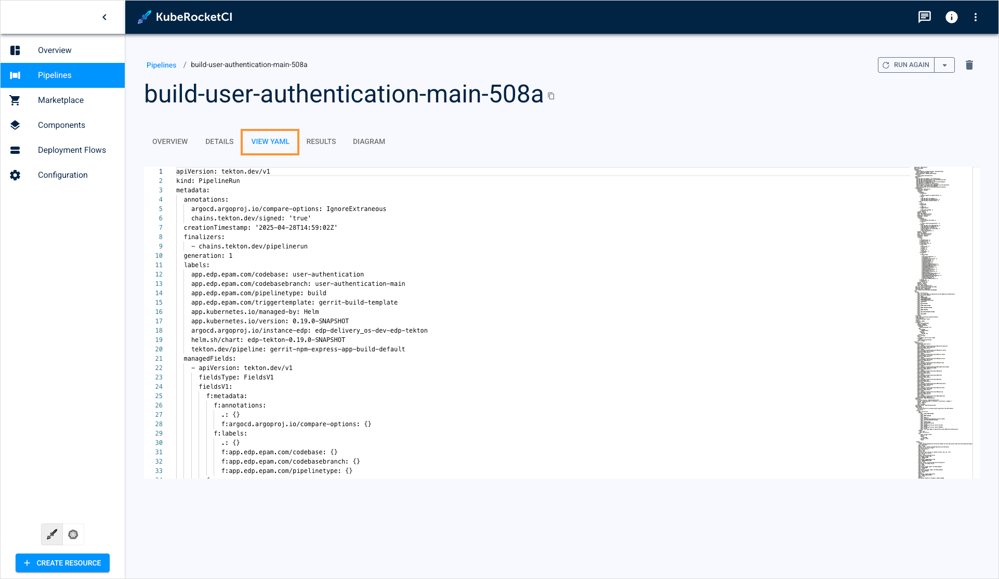

  This tab displays the YAML configuration of your pipeline.

5. Navigate to the **Results** tab:

  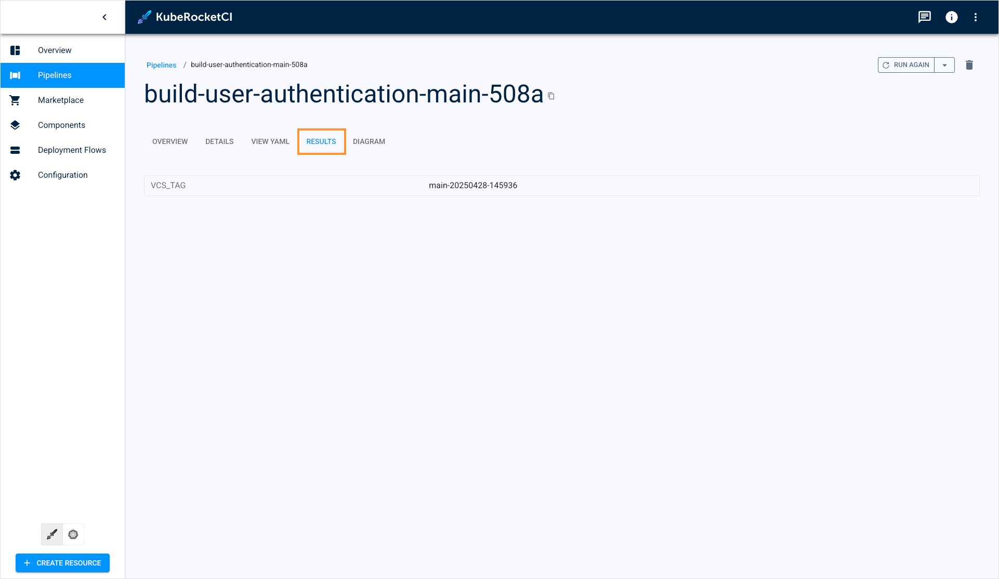

  This tab shows the resulting artifact that was built in the pipeline.

  There are also a couple of ways to view the build pipeline results: from the codebase details page and the Pipelines section:

  From the codebase details page:

  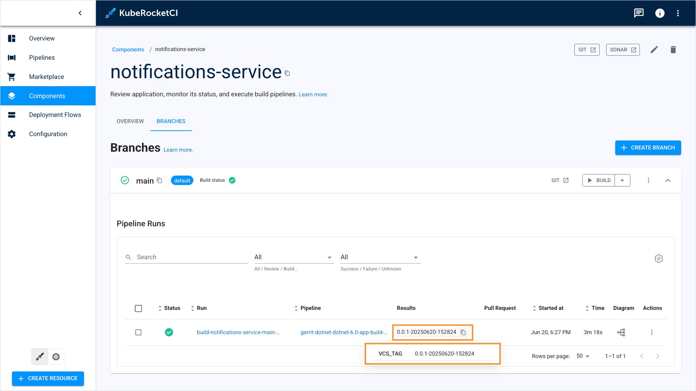

  From the Pipelines section:

  

:::note
This tab is accessible only in Build Pipelines that produce artifacts.
:::

6. Navigate to the **Diagram** tab:

  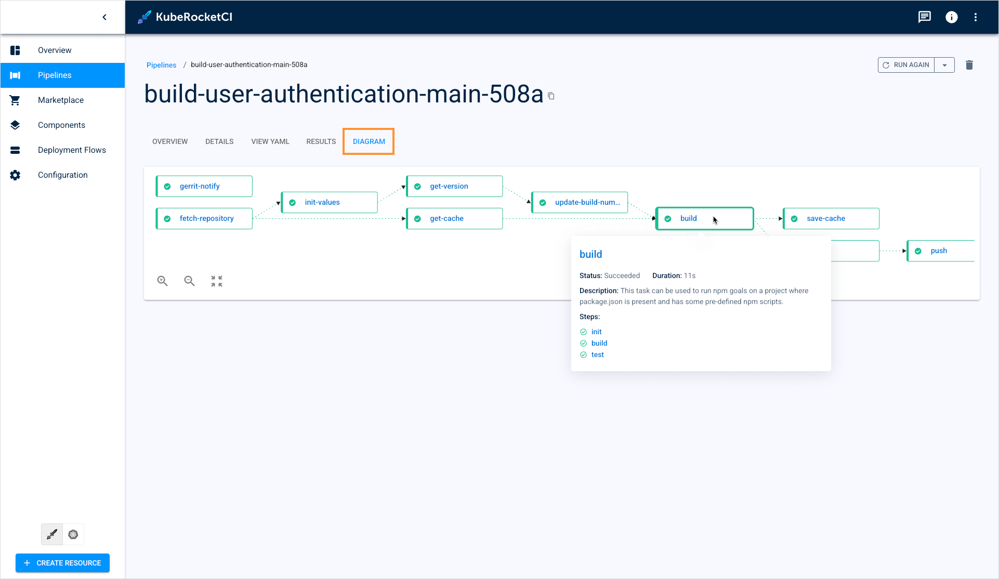

  The diagram displays the pipeline's real-time status. Click the task name to navigate to the corresponding task in the **Details** tab.

## Operate With Pipelines

The Pipelines section allows you to track, restart, and delete pipelines.

To restart the PipelineRun, click the actions button and select **Run again**:

  

To restart the PipelineRun using different parameters, click the actions button and select **Run with params**:

  

To delete the PipelineRun, click the actions button and select **Delete**:

  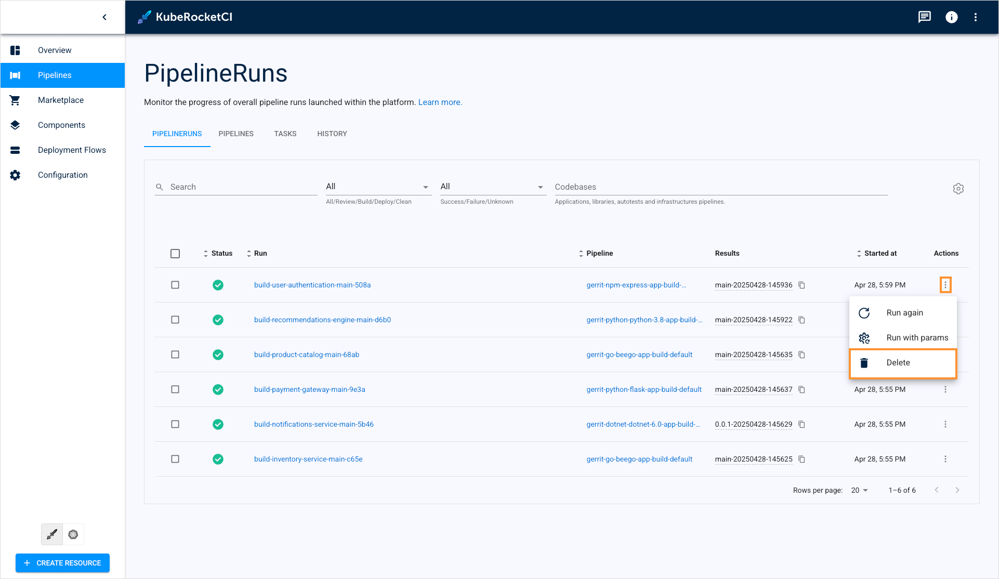

Alternatively, you can enter the PipelineRun and delete/restart the pipeline using the corresponding buttons:

  

## View Pipelines/Tasks

The Pipelines section also offers users to view and edit all the Tekton Pipelines and Tasks defined in the platform. It is implemented by the corresponding **Pipelines** and **Tasks** tabs.

To view and manage Tekton Pipelines, select the **Pipelines** tab:

  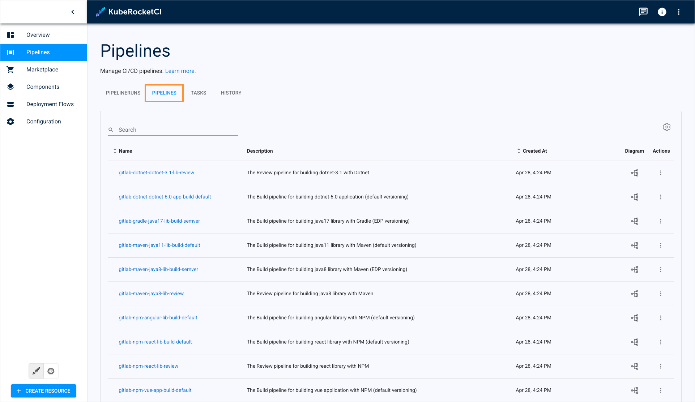

To view and manage Tekton Tasks, select the **Tasks** tab:

  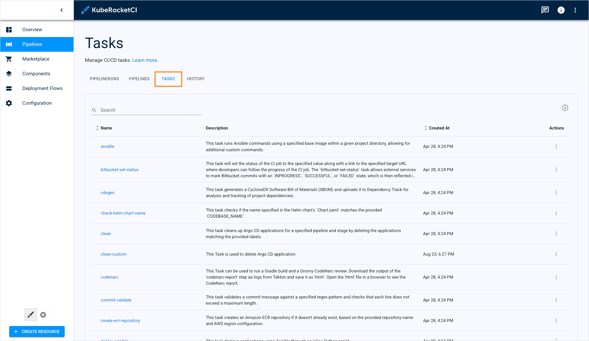

The **History** tab shows logs saved in the alternative log stash tools, such as OpenSearch:

  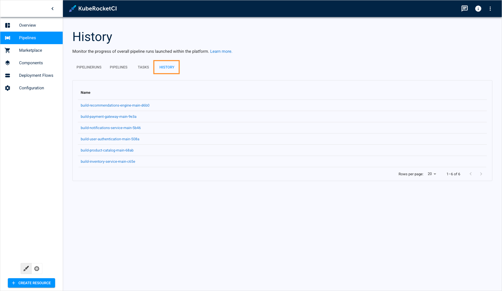

:::note
The **History** tab operates if the OpenSearch tool is installed. You can install OpenSearch using our [cluster add-ons](https://github.com/epam/edp-cluster-add-ons/blob/main/clusters/core/apps/values.yaml#L207).
:::

## Edit Table View

All the tables in the section are configurable. Most of the tabs can be hidden. To set only specific columns to display, click the **Table settings** button:

  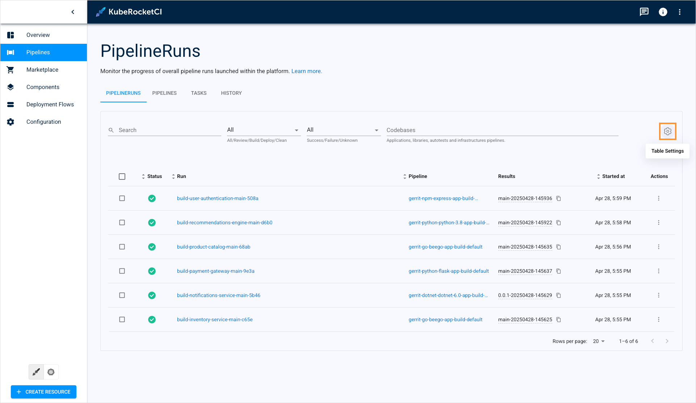

Select the columns to display and click **Save**:

  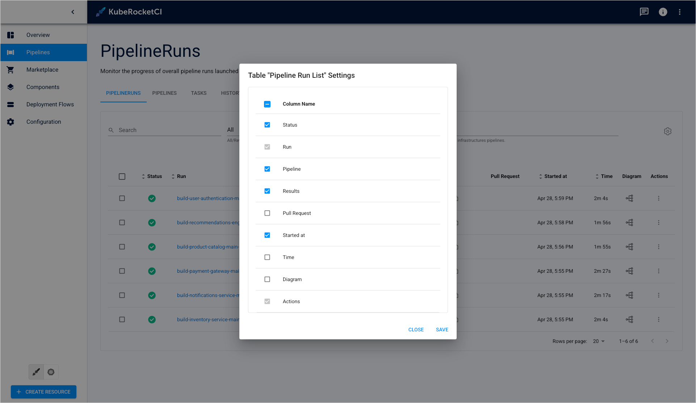

You can also edit column width:

  

To reset table settings to defaults, select all the columns to display.

## Edit Pipelines/Tasks

KubeRocketCI portal allows to edit the existing Tekton Pipelines and Tasks directly in the Pipelines section. In our example, we will show how to edit a Task but the same procedure applies to Pipelines:

1. Navigate to the **Tasks** tab.

2. Enter a Task by clicking its name:

  

3. On the Task details page, click **Edit**:

  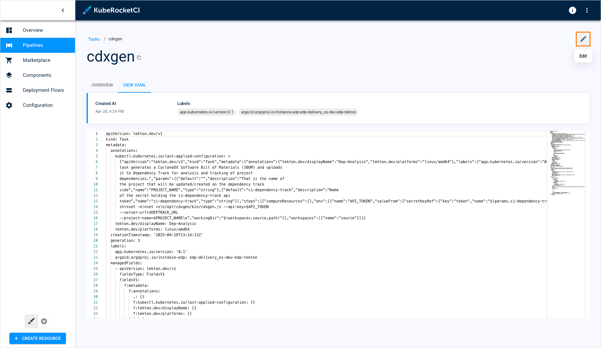

4. On the edit window, make your changes and click **Save & apply**:

  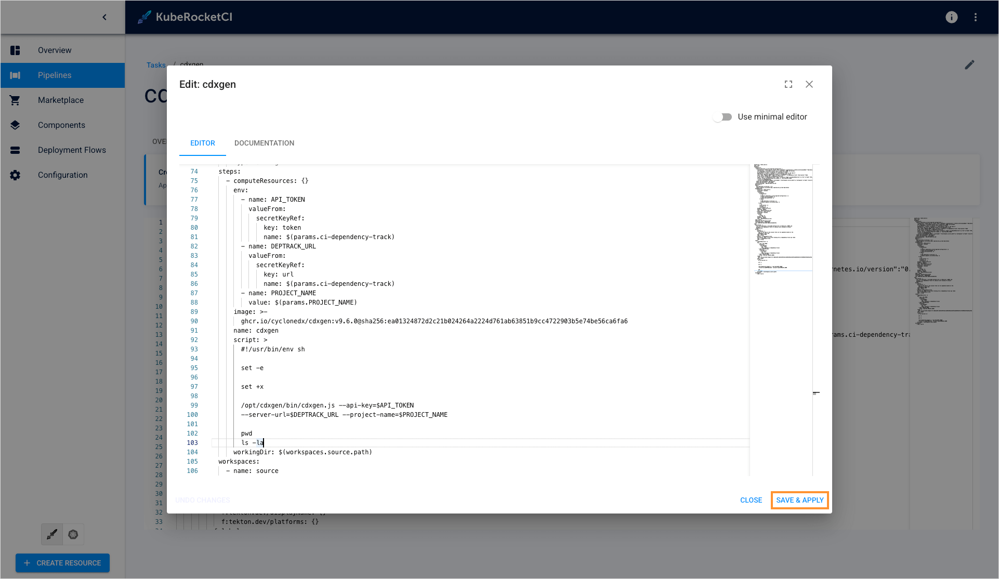

Now you know how to view and manage pipelines in KubeRocketCI.

## Related Articles

* [Marketplace Overview](./marketplace.md)
* [Manage Deployment Flows](./manage-environments.md)
* [Manage Applications](./application.md)
