import Tabs from '@theme/Tabs';
import TabItem from '@theme/TabItem';

# Platform Cleanup

During platform's continuous work, various resources are created. Some resources can't be deleted completely, potentially causing issues in the future, like creating duplicate resource, storage overflow, etc. This page describes complete resource deletion in KubeRocketCI from application to deployment flow.

## Prerequisites

To follow the guidelines below, ensure you have an unnecessary deployment flow with applications you are ready to delete.

## Platform Resource Cleanup

We will cover both platform and third-party resource deletion.

### Delete Deployment Flow

To delete a deployment flow, follow the steps below:

1. Navigate to **KubeRocketCI portal** -> **Deployment Flows**:

  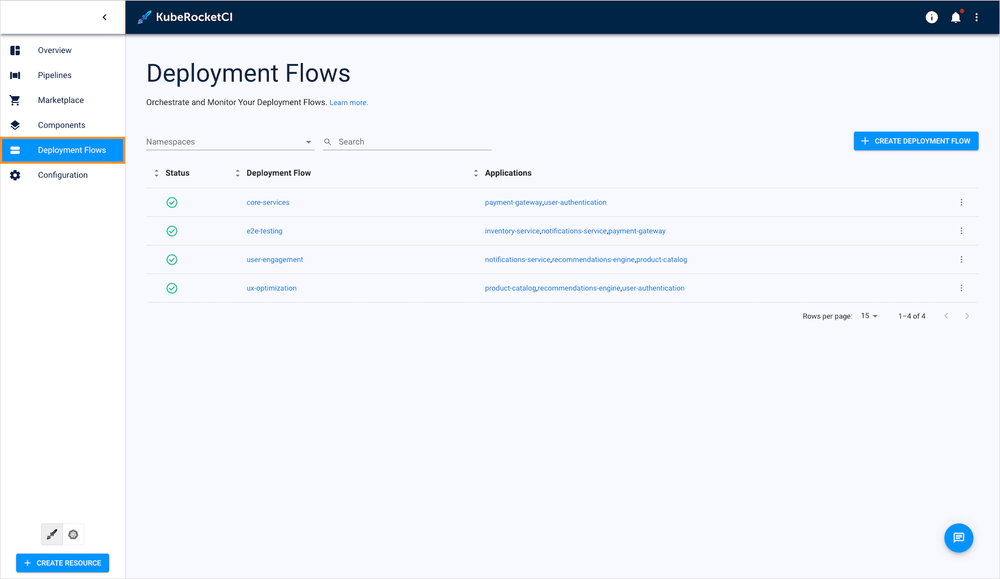

2. Choose a deployment flow to delete. Click the actions button and select **Delete**:

  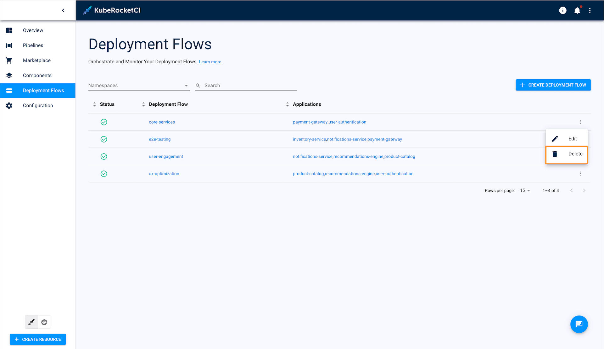

3. Enter the deployment flow name and click **Delete**:

  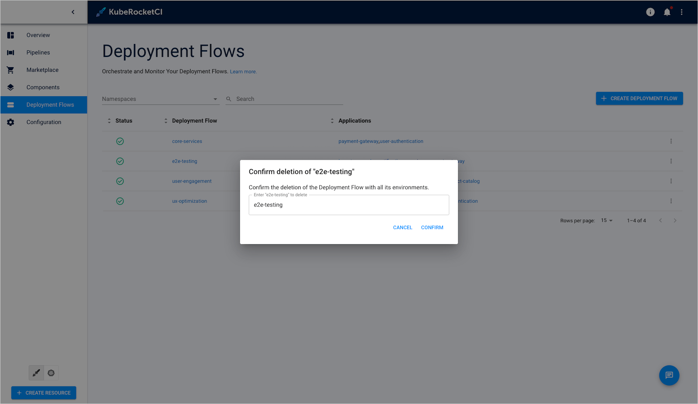

### Delete Applications

To delete an application, follow the steps below:

1. Navigate to **KubeRocketCI portal** -> **Components**:

  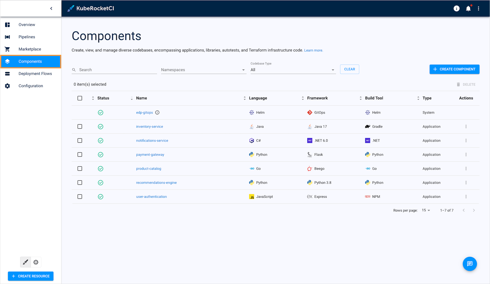

2. Choose an application to delete. Click the actions button and select **Delete**:

  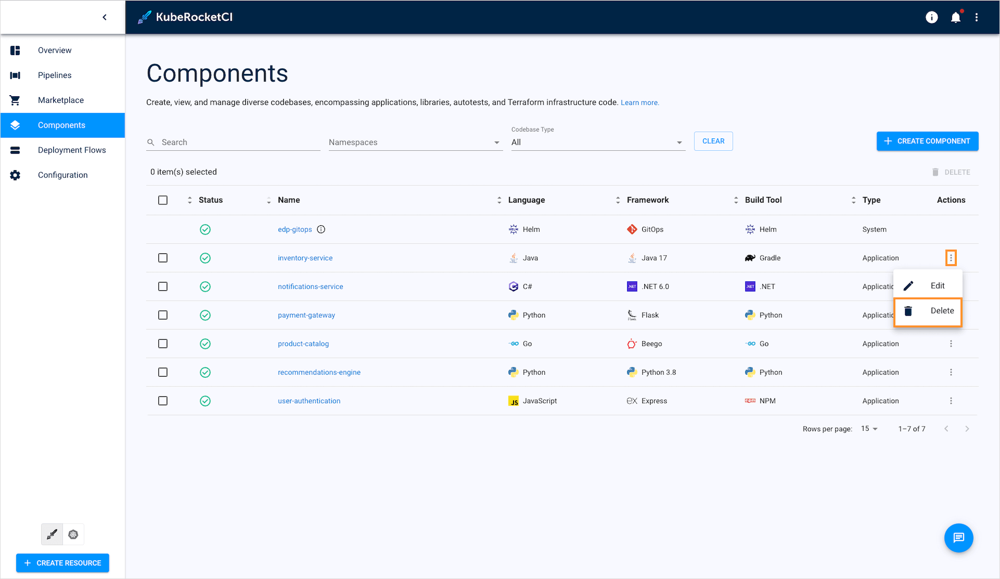

3. Enter the deployment flow name and click **Delete**:

  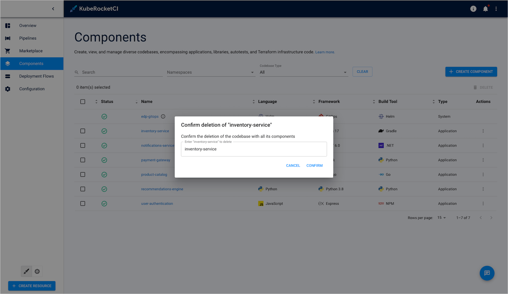

### Delete Pipeline Runs

The last platform resource remaining is pipeline run. To delete pipeline runs, follow the steps below:

1. Navigate to **KubeRocketCI portal** -> **Pipelines**:

  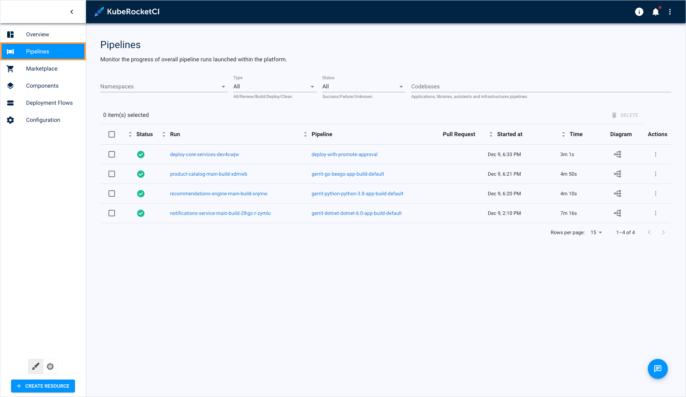

2. Choose an application to delete. Click the actions button and select **Delete**:

  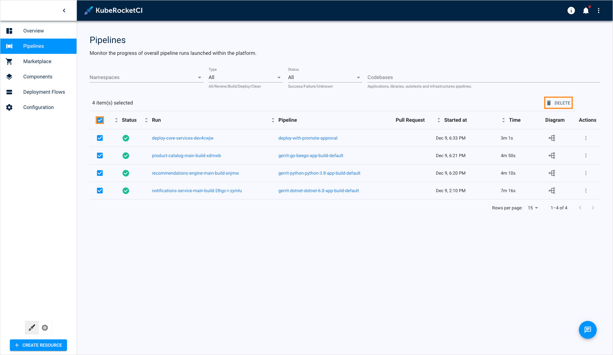

3. On the confirmation window, enter **confirm** and click **Delete**:

  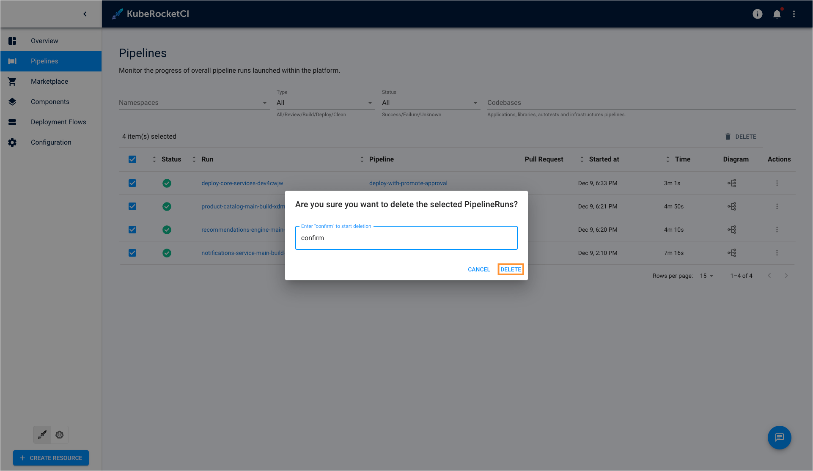

## Third-Party Resource Cleanup

Many tools are involved in the codebase management process. So it is essential to clean them up as well to avoid issues in the future.

### Version Control System

As soon as a codebase is created, it appears in a Version Control System (VCS), regardless of what VCS you leverage. Below are references to official documentation on deleting code repositories:

<Tabs
      defaultValue="github"
      values={[
        {label: 'GitHub', value: 'github'},
        {label: 'GitLab', value: 'gitlab'},
        {label: 'Bitbucket', value: 'bitbucket'},
        {label: 'Gerrit', value: 'gerrit'}
      ]}>

        <TabItem value="github">
          To delete a GitHub repository, read the [Deleting a repository](https://docs.github.com/en/repositories/creating-and-managing-repositories/deleting-a-repository) page.
        </TabItem>

        <TabItem value="gitlab">
          To delete a GitLab repository, read the [Manage projects](https://docs.gitlab.com/ee/user/project/working_with_projects.html#delete-a-project) page.
        </TabItem>

        <TabItem value="bitbucket">
          To delete a Bitbucket repository, read the [Delete a repository](https://support.atlassian.com/bitbucket-cloud/docs/delete-a-repository/) page.
        </TabItem>

        <TabItem value="gerrit">
          To delete a Gerrit repository, read the [Project Owner Guide](https://gerrit-review.googlesource.com/Documentation/intro-project-owner.html#project-deletion).
        </TabItem>
    </Tabs>

### Deleting Nexus Artifacts

KubeRocketCI uses Nexus as a registry for storing application artifacts. To clean up unnecessary container images, follow the steps below:

1. Navigate to Nexus main menu and select the **Browse** tab:

  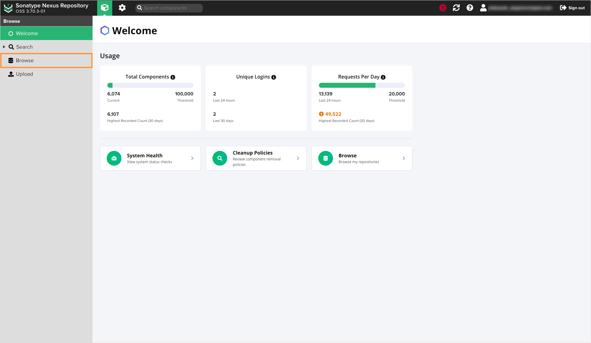

2. On the **Browse** tab, select the folder with the name that represents your application type:

  For example, if you want to delete a .NET application, navigate to **edp-dotnet-release** or **edp-dotnet-snapshot** folder. Understanding the difference between the **release** and **snapshot** folders is essential:

  * **release**: This type of repository stores applications that were built in release branches. These applications are usually tagged as release candidates (RC).
  * **snapshot**: This type of repository stores any other applications and their versions, which are usually tagged as snapshots.

  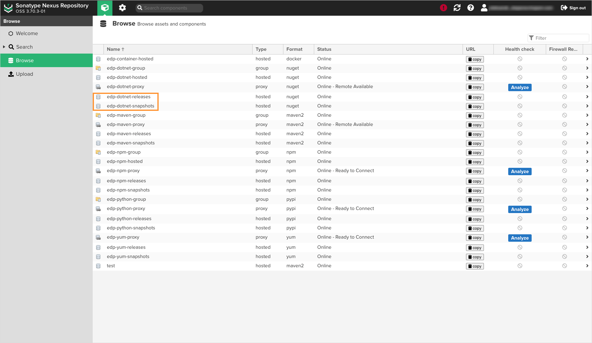

3. In the Nexus repository, select the application folder and click **Delete folder**:

  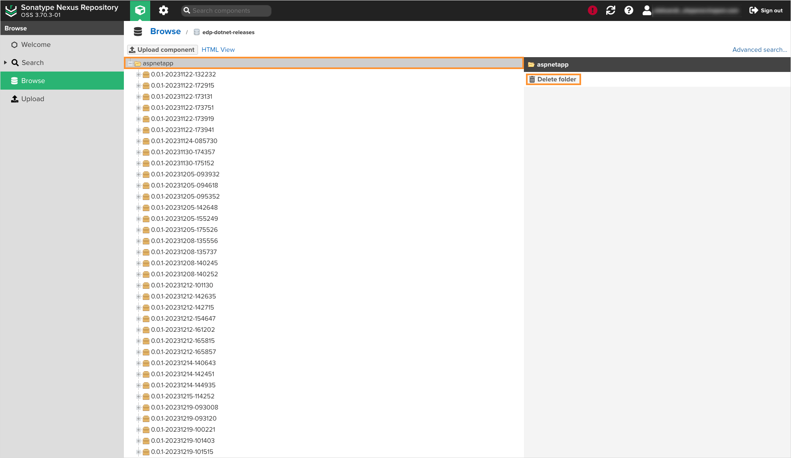

4. (Optional) Repeat the steps 1-3 for all the applications and repositories you want to clean up.

### Deleting Container Images

KubeRocketCI uses container images to deploy the applications to [deployment flows](../user-guide/add-cd-pipeline.md). To clean up a container registry, follow the corresponding guidelines:

<Tabs
      defaultValue="ecr"
      values={[
        {label: 'AWS ECR', value: 'ecr'},
        {label: 'DockerHub', value: 'docker'},
        {label: 'Harbor', value: 'harbor'},
        {label: 'Nexus', value: 'nexus'},
        {label: 'GitHub', value: 'github'}
      ]}>

        <TabItem value="ecr">
          To delete container images from the AWS Elastic Container Registry, read the [Deleting an image in Amazon ECR](https://docs.aws.amazon.com/AmazonECR/latest/userguide/delete_image.html#:~:text=To%20delete%20an%20image%20(AWS%20Management%20Console)&text=In%20the%20navigation%20pane%2C%20choose,to%20delete%20and%20choose%20Delete.) page.
        </TabItem>

        <TabItem value="docker">
          To delete container images from DockerHub, read the [docker image rm](https://docs.docker.com/reference/cli/docker/image/rm/) page.
        </TabItem>

        <TabItem value="harbor">
          To delete container images from Harbor, read the [Deleting Artifacts](https://goharbor.io/docs/2.3.0/working-with-projects/working-with-images/deleting-artifact/) page.
        </TabItem>

        <TabItem value="nexus">
          1. Navigate to Nexus main menu and select the **Browse** tab:

            

          2. On the **Browse** tab, select the repository with the **edp-container-hosted** name:

            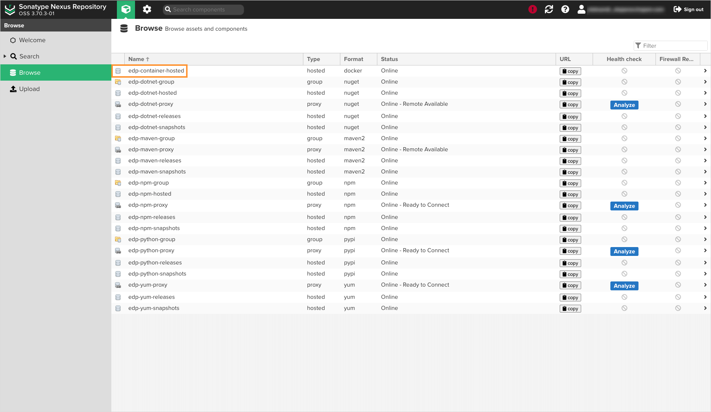

          3. On the repository details page, select the folder name and click **Delete folder**:

            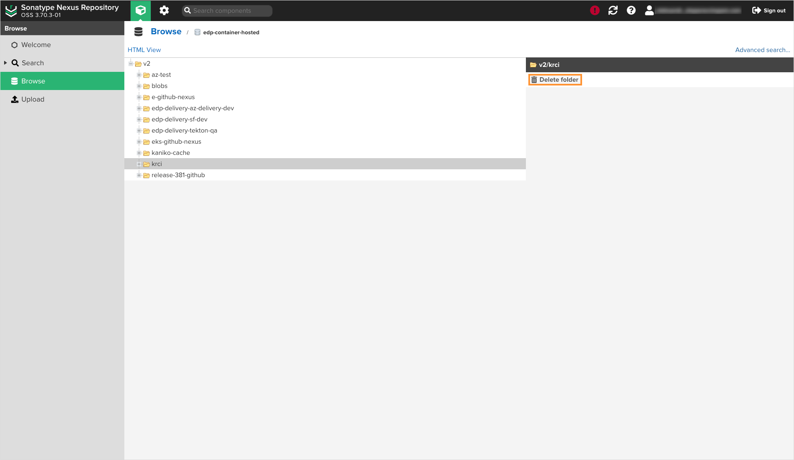

        </TabItem>

        <TabItem value="github">
          To delete container images from GitHub Container Registry, read the [Working with the Container registry](https://docs.github.com/en/packages/working-with-a-github-packages-registry/working-with-the-container-registry#authenticating-with-a-personal-access-token-classic) page.
        </TabItem>
    </Tabs>

### Deleting SonarQube Projects

KubeRocketCI generates a SonarQube project for every new codebase. To clean up application projects, follow the guidelines described in the [official documentation](https://docs.sonarsource.com/sonarqube-server/8.9/project-administration/project-settings/#deleting-a-project).

## Related Articles

* [Add Application](./application.md)
* [Manage Applications](./add-application.md)
* [Manage Deployment Flows](./manage-environments.md)
