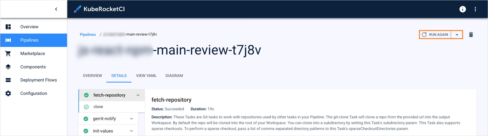
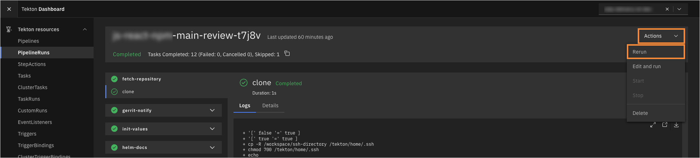
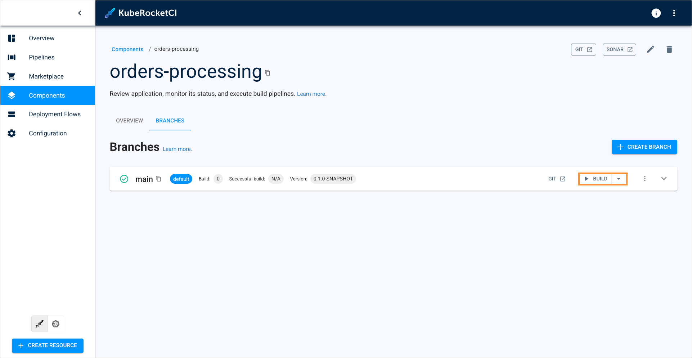

---

title: "KubeRocketCI: Tekton Overview"
sidebar_label: Tekton Overview
description: "KubeRocketCI is a platform that utilizes the Tekton stack to implement continuous integration and continuous delivery (CI/CD) pipelines, offering access to all Tekton features."

---
<!-- markdownlint-disable MD025 -->

import Tabs from '@theme/Tabs';
import TabItem from '@theme/TabItem';

# KubeRocketCI: Tekton Overview

<head>
  <link rel="canonical" href="https://docs.kuberocketci.io/docs/user-guide/tekton-pipelines" />
</head>

KubeRocketCI is a platform that utilizes the Tekton stack to implement continuous integration and continuous delivery (CI/CD) pipelines, offering access to all Tekton features.
It comes pre-configured with various Tekton resources, including pipelines, tasks, triggers, and other components. This documentation outlines how to interact with these Tekton resources within the KubeRocketCI platform, addressing common use cases, pipeline configuration, and execution processes.

## Prerequisites

Before executing pipelines, ensure that the project is onboarded to the KubeRocketCI platform and that the relevant branches are properly configured.

## Pipeline Types in the Platform

KubeRocketCI supports four main types of pipelines:

* **Review Pipeline**: This pipeline is initiated when a pull request is created. It aims to check code quality and run tests before the code can be merged.

* **Build Pipeline**: This pipeline is triggered when a pull request is merged. It is responsible for building the application and generating deployable artifacts.

* **Deploy Pipeline**: This pipeline handles the deployment of the application to a target environment, applying specific configurations.

* **Clean Pipeline**: This pipeline is responsible for cleaning up any resources created during the deployment, ensuring a fresh environment for future deployments.

* **Test Pipeline**: This pipeline is designed to execute automated tests against deployed environments. It ensures that the application functions as expected.

* **Security Pipeline**: This pipeline performs security scanning and vulnerability analysis. It is used to identify vulnerabilities, misconfigurations, and compliance issues.

* **Release Pipeline**: Manages the process of approving and publishing new releases, ensuring that all compliance and governance standards are met.

Each pipeline type is identified using specific labels in Kubernetes objects:

* `app.edp.epam.com/pipelinetype: review` — for review pipelines;
* `app.edp.epam.com/pipelinetype: build`— for build pipelines;
* `app.edp.epam.com/pipelinetype: deploy` — for deploy pipelines;
* `app.edp.epam.com/pipelinetype: clean`— for clean pipelines;
* `app.edp.epam.com/pipelinetype: tests`— for test pipelines;
* `app.edp.epam.com/pipelinetype: security`— for security pipelines;
* `app.edp.epam.com/pipelinetype: release`— for release pipelines.

## Creating a Pipeline

To create a pipeline, you need to define and apply Tekton resources such as tasks, pipelines, and triggers in the cluster.

KubeRocketCI includes a library component for managing Tekton resources declaratively. This library integrates with Argo CD, enabling version control and automatic synchronization of pipeline definitions.

Below is the recommended flow for creating comprehensive and efficient Tekton pipelines:

1. Start by modifying an existing pipeline example from the library to suit your needs.
2. Test changes by applying resources directly to the cluster.
3. Once verified, commit changes to the repository to ensure they are tracked and version-controlled.
4. Check/apply changes in Argo CD.

## Configuring Pipelines for Projects

Proper pipeline configuration depends on its purpose. Pipeline configuration is different for CI and CD pipelines.

### Review and Build Pipelines (CI)

Two approaches are available for defining review and build pipelines:

1. [Custom Framework/Build Tool](/docs/use-cases/tekton-custom-pipelines):

* Useful for onboarding multiple projects with the same pipeline structure.
* Pipelines follow a naming pattern and are mapped to projects via project settings.

2. [Branch-Specific Pipelines](/docs/use-cases/custom-pipelines-flow#replace-existing-pipelines-for-components-with-custom-pipelines):

* Ideal for enabling different pipelines for different branches of a project.
* Pipelines are explicitly defined for specific branches.

### Deploy and Clean Pipelines (CD)

Deploy and Clean pipelines require the creation of a TriggerTemplate resource with appropriate labels:

* `app.edp.epam.com/pipelinetype: deploy` — for deploy pipelines;
* `app.edp.epam.com/pipelinetype: clean` — for clean pipelines.

The TriggerTemplate defines parameters (e.g., service account name, timeout) and references the deploy pipeline in its pipelineRef field.

### Security Pipeline

Security pipeline conducts security scans and vulnerability assessments as a standalone process, decoupled from the build pipelines. Moving security checks into a separate pipeline enables more frequent, targeted scans, reduces build pipeline time, and allows to manage and evolve scanning logic independently of application delivery.

  

The scan result summary can be found in the **Results** tab. It refers you to the DefectDojo tool:

  

### Test Pipeline

Test pipelines execute automated tests for environments independently of deployments. This allows teams to validate changes quickly without the overhead of full environment deployment.

Previously, autotests could only be triggered after the application deploy pipeline, but with test pipelines, tests are now fully independent of deployment. This separation allows teams to validate application functionality on demand, run tests at any stage, and improve feedback cycles by decoupling testing from application delivery.

  

### Release Pipelines

Release pipeline orchestrates the approval and publishing workflow for new releases, supporting organizational compliance and governance requirements. By isolating release logic in its own pipeline, teams can implement custom approval steps, integrate with external systems, and ensure that release processes are auditable and consistent.

:::note
KubeRocketCI does not offer pre-built release pipelines. You can create custom release pipelines tailored to your project's needs.
:::

  

## Trigger Pipelines

A specific event triggers each pipeline type.

### Review Pipeline

Trigger a review pipeline using one of the four methods:

1. Create a pull request in the repository targeting a configured branch. The review pipeline will be triggered automatically once the pull request is created:

  

2. Use the **Run Again** button on the PipelineRun details page in the KubeRocketCI portal (if a PipelineRun exists):

  

3. Use the **Rerun** button on the PipelineRun details page in the Tekton dashboard (if a PipelineRun exists):

  

4. Add a comment that begins with the `/recheck` or `/ok-to-test` command on the pull request page:

:::note
The `/recheck` and `/ok-to-test` commands must be at the beginning of your comment to be recognized. These commands work for all the available Version Control Systems.
:::

  

### Build Pipeline

Overall, there are four methods of triggering a build pipeline:

1. Merge a pull request into a configured branch.

2. Use the **Run Again** button in the KubeRocketCI portal (if a PipelineRun exists):

  

3. Use the Rerun button in the Tekton dashboard (if a PipelineRun exists):

  

4. Use the Trigger Build PipelineRun button in the KubeRocketCI portal within the branches section:

  

### Deploy Pipeline

Deploy pipelines can be triggered manually or automatically. Automatic triggers are implemented using the **TriggerType** custom resource. There are three ways to trigger a deploy pipeline:

1. Use **Configure Deploy** and **Start Deploy** buttons in the KubeRocketCI portal:

  

2. Configure the pipeline with the `Auto` TriggerType to deploy automatically after the build pipeline finishes and a new artifact version is created.

3. Use the `Auto-stable` TriggerType for deploying stable component versions while updating only the rebuilt component.

### Clean Pipeline

Trigger the clean pipeline using the **Clean** button in the KubeRocketCI portal within the appropriate stage section.

### Security, Test, and Release Pipeline

To trigger a security, test, and release pipeline, follow the steps below:

1. Navigate to the **Pipelines** section.

2. Open the **Pipelines** tab.

3. On the **Pipelines** tab, use the filter to select a security, test, or release pipeline:

  

4. In the pipelines list, click the actions button and select **Run with parameters**:

  

5. On the create resource window, specify the required parameters and click **Save & Apply**:

    <Tabs
      defaultValue="security"
      values={[
        {label: 'Security', value: 'security'},
        {label: 'Test', value: 'test'}
      ]}>

      <TabItem value="security">

        

        * **git-source-url**: Git or HTTPS address of the Git repository where the application code is stored.
        * **git-source-revision**: Git branch of the repository.
        * **CODEBASE_NAME**: Enter the name of the codebase you want to scan.
      </TabItem>
      <TabItem value="test">

        

        * **git-source-url**: Git or HTTPS address of the Git repository where the autotests are stored.
        * **git-source-revision**: Git branch of the repository.
        * **makefile-target**: Enter one of the targets specified in the make file of your autotests.
        * **base-image**: Specify the container image that will be used to run your autotests.
      </TabItem>
    </Tabs>

## Related Articles

* [Pipelines Overview](../user-guide/pipelines.md)
* [Add Library](../user-guide/add-library.md)
* [Add Autotest](../user-guide/add-autotest.md)
