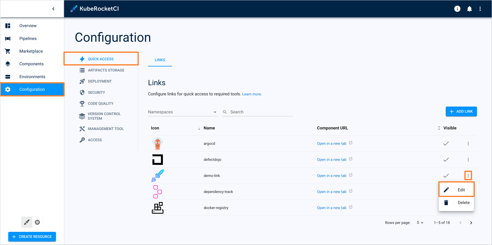

<!-- markdownlint-disable MD025 -->

# Artifact Versioning in KubeRocketCI

<head>
  <link rel="canonical" href="https://docs.kuberocketci.io/docs/user-guide/add-ai-assistant" />
</head>

This page describes artifact versioning types in KubeRocketCI, outlining their differences and versioning patterns.

Artifact versioning in KubeRocketCI is designed to ensure each build and deployment can be uniquely identified, managed, and traced back to its source.

Artifact versioning is defined for every codebase individually when creating a codebase:

  

Codebase version is marked on the `git-tag` step:

  

## Versioning Types

KubeRocketCI supports two versioning types: default and semver.

### Default Versioning

Default versioning generates versions based on the branch name and datetime, e.g. (`BRANCH-DATETIME`):

  

### Semantic Versioning

Semantic versioning (semver) structures versions as `MAJOR.MINOR.PATCH-BUILD_ID`, based on the [semantic versioning standards](https://semver.org/):

  

**CodebaseBranch**: The CodebaseBranch custom resource is integral to the artifact versioning process in KubeRocketCI. It tracks and stores versioning details related to each branch. This includes:

- **Version History**: A list of all versions created from the branch.
- **Build Information**: Details of the current and last successful builds, which can include version identifiers.

## Custom Versioning

User can implement **Custom Versioning** by updating [`get-version`](https://github.com/epam/edp-tekton/tree/master/charts/pipelines-library/templates/tasks/getversion) CI step.

## Related Articles

* [Add Git Server](add-git-server.md)
* [Add Cluster](add-cluster.md)
* [Manage GitOps](gitops.md)
* [Manage Registries](manage-container-registries.md)