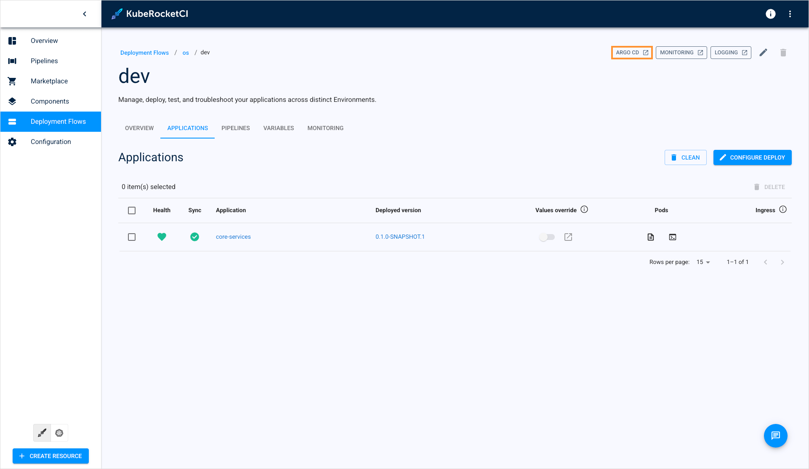
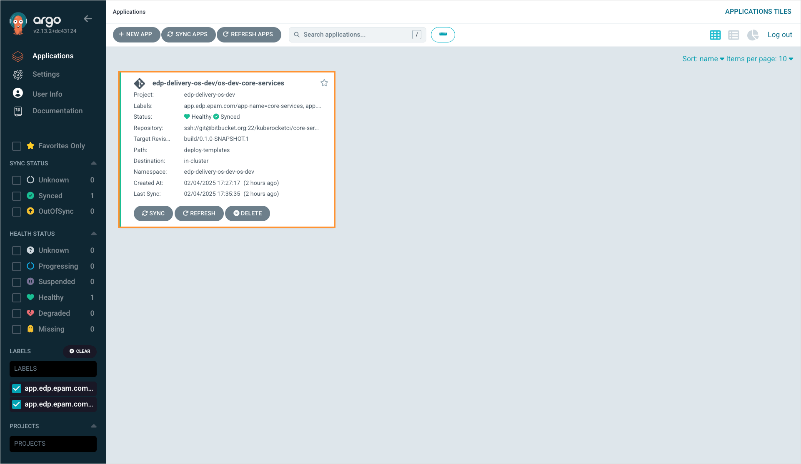
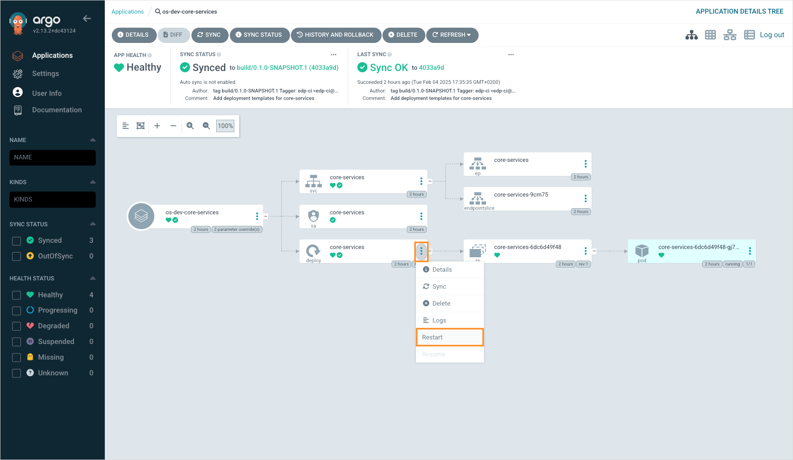

# How to Restart an Application?

<head>
  <link rel="canonical" href="https://docs.kuberocketci.io/faq/how-to/application-deployment/restart-application" />
</head>

To restart an application, follow these steps:

1. Navigate to the desired environment.
2. On the environment details page, click the **Argo CD** button:

    

3. Select the application you want to restart:

    

4. Click the actions button in the deployment block and select restart:

    

5. Once the restart process is complete, ensure that the **Argo CD application status** is **Synced** and **Healthy** to confirm the new version is running successfully.
