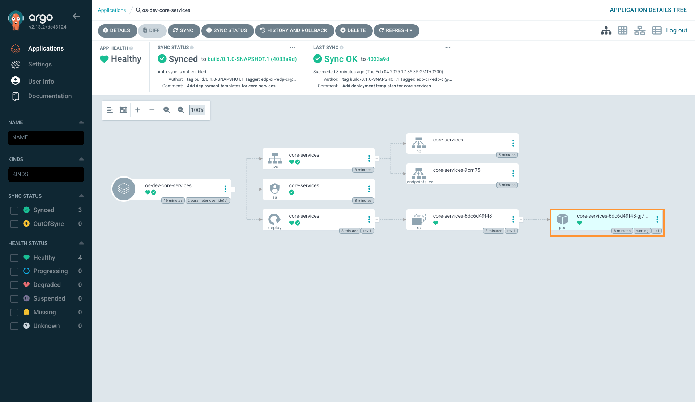
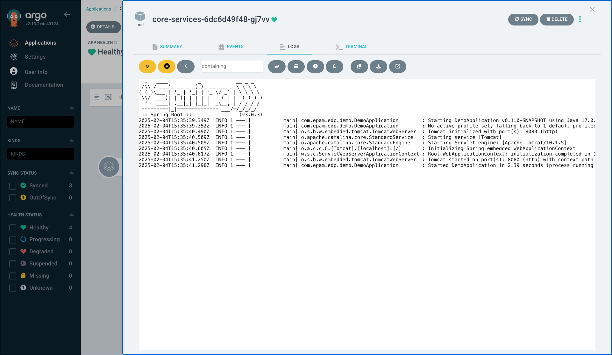

# How Can I Access Application Logs?

<head>
  <link rel="canonical" href="https://docs.kuberocketci.io/faq/how-to/developer/access-application-logs/" />
</head>

There are two options to view application logs:

1. **Using KubeRocketCI portal**: Navigate to the environment details page and click the **Show logs** button in front of the application whose logs you want to view. More information is provided in the [Manage Deployment Flows](/docs/user-guide/manage-environments#troubleshoot-application). This method is preferable when your application is deployed in the same cluster as the platform.
2. **Using a pod's logs window in Argo CD**: This method implies using Argo CD to view the application logs. It is preferable when the application is deployed into a [remote cluster](/docs/user-guide/add-cluster).

To view application logs via Argo CD, follow the steps below:

1. On the environment details page, click the **Argo CD** button.
2. Enter the application whose logs you want to view.
3. Click the pod block to view its details:

    

4. Navigate to the **Logs** tab to view the application logs:

    
