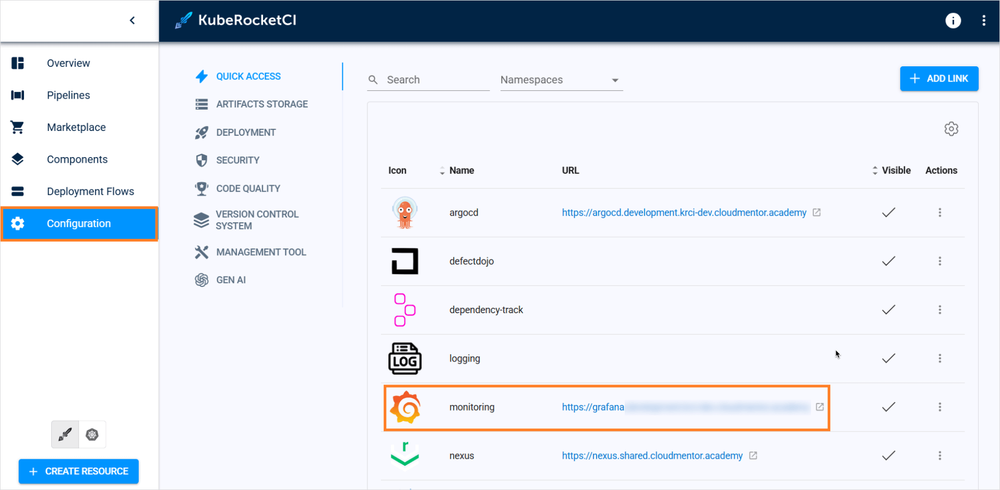

# How to View Grafana Metrics for an Application?

<head>
  <link rel="canonical" href="https://docs.kuberocketci.io/faq/how-to/developer/access-grafana-dashboard" />
</head>

There are two ways to access the Grafana service:

1. To find the Grafana service, navigate to Configuration → Quick Access → Links → Monitoring:

  

You might be asked to log in to the service.

2. You can also get a built-in Grafana Dashboard for the deployed application. Refer to the [Manage Deployment Flows](/docs/user-guide/manage-environments#monitor-application) page for more details.
