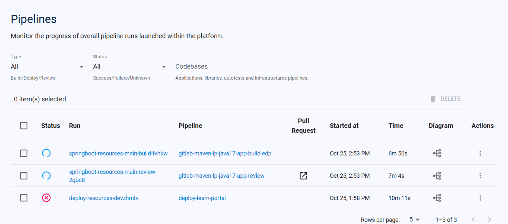
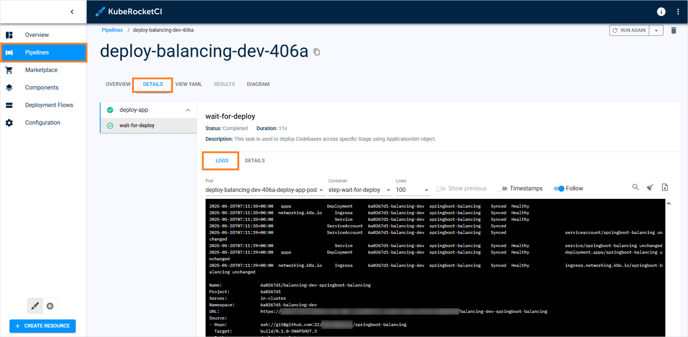
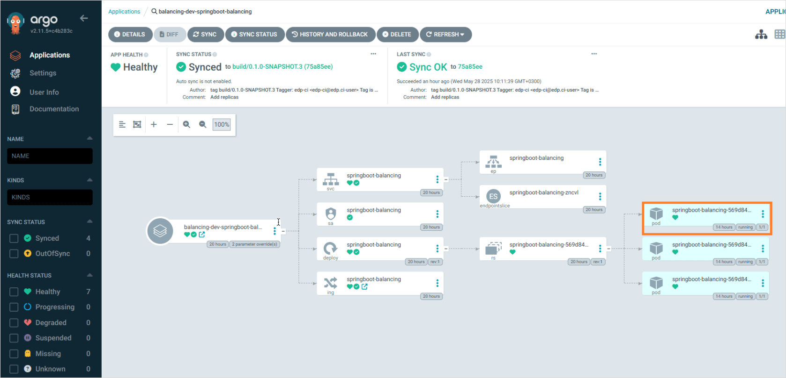
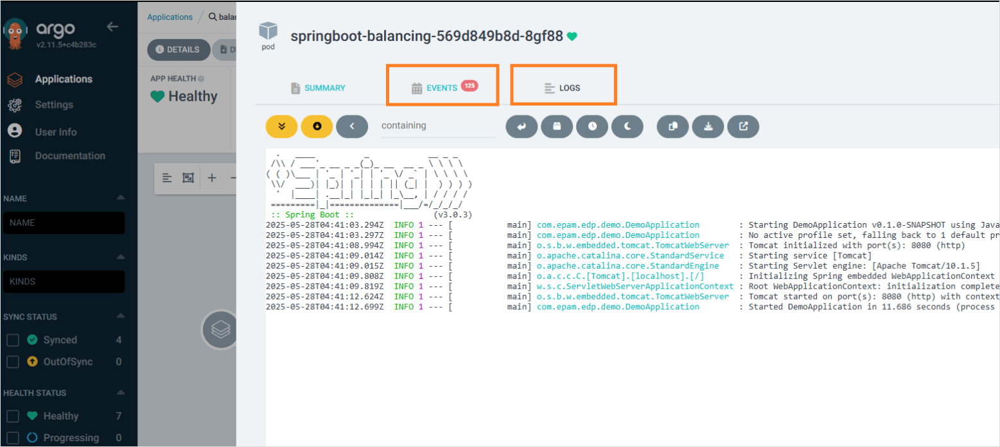

# How to Decrease Pipeline Processing Time?

<head>
  <link rel="canonical" href="https://docs.kuberocketci.io/faq/how-to/developer/pipeline-processing-time" />
</head>

There could be several reasons why the process is long:

1. Check if there was a connection interruption.

2. If the deployment is loading for more than 5-7 minutes - click the **Stop Run** button in the upper right corner and restart it using **Run Again**. For more details, read the [Pipelines Overview](/docs/user-guide/pipelines#operate-with-pipelines) page.

3. Due to finite resources allocated to each cluster, running multiple pipelines in parallel might result in long loading times and usually an error:

    

4. If the issue is related to deploy pipelines, check the correctness of the application's code implemented. If the application does not pass liveness and readiness probes - the pod does not respond, and the loading will be endless. In this case, please check logs:

  In the platform click the PipelineRun name -> Details and then check logs:

    

  You can also check logs in Argo CD:

  1. On the environment details page, click the Argo CD button.
  2. Enter the application whose logs you want to open.
  3. Click the pod block to view its details:

    

  4. Check the **Events** and **Logs** tabs:

    
