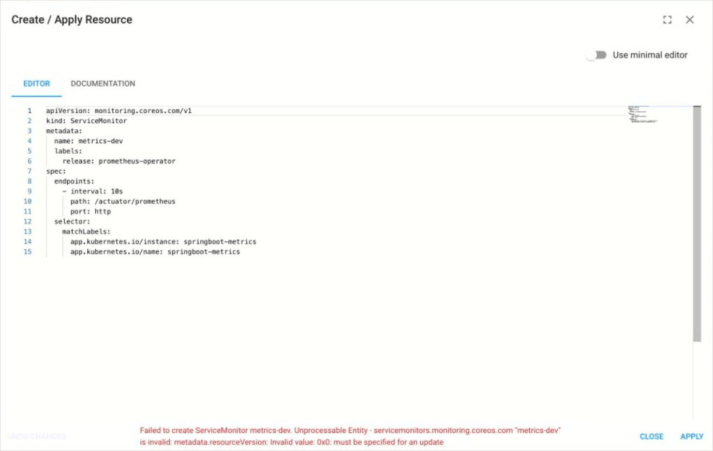
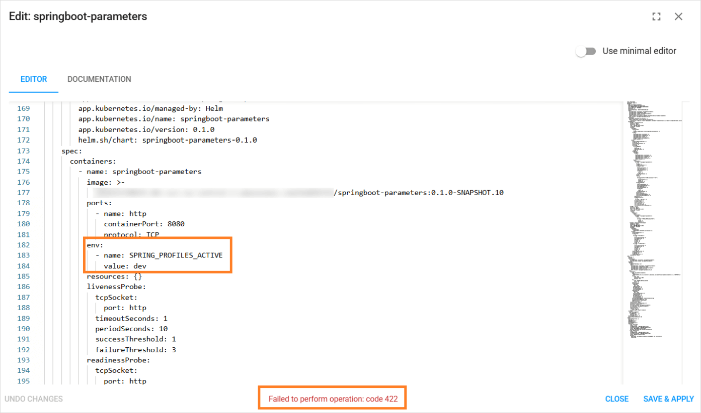

# How to Troubleshoot Issues in the Create Resource Window?

<head>
  <link rel="canonical" href="https://docs.kuberocketci.io/faq/how-to/developer/unprocessable-entity-message" />
</head>

There are a couple of known issues related to the **Create Resource** window:

1. When adding a new object and using the **Create Resource** window, you might get an error like this:

```bash
Failed to create ServiceMonitor metrics-dev. Unprocessable Entity - servicemonitors.monitoring.coreos.com "metrics-dev" is invalid: metadata.
resourceVersion: Invalid value: 0x0: must be specified for an update
```

  

  This is a common error that typically occurs when you try to add a resource or object that **already exists**. Ensure you deleted the resource before creating a new one or change the namespace.

2. Another issue connected with the **Create Resource** window is the **Failed to perform operation: code 422** error:

  

Please note that the YAML format is used.

A YAML file relies on whitespace and indentation to indicate nesting. It is critical to note that tab characters cannot be used for indentation in YAML files;
only spaces can be used. Read the [YAML basics in Kubernetes](https://developer.ibm.com/tutorials/yaml-basics-and-usage-in-kubernetes/) page for more details.
