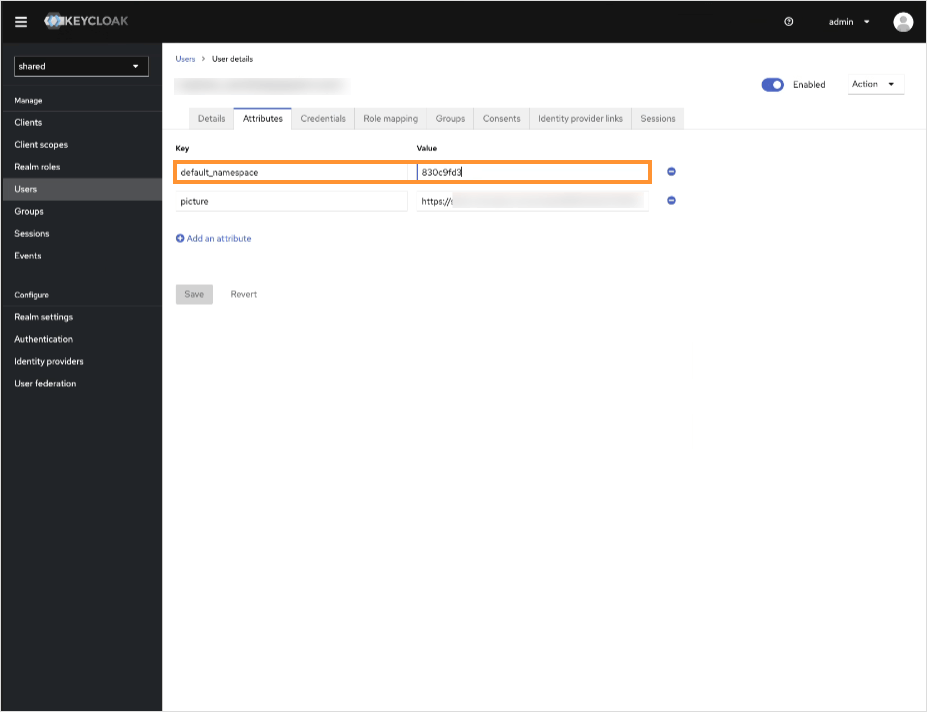

# How Can I Set Namespaces in KubeRocketCI?

<head>
  <link rel="canonical" href="https://docs.kuberocketci.io/faq/how-to/devops/set-namespaces-kuberocketci" />
</head>

There are three ways to define namespaces in KubeRocketCI:

## 1. During Helm Chart Installation

When [installing KubeRocketCI via Helm Chart](/docs/operator-guide/install-kuberocketci), you can specify the namespace during installation:

```bash
helm install krci epamedp/edp-install --wait --timeout=900s \
--version 3.12.3 \
--values values.yaml \
--namespace krci \
--create-namespace
```

The `krci` namespace will be automatically set in the KubeRocketCI portal.

## 2. Via Keycloak User Attributes

If Keycloak is configured and integrated with the platform, you can set the namespace in the Keycloak user attributes:



This method allows you to configure namespaces on a per-user basis through Keycloak's user management interface.

## 3. Manual Configuration

You can also set namespaces manually through the KubeRocketCI portal. For detailed instructions on manual namespace configuration, refer to the [Portal Settings](/docs/user-guide/portal-settings) page.

:::tip
For information about how KubeRocketCI determines the default namespace on first login, see [How Does KubeRocketCI Determine the Default Namespace on First Login?](/faq/how-to/devops/determine-default-namespace-first-login)
:::

