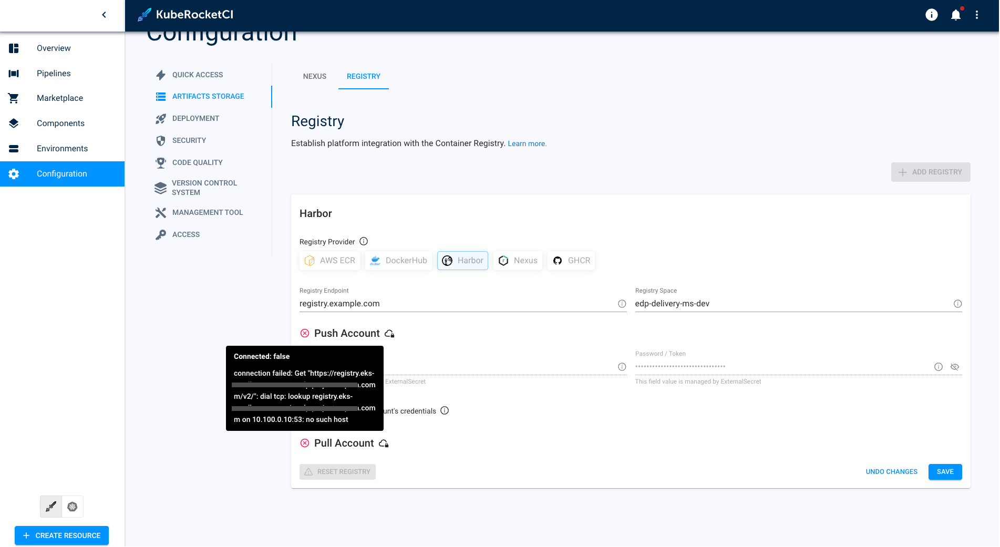

# Container Registry Error

## Problem

Failed to establish a connection with the container registry.

## Cause

The user credentials are incorrect.

## Solution 1 (External Secret Operator)

1. Navigate to Cloud Provider's Management Console.

2. Navigate to `AWS System Manager` -> `Parameter Store`.

3. Update the credentials for the container registry to ensure they are current and have the necessary permissions.

4. Wait for External Secret Operator Credential Update. Allow approximately 2 minutes for the External Secret Operator to detect and implement the credential changes.

## Solution 2 (Manually Provisioned Credentials)

1. In the KubeRocketCI portal navigate **Configuration** -> **Artifacts Storage** -> **Registry**:

2. Modify user credentials, including endpoint, user, or token, to ensure appropriate access rights.

    :::note
      For detailed instructions, visit the [managing container registries.](../../user-guide/manage-container-registries)
    :::

## Related Articles

* [Change Container Registry](https://epam.github.io/edp-install/operator-guide/container-registries/)
