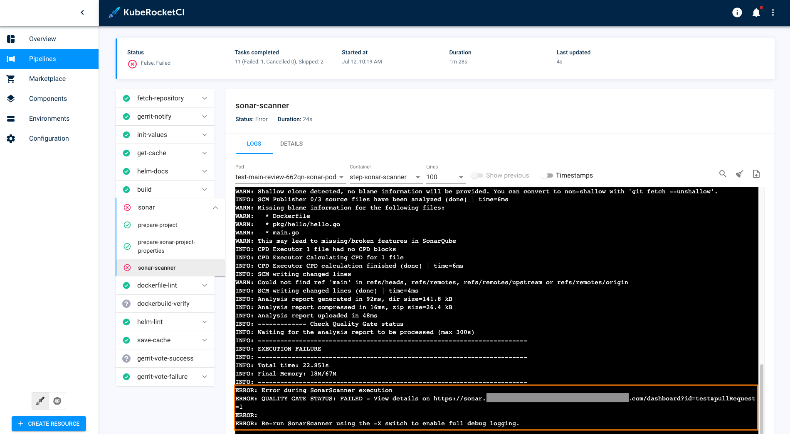
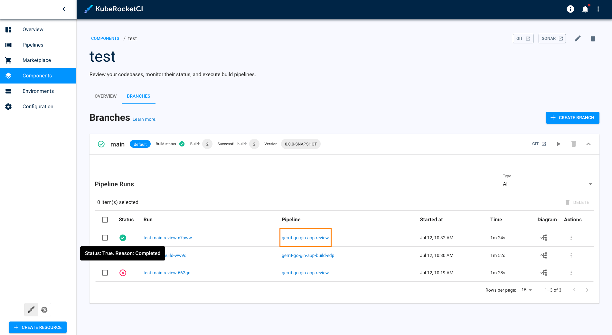

# Review Pipeline is Failed

## Problem

Application can't succeed with review.

  

## Cause

The review pipeline can fail for various reasons related to the Merge Request, including linter errors, scanner issues, tests, and more. The standard approach to troubleshooting involves navigating to the pipeline status to examine the error, and then making adjustments based on the type of error encountered.

## Solution (Sonar Scanner Error)

This error occurs because SonarQube does not have complete source code data and is unable to compare changes from the patch with the main code. To resolve this issue, execute the build pipeline to submit a comprehensive report of the source code to SonarQube.

1. Navigate to your application in KubeRocketCI portal.

2. In the main branch section, click the **Trigger build pipeline run** button to run scanning of full repository.

3. After successful finished build pipeline - re-trigger review pipeline, for example by using `/recheck` (or `/ok-to-test`) feature.

    

## Related Articles

* [Create Application](../../quick-start/create-application.md)
* [SonarQube Integration](../code-quality/sonarqube.md)
