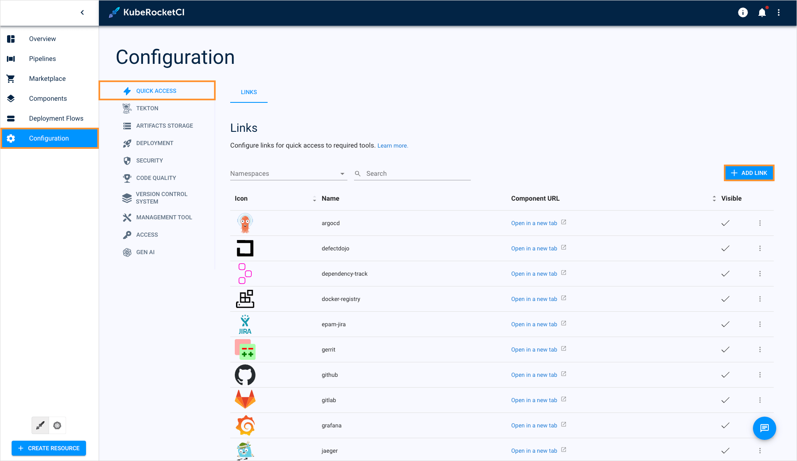
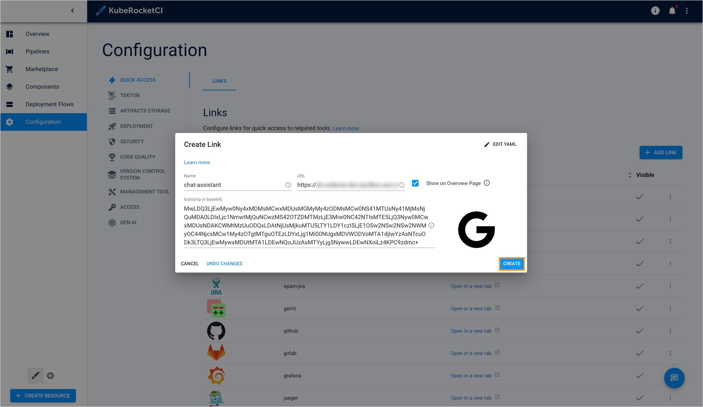
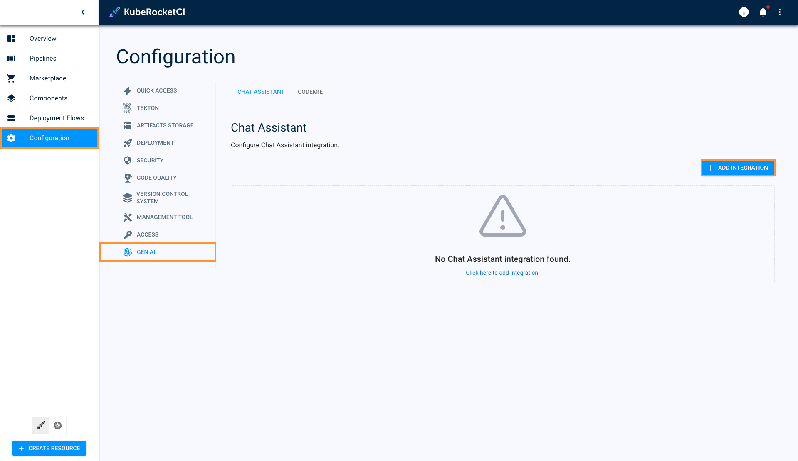
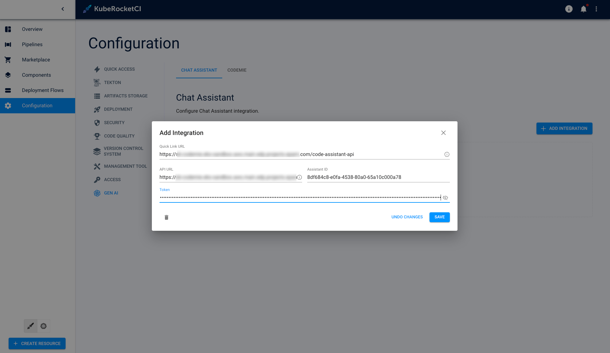
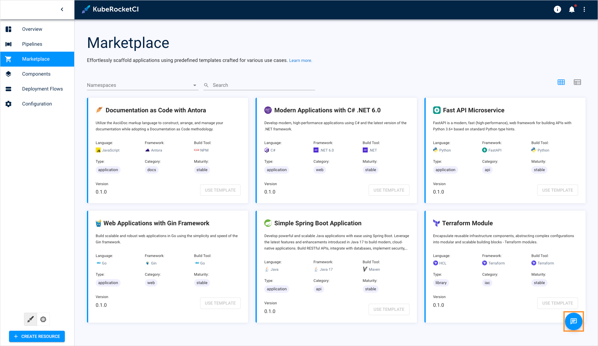
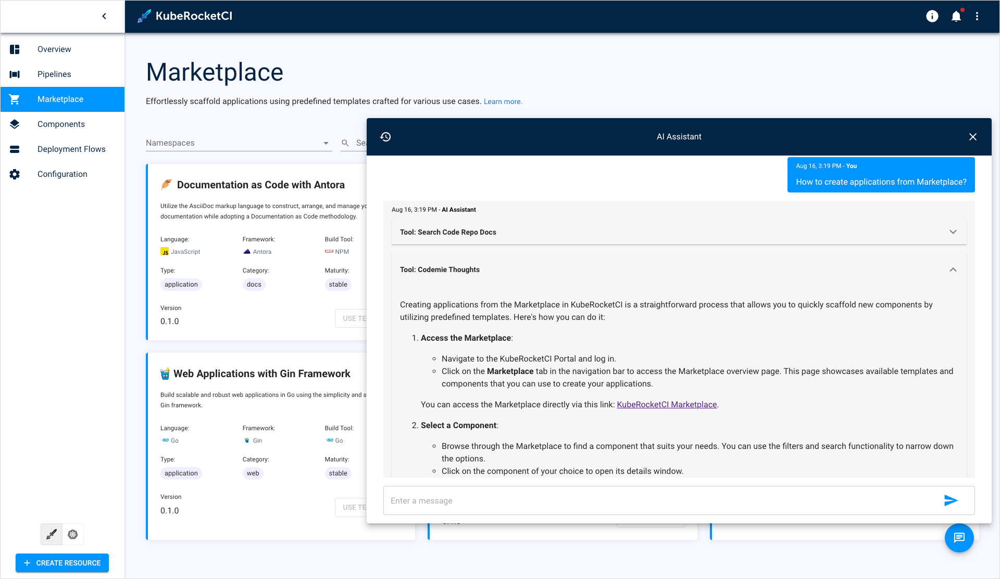
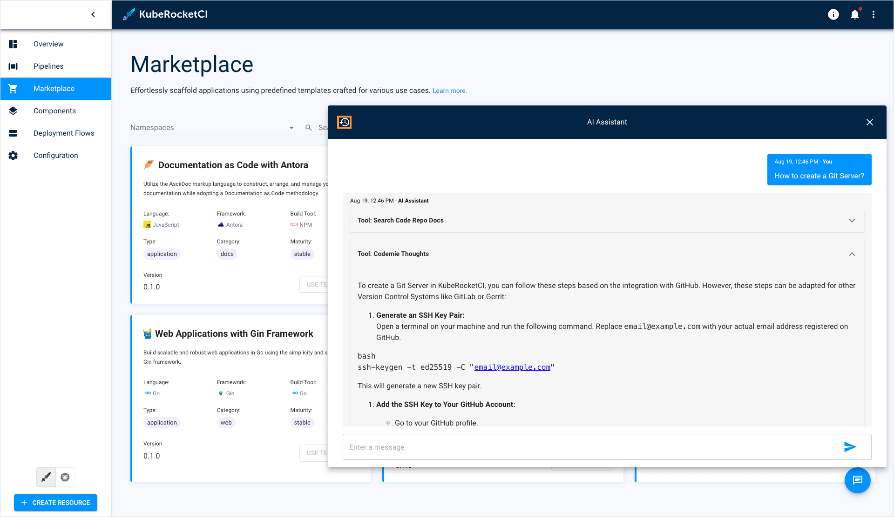

# Add Gen AI Assistant

The KubeRocketCI portal allows you to connect the platform with a third-party AI assistant, enabling its use within the platform. This integration assists by providing platform-related information and answering any questions in the chat. The assistant's configuration is performed via the Configuration tab in the Gen AI section.

## Prerequisites

This option requires you to have your AI assistant configured on a dedicated instance first. Besides, assistant should be set up in the way it will have the [KubeRocketCI documentation](https://github.com/KubeRocketCI/docs) data indexed and added to the assistant's context. Therefore, before starting the integration procedure, ensure that your Gen AI instance is set up properly.

## Set Up Integration

To integrate the AI assistant, follow the steps below:

1. Navigate to **KubeRocketCI** -> **Configuration** -> **Gen AI** and click the **+ Add link** button:

  

2. Fill in the fields and click **Create**:

  

3. Navigate to **KubeRocketCI** -> **Configuration** -> **Gen AI** and click the **+ Add integration** button:

  

4. Fill in the required fields:

    * **Quick Link URL** - This link will be attached to the quick links presented on the KubeRocketCI portal main page. It should lead to the Gen AI instance endpoint.
    * **API URL** - This is the URL address of the assistant's API server.
    * **Assistant ID** - Enter the ID of a dedicated assistant that will be used to interact with you.
    * **Token** - This token will be used to get authorized access to your Gen AI instance. Ensure that sufficient permissions are set so that the platform can interact with the assistant using this token.

  

5. Click the **Save** button.

## Verify Integration

As soon as the integration procedure is completed, click the AI chat button at the bottom-right corner of the screen:

  

Type something in the chat to make sure the assistant works properly:

  

When you close the chat and reopen it, a new chat begins. You can see the chat history by clicking the clock icon:

  

You can also create another chat by clicking the **+ New chat** button:

  

Depending on the assistant's settings, it will be able to provide platform-related guidance, such as how to onboard a library or deploy an application, and address any questions you may have.
