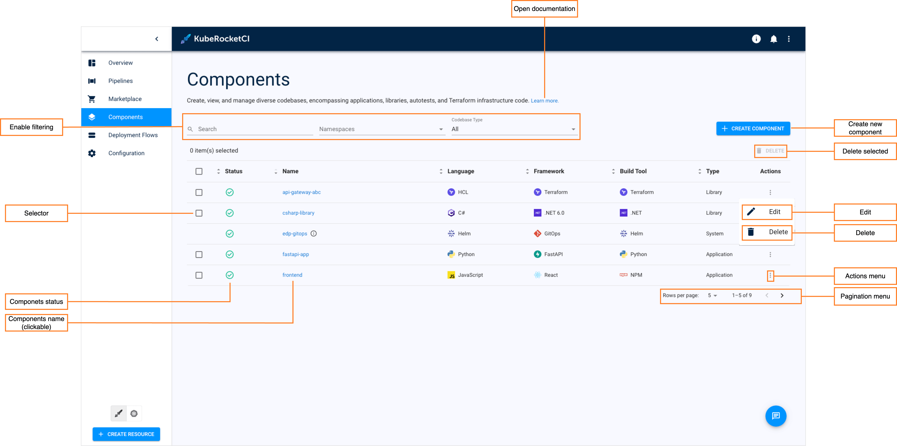
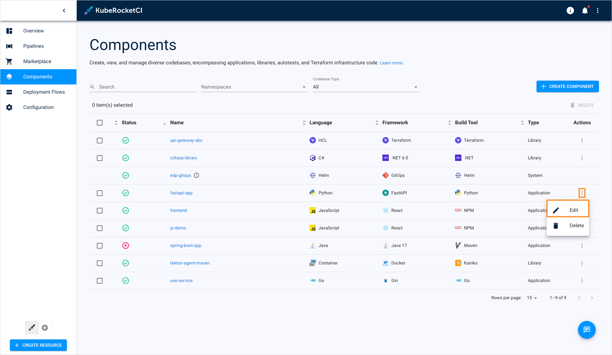
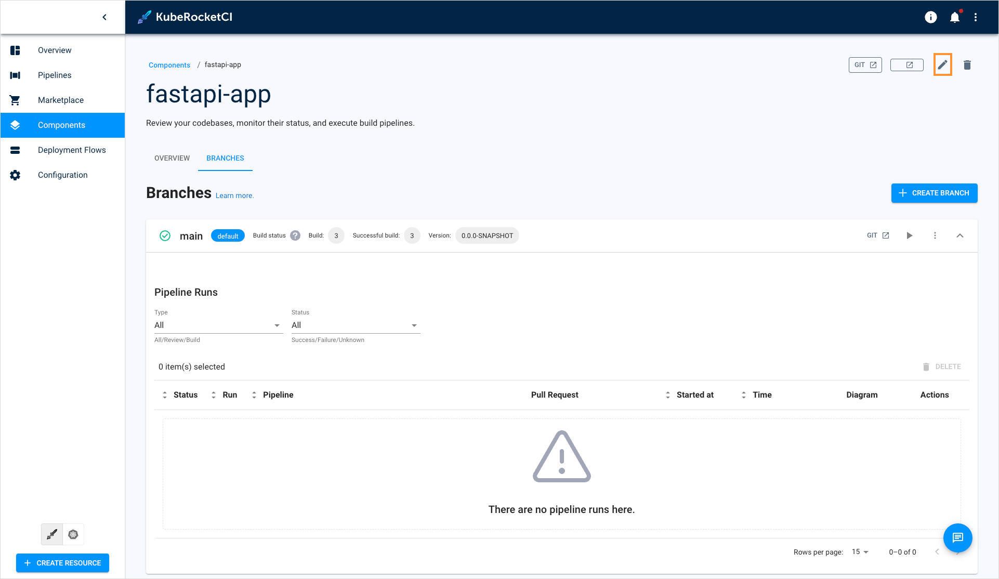
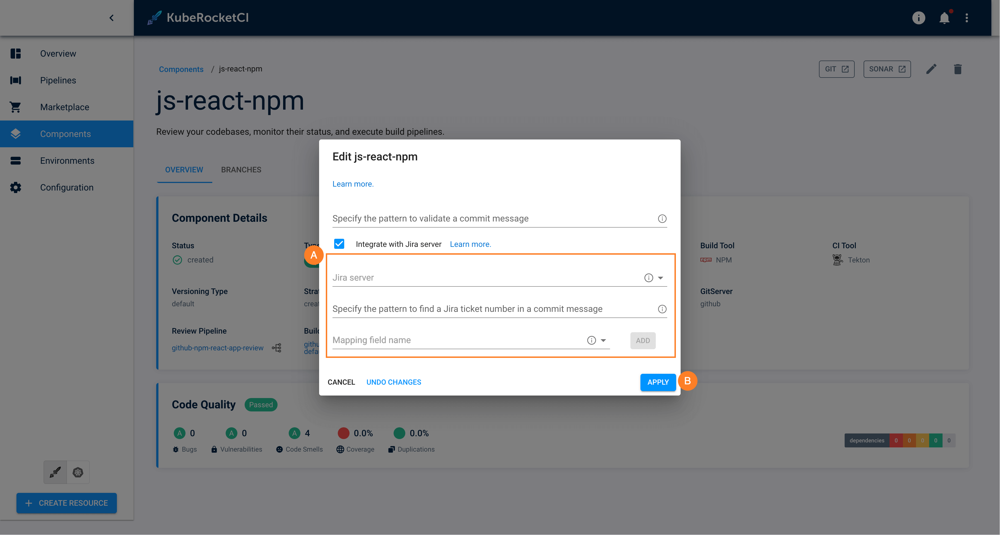

# Manage Applications

This section describes the subsequent possible actions that can be performed with the newly added or existing applications.

## Check and Remove Application

As soon as the application is successfully provisioned, the following will be created:

* An Application Codebase type will appear in the Codebase list of the Components section.
* With the **Create** strategy, a new project will be generated on GitHub or another integrated VCS. When **Clone** is chosen, the repository will be forked from the original and copied to the KubeRocketCI-integrated repository. If **Import** is selected, the platform connects to the chosen repository.

The added application will be listed in the Applications list allowing you to do the following:

* **Component status** - displays the application status. Can be red or green depending on if the KubeRocketCI portal managed to connect to the Git Server with the specified credentials or not.
* **Component name (clickable)** - displays the application name set during the application creation.
* **Open documentation** - opens the application related documentation page.
* **Enable filtering** - enables filtering by application name and namespace where this custom resource is located in.
* **Create new application** - displays the **Create new component** menu.
* **Selector** - Allows you to select multiple applications for bulk actions.
* **Delete selected** - Deletes all selected applications. This option is only available when one or more applications are selected using the **Selector**.
* ***Actions menu** provides additional options for each individual application:
* **Edit** - Allows you to modify the application's settings. You can access this option by clicking the options icon (vertical ellipsis) next to the application's name in the list, and then selecting **Edit**. For more details, see the [Edit Existing Application](#edit-existing-application) section.
* **Delete** - Removes the application from the KubeRocketCI portal. You can access this option by clicking the options icon (vertical ellipsis) next to the application's name in the list, and then selecting **Delete**.

  :::warning
    The application that is used in a CD pipeline cannot be removed.
  :::

There are also options to sort the applications:

* **Pagination menu** - select a number of applications displayed per page (15, 25 or 50 rows) and navigate between pages if the number of applications exceeds the capacity of a single page.

* **Enable filtering** - sort the existing applications in a table by clicking the sorting icons in the table header. Sort the applications alphabetically by their name, language, build tool, framework, and CI tool. You can also sort the applications by their status: Created, Failed, or In progress.

## Edit Existing Application

KubeRocketCI Portal provides the ability to enable, disable or edit the Jira Integration functionality for applications.

1. To edit an application directly from the Applications overview page or when viewing the application data:

    * Select **Edit** in the options icon menu:

    

    

    * The Edit Application dialog opens.

2. To enable Jira integration, in the **Edit Application** dialog do the following:

    

    a. Mark the **Integrate with Jira server** check box and fill in the necessary fields. Please see steps d-h of the [Add Application](add-application.md) page.

    b. Select the **Apply** button to apply the changes.

3. To disable Jira integration, in the **Edit Application** dialog do the following:

    a. Clear the **Integrate with Jira server** check box.

    b. Select the **Apply** button to apply the changes.

4. To create, edit and delete application branches, please refer to the [Manage Branches](../user-guide/manage-branches.md) page.

## Related Articles

* [Add Application](add-application.md)
* [Manage Branches](../user-guide/manage-branches.md)
