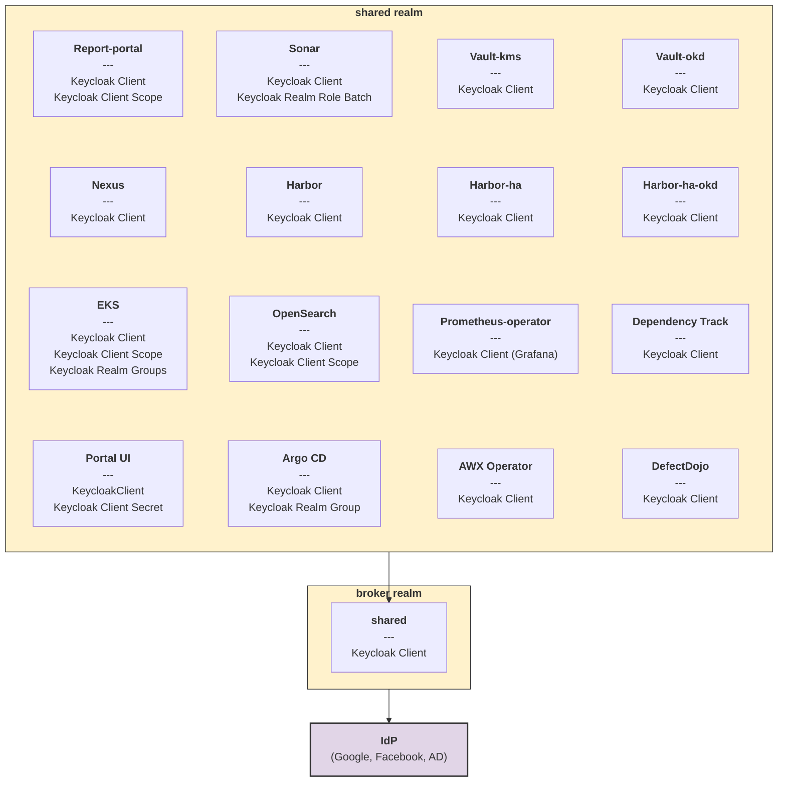
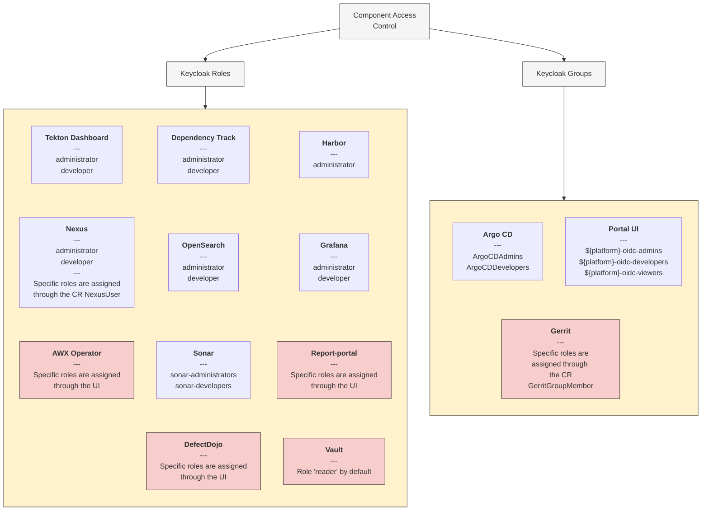

# Overview

<head>
  <link rel="canonical" href="https://docs.kuberocketci.io/docs/operator-guide/auth/platform-auth-model/" />
</head>

KubeRocketCI uses [Keycloak](https://keycloak.org) as central access management solution, handling user permissions across various platform tools, including Kubernetes. Kubernetes clusters leverage Keycloak for RBAC implementation via [OIDC](https://kubernetes.io/docs/reference/access-authn-authz/authentication/). This consistent approach allows administrators to manage access uniformly.
Within Kubernetes, [Custom Resources (CRs)](https://kubernetes.io/docs/concepts/extend-kubernetes/api-extension/custom-resources/) are used to refine and enforce access controls by [configuring Keycloak](https://operatorhub.io/operator/edp-keycloak-operator), translating Kubernetes configurations into Keycloak access policies.

## Keycloak Components Overview

Keycloak is a critical component in KubeRocketCI for managing authentication and authorization. It uses realms, roles and groups to control access across the platform.

The diagram below illustrates the Keycloak resources within the KubeRocketCI system. It shows how tools and their Keycloak configurations are managed within the `shared` and `broker` realms. The `broker` realm serves as a central "authentication proxy" (broker), connecting to external Identity Providers (IdPs) such as Google, Facebook, and Active Directory (AD) through OIDC and/or SAML protocols. The `shared` realm consolidates platform tools such as Argo CD, Nexus Repository, SonarQube, Report-portal, Harbor, and others as OIDC (OpenID Connect) clients.

Each component can have its own unique configurations, including Keycloak roles, groups, or client scopes.



## Keycloak Roles and Groups

The diagram below provides an overview of the access control mechanisms for various tools integrated with Keycloak.
It illustrates two primary methods of managing user access: [Keycloak roles](#roles) and [Keycloak groups](#groups).



Components, highlighted in red, require additional configuration directly within the tool's UI.

:::info
  `${platform}` is a placeholder for the platform name (namespace), where the KubeRocketCI is deployed.
:::

For detailed instructions on setting up OIDC integration for various components, please refer to the following articles:

1. **AWX** - [Community Documentation](https://ansible.readthedocs.io/projects/awx/en/latest/)
2. **DefectDojo** - [DefectDojo Permissions](https://docs.defectdojo.com/en/customize_dojo/user_management/configure_sso/#keycloak)
3. **Nexus** - [Nexus authentication process](#nexus-repository-manager)
4. **Report Portal** - [Report Portal Keycloak Integration](../project-management-and-reporting/reportportal-keycloak.md)
5. **Vault** - [OIDC provider configuration](https://developer.hashicorp.com/vault/docs/auth/jwt/oidc-providers/keycloak)
6. **Tekton** - [Tekton Dashboard Authentication](oauth2-proxy.md)
7. **Gerrit** - [Gerrit Authentication](#gerrit)

### Roles

The `shared` Keycloak realm defines two composite roles:

* **Administrator Role**:
  * Designed for users who need administrative access to the tools used on the platform.
  * This composite role includes the `administrator` and `sonar-administrators` roles.
  * Users assigned the `administrator` composite role will inherit both roles.

* **Developer Role**:
  * Designed for users who need access to the development tools used on the platform.
  * This composite role includes the `developer` and `sonar-developers` roles.
  * Users assigned the `developer` composite role will inherit both roles.

These composite roles simplify the assignment of administrative and development permissions within the KubeRocketCI.

The table below provides an overview of the `shared` realm roles and their types:

| Realm Role Name | Regular Role | Composite role |
| - | :-: | :-: |
| administrator | | :white_check_mark: |
| developer | | :white_check_mark: |
| sonar-administrators | :white_check_mark: | |
| sonar-developers | :white_check_mark: | |

### Groups

KubeRocketCI uses the `shared` realm for group management. The [groups](https://github.com/epam/edp-install/tree/master/deploy-templates/templates/rbac) are designed to control access to various components such as Argo CD, the KubeRocketCI portal, and the EKS cluster.

| Group Name          | Purpose                                                                    |
|---------------------|----------------------------------------------------------------------------|
| `ArgoCDAdmins`        | Administrator access to Argo CD instance                                |
| `ArgoCD-${platform}-users`    | Access to the Argo CD project mapped to the `${platform}` tenant                                |
| `oidc-cluster-admins` | Full administrator (cluster-admin) access to the kubernetes cluster     |
| `${platform}-oidc-admins`     | Administrator access to KubeRocketCI                               |
| `${platform}-oidc-developers` | Developer access to KubeRocketCI |
| `${platform}-oidc-viewers`    | Read-only access to view resources in KubeRocketCI                |

These groups simplify the management of permissions and ensure that users have the appropriate level of access based on their roles and responsibilities.

## SonarQube OIDC

Access to SonarQube is managed through configurations in Keycloak (Keycloak Operator) and SonarQube (Sonar Operator). This section provides a detailed walkthrough for configuring access control.

### Keycloak Configuration

SonarQube access is managed using Keycloak roles within the `shared` realm:

* **sonar-developers**: Grants developer access to SonarQube.
* **sonar-administrators**: Grants administrative access to SonarQube.

To grant access, the appropriate role must be assigned to the user in Keycloak.

:::note Example
  A user who needs developer access to SonarQube should be assigned the `sonar-developers` role or the `developer` composite role in Keycloak.
:::

### SonarQube Configuration

[KubeRocketCI Sonar Operator](https://github.com/epam/edp-sonar-operator) provides a [SonarQube Permission Template](https://docs.sonarsource.com/sonarqube-server/latest/instance-administration/system-functions/security/) to manage user access and permissions for SonarQube projects.

The template is stored in the SonarQube [custom resource](https://github.com/epam/edp-sonar-operator/blob/master/deploy-templates/_crd_examples/permission_template.yaml) of the operator. An example of a custom resource is shown below.

:::note Sonar Permission Template

 ```yaml
 apiVersion: v2.edp.epam.com/v1
 kind: SonarPermissionTemplate
 metadata:
   name: edp-default
 spec:
   name: edp-default
   description: "KubeRocketCI permission templates (DO NOT REMOVE)"
   projectKeyPattern: ".+"
   default: true
   groupsPermissions:
     view-group:
       - user
     sonar-developers:
       - user
       - securityhotspotadmin
       - issueadmin
       - codeviewer
     sonar-administrators:
       - admin
       - user
   sonarRef:
     name: sonar
 ```

:::

The SonarQube Permission Template defines three groups: `view-group`, `sonar-administrators`, and `sonar-developers`:

* **view-group**: Users who have read-only access to the project. They can view project's data and metrics but cannot modify or interact with it.
* **sonar-administrators**: Users with full control over the SonarQube project. They can create, modify, delete projects, manage user access, and configure SonarQube settings.
* **sonar-developers**: Users actively working on the SonarQube project. They have read and write access, can modify project data and metrics, and configure project-specific settings.

These groups provide different levels of access based on the user's role and responsibilities.

:::info
 If a user is not assigned to any group, they will be placed in the `sonar-users` group by default. This group does not have any permissions in the `edp-default` Permission Template.
:::

### Group Permissions

The following table describes the permissions assigned to each group:

| Group Name               | Sonar Permissions                             |
|--------------------------|-----------------------------------------------|
| view-group    | user                                          |
| sonar-administrators     | admin, user                                   |
| sonar-developers         | codeviewer, issueadmin, securityhotspotadmin, user |
| sonar-users              | -                                             |

## Nexus Repository Manager

KubeRocketCI leverages oauth2-proxy to authenticate users in Nexus Repository Manager OSS.

The user's access level is determined by the roles assigned in Keycloak.

:::info
  Only users with either the `administrator` or `developer` role in Keycloak can access Nexus.
:::

The platform manages two distinct roles: `edp-admin`, `edp-viewer`.

:::note Example of edp-admin NexusRole and NexusUser

  ```yaml
  apiVersion: edp.epam.com/v1alpha1
  kind: NexusRole
  metadata:
    name: edp-admin
  spec:
    id: edp-admin
    nexusRef:
      name: nexus
      kind: Nexus
    name: edp-admin
    description: Read and write access to all repos and scripts
    privileges:
      - nx-apikey-all
      - nx-repository-view-*-*-add
      - nx-repository-view-*-*-browse
      - nx-repository-view-*-*-edit
      - nx-repository-view-*-*-read
      - nx-script-*-add
      - nx-script-*-delete
      - nx-script-*-run
      - nx-search-read
  ```

  ```yaml
  apiVersion: edp.epam.com/v1alpha1
  kind: NexusUser
  metadata:
    name: ci-user
    namespace: nexus
  spec:
    email: ci.user@edp.com
    firstName: ci.user
    id: ci.user
    lastName: CI
    nexusRef:
      kind: Nexus
      name: nexus
    roles:
      - edp-admin
    secret: $ci-nexus:password
    status: active
  ```

:::

## KubeRocketCI Portal and Kubernetes Cluster

Both the KubeRocketCI Portal and the Kubernetes cluster use Keycloak groups for access control. Users must be added to the appropriate group in Keycloak to gain access. These groups are configured in the `broker` realm.

:::warning
  For the Kubernetes cluster to manage access control correctly, Keycloak must be configured as an OpenID Connect (OIDC) provider. Ensure that your Keycloak setup is properly [configured for OIDC](./configure-keycloak-oidc-eks.md) before proceeding.
:::

:::info
  The `broker` realm keeps Kubernetes OIDC client.
:::

### Keycloak Groups

| Group Name | View | Build | Deploy | Full Namespace Access |
| - | :-: | :-: | :-: | :-: |
|`${platform}-oidc-admins`    | :white_check_mark: | :white_check_mark: | :white_check_mark: | :white_check_mark: |
|`${platform}-oidc-developers`| :white_check_mark: | :white_check_mark: | :white_check_mark: | |
|`${platform}-oidc-viewers`   | :white_check_mark: | | | |

### Cluster RBAC Resources

The platform defines five RoleBindings that grant the necessary permissions to the corresponding Keycloak groups mentioned above.

| RoleBinding Name| Role Name | Groups |
| - | - | - |
| tenant-admin | cluster-admin | `${platform}-oidc-admins` |
| tenant-developer | tenant-developer | `${platform}-oidc-developers` |
| tenant-viewer | view | `${platform}-oidc-viewers` , `${platform}-oidc-developers` |

Platform includes RBAC settings for the full cluster administration privileges.

| Cluster Role Binding Name| Cluster Role Name | Group |
| - | - | - |
| cluster-admin | cluster-admin | `oidc-cluster-admins` |

:::note
  KubeRocketCI provides an [aggregated](https://kubernetes.io/docs/reference/access-authn-authz/rbac/#aggregated-clusterroles) ClusterRole `edp-aggregate-view-${platform}` with the permissions to view the KubeRocketCI [custom resources](../../api/overview.md).
:::

:::info
  The `tenant-admin` RoleBinding is created in a namespace by the `cd-pipeline-operator`. The `tenant-admin` RoleBinding assigns the `admin` role to the `${platform}-oidc-admins` and `${platform}-oidc-developers` groups.
:::

### Grant User Access to the Created Namespaces

To provide users with admin or developer privileges for project namespaces, they need to be added to the `${platform}-oidc-admins` and `${platform}-oidc-developers` groups in Keycloak.

## Argo CD

In Argo CD, groups are specified when creating an AppProject to restrict access to deployed applications. To gain access to deployed applications within a project, users must be added to the corresponding Argo CD group in Keycloak. This ensures that only authorized users can access and modify applications within the project.

:::info
  By default, only the `ArgoCDAdmins` group is automatically created in Keycloak.
:::

## Gerrit

Users should authenticate to Gerrit using their Keycloak credentials.

After logging into Gerrit, users are not automatically assigned to any groups. To add a user to a group, a `GerritGroupMember` custom resource must be created. This custom resource specifies the user's email address and the name of the group to which they should be added.

Below is an example of a `GerritGroupMember` custom resource:

:::note Gerrit Group Member

 ```yaml
 apiVersion: v2.edp.epam.com/v1
 kind: GerritGroupMember
 metadata:
   name: user-admins
 spec:
   accountId: user@user.com
   groupId: Administrators
 ```

:::

Once the `GerritGroupMember` resource is created, the user will inherit the permissions and access levels associated with the specified group.

## Related Articles

* [KubeRocketCI Portal Overview](../../user-guide/index.md)
* [EKS OIDC With Keycloak](configure-keycloak-oidc-eks.md)
* [Argo CD Integration](../cd/argocd-integration.md)
