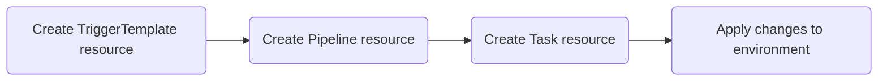

<!-- markdownlint-disable MD025 -->

# Customize Environment Cleanup

<head>
  <link rel="canonical" href="https://docs.kuberocketci.io/docs/operator-guide/cd/customize-environment-deletion/" />
</head>

KubeRocketCI provides capabilities to fully operate the CI/CD flow, starting from building applications to deploying its new release. The operation flow is designed to be seamless for most of the users. However, there may be cases where more specialized actions are necessary. These might include custom procedures for managing the deletion of application resources.

## Create Custom Clean Pipeline

Delete pipeline is a typical Tekton pipeline but with its own instructions. The custom delete pipeline creation involves the following steps:



Clear pipeline consists of **Trigger Template**, **Pipeline**, and **Task** custom resources. To create a custom clean pipeline, follow the steps below:

1. Create and apply the **TriggerTemplate** custom resource. Refer to the example [TriggerTemplate](https://github.com/epam/edp-tekton/blob/master/charts/pipelines-library/templates/triggers/cd/clean.yaml). Ensure to set the appropriate pipeline type in the labels:

  ```bash
  ...
  labels:
      app.edp.epam.com/pipelinetype: clean
  ...
  ```

2. Create and apply the **Pipeline** custom resource. Refer to the example [Pipeline](https://github.com/epam/edp-tekton/blob/master/charts/pipelines-library/templates/pipelines/cd/clean.yaml). Ensure to set the concrete task to trigger:

  ```bash
  ...
  spec:
    taskRunTemplate:
      serviceAccountName: tekton
    pipelineRef:
      name: clean-custom
  ...
  ```

  Additionally, set the concrete task to run:

  ```bash
  tasks:
    - name: clean
      taskRef:
        kind: Task
        name: clean-custom
  ```

3. Create and apply the **Task** custom resource. Refer to the example [Task](https://github.com/epam/edp-tekton/blob/master/charts/pipelines-library/templates/tasks/cd/clean.yaml).

## Enable Clean Pipeline

As soon as all the three custom resources are correctly configured and applied, you can select the newly created pipeline in the KubeRocketCI portal.

### New Environments

To apply the newly created clean pipeline to your environments, follow the steps below:

1. In the deployment flow details page, click the **Add environment** button:

  

2. In the **Add environment** window, select the custom clean pipeline:

  

### Existing Environments

If you need to change the delete pipeline in an already existing environment, follow the steps below:

1. Navigate to the environment details page and click the **Edit** button:

  

2. In the **Add environment** window, select the custom clean pipeline:

  

As soon as the clean pipeline is created and selected within an environment, you can trigger it by clicking the **Clean** button.

## Related Articles

* [Customize Deploy Pipeline](../../operator-guide/cd/customize-deploy-pipeline.md)
* [Add Deployment Flow](../../user-guide/add-cd-pipeline.md)
* [Manage Deployment Flows](../../user-guide/manage-environments.md)
