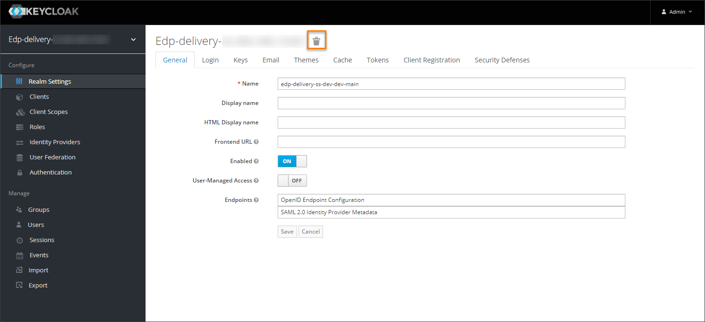

# Restore KubeRocketCI Tenant With Velero

<head>
  <link rel="canonical" href="https://docs.kuberocketci.io/docs/operator-guide/disaster-recovery/velero-restore-platform/" />
</head>

You can use the Velero tool to restore a platform tenant. Explore the main steps for backup and restoring below.

1. Delete all related entities in **Keycloak**: realm and clients from **master/openshift** realms. Navigate to the entities list in the Keycloak, select the necessary ones, and click the deletion icon on the entity overview page.
    If there are customized configs in Keycloak, save them before making backup.

    

2. To restore KubeRocketCI, install and configure the Velero tool. Please refer to the [Install Velero](install-velero.md) documentation for details.

3. Remove all locks for operators. Delete all config maps that have `<OPERATOR_NAME>-operator-lock` names. Then restart all pods with operators, or simply run the following command:

    ```bash
    kubectl -n edp delete cm $(kubectl -n edp get cm | grep 'operator-lock' | awk '{print $1}')
    ```
