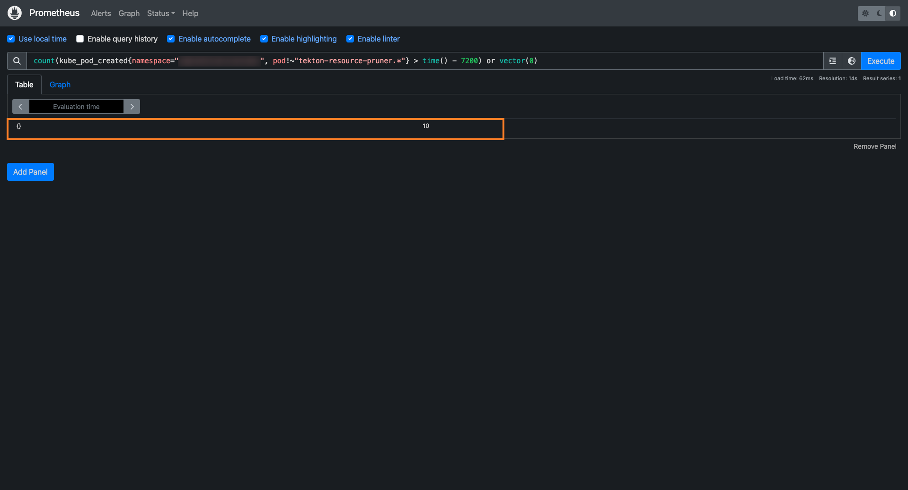
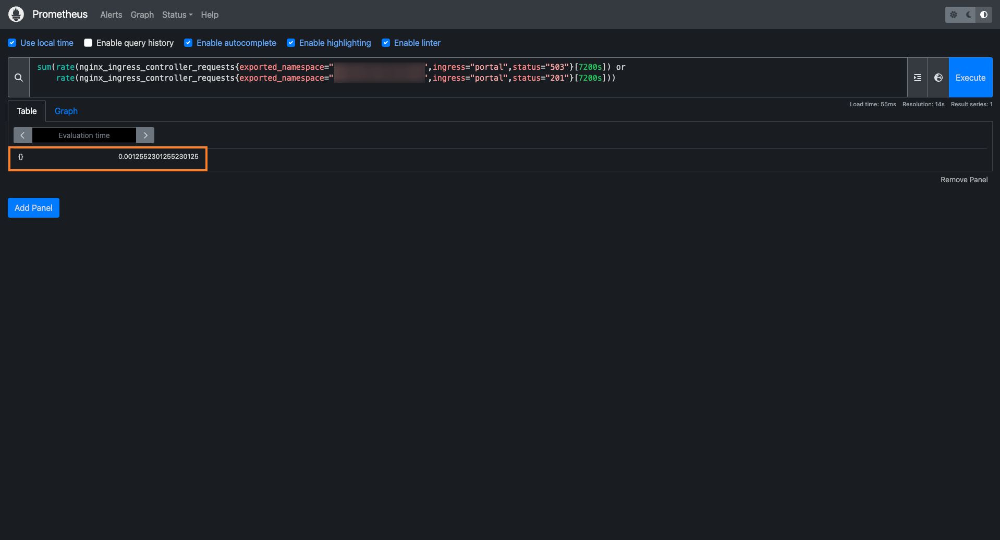

# Namespace And Cluster Autoscaling 

In modern cloud environments, efficient resource management is essential to maintain performance while minimizing costs. This documentation provides a step-by-step guide to configuring **pods and cluster autoscaling** in a Kubernetes environment using **Karpenter** and **KEDA**.  

Karpenter dynamically provisions and removes nodes based on real-time demand, ensuring that the cluster has just the right amount of capacity. KEDA, on the other hand, scales workloads by adjusting pod replicas based on key metrics, such as pipeline activity and user requests.  

By implementing this approach, the cluster remains responsive to workload fluctuations, preventing over-provisioning and reducing unnecessary resource usage. This results in a **cost-effective, scalable, and efficient** infrastructure that adapts to real-time demands without manual intervention.  

## Prerequisites

Before setting up AutoScaling, ensure the following requirements are met:  

- [**Prometheus is installed**](https://github.com/epam/edp-cluster-add-ons/tree/main/clusters/core/addons/prometheus-operator) and exporting cluster metrics.  
- [**Nginx Ingress is installed**](https://github.com/epam/edp-cluster-add-ons/tree/main/clusters/core/addons/ingress-nginx) and configured to export its [metrics](https://github.com/epam/edp-cluster-add-ons/blob/main/clusters/core/addons/ingress-nginx/values.yaml#L38) to Prometheus.  

## Karpenter

The configuration and installation of Karpenter involve several steps, including:  
- **Setting up resources in the AWS provider** – configuring IAM roles, permissions, and networking.  
- **Installing the Karpenter Helm chart** – deploying Karpenter controller in the Kubernetes cluster.  
- **Configuring essential components** – setting up `Node Pools` and `Node Class`, and integrating with cluster resources.  


### AWS Configuration

To ensure Karpenter can properly manage node provisioning, it is essential to configure AWS resources correctly. This includes:  
- **Creating IAM roles and policies** – Karpenter requires specific permissions to provision and manage EC2 instances.  
- **Tagging VPC Subnets and Security Groups** – Karpenter uses these tags to determine which network subnets and security groups to apply when creating new nodes.

:::info  
Karpenter does not use Auto Scaling Groups (ASG) when creating new nodes. Instead, it provisions EC2 instances directly and registers them with the cluster.  
:::

1. IRSA Configuration

    To allow Karpenter to interact with AWS services securely, configure IAM Roles for Service Accounts (IRSA). This configuration can be done automatically during cluster installation using a [terraform-aws-platform](https://github.com/KubeRocketCI/terraform-aws-platform/blob/master/eks/irsa.tf#L143) template or **manually** after the cluster is deployed.  


2. Network and Security Groups Configuration

    Ensure that the required tags are added to VPC `subnets` and `security group` so Karpenter can use them for provisioning new nodes.

    ```hcl
    module "vpc" {
      source  = "terraform-aws-modules/vpc/aws"
      version = "5.1.2"

      private_subnet_tags = merge(var.tags, tomap({ "karpenter.sh/discovery" = "${var.cluster_name}" }))
      default_security_group_tags = merge(var.tags, tomap({ "karpenter.sh/discovery" = "${var.cluster_name}" }))
      tags = var.tags
    }
    ```

    :::info  
    This method will add tags to all private subnets created during cluster initialization. If your cluster operates in a single-subnet zone, you must manually add the required tags to the appropriate subnets, as Terraform does not support tagging individual subnets.  
    :::


### Install Karpenter

Install and configure Karpenter using the [add-ons approach](https://github.com/epam/edp-cluster-add-ons/tree/main/clusters/core/addons/karpenter) or manually. Specify the controller role that was created in AWS, and configure **tolerations** and **nodeSelector** if necessary:

```yaml title="values.yaml"
karpenter:
  # tolerations:
  # - key: "type"
  #   operator: "Equal"
  #   value: "system"
  #   effect: "NoSchedule"
  # nodeSelector:
  #   type: system

  # -- Karpenter IAM role to manage cluster nodes
  serviceAccount:
    annotations:
      eks.amazonaws.com/role-arn: arn:aws:iam::0123456789:role/KarpenterControllerRole-eks
```

Since Karpenter is installed in a separate namespace, you need to update the configuration of its CRD used for Webhook Validation resources. 

**Node Pools**:

```bash
kubectl patch crd nodepools.karpenter.sh --type=merge -p '{
  "spec": {
    "conversion": {
      "webhook": {
        "clientConfig": {
          "service": {
            "namespace": "karpenter"
          }
        }
      }
    }
  }
}'
```

**Node Class**:

```bash
kubectl patch crd ec2nodeclasses.karpenter.k8s.aws --type=merge -p '{
  "spec": {
    "conversion": {
      "webhook": {
        "clientConfig": {
          "service": {
            "namespace": "karpenter"
          }
        }
      }
    }
  }
}'
```

### Install Karpenter Resources

Karpenter uses its own custom resources to manage node provisioning logic in a Kubernetes cluster. Proper configuration and installation of these resources ensure system stability.  

First, you need to set up the **values** file. Here, you must specify:  
- The **AMI** that will be used for nodes.  
- The **cluster name** (also used in AWS resource tags).  
- The **instance settings**, such as instance types, limits, and constraints.  

```yaml title="values.yaml"
karpenter:
# -- AMI that used by nodes in EKS cluster
amiID: ami-XXXXXXXXXXXXXXXXX

# -- EKS cluster name, must be the same as in Karpenter configuration
clusterName: "eks"

instanceType:
  category: ["m", "c", "r"]
  family: ["m5", "c5", "r5"]
  size: ["xlarge", "2xlarge", "4xlarge"]
  type: ["on-demand", "spot"]
```

:::note  
By default, Karpenter does not have a built-in mechanism to operate on a cron schedule. If your ASG uses scheduled scaling, keep in mind that once the node running Karpenter shuts down, the nodes it provisioned will remain active.  

This Helm chart includes a custom feature that manages resources based on a schedule. To enable it, **turn on scheduling** and set the correct time.  
:::

```yaml title="values.yaml"
karpenter:
  # Set the same as Karpenter configuration
  # Used for cron job node assignment
  tolerations: []
  # - key: "type"
  #   operator: "Equal"
  #   value: "system"
  #   effect: "NoSchedule"
  nodeSelector: {}
  #   type: system

# -- This block enable CronJob to create and delete nodepool
cronjob:
  enabled: true
  startTime: "00 9 * * *"
  endTime: "00 18 * * *"
```


### Verify Karpenter Functionality

To verify the functionality of Karpenter, you can create a pod and adjust the number of replicas in its configuration.

1. Create a deployment with the zero replicas:

    ```bash
    cat <<EOF | kubectl apply -f -
    apiVersion: apps/v1
    kind: Deployment
    metadata:
      name: inflate
    spec:
      replicas: 0
      selector:
        matchLabels:
          app: inflate
      template:
        metadata:
          labels:
            app: inflate
        spec:
          terminationGracePeriodSeconds: 0
          securityContext:
            runAsUser: 1000
            runAsGroup: 3000
            fsGroup: 2000
          containers:
          - name: inflate
            image: public.ecr.aws/eks-distro/kubernetes/pause:3.7
            resources:
              requests:
                cpu: 1
            securityContext:
              allowPrivilegeEscalation: false
    EOF
    ```

2. Scale the deployment to 5 replicas to see how Karpenter responds:

    ```bash
    kubectl scale deployment inflate --replicas 5
    ```

3.	Check Karpenter logs to confirm it is provisioning nodes:

    ```bash
    kubectl logs -f -n karpenter -l app.kubernetes.io/name=karpenter -c controller
    ```

4.	Clean up resources after testing:

    ```bash
    kubectl delete deployment inflate
    ```

## Keda

The configuration and installation of Keda involve several steps, including:  

- **Installing the Keda Helm chart** – deploying Keda controller in the Kubernetes cluster.  
- **Configuring essential components** – setting up `Scaled Object`, and integrating with cluster resources.  

### Install Keda

Install and configure Keda using the [add-ons approach](https://github.com/epam/edp-cluster-add-ons/tree/main/clusters/core/addons/keda) or manually. Specify **tolerations** and **nodeSelector** if necessary:

```yaml title="values.yaml"
keda:
  # tolerations:
  # - key: "type"
  #   operator: "Equal"
  #   value: "system"
  #   effect: "NoSchedule"
  # nodeSelector:
  #   type: system
```

### Install Keda Resources

KEDA operates based on configurations stored in its Custom Resources. It supports multiple data sources to determine the appropriate number of replicas for a deployment. In this setup, the scaling decisions are based on **Prometheus metrics**, which have been selected based on the behavior of the KRCI platform.  

Below are the key metrics used for scaling analysis:  

- **Number of created pods in the last N minutes** (excluding cron jobs for old pipeline cleanup). This metric ensures the platform remains active if users are continuously running pipelines.  
- **Number of HTTP requests to the KRCI portal in the last N minutes**, indicating user activity on the platform.  

These metrics help maintain an optimal balance between performance and resource efficiency. 


1. Install and configure Keda-tenant using the [add-ons approach](https://github.com/epam/edp-cluster-add-ons/tree/main/clusters/core/addons/keda-tenants) or manually.


    Before installing, ensure that you have set the correct values in the **KEDA Tenants** configuration. The following parameters should be customized according to your setup:  

    - **`namespaces`** – List of namespaces where the KRCI platform is installed.  
    - **`timeInterval`** – Idle time after which the platform will automatically scale down to **0 replicas**.  
    - **`gitProviders`** – List of Git providers configured to work with the platform (this list must match the configuration set during the installation of the [`edp-install`](https://github.com/epam/edp-install/blob/master/deploy-templates/values.yaml#L26) Helm chart).  


    Below are the key parameters for configuring the KEDA Tenants Helm chart:  


    ```yaml title="values.yaml"
    kedaTenants:
      # -- This value specifies the namespaces where KubeRocketCI deployed.
      namespaces:
      - krci
    # -- Interval in seconds to scale resources.
    timeInterval: '7200'

    # -- This parameter specifies which Git servers are installed in KubeRocketCI.
    # -- https://github.com/epam/edp-install/blob/master/deploy-templates/values.yaml#L2
    gitProviders:
      - github
      # - gitlab
      # - bitbucket
      # - gerrit
    ```

### Verify Keda Functionality

Steps to Verify  

1. **Access Prometheus**  
   - Use **Ingress** or **port-forwarding** to access the Prometheus UI:  

2. **Expected Results**  
    - If the metric values are **greater than 0**, KEDA will keep the deployments running.  
    - If the metric values drop **below 0**, KEDA will scale the deployments down to **0 replicas**.  

    **This image** shows a query for the number of new nodes.  

    

    **This image** shows a query for the number of new requests.  

    


By following the steps in this documentation, we have set up a flexible cluster configuration that dynamically adjusts computing resources based on the current workload.  

With **Karpenter**, the cluster automatically scales nodes when additional capacity is needed and removes unused ones when the load decreases.  
With **KEDA**, workloads scale up or down based on real-time metrics, ensuring efficient resource utilization.  

This approach helps maintain **high performance**, **cost efficiency**, and **automatic resource management** without manual intervention.
